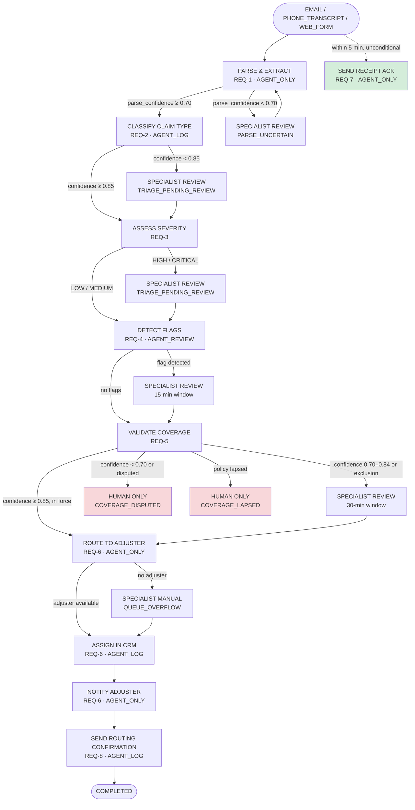

# FNOL Processing Agent — Workflow Diagram

```mermaid
flowchart TD
  A([EMAIL / PHONE_TRANSCRIPT / WEB_FORM]) --> B[PARSE & EXTRACT\nREQ-1 · AGENT_ONLY]
  B -->|parse_confidence ≥ 0.70| C[CLASSIFY CLAIM TYPE\nREQ-2 · AGENT_LOG]
  B -->|parse_confidence < 0.70| R1[SPECIALIST REVIEW\nPARSE_UNCERTAIN]
  R1 --> B
  C -->|confidence ≥ 0.85| D[ASSESS SEVERITY\nREQ-3]
  C -->|confidence < 0.85| R2[SPECIALIST REVIEW\nTRIAGE_PENDING_REVIEW]
  R2 --> D
  D -->|LOW / MEDIUM| E[DETECT FLAGS\nREQ-4 · AGENT_REVIEW]
  D -->|HIGH / CRITICAL| R3[SPECIALIST REVIEW\nTRIAGE_PENDING_REVIEW]
  R3 --> E
  E -->|no flags| F[VALIDATE COVERAGE\nREQ-5]
  E -->|flag detected| R4[SPECIALIST REVIEW\n15-min window]
  R4 --> F
  F -->|confidence ≥ 0.85, in force| G[ROUTE TO ADJUSTER\nREQ-6 · AGENT_ONLY]
  F -->|confidence 0.70–0.84 or exclusion| R5[SPECIALIST REVIEW\n30-min window]
  F -->|confidence < 0.70 or disputed| R6[HUMAN ONLY\nCOVERAGE_DISPUTED]
  F -->|policy lapsed| R7[HUMAN ONLY\nCOVERAGE_LAPSED]
  R5 --> G
  G -->|adjuster available| H[ASSIGN IN CRM\nREQ-6 · AGENT_LOG]
  G -->|no adjuster| R8[SPECIALIST MANUAL\nQUEUE_OVERFLOW]
  R8 --> H
  H --> I[NOTIFY ADJUSTER\nREQ-6 · AGENT_ONLY]
  I --> J[SEND ROUTING CONFIRMATION\nREQ-8 · AGENT_LOG]
  J --> K([COMPLETED])

  A -.->|within 5 min, unconditional| ACK[SEND RECEIPT ACK\nREQ-7 · AGENT_ONLY]
  style ACK fill:#d4edda
  style R6 fill:#f8d7da
  style R7 fill:#f8d7da
```
