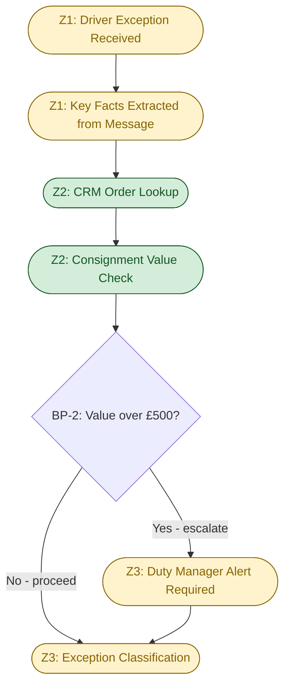
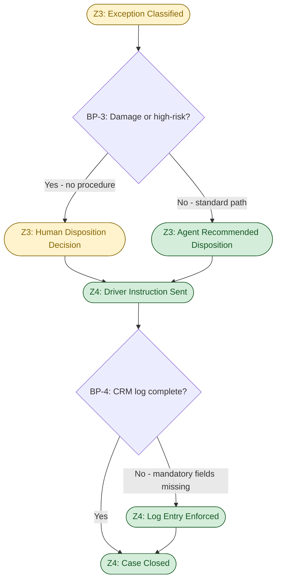
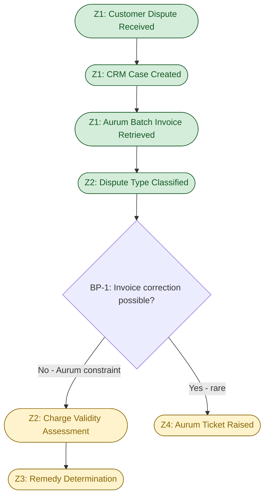
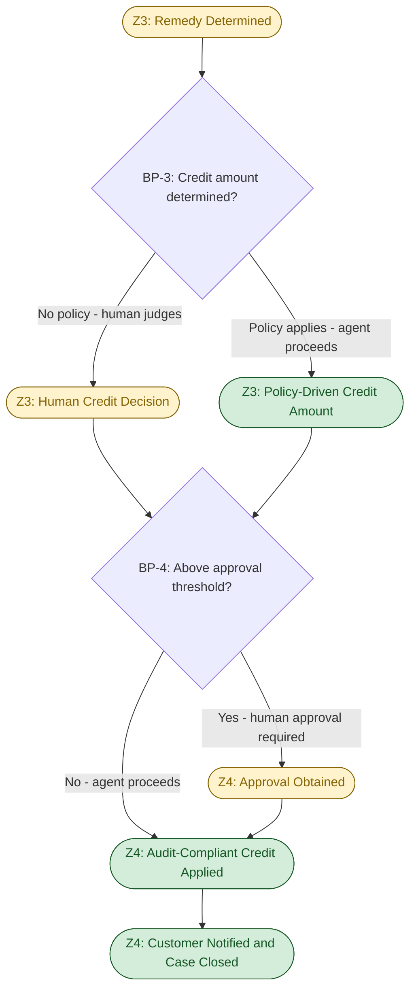

# D1 — Cognitive Load Map: Apex Distribution Ltd — Customer Operations

**Produced:** 2026-05-06
**Status:** Draft — awaiting FDE review

---

## 0. Executive summary

- Delivery exceptions (WS1) and billing disputes (WS4) were selected for decomposition: WS1 carries the highest per-case cognitive burden because every damage decision is discretion-driven with no documented procedure, while WS4 carries the highest compliance risk and the most structurally constrained resolution path — together they represent the two work streams where agent design decisions have the greatest consequence and the widest range of viable architectures.
- The most significant breakpoint across both maps is the moment of **disposition or credit decision without a codified policy** — in WS1 this is the dispatcher choosing return/hold/reattempt for a damaged consignment against an incomplete SOP, and in WS4 this is the agent choosing a credit amount against no stated threshold — both are currently pure-judgment decisions where an agent can only act if a human-defined rule is first put in place.
- The cross-work-stream pattern most consequential for agent design is the **shared absence of a formal decision rule at the highest-stakes moment**: in both work streams, the human currently substitutes tacit knowledge for policy, meaning an agent cannot take over the high-value decision in either stream without a policy design step as a prerequisite — the agent's scope boundary is defined by where the rules run out.

---

## 0b. Table of contents

- [0. Executive summary](#0-executive-summary)
- [0b. Table of contents](#0b-table-of-contents)
- [1. Work stream selection and rationale](#1-work-stream-selection-and-rationale)
- [2. Cognitive Load Map — WS1 Delivery Exceptions](#2-cognitive-load-map--ws1-delivery-exceptions)
  - [2a. Lived process narrative](#2a-lived-process-narrative)
  - [2b. Jobs to be Done decomposition](#2b-jobs-to-be-done-decomposition)
  - [2c. Cognitive zones and breakpoints](#2c-cognitive-zones-and-breakpoints)
  - [2d. Micro-task inventory with dimension scores](#2d-micro-task-inventory-with-dimension-scores)
  - [2e. Process topology diagram](#2e-process-topology-diagram)
- [3. Cognitive Load Map — WS4 Billing Disputes](#3-cognitive-load-map--ws4-billing-disputes)
  - [3a. Lived process narrative](#3a-lived-process-narrative)
  - [3b. Jobs to be Done decomposition](#3b-jobs-to-be-done-decomposition)
  - [3c. Cognitive zones and breakpoints](#3c-cognitive-zones-and-breakpoints)
  - [3d. Micro-task inventory with dimension scores](#3d-micro-task-inventory-with-dimension-scores)
  - [3e. Process topology diagram](#3e-process-topology-diagram)
- [4. Cross-work-stream observations](#4-cross-work-stream-observations)
- [5. Assumption log](#5-assumption-log)

---

## 1. Work stream selection and rationale

**Selected: WS1 — Delivery Exceptions and WS4 — Billing Disputes.**

WS1 offers the highest cognitive complexity in the portfolio: the primary exception type (damaged consignments) has no documented decision procedure (SOP Section 4.3 is explicitly incomplete), every disposition decision is made from dispatcher tacit knowledge, and the consequences of a wrong call are immediate and hard to reverse once the driver leaves the site. Its delegation potential is meaningful because the intake and classification steps are structurally tractable — structured driver inputs and a rules-based escalation threshold — but the core disposition decision cannot be automated without first encoding a decision matrix that does not yet exist.

WS4 offers the highest compliance risk: an active audit trail gap (credits applied informally, bypassing the APPROVER_ID and AUDIT_REF requirements), a system constraint that prevents the correct action (Aurum cannot adjust invoice line items in real time), and a 9-day observed resolution cycle driven by structural latency rather than agent capacity. Its delegation potential is medium but specific: triage, validity assessment, and compliant credit record generation are all mechanically tractable once a formal credit policy is defined, making it the work stream with the clearest prerequisite gap separating current state from agentic capability.

WS2 (ETA inquiries) was excluded because its cognitive complexity is low — it is primarily a lookup task with a well-defined delegation path. It should be automated, but the design decisions are straightforward and would not yield insight from a full cognitive decomposition. WS3 (dispatch adjustments) was excluded because the binding constraint is systemic (the Citrix dispatch console's limited API surface), not cognitive — decomposing it in detail would surface a technical integration problem, not a cognitive load problem.

---

## 2. Cognitive Load Map — WS1: Delivery Exceptions

### 2a. Lived process narrative

*Reconstructed from Artefact 1 (driver voicemail, Mark Petrov, route 042) and Artefact 4 (SOP v2.3). Inferences are labelled.*

A driver encounters a problem at a delivery stop and contacts the dispatch desk. In Artefact 1, this arrives as an unstructured voicemail: "the pallet's leaning, looks damaged on one corner, but to me it looks fine, it's just been on the lorry. The site manager isn't here, it's just the warehouse guy and he's new I think, he doesn't want to sign for it." The dispatcher who picks up the message must extract a decision-relevant picture from this: what type of exception is this? Is this a damage claim, a refusal, or both? Is the warehouse worker's reluctance legally significant?

The dispatcher opens the CRM to retrieve the customer record and case history [INFERENCE — CRM is confirmed as the case management system]. They check the order details to determine consignment value. If the value exceeds £500, the SOP requires escalation to the Duty Manager via the dispatch console [scenario evidence: SOP Section 4.2]. Whether this threshold check is consistently performed is unknown [labelled unknown U-5 in D0D].

Here the process hits its most significant gap: Section 4.3 (Damaged consignments) is blank. The dispatcher has no documented procedure to consult. They draw on experience: "this driver, this customer, this type of situation." Is the damage likely cosmetic? Is the Stein-Allen account a high-sensitivity customer? What would a re-attempt cost in terms of time and driver capacity? The dispatcher makes a judgment call — return-to-depot, hold at location, conditional acceptance — and calls the driver back.

The driver has been parked throughout. In Artefact 1, the message ends: "I'm parked up till you tell me." Every minute of delay is a minute taken from the six remaining drops on route 042. The operational cost of a slow decision is borne by the entire route, not just this case.

The dispatcher instructs the driver and logs the case in the CRM [INFERENCE — logging may be deferred or incomplete under pressure]. The case may or may not generate a follow-up: if the consignment was refused and returned, a redelivery or credit process begins. If conditionally accepted, the customer may later file a damage claim that reopens the case as a billing dispute (cross-stream linkage to WS4).

What informal knowledge is being applied: the dispatcher is pattern-matching from memory — which customers are strict about pallet condition, which drivers are reliable reporters of actual damage vs. nervousness about signing, what "leaning" means in practice on this route. None of this is in the CRM or the SOP.

---

### 2b. Jobs to be Done decomposition

| JtD ID | Cognitive contract — what outcome must be produced? | Trigger | Actor | Key decisions | Key systems/data | Primary cognitive type | Expected output |
|--------|------------------------------------------------------|---------|-------|---------------|-----------------|----------------------|-----------------|
| WS1-J1 | Determine what type of exception has occurred and whether it requires immediate dispatcher intervention or can be handled by a standard procedure | Driver contact (call, voicemail, app message) received | Dispatcher | Is this damage, refusal, missed window, or other? Is there a standard procedure that applies? Does this require escalation before a decision can be made? | CRM (customer/order record), SOP (procedure check), Driver App (driver message) | Pattern recognition + exception handling | Classified exception type with escalation flag and relevant context assembled for the disposition decision |
| WS1-J2 | Produce an operationally correct, policy-compliant disposition instruction for the driver that accounts for consignment value, customer relationship, and route impact | Exception classified, driver waiting for instruction | Dispatcher (with potential Duty Manager) | Return/hold/reattempt/conditional accept? Does consignment value require escalation? What is the customer's likely response to each option? | CRM (customer history, consignment value), SOP Section 4.2 (escalation threshold), dispatcher tacit knowledge | Human sense-making (no procedure for damage; judgment-dominant) | Disposition instruction delivered to driver; driver unblocked |
| WS1-J3 | Ensure the exception is documented completely enough to support downstream claims handling, billing adjustments, and audit review | Disposition delivered and driver has proceeded | Dispatcher | What information must be recorded? Was the escalation threshold applied and documented? Is the damage claim information sufficient for a future billing dispute? | CRM (case record), SOP (documentation requirements) | Deterministic execution | Closed CRM case record with exception type, disposition rationale, escalation flag, and outcome |

---

### 2c. Cognitive zones and breakpoints

**Zones:**

| Zone ID | Zone name | Micro-tasks in zone | Dominant cognitive type | Data dependencies | Error tolerance |
|---------|-----------|---------------------|------------------------|-------------------|-----------------|
| Z1 | Input reception and extraction | Receive driver message; extract key facts | Human sense-making (unstructured input, ambiguous reports) | Driver App (message), no structured form | High tolerance for minor extraction errors; misclassifying exception type has downstream cost |
| Z2 | Context assembly | CRM lookup; consignment value check; escalation threshold evaluation | Deterministic execution (lookup + rule application) | CRM (REST API confirmed); consignment value field (source uncertain — see A-2) | Low tolerance — wrong consignment value produces a missed or false escalation |
| Z3 | Disposition decision | Exception classification; disposition determination; Duty Manager consultation if required | Human sense-making (judgment-dominant; no codified procedure for damage) | CRM (customer history), dispatcher tacit knowledge, SOP Section 4.2 (escalation only) | Very low tolerance — wrong disposition instruction cannot be recalled once driver proceeds |
| Z4 | Execution and closure | Driver communication; CRM case logging | Deterministic execution | Driver App (messaging), CRM (structured fields) | Medium tolerance — communication errors are recoverable; logging gaps create audit exposure |

**Breakpoints:**

| BP ID | Description of handoff | From | To | Why this is a breakpoint | Agent opportunity or risk |
|-------|------------------------|------|----|--------------------------|--------------------------|
| BP-1 | Unstructured driver input must be converted into a structured exception record before any rule-based logic can be applied | Human (dispatcher reading/listening to message) | Agent (structured extraction + classification) | Rule-to-judgment shift: the input is unstructured; pattern recognition is needed before any rule table applies | **Opportunity:** agent with NLP capability can extract exception type, consignment ID, driver location, and reason code from driver message, pre-populating a structured case. **Risk:** extraction errors at this stage propagate to all downstream decisions |
| BP-2 | Consignment value threshold check must gate the escalation decision before any disposition recommendation is made | Agent (lookup + rule application) | Human (Duty Manager) if threshold met; dispatcher if not | Compliance gate: SOP Section 4.2 is the one codified rule in this work stream — an agent can apply it mechanically, but human availability for escalation is uncertain | **Opportunity:** agent enforces the £500 threshold consistently, eliminating the current inconsistency risk. **Risk:** if the Duty Manager is unavailable, the agent must have a defined fallback path rather than proceeding without escalation |
| BP-3 | The disposition decision for damage/refusal exceptions requires judgment that no current rule covers | Dispatcher (judgment) | Agent cannot proceed autonomously without a decision matrix | Rule-to-judgment shift: SOP Section 4.3 is blank; the decision is currently made from tacit knowledge alone | **Opportunity:** agent can present a structured recommended disposition with supporting evidence (customer tier, consignment value, site context) for a 30-second dispatcher approval rather than a full 12-minute reconstruction. **Risk:** if the agent presents a wrong recommendation and the dispatcher rubber-stamps it without scrutiny, quality degrades rather than improves |
| BP-4 | CRM case must be logged with sufficient detail before the case is closed | Agent (enforcement of mandatory fields) | Dispatcher (content judgment on what to record) | Compliance gate: incomplete logging creates audit exposure for downstream damage claims and billing disputes | **Opportunity:** agent enforces mandatory field completion before case closure — eliminating the logging gaps that occur under time pressure. **Risk:** mandatory field enforcement without a clear logging standard will surface the question of what "sufficient detail" means, which must be answered in the design |

---

### 2d. Micro-task inventory with dimension scores

| Micro-task | Cognitive Load | Input Structure | Decision Determinism | Exception Freq | Turn-Taking | Latency Constraint | Compliance/Risk | Tool/API Availability |
|------------|--------------|----------------|---------------------|----------------|-------------|-------------------|-----------------|----------------------|
| MT1: Receive and extract key facts from driver message | H [^1] | L [^2] | L [^3] | H [^4] | H [^5] | H [^6] | M [^7] | L [^8] |
| MT2: Retrieve customer/order record from CRM | L [^9] | H [^10] | H [^11] | L [^12] | L [^13] | H [^14] | L [^15] | H [^16] |
| MT3: Check consignment value and apply escalation threshold | L [^17] | M [^18] | H [^19] | L [^20] | L [^21] | H [^22] | H [^23] | M [^24] |
| MT4: Classify exception type (damage/refusal/missed/other) | M [^25] | L [^26] | M [^27] | M [^28] | M [^29] | H [^30] | M [^31] | M [^32] |
| MT5: Determine disposition — return/hold/reattempt/conditional | H [^33] | L [^34] | L [^35] | H [^36] | H [^37] | H [^38] | H [^39] | L [^40] |
| MT6: Escalate to Duty Manager (if value >£500) | L [^41] | H [^42] | H [^43] | L [^44] | H [^45] | H [^46] | H [^47] | M [^48] |
| MT7: Communicate disposition instruction to driver | L [^49] | H [^50] | H [^51] | L [^52] | H [^53] | H [^54] | L [^55] | H [^56] |
| MT8: Log case in CRM with exception type, outcome, and rationale | L [^57] | H [^58] | H [^59] | M [^60] | L [^61] | L [^62] | M [^63] | H [^64] |

**Score footnotes — WS1:**

[^1]: H — driver message is unstructured voice or free text; agent must infer exception type, consignment ID, location, and reason from narrative description (Artefact 1 shows multiple facts embedded in a single voicemail).
[^2]: L — driver App messages are free text; no structured form exists; SOP references retired DispatchHub which had a structured form (Artefact 4 footnote).
[^3]: L — driver's description may be ambiguous (Artefact 1: "looks damaged on one corner, but to me it looks fine"); extraction outcome varies by reporter.
[^4]: H — exceptions are by definition non-standard; the triggering event (damage, refusal, missed window) is not predictable.
[^5]: H — driver is waiting in real time; clarification requires a back-and-forth exchange before the extraction is complete.
[^6]: H — driver is parked with six remaining drops; every minute of dispatcher delay costs route efficiency (Artefact 1).
[^7]: M — misclassifying the exception type routes to the wrong procedure; not directly a financial error but has downstream billing and claims consequences.
[^8]: L — no structured driver intake form; Driver App messages are unstructured; NLP extraction is not currently in place.
[^9]: L — CRM lookup given order/delivery ID is a standard query requiring no judgment.
[^10]: H — CRM is a structured system; records are queryable by customer ID or order number.
[^11]: H — given a valid order ID, the CRM record is deterministic; no ambiguity in retrieval.
[^12]: L — CRM records exist for all active deliveries; failed retrieval would indicate a data entry error, not an exception.
[^13]: L — single system call; no back-and-forth required.
[^14]: H — decision cannot proceed without customer and order context; this is a blocking step.
[^15]: L — lookup only; no change to any record; no compliance exposure.
[^16]: H — CRM REST APIs are confirmed available (scenario).
[^17]: L — rule application: compare consignment value to £500 threshold; binary outcome.
[^18]: M — consignment value should be in the order record; uncertainty about whether it is in CRM or requires Aurum lookup (see A-2).
[^19]: H — given consignment value and threshold, the escalation decision is binary and fully deterministic.
[^20]: L — the threshold check either triggers or does not; no frequent edge cases.
[^21]: L — single field comparison; no human consultation needed.
[^22]: H — threshold check is the gating step for escalation compliance; must complete before disposition decision.
[^23]: H — failure to escalate a >£500 consignment is a SOP violation with potential financial and reputational exposure (SOP Section 4.2).
[^24]: M — depends on whether consignment value is available in CRM at time of exception; if in Aurum batch only, a 24-hour lag applies.
[^25]: M — exception type can usually be inferred from driver's description; damage vs. refusal vs. missed window have distinct surface features, but combinations are possible (Artefact 1 shows both damage and refusal in the same event).
[^26]: L — classification input is the unstructured driver message; same input structure issue as MT1.
[^27]: M — most cases are classifiable; ambiguous cases (damage + refusal combined) require a judgment about primary type.
[^28]: M — combined/ambiguous exceptions occur (Artefact 1); frequency is unknown but non-trivial given the incomplete SOP.
[^29]: M — dispatcher may need to ask the driver for clarification before classifying with confidence.
[^30]: H — classification is the prerequisite for all downstream decisions; cannot proceed without it.
[^31]: M — wrong classification routes to wrong procedure; not directly a financial error but causes downstream rework.
[^32]: M — CRM case type field supports classification, but mapping from unstructured input requires NLP; no current tool does this automatically.
[^33]: H — no documented decision procedure for damaged consignments (SOP Section 4.3 blank); dispatcher must synthesise driver report, customer history, consignment value, and operational context to produce a disposition.
[^34]: L — inputs to disposition decision are primarily tacit and contextual; none are in a structured system.
[^35]: L — with no decision matrix, different dispatchers would produce different dispositions for identical inputs (confirmed domain-typical pattern from D0A).
[^36]: H — damaged consignment is the exception type with the highest variability and the fewest encoded rules.
[^37]: H — may require Duty Manager consultation (escalation threshold met) or driver clarification (additional context needed); multiple concurrent conversations possible.
[^38]: H — driver is parked; route impact increases with each minute of delay.
[^39]: H — wrong disposition for a high-value consignment creates financial exposure (replacement, redelivery) and reputational risk with the customer (Stein-Allen is described as "the big one" in Artefact 1).
[^40]: L — no system supports the disposition decision; pure judgment; agent can only assist if a decision matrix is first provided.
[^41]: L — rule application: if value >£500, contact Duty Manager; no judgment required on whether to escalate.
[^42]: H — escalation trigger (consignment value) is a structured field; the rule is codified.
[^43]: H — escalation is a binary rule; given the threshold condition, the action is determined.
[^44]: L — escalation is triggered by the threshold, not by random events; frequency depends on consignment value distribution.
[^45]: H — escalation requires reaching the Duty Manager who may be unavailable; async wait possible.
[^46]: H — driver is still waiting; Duty Manager unavailability blocks resolution.
[^47]: H — failure to escalate is a SOP violation; correct escalation is a compliance requirement.
[^48]: M — escalation is via the dispatch console (Citrix, limited API); programmatic escalation notification may not be possible without integration work.
[^49]: L — communication is execution of a decision already made; no judgment required.
[^50]: H — Driver App messaging is structured; message can be composed from decision output fields.
[^51]: H — given a disposition, the communication content is fully determined.
[^52]: L — message delivery failure is rare; driver acknowledgement confirms receipt.
[^53]: H — real-time exchange; driver may ask clarifying questions requiring immediate response.
[^54]: H — driver must receive instruction before proceeding; this is the final blocking step.
[^55]: L — communication itself is not a compliance event; error is recoverable by follow-up.
[^56]: H — Driver App messaging API is available (in-house iOS/Android, scenario).
[^57]: L — structured data entry into CRM fields; no judgment on what decision to record (decision is already made).
[^58]: H — CRM case fields are structured; logging is a field-population exercise.
[^59]: H — logging records what happened; no decision-making involved.
[^60]: M — under time pressure, logging is frequently deferred or abbreviated; exception handling creates incomplete records (domain-typical gap, D0A G-3).
[^61]: L — logging is a solo activity; no coordination required.
[^62]: L — logging can be completed after the driver has been released; not time-critical in the same way as the disposition.
[^63]: M — incomplete logging creates gaps in the case history that affect downstream billing disputes and claims; not a direct compliance event but an enabling risk.
[^64]: H — CRM REST APIs are confirmed available.

---

### 2e. Process topology diagram

**Phase 1 — Intake and Classification**

**Phase 2 — Disposition and Closure**

*Green nodes: agent-owned (deterministic execution, rule application, structured communication). Amber nodes: human-in-the-loop required (unstructured input interpretation, judgment-dependent decisions, escalation handling).*

---

## 3. Cognitive Load Map — WS4: Billing Disputes

### 3a. Lived process narrative

*Reconstructed from Artefact 2 (Hayes & Sons email thread, INV-2026-04318), Artefact 5 (Aurum batch exports), and APEX_DISPUTES_OPEN_20260414.csv. Inferences are labelled.*

A customer disputes a charge on their invoice. They contact Apex — either directly to billing@ or to Customer Operations. The contact arrives as an email (Artefact 2), though calls and escalations are also implied by the 22-minute hold time mentioned in message 3. The agent creates or retrieves a case in the CRM [INFERENCE — CRM is the case management system].

The agent must retrieve the invoice. Aurum Billing does not expose a real-time API — the agent is working from yesterday's batch export at best, and the reconciliation file lags an additional 24 hours [scenario evidence]. If the dispute arrived on the same day as the invoice, the agent may be looking at data that does not yet reflect that invoice. For ongoing disputes, the APEX_DISPUTES_OPEN export shows the current state — but this too is T-1 [scenario evidence].

The agent identifies the dispute type. In Artefact 2, the customer disputes a fuel surcharge applied to a damaged delivery. Fuel surcharges are automatically calculated by Aurum based on route distance and are not tied to delivery condition [scenario evidence: Artefact 2, message 2]. The agent recognises — or has learned — that Aurum cannot adjust individual fuel surcharge line items. The correct action (removing or reducing the surcharge) is technically impossible in real time.

**Pause point:** the agent must decide what to do given a system constraint that prevents the correct action. The options are: (a) raise a formal Aurum modification ticket (48-hour turnaround, uncertain outcome), (b) apply a goodwill credit as a workaround, or (c) explain to the customer that nothing can be done right now.

The agent applies a goodwill credit. In Artefact 2, Sandra applies £170 against a £340 dispute — 50% of the disputed amount — with no stated rationale for why 50%. This is applied via "manual override" with no entry in the credits audit log [scenario evidence: Artefact 2 internal note]. The APEX_CREDITS schema formally requires APPROVER_ID and AUDIT_REF [scenario evidence: APEX_CREDITS CSV], but the informal application bypasses both.

The customer does not receive a corrected invoice. They receive a credit on their next statement — at an unspecified future date. In the case shown, the customer's reply (day 9) has not yet been received, suggesting the resolution is not accepted as final [INFERENCE from Artefact 2 structure].

The APEX_DISPUTES_OPEN export shows that customer C-04451 (Hayes & Sons) has three simultaneous open disputes — all of type FUEL_SURCH_DAMAGE, all assigned to Sandra W. [scenario evidence]. This suggests the informal credit workaround is not resolving the underlying billing relationship problem; it is suppressing individual disputes while the root cause (Aurum's inability to correct fuel surcharge line items on damaged deliveries) persists.

What informal knowledge is being applied: Sandra knows that Aurum cannot adjust fuel surcharges, knows that a goodwill credit is the only available tool, and has developed an informal sense of "how much" to apply. None of this is in any documented policy.

---

### 3b. Jobs to be Done decomposition

| JtD ID | Cognitive contract — what outcome must be produced? | Trigger | Actor | Key decisions | Key systems/data | Primary cognitive type | Expected output |
|--------|------------------------------------------------------|---------|-------|---------------|-----------------|----------------------|-----------------|
| WS4-J1 | Determine whether the disputed charge is valid, erroneous, or requires policy judgment — and what the appropriate remedy class is given the system's structural constraints | Customer dispute contact received | Billing agent | Is the charge correct per Aurum's calculation? Is it valid given the delivery outcome? Can it be corrected in real time or only via goodwill credit? | CRM (case history), Aurum batch export (invoice, surcharge line items), APEX_DISPUTES_OPEN | Synthesis (cross-system data reconciliation + policy application) | Structured dispute assessment: charge validity verdict, remedy class, and constraint identification |
| WS4-J2 | Determine and apply a credit that is financially appropriate, policy-compliant, and generates a complete audit trail record | Dispute assessed, remedy class identified as goodwill credit | Billing agent (with approval if above threshold) | What credit amount is appropriate? Is this below the approval threshold? Is the APPROVER_ID and AUDIT_REF populated? | Aurum batch (APEX_CREDITS schema), CRM, credit policy (currently undefined — assumption A-3) | Human sense-making (judgment on amount; compliance enforcement on trail) | Formally applied credit with APPROVER_ID and AUDIT_REF populated; customer notified of outcome and timeline |
| WS4-J3 | Ensure the customer understands what was done, why, and when to expect the credit — and that the case is closed in a state that supports future dispute pattern analysis | Credit applied, customer communication pending | Billing agent | Is the explanation accurate and complete? Does it address why the invoice could not be corrected? Is the case status in CRM accurate? | CRM (case record, outbound messaging), APEX_DISPUTES_OPEN (status update) | Deterministic execution + communication | Closed CRM case; accurate dispute status in APEX_DISPUTES; customer communication sent |

---

### 3c. Cognitive zones and breakpoints

**Zones:**

| Zone ID | Zone name | Micro-tasks in zone | Dominant cognitive type | Data dependencies | Error tolerance |
|---------|-----------|---------------------|------------------------|-------------------|-----------------|
| Z1 | Case intake and invoice retrieval | Create/retrieve CRM case; retrieve Aurum batch invoice data; identify dispute type | Deterministic execution (lookup, retrieval, classification) | CRM (REST API), Aurum batch (T-1 CSV); data is yesterday's at best | Medium tolerance — data staleness may cause the agent to work from an incomplete picture |
| Z2 | Dispute validity assessment | Assess charge validity; determine whether invoice correction is possible | Synthesis (cross-reference invoice, delivery record, surcharge calculation, account history) | Aurum (invoice, surcharge, disputes); CRM (delivery outcome, account history); no real-time integration | Low tolerance — incorrectly validating an invalid charge harms the customer; incorrectly invalidating a valid one harms the business |
| Z3 | Remedy determination | Determine credit amount; apply credit policy; route for approval if above threshold | Human sense-making (no credit policy stated; judgment-dominant); compliance gate (APPROVER_ID/AUDIT_REF required) | Credit policy (currently undefined); APEX_CREDITS schema; approval authority structure (unknown) | Very low tolerance — under-crediting drives customer churn; over-crediting is a financial loss; non-compliant application creates audit exposure |
| Z4 | Compliant execution and closure | Apply credit with audit fields populated; submit Aurum ticket if formal correction needed; notify customer; close CRM case | Deterministic execution (field population, messaging, ticket submission) | APEX_CREDITS write capability (uncertain — see A-4); CRM messaging; Aurum ticket process | Medium tolerance — execution errors are recoverable; audit trail gap is not |

**Breakpoints:**

| BP ID | Description of handoff | From | To | Why this is a breakpoint | Agent opportunity or risk |
|-------|------------------------|------|----|--------------------------|--------------------------|
| BP-1 | System constraint evaluation: can the invoice be corrected in real time or not? | Agent (rule application) | Agent continues on constrained path; no human needed here | System constraint gate: Aurum cannot adjust line items in real time; this is a known, binary constraint that requires no judgment | **Opportunity:** agent can apply this rule mechanically and immediately route to the correct remedy path (goodwill credit), without the dispatcher having to re-learn this constraint per case. **Risk:** if the constraint ever changes (Aurum gains an API), the routing logic must be updated |
| BP-2 | Charge validity judgment: is the disputed charge correct given the delivery outcome? | Agent (structured data retrieval and comparison) | Human (for ambiguous cases) | Rule-to-judgment shift: fuel surcharge validity is rule-based (distance-based calculation), but validity in the context of a damage claim requires judgment about whether the charge is "fair" given the outcome | **Opportunity:** for clear-cut cases (surcharge on a fully accepted delivery — no dispute basis), agent can close autonomously. **Risk:** for damage-linked surcharges (the majority of open disputes per APEX_DISPUTES_OPEN), the validity question requires human judgment on the damage claim relationship |
| BP-3 | Credit amount determination: what amount should be credited? | Human (judgment; no policy) | Agent (enforcement) only after policy is defined | Rule-to-judgment shift: no credit policy exists; agent cannot determine an amount without a codified rule | **Opportunity:** once a credit policy is defined (e.g., 50% of disputed amount for fuel surcharge on damage claim, subject to approval above £X), agent can apply it mechanically and consistently — eliminating the current per-agent variation. **Risk:** deploying before policy is defined will either block all credits (agent refuses to proceed without a rule) or reproduce informal behaviour (agent mirrors the 50% heuristic without authority to do so) |
| BP-4 | Audit trail compliance: was the credit applied with APPROVER_ID and AUDIT_REF populated? | Agent (field population enforcement) | Human (approval above threshold) | Compliance gate: APEX_CREDITS schema requires both fields; current practice bypasses them; the agent must enforce the formal path | **Opportunity:** agent enforces mandatory field completion before credit is written — closing the active compliance gap identified in Artefact 2. **Risk:** if the agent writes credits and the APPROVER_ID is automatically populated with a system ID rather than a named human approver, the audit trail is technically complete but operationally meaningless |

---

### 3d. Micro-task inventory with dimension scores

| Micro-task | Cognitive Load | Input Structure | Decision Determinism | Exception Freq | Turn-Taking | Latency Constraint | Compliance/Risk | Tool/API Availability |
|------------|--------------|----------------|---------------------|----------------|-------------|-------------------|-----------------|----------------------|
| MT1: Create/retrieve CRM case and link to invoice | L [^65] | H [^66] | H [^67] | L [^68] | L [^69] | M [^70] | L [^71] | H [^72] |
| MT2: Retrieve invoice and surcharge data from Aurum batch | L [^73] | H [^74] | H [^75] | M [^76] | L [^77] | M [^78] | L [^79] | M [^80] |
| MT3: Classify dispute type (fuel surcharge / redelivery fee / dimensional weight / other) | M [^81] | M [^82] | M [^83] | M [^84] | L [^85] | M [^86] | M [^87] | H [^88] |
| MT4: Assess whether the disputed charge is valid | H [^89] | M [^90] | M [^91] | M [^92] | M [^93] | L [^94] | H [^95] | M [^96] |
| MT5: Determine whether invoice correction is possible (Aurum constraint check) | L [^97] | H [^98] | H [^99] | L [^100] | L [^101] | L [^102] | M [^103] | H [^104] |
| MT6: Determine appropriate credit amount | H [^105] | L [^106] | L [^107] | H [^108] | M [^109] | L [^110] | H [^111] | L [^112] |
| MT7: Apply credit with APPROVER_ID and AUDIT_REF | L [^113] | H [^114] | H [^115] | M [^116] | L [^117] | L [^118] | H [^119] | M [^120] |
| MT8: Communicate resolution to customer | L [^121] | H [^122] | H [^123] | M [^124] | H [^125] | M [^126] | M [^127] | H [^128] |

**Score footnotes — WS4:**

[^65]: L — CRM case creation/retrieval is a standard lookup; no judgment required.
[^66]: H — CRM is a structured system; invoice number and customer ID are the lookup keys.
[^67]: H — given invoice number, CRM case retrieval is deterministic; no ambiguity.
[^68]: L — CRM records exist for all active accounts; retrieval failure indicates a data issue, not an exception.
[^69]: L — single system call; no coordination required.
[^70]: M — customer is not waiting in real time the way a parked driver is; same-day response is expected but not minute-by-minute.
[^71]: L — lookup only; no record change at this stage.
[^72]: H — CRM REST APIs are confirmed available.
[^73]: L — reading a CSV batch export is a structured lookup; no judgment.
[^74]: H — Aurum exports are structured CSVs with defined schemas (INVOICE_NO, AMT_FUEL_SURCH, etc.).
[^75]: H — given invoice number, the record in the CSV is deterministic; however, the data is T-1, which may not reflect same-day invoices.
[^76]: M — if the dispute concerns an invoice not yet in the batch (same-day or data lag), the agent is working blind; this is a known exception case.
[^77]: L — CSV read is a batch operation; no human coordination required.
[^78]: M — working from yesterday's data is a known constraint; for time-sensitive disputes, data freshness is a risk but not a blocking issue at intake.
[^79]: L — read operation only; no compliance exposure at retrieval stage.
[^80]: M — Aurum data is available via daily CSV exports; agent can read these; write access to Aurum is not available in real time; real-time query is not possible.
[^81]: M — dispute type can usually be inferred from customer's description; fuel surcharge, redelivery fee, and dimensional weight have distinct characteristics; some disputes are ambiguous or span multiple charge types.
[^82]: M — customer email is semi-structured; dispute type is usually stated but may require parsing from natural language.
[^83]: M — most dispute types are identifiable; edge cases (multi-charge disputes, ambiguous descriptions) require judgment.
[^84]: M — multi-charge disputes exist (APEX_DISPUTES shows FUEL_SURCH_DAMAGE as a combined type); not rare.
[^85]: L — classification is based on available information; no back-and-forth required at this stage.
[^86]: M — classification is the prerequisite for validity assessment; important but not time-critical in the same way as exception handling.
[^87]: M — misclassification routes to wrong assessment procedure; not directly a financial error but causes rework.
[^88]: H — APEX_DISPUTES_OPEN export includes a DISPUTE_TYPE field; CRM case type field supports classification; structured data available.
[^89]: H — requires cross-referencing invoice (Aurum batch), delivery outcome (CRM/Driver App), surcharge calculation basis (route distance), and account history; no single source has all required data.
[^90]: M — invoice and surcharge data are structured; delivery outcome in CRM may be structured; damage assessment from driver may be unstructured.
[^91]: M — fuel surcharge validity based on route distance is rule-based; validity in the context of a damage claim requires judgment about the relationship between the charge and the outcome.
[^92]: M — damage-linked disputes (majority of APEX_DISPUTES open cases) require judgment; simple calculation errors are deterministic.
[^93]: M — may need to consult delivery records or Driver App scan data to confirm delivery outcome.
[^94]: L — resolution expected within days; no real-time pressure.
[^95]: H — incorrectly validating an invalid charge loses customer trust and may trigger further escalation; incorrectly invalidating a valid charge is a financial loss.
[^96]: M — invoice and delivery data accessible via batch; real-time delivery outcome from Driver App uncertain.
[^97]: L — rule application: Aurum cannot adjust line items in real time; this is a known, binary constraint that requires no case-by-case judgment.
[^98]: H — the constraint is a known fact; no ambiguous inputs.
[^99]: H — the constraint applies universally; no judgment required.
[^100]: L — constraint is universal; no exceptions exist for real-time correction.
[^101]: L — no consultation needed; constraint is known.
[^102]: L — applying the constraint check is instantaneous; no waiting.
[^103]: M — informing the customer incorrectly about correction options would damage trust; agent must communicate accurately.
[^104]: H — knowledge of constraint is available; no system query needed; rule is encapsulated in agent logic.
[^105]: H — no credit policy exists; Sandra applied 50% of disputed amount in Artefact 2 without stated rationale; different agents would produce different amounts for identical disputes.
[^106]: L — no structured policy document exists to guide the amount decision; agent would be operating on informal norms or no guidance.
[^107]: L — highly judgment-dependent; even experienced agents produce inconsistent amounts without a policy.
[^108]: H — every dispute requiring a goodwill credit reaches this decision point with no rule to apply; it is the norm, not the exception.
[^109]: M — large credits may require consultation with a senior agent or manager; threshold unknown.
[^110]: L — no time pressure on credit amount decision; customer is waiting days, not minutes.
[^111]: H — under-crediting risks customer churn (Artefact 2: customer escalating after a 9-day thread); over-crediting is a direct financial loss; non-compliant application creates audit exposure.
[^112]: L — no system or policy document supports the credit amount decision; pure judgment with no tool assistance.
[^113]: L — execution of a decision already made; field population in the credit record.
[^114]: H — APEX_CREDITS schema is structured: CREDIT_ID, INVOICE_NO, CUSTOMER_ID, CREDIT_AMT, REASON_CODE, APPROVER_ID, AUDIT_REF, APPLIED_DT.
[^115]: H — given credit amount and required fields, record creation is deterministic.
[^116]: M — informal bypass is current practice (Artefact 2); the agent must enforce the formal path even when the informal path is habitual.
[^117]: L — single record write; no coordination.
[^118]: L — not time-critical; can be applied same day.
[^119]: H — APPROVER_ID and AUDIT_REF are required fields per schema; non-compliant application is an active compliance gap (Artefact 2).
[^120]: M — agent can read APEX_CREDITS CSV; write access to Aurum credit records requires confirmation — may require a separate integration or Aurum ticket process.
[^121]: L — communication is execution of a decision already made; content is determined.
[^122]: H — CRM outbound messaging is structured.
[^123]: H — content (credit amount, timeline, reason) is determined by prior steps.
[^124]: M — customer may respond with follow-up (Artefact 2: customer escalated after day 4); agent must be able to handle a response.
[^125]: H — customer may reply; dispute thread may continue; back-and-forth is expected for complex cases.
[^126]: M — same-day customer communication is expected but not minute-by-minute.
[^127]: M — misleading the customer about amount or timing has customer relations consequences.
[^128]: H — CRM REST APIs confirmed for outbound messaging.

---

### 3e. Process topology diagram

**Phase 1 — Intake and Validity Assessment**

**Phase 2 — Remedy and Closure**

*Green nodes: agent-owned (deterministic execution, rule application, compliant field population). Amber nodes: human-in-the-loop required (validity judgment, credit amount determination, approval for above-threshold credits).*

---

## 4. Cross-work-stream observations

**Observation 1 — Shared prerequisite: a codified decision rule must exist before an agent can act at the highest-value moment.**
In both WS1 and WS4, the most consequential decision in the work stream (disposition of damaged consignment; credit amount for billing dispute) is currently made from tacit knowledge against no documented policy. An agent cannot autonomously take over either decision without a human-defined rule to apply. This is not a technology gap — it is a process design gap that must be closed before agent development begins. The policy design step is a prerequisite, not a parallel workstream.

**Observation 2 — Shared data dependency: CRM is the common context layer for both work streams.**
Both WS1 and WS4 begin with a CRM lookup (customer record, case history, order details) and end with a CRM write (case closure, logging). The CRM REST API is confirmed available. A shared context retrieval component — pulling customer record, account history, and case status from CRM — would be reusable across both work streams and would reduce redundant integration work. This component also supports cross-stream linkage: a refused delivery (WS1) that generates a billing dispute (WS4) would share the same CRM case context.

**Observation 3 — Shared compliance gap: both work streams currently bypass audit requirements under time pressure.**
WS1 has incomplete CRM logging under call pressure (MT8 exception frequency: M); WS4 has informal credit application bypassing APPROVER_ID and AUDIT_REF (MT7 exception frequency: M). In both cases, the bypass is not malicious — it is a rational response to time pressure and an approval process that adds friction without clear benefit to the agent. An agent that enforces audit compliance in both streams will surface this tension: if enforcement slows resolution, it will be perceived as a regression. The design must make compliant behaviour faster than the workaround, not just mandatory.

**Observation 4 — Shared entry point uncertainty: both work streams receive unstructured inputs that must be classified before any rule can be applied.**
WS1 receives unstructured driver voice/text messages (BP-1); WS4 receives semi-structured customer emails. In both cases, the first cognitive step is extraction and classification — converting the input into a structured representation. A shared NLP intake component (structured extraction from free text + classification into work stream and exception type) would serve both work streams and reduce the most common source of downstream processing errors.

**Observation 5 — Asymmetric latency requirements that constrain shared agent architecture.**
WS1 has hard real-time latency requirements (driver parked, route impact accumulates per minute); WS4 has soft same-day requirements (customer expects a response within the working day, not within minutes). Any shared agent architecture must accommodate both: a synchronous, low-latency path for WS1 exception classification and driver instruction, and an asynchronous, batch-aware path for WS4 dispute assessment working from T-1 data. These are different operational patterns even if they share intake and context-retrieval components.

---

## 5. Assumption log

> **Assumption A-1:** The disposition decision for WS1 exceptions is the dispatcher's call in all non-escalated cases, without any structured decision support tool, checklist, or consultation protocol.
> **Why it matters:** Determines the scope of the "HITL co-pilot" design — if any structured tool exists (even an informal checklist), the agent's value-add in the decision zone is lower; if there is genuinely no support structure, the agent's recommendation capability is the primary improvement.
> **If wrong:** If dispatchers use an informal shared document or communication channel to cross-check decisions, the social context of that channel is part of the decision system and the agent must integrate with it.
> **Confidence:** Medium-high — Artefact 1 shows a dispatcher attempting to reach Sandra (a colleague, not a system) and finding her line busy; the "consult a person" path is the only visible support mechanism.

> **Assumption A-2:** Consignment value is accessible in the CRM at the point of exception handling, without requiring a separate Aurum lookup.
> **Why it matters:** If consignment value is only in Aurum (batch-only), the escalation threshold check (MT3) faces the same 24-hour data lag as billing, which would mean the agent cannot reliably enforce the >£500 rule at the time of the exception.
> **If wrong:** If consignment value is batch-only, the escalation threshold enforcement capability of the agent is constrained, and a different proxy (e.g., customer tier) must substitute.
> **Confidence:** Medium — the CRM holds customer and order records; whether order value is a field on the delivery record vs. only on the invoice is not stated in the scenario.

> **Assumption A-3:** No formal credit policy exists at Apex — the credit amount applied in Artefact 2 (£170 against a £340 dispute) reflects a personal heuristic, not a documented policy at a 50% threshold.
> **Why it matters:** If a credit policy exists and is simply not being followed, the agent design path is simpler (enforce the existing policy). If no policy exists, the FDE must flag this as a prerequisite deliverable before the agent can be designed for Z3 (remedy determination) in WS4.
> **If wrong:** If a credit policy does exist (e.g., documented in a finance policy document not included in the scenario), the agent can be built to it directly, and the policy-design step can be skipped.
> **Confidence:** Medium — the scenario does not reference any credit policy document; Artefact 2 shows a credit applied with no stated basis; the internal note references "goodwill" without any threshold or formula.

> **Assumption A-4:** The agent can read Aurum batch export CSVs directly from the export path but cannot write to Aurum records programmatically — credit application requires either a separate write pathway (via CRM or a middleware layer) or a continuation of the manual Aurum ticket process.
> **Why it matters:** If the agent cannot write audit-compliant credit records to the APEX_CREDITS export pathway, closing the compliance gap in WS4 requires a different technical approach (e.g., a separate credits ledger in CRM that feeds into Aurum reconciliation).
> **If wrong:** If Aurum exposes any write interface (even a restricted one for credits), the agent can close the compliance gap directly without a separate ledger.
> **Confidence:** Medium — the scenario states "batch-file exports only" and "no real-time API"; whether this applies equally to reads and writes, or only to real-time queries, is not specified.
