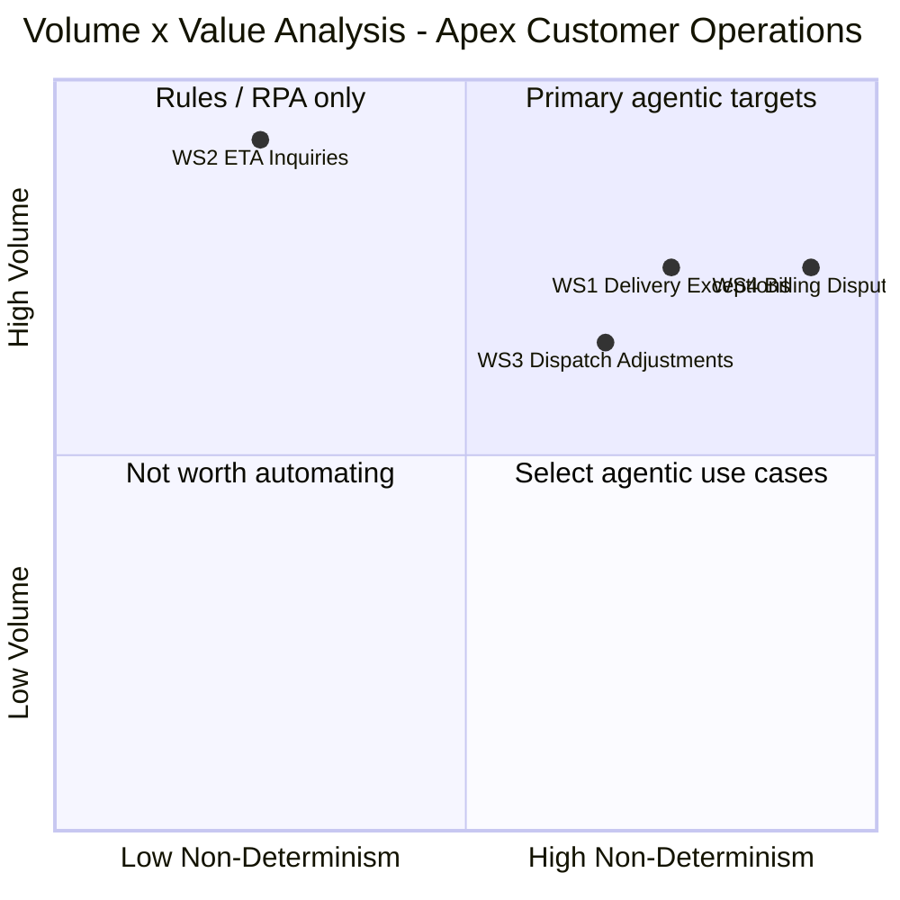

# D3 — Volume × Value Analysis: Apex Distribution Ltd — Customer Operations

**Produced:** 2026-05-06
**Status:** Draft — awaiting FDE review

---

## 0. Executive summary

- The primary agentic target is **WS4 — Billing Disputes** with an Agentic Value Score of 20 (Strong candidate): it absorbs 1,680 agent-minutes per day in the highest-cost work stream (28 min/case × 60/day), carries an active audit trail compliance gap that creates regulatory exposure regardless of agent deployment, and the competitor benchmark cited by the CEO (£1.2M annualised saving) is most plausible in the dispute resolution domain where handle time and churn risk are highest.
- The work stream that looks like a strong agentic candidate but is not yet deliverable is **WS3 — Dispatch Adjustments**, which scores 16 (Strong candidate) but fails the suitability gate on Tool Coverage (L) because the dispatch console runs via Citrix with a limited API surface and no confirmed programmatic write access — meaning the agent has no execution path for the work it would need to influence most.
- The economics directionally close: a preliminary TCO estimate projects ~£175k in annual saving against ~£100k build cost with a ~7-month payback; the single biggest assumption is that HITL time per billing dispute case reduces to 8 minutes — if the human still spends the full 28 minutes on manual steps the agent cannot substitute, the saving falls to near zero.

---

## 0b. Table of contents

- [0. Executive summary](#0-executive-summary)
- [0b. Table of contents](#0b-table-of-contents)
- [1. Suitability pre-screening (ATX Step 1)](#1-suitability-pre-screening-atx-step-1)
- [2. Volume derivation](#2-volume-derivation)
- [3. Non-determinism scoring](#3-non-determinism-scoring)
- [4. Volume x Value grid](#4-volume-x-value-grid)
- [5. Where an agent creates value and where it creates risk](#5-where-an-agent-creates-value-and-where-it-creates-risk)
- [6. Suitability gate check](#6-suitability-gate-check)
- [7. Primary agentic target — selection and justification](#7-primary-agentic-target--selection-and-justification)
- [8. Preliminary TCO sense-check](#8-preliminary-tco-sense-check)

---

## 1. Suitability pre-screening (ATX Step 1)

| Work Stream | Solvable by rules/RPA only? | Tacit judgment with no structure? | Critical integrations unavailable? | Compliance risk with no viable HITL? | Pre-screen result |
|---|---|---|---|---|---|
| WS2 — ETA Inquiries | Partly — standard path is near-RPA but edge-case GPS inference and natural language intake require agent capability | No — edge cases are bounded, not open-ended judgment | No — CRM REST API and Driver App both confirmed | No — providing an estimate carries no compliance trigger | **Pass** — proceeds to V×V analysis |
| WS1 — Delivery Exceptions | No — unstructured driver input, incomplete SOP for damage; no rule set covers disposition | Partly — disposition decision is Human Only but intake/classification is tractable | Partly — Driver App API access unconfirmed; dispatch console limited | No — HITL design is viable; £500 escalation is a codifiable compliance gate | **Conditional pass** — proceeds; Driver App API is a prerequisite discovery item |
| WS3 — Dispatch Adjustments | No — multi-system synthesis under time pressure is beyond rules/RPA | No — patterns exist for common adjustment types | **Yes** — dispatch console (Citrix, limited API surface) has no confirmed programmatic read/write access; blocking | No — compliance risk is manageable, but integration gap makes HITL design moot | **Conditional — not yet delegatable** — appears on grid for diagnostic completeness; excluded from agentic candidate set pending technical confirmation of dispatch console API |
| WS4 — Billing Disputes | No — damage-linked charge validity requires judgment; credit determination has no policy | Partly — credit amount determination is Human Only pending policy definition | Partly — Aurum batch export readable; write access to APEX_CREDITS pathway unconfirmed | **Conditional** — audit trail gap is an active compliance risk; HITL design must enforce APPROVER_ID and AUDIT_REF before any credit is written | **Conditional pass** — proceeds; Aurum write pathway and credit policy definition are prerequisite items |

**Notes:** WS3 is excluded from the primary candidate set but plotted on the V×V grid to show where it would sit if the integration constraint were resolved. The conditional passes for WS1 and WS4 mean both proceed to full scoring but their archetype assignments remain contingent on resolving the flagged prerequisites.

---

## 2. Volume derivation

**Source:** `Scenario/scenario_context.md` — daily volumes stated explicitly.
**Working assumption:** 5 working days/week [A-1].

| Work Stream | Daily volume (scenario) | Weekly volume (derived) | Arithmetic |
|---|---|---|---|
| WS2 — ETA Inquiries | ~400/day | ~2,000/week | 400 × 5 = 2,000 |
| WS1 — Delivery Exceptions | ~180/day | ~900/week | 180 × 5 = 900 |
| WS3 — Dispatch Adjustments | ~90/day | ~450/week | 90 × 5 = 450 |
| WS4 — Billing Disputes | ~60/day | ~300/week | 60 × 5 = 300 |
| **Total** | **~730/day** | **~3,650/week** | |

**Cross-check:** The scenario states 35 staff handling four work streams totalling ~730 cases/day. No routing splits or distribution percentages are stated beyond the per-work-stream daily volumes. The daily totals are taken directly from the scenario; the weekly totals are derived figures and are labelled as assumptions throughout this document.

**Annual volumes** (derived, 250 working days [A-1]):
- WS2: 400 × 250 = 100,000/year
- WS1: 180 × 250 = 45,000/year
- WS3: 90 × 250 = 22,500/year
- WS4: 60 × 250 = 15,000/year

---

## 3. Non-determinism scoring

| Work Stream | Volume Score (1–5) | Non-Determinism Score (1–5) | Agentic Value Score | Candidate status |
|---|---|---|---|---|
| WS2 — ETA Inquiries | 5 | 2 | **10** | Consider agentic — validate with TCO |
| WS1 — Delivery Exceptions | 4 | 4 | **16** | Strong agentic candidate |
| WS3 — Dispatch Adjustments | 4 | 4 | **16** | Strong candidate — excluded (suitability gate fail) |
| WS4 — Billing Disputes | 4 | 5 | **20** | Strong agentic candidate |

**Score justifications:**

**WS2 — ETA Inquiries: Volume = 5, Non-Determinism = 2**
Volume 5: 400 cases/day is unambiguously "hundreds+ per day" — the highest-volume work stream in the portfolio, the threshold for Score 5 being "hundreds+ per day or continuous stream."
Non-Determinism 2 (Mostly deterministic): The standard path — customer asks "where is my delivery?", agent retrieves order window from CRM, responds — is a pure lookup with no reasoning required. The edge case (~30% of volume, assumption A-2) requires GPS data interpretation and a dispatch consultation, but this is a bounded inference from structured data, not policy interpretation or contextual judgment. The work is "mostly deterministic: small reasoning component around structured rules." Score 3 (mixed) would require the exceptions to be structurally unavoidable rather than a minority path.

**WS1 — Delivery Exceptions: Volume = 4, Non-Determinism = 4**
Volume 4: 180 cases/day falls firmly within "50–200 per day." It is at the high end of this band but does not clearly exceed 200 to justify Score 5.
Non-Determinism 4 (Significant reasoning): Every exception requires the dispatcher to adapt a response to a unique combination of driver report, customer history, consignment value, and route context. The SOP provides no guidance for damaged consignments (Section 4.3 blank); dispatchers pattern-match from experience across exception types. This is contextual adaptation and exception handling — not ad hoc synthesis of entirely novel problems (which would justify Score 5), but clearly beyond rule-following.

**WS3 — Dispatch Adjustments: Volume = 4, Non-Determinism = 4**
Volume 4: 90 cases/day is within "50–200 per day."
Non-Determinism 4: Dispatch adjustments require simultaneous awareness of route state (dispatch console), driver GPS (Driver App), and customer priority (CRM), synthesised under time pressure. The reasoning follows recognisable patterns (standard diversion, driver swap, additional pickup) but each case requires contextual adaptation — which driver, which route, which drops can absorb a delay. Score 4 rather than 5 because common adjustment types are not fully novel; experience builds reliable patterns.

**WS4 — Billing Disputes: Volume = 4, Non-Determinism = 5**
Volume 4: 60 cases/day is within "50–200 per day."
Non-Determinism 5 (High reasoning): Billing dispute resolution requires synthesis of: invoice data (Aurum batch export, T-1), delivery outcome (CRM/Driver App), fuel surcharge calculation basis (route-distance formula), customer account history (CRM), and credit policy — a policy that does not currently exist. No single source contains all required data; the systems do not integrate in real time; the credit amount decision has no codified rule. This is explicitly "synthesis of multiple data sources, policy interpretation, contextual judgment" — the defining criteria for Score 5.

**Non-Determinism range:** 2 to 5 = 3-point range across work streams. ✓ (minimum 2-point range met)

---

## 4. Volume x Value grid

**Formula coordinates (pre-adjustment):**
- WS2: x = (2-1)/4 = 0.25; y = (5-1)/4 = **1.00** (invalid — capped at 0.92 in diagram)
- WS1: x = (4-1)/4 = 0.75; y = (4-1)/4 = **0.75**
- WS3: x = (4-1)/4 = 0.75; y = (4-1)/4 = **0.75** (collision with WS1 — offset to 0.67, 0.65 in diagram)
- WS4: x = (5-1)/4 = **1.00** (invalid — capped at 0.92); y = (4-1)/4 = 0.75

**Adjusted rendering coordinates:**
- WS2: (0.25, 0.92)
- WS1: (0.75, 0.75)
- WS3: (0.67, 0.65) — offset from WS1 collision; separation = ~0.14 ✓
- WS4: (0.92, 0.75)



**Chart notes:**
- WS3 (Dispatch Adjustments) appears in Q1 (Primary agentic targets) by score alone but is excluded from the primary candidate set by the suitability pre-screen due to the Citrix API constraint. Its position on the grid reflects potential, not deliverability.
- WS2 (ETA Inquiries) plots in Q2 (Rules/RPA only) — correctly signalling that the dominant path does not require full agentic capability and is closer to a structured automation.
- WS4 and WS1 both plot in Q1 and are the valid agentic candidates.

---

## 5. Where an agent creates value and where it creates risk

> **Work Stream WS2: ETA Inquiries**
> **Value created by agent:** The agent can handle standard ETA lookups (estimated ~70% of 400 daily cases [A-2]) end-to-end without human intervention, freeing approximately 1,120 agent-minutes per day for higher-complexity work. Natural language intake removes the need for a human to read every inbound message before triaging it.
> **Risk created by agent:** For edge-case estimates (stale GPS data), the agent may produce a confident-sounding estimate from a 26-minute-old location ping — creating false precision that worsens the customer experience rather than improving it. The risk is a service quality miss, not a compliance event.
> **Net assessment:** Value > Risk — low compliance stakes, high volume, confirmed tooling. The key design constraint is that the agent must communicate data staleness explicitly when GPS data is stale, rather than presenting a stale estimate as current.

> **Work Stream WS1: Delivery Exceptions**
> **Value created by agent:** Structured extraction from unstructured driver messages removes 3–5 minutes of manual context assembly per case at a moment of peak dispatcher pressure (driver parked, route impact accumulating). Mechanical enforcement of the £500 Duty Manager escalation rule eliminates the current inconsistency risk — converting a sometimes-followed SOP rule into a guaranteed compliance gate. These two contributions work even before the disposition decision is made.
> **Risk created by agent:** The extraction and classification step is the most error-prone in the agent's scope. A misclassified exception (e.g., classifying a combined damage + refusal event as "refusal only") routes to the wrong disposition path. Because the driver acts on the resulting instruction, the downstream cost of a wrong classification is an incorrect field decision that cannot be recalled. The risk is acute at the boundary between agent-owned classification (C-3) and human-owned disposition (C-4): if the dispatcher rubber-stamps the agent's classification without scrutiny, the agent's error becomes the dispatcher's error.
> **Net assessment:** Value > Risk — conditional on human validation of the agent's classification output before any disposition decision is taken. The HITL design must treat the agent's classification as a structured hypothesis, not a resolved fact.

> **Work Stream WS3: Dispatch Adjustments**
> **Value created by agent:** An agent with multi-system read capability (CRM + Driver App) could pre-populate a structured route state summary for the dispatcher — reducing the cognitive assembly burden before the adjustment decision. Estimated 5–8 minutes of the 18-minute average handle time is data retrieval that the agent could automate.
> **Risk created by agent:** The dispatch console (Citrix, limited API surface) means the agent cannot act on its analysis. A tool that produces a recommendation but cannot execute it creates a new coordination step — the dispatcher must now receive, validate, and manually enter the agent's recommendation — potentially adding friction rather than removing it. More critically, the scenario's primary governance constraint on Aurum (batch-only, schema changes without notice) is paralleled here: if the dispatch console's schema or UI changes, a fragile Citrix integration breaks in the same way the billing RPA broke in 2024. Building a Citrix integration risks replicating the prior automation failure mode.
> **Net assessment:** Risk > Value in current state. The agent should not be built for WS3 until the dispatch console API surface is confirmed and a non-Citrix integration path is established.

> **Work Stream WS4: Billing Disputes**
> **Value created by agent:** The agent closes the active audit trail compliance gap by mechanically enforcing APPROVER_ID and AUDIT_REF field completion before any credit record is written to APEX_CREDITS — the specific failure mode documented in Artefact 2 (Sandra's £170 credit with no audit log entry). This is the scenario's primary governance constraint made operational. Additionally, the agent eliminates the repeat-routing failure shown in Artefact 2 (customer bounced between billing@ and Customer Ops over 9 days) by consolidating dispute intake and first-response into a single agent-handled path. For the ~33% of disputes whose charge validity is rule-based (no damage linkage, clear calculation), the agent can close the validity assessment and route the credit recommendation without human involvement up to the approval threshold.
> **Risk created by agent:** The Aurum batch-only architecture means the agent is always working from T-1 data — if a dispute concerns an invoice generated today, the agent has no record to retrieve. More critically: the credit determination step (C-7) has no policy to apply, so an agent deployed without a credit policy will either refuse to recommend a credit (blocking all cases) or will hardcode the informal 50% heuristic from Artefact 2 (perpetuating an arbitrary amount as a policy). The second failure mode is insidious — it would look like correct behaviour while encoding an undocumented rule into the system. **The Aurum batch-only constraint and the absent credit policy are the scenario's primary governance constraints, and they both land in WS4.**
> **Net assessment:** Value > Risk — conditional on (1) credit policy definition prior to deployment; (2) confirmed write pathway for APEX_CREDITS; (3) agent explicitly communicating T-1 data staleness in all dispute assessments. The compliance gap closure alone — preventing informal credits that bypass audit fields — justifies deployment even before autonomous resolution capability is added.

---

## 6. Suitability gate check

Applying the suitability gate to the top 2 candidates by Agentic Value Score: WS4 (score 20) and WS1 (score 16).

| Factor | WS4 — Billing Disputes | WS1 — Delivery Exceptions |
|---|---|---|
| Input Structure | M — customer emails semi-structured; Aurum CSV exports fully structured; dispute-type classification tractable from natural language | L — driver messages are unstructured voice/free text (Artefact 1); no structured intake form exists |
| Decision Determinism | M — surcharge validity for clear-cut cases is rule-based; damage-linked dispute validity requires judgment (~67% of open cases per APEX_DISPUTES_OPEN) | M — exception classification is mostly deterministic; disposition for damage/refusal is Human Only (SOP Section 4.3 blank) |
| Tool Coverage | M — CRM REST API confirmed; Aurum batch export readable; Aurum write access unconfirmed; no real-time billing API | M — CRM REST API confirmed; Driver App available; Driver App message API unconfirmed; dispatch console limited (Citrix) |
| Exception Rate | M — damage-linked disputes are the majority of open disputes; straightforward calculation errors are a minority | H — exceptions are by definition non-standard; combined exception types (damage + refusal) occur |
| Compliance Risk | H — active audit trail gap confirmed (Artefact 2); APPROVER_ID and AUDIT_REF are mandatory schema fields; Aurum modification requires 48h manual ticket | M — £500 escalation rule requires consistent enforcement; SOP Section 4.3 incomplete; no formal audit trail requirement for exception decisions |
| **Gate Result** | **Conditional** — Tool Coverage and Compliance Risk require validation; credit policy and Aurum write pathway are prerequisites before deployment | **Conditional** — Input Structure (L) and Tool Coverage (Driver App API) require validation; HITL design for disposition is well-defined and viable |

**Gate summary:** Both candidates receive conditional results. WS4's condition is higher-stakes (active compliance gap + unconfirmed write pathway); WS1's condition is more tractable (Driver App API confirmation is a standard technical discovery question). Neither fails outright.

---

## 7. Primary agentic target — selection and justification

**Primary agentic target: WS4 — Billing Disputes (Agentic Value Score: 20)**

WS4 wins on the Volume × Value grid because it combines the highest Non-Determinism score (5 — synthesis of multiple data sources, policy interpretation, contextual judgment) with a volume of 60 cases/day that puts it firmly in the Strong agentic candidate band. No other work stream combines reasoning complexity of this level with confirmed daily operational load; WS2 has higher volume but far lower reasoning demand (Score 2), and WS1 has equal non-determinism but its highest-value cluster (disposition decision) is scoped as Human Only regardless of agent capability.

It passes the suitability gate conditionally — the conditions are real but finite: a credit policy definition (a policy design task, not a technical task) and confirmation of the Aurum write pathway (a technical discovery question). Both are addressable within the pre-build phase; neither requires a new system to be built.

The specific business pain it addresses: 60 cases/day × 28 min/case = 1,680 agent-minutes per day absorbed in the work stream with the highest per-case handle time and the highest active compliance risk. Customer C-04451 holds three simultaneous open disputes (APEX_DISPUTES_OPEN), suggesting the current resolution process is not closing cases — it is deferring them. The CEO's £1.2M competitor benchmark is most credible in a high-handle-time, high-churn-risk work stream; billing disputes are where unresolved cases translate directly to lost customer relationships.

The feasibility case rests on three confirmed capabilities: CRM REST API (customer and case data), Aurum batch CSV exports (invoice, surcharge, dispute, and credit data), and the APEX_CREDITS schema (a structured write target with all required audit fields defined). The agent does not need a real-time Aurum API to handle intake and validity assessment — it needs only the batch data it already has access to. The compliance gap closure (C-8: enforcing APPROVER_ID and AUDIT_REF) can be delivered as a first increment with no write-to-Aurum requirement, using the CRM as the compliant credit record system and reconciling to Aurum via the existing batch process.

The single biggest risk to agentic success in WS4 is deploying without a credit policy and allowing the agent to operationalise an informal heuristic as a de facto policy. If the agent is trained or prompted to apply a 50% goodwill credit rule (derived from Artefact 2) without explicit policy authorisation, it will produce consistent but unauthorised credit decisions at scale — encoding a compliance gap into a machine that runs at 60 cases/day.

---

## 8. Preliminary TCO sense-check

**Primary target: WS4 — Billing Disputes**

```
BASELINE COST

  Time per case: 28 min (from scenario)
  Fully loaded hourly cost: £35/hr [ASSUMPTION: UK customer operations agent,
    including salary, NI, benefits, overhead — industry typical for this role level]
  Baseline cost per case: (28/60) × £35 = £16.33/case
  Cases per year: 60/day × 250 working days [ASSUMPTION: standard UK working year]
    = 15,000 cases/year
  Annual baseline: 15,000 × £16.33 = £244,950/year

AGENT COST ESTIMATE

  Estimated tokens per case:
    - Dispute intake + customer email parsing: ~600 tokens input
    - Aurum batch CSV retrieval and parsing (invoice + surcharge + disputes): ~400 tokens input
    - CRM case context: ~300 tokens input
    - Validity assessment and recommendation generation: ~400 tokens output
    - Audit record field population: ~150 tokens output
    Total: ~1,300 tokens input + ~550 tokens output = ~1,850 tokens/case [ASSUMPTION]

  Model: Claude Sonnet class [ASSUMPTION — mid-tier capable model suitable for
    synthesis and structured output tasks]
  Estimated token cost:
    Input: 1,300 × £0.0025/1K tokens = £0.00325/case [ASSUMPTION: ~$3/1M tokens at ~£0.0025/1K]
    Output: 550 × £0.012/1K tokens = £0.0066/case [ASSUMPTION: ~$15/1M tokens at ~£0.012/1K]
    Token cost per case: ~£0.01/case (rounds to negligible vs. HITL cost)

  HITL rate and cost:
    - C-6 validity assessment: ~60% of cases require human review
      [ASSUMPTION based on APEX_DISPUTES_OPEN: 4/6 open disputes are damage-linked
      ≈ 67%; rounded conservatively to 60%]
    - C-7 credit determination: 100% human (Human Only cluster)
    - Estimated HITL time per case: 8 min [ASSUMPTION: human reviews agent's
      structured validity assessment + makes credit decision, vs. 28 min for full
      manual handling; 8 min reflects the judgment-only steps once data assembly
      is handled by the agent]
    HITL cost per case: (8/60) × £35 = £4.67/case

  Estimated agent cost per case:
    Token cost: £0.01
    HITL cost: £4.67
    Total: £4.68/case

  Annual agent cost: 15,000 × £4.68 = £70,200/year

ECONOMICS

  Annual saving: £244,950 − £70,200 = £174,750/year
  Estimated build cost: £100,000 [ASSUMPTION: includes policy design sprint,
    agent development, Aurum batch integration, CRM integration, HITL workflow
    design, and initial test/deploy — mid-range estimate for an internal agent
    with confirmed APIs and a 3–4 month build cycle]
  Payback period: £100,000 / £174,750 ≈ 6.9 months (~7 months)
```

**Directional conclusion:** The economics close comfortably if the HITL time estimate (8 min/case) holds. This estimate is the load-bearing assumption: if human time per case reduces by only 10 minutes rather than 20 (i.e., HITL time is 18 min rather than 8 min), annual saving drops to ~£90k and payback extends to ~13 months — still viable, but requiring a stronger business case to justify the build investment. The 8-minute assumption should be validated by: (a) timing a structured pilot where a human reviews a pre-populated case summary vs. building from scratch, and (b) confirming that the credit determination step (the primary human-only judgment) genuinely takes ≤5 minutes once the agent has assembled the context.

**Sensitivity check on volume:** The scenario's 60/day figure is stated as an average; if actual dispute volume is lower (e.g., 40/day due to seasonal patterns), annual saving drops to ~£116k and payback extends to ~10 months. Still viable.

---

## Assumption log

> **Assumption A-1:** A standard UK working week of 5 days and working year of 250 days are used for volume derivation and annual cost calculations.
> **Why it matters:** Drives all weekly and annual volume estimates; TCO arithmetic depends on cases/year.
> **If wrong:** If Apex operates 6 days/week (possible for a carrier serving B2C customers with weekend deliveries), annual volumes increase by ~20% and the TCO saving estimate increases proportionally.
> **Confidence:** Medium — 5-day working week is standard for office functions; Apex's operational pattern for Customer Operations is not stated.

> **Assumption A-2:** Approximately 70% of ETA inquiries (WS2) are standard lookups resolving without dispatch consultation; ~30% require the edge-case GPS interpretation path.
> **Why it matters:** Drives the non-determinism score for WS2 (kept at 2 rather than 3) and the autonomous ETA handling claim.
> **If wrong:** If edge-case proportion is >50%, WS2 non-determinism rises to 3, Agentic Value Score rises to 15, and WS2 enters the "Strong agentic candidate" band.
> **Confidence:** Low — Artefact 3 shows one edge-case inquiry; no population-level distribution is available. Validate by pulling 30 days of CRM ETA cases and classifying by whether a dispatch consultation occurred.

> **Assumption A-3:** A fully loaded hourly cost of £35 per Customer Operations agent (including salary, NI, benefits, and overhead) is used for the TCO baseline.
> **Why it matters:** Directly drives the annual baseline cost (£244,950) and annual saving (£174,750). A different cost rate changes the payback period proportionally.
> **If wrong:** If the actual cost is £25/hr, annual baseline drops to ~£175k and annual saving drops to ~£125k; payback extends to ~10 months. If £45/hr, saving rises to ~£225k and payback shortens to ~5 months.
> **Confidence:** Low — no salary or cost data is provided in the scenario; £35/hr is a reasonable mid-estimate for this role profile in Birmingham, UK. Validate with the COO or HR team.

> **Assumption A-4:** HITL time per billing dispute case reduces to 8 minutes once the agent handles structured data assembly, intake classification, and audit record execution — with the human focusing only on validity judgment and credit determination.
> **Why it matters:** This is the single biggest assumption in the TCO estimate. If wrong, the saving collapses.
> **If wrong:** If human time per case only reduces to 18 min (rather than 8 min), annual saving falls to ~£90k and payback extends to ~13 months — still viable but less compelling.
> **Confidence:** Low — no time-and-motion data is available for the current process; the 8-minute estimate is derived from the D1 analysis (judgment steps only: validity assessment + credit decision). Validate by timing a structured pilot before committing to the build business case.
