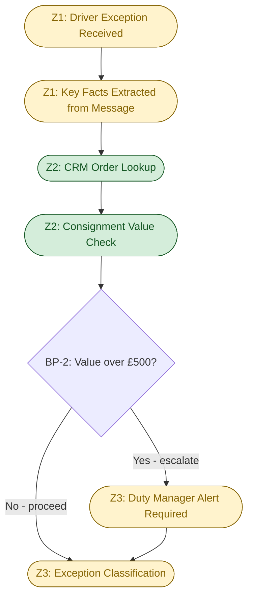
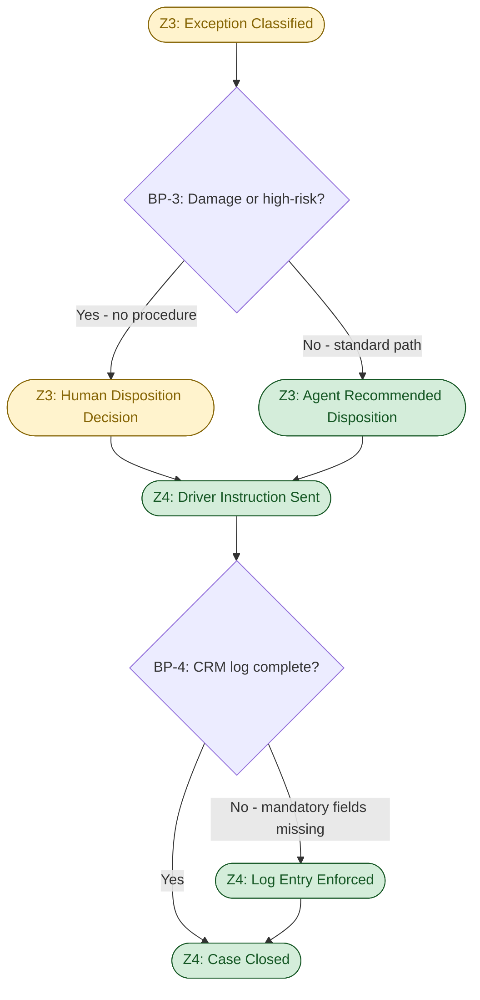
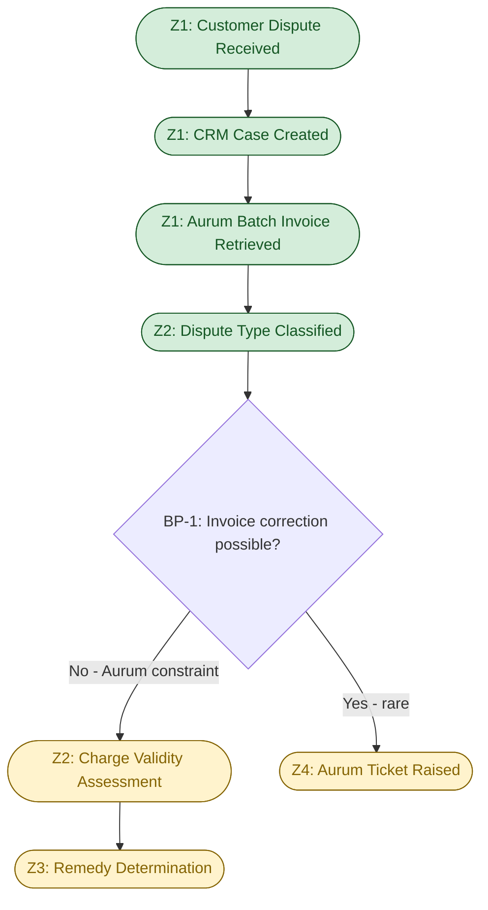
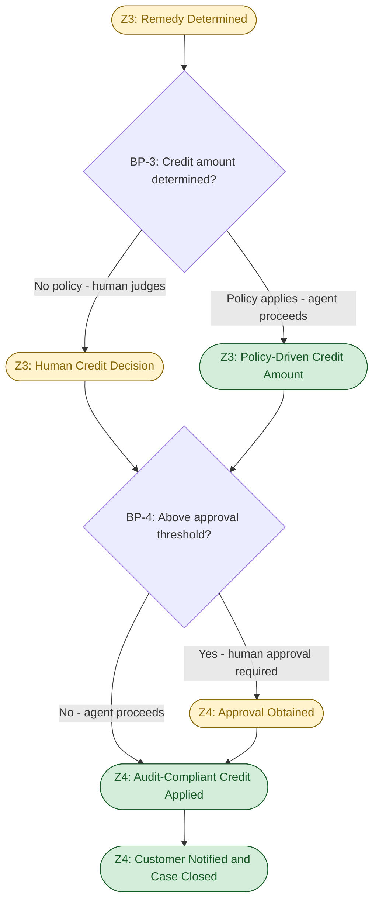
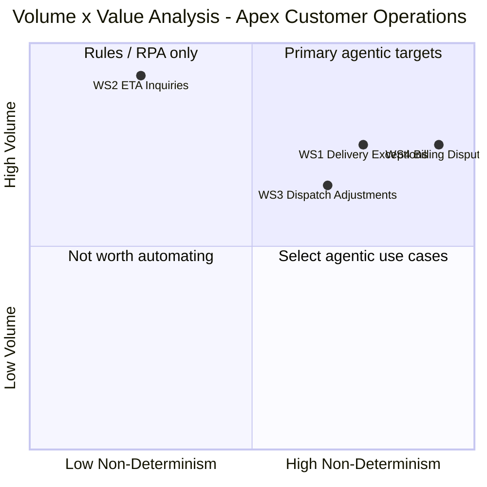

# D1 — Cognitive Load Map: Apex Distribution Ltd — Customer Operations

**Produced:** 2026-05-06
**Status:** Draft — awaiting FDE review

---

## 0. Executive summary

- Delivery exceptions (WS1) and billing disputes (WS4) were selected for decomposition: WS1 carries the highest per-case cognitive burden because every damage decision is discretion-driven with no documented procedure, while WS4 carries the highest compliance risk and the most structurally constrained resolution path — together they represent the two work streams where agent design decisions have the greatest consequence and the widest range of viable architectures.
- The most significant breakpoint across both maps is the moment of **disposition or credit decision without a codified policy** — in WS1 this is the dispatcher choosing return/hold/reattempt for a damaged consignment against an incomplete SOP, and in WS4 this is the agent choosing a credit amount against no stated threshold — both are currently pure-judgment decisions where an agent can only act if a human-defined rule is first put in place.
- The cross-work-stream pattern most consequential for agent design is the **shared absence of a formal decision rule at the highest-stakes moment**: in both work streams, the human currently substitutes tacit knowledge for policy, meaning an agent cannot take over the high-value decision in either stream without a policy design step as a prerequisite — the agent's scope boundary is defined by where the rules run out.

---

## 0b. Table of contents

- [0. Executive summary](#0-executive-summary)
- [0b. Table of contents](#0b-table-of-contents)
- [1. Work stream selection and rationale](#1-work-stream-selection-and-rationale)
- [2. Cognitive Load Map — WS1 Delivery Exceptions](#2-cognitive-load-map--ws1-delivery-exceptions)
  - [2a. Lived process narrative](#2a-lived-process-narrative)
  - [2b. Jobs to be Done decomposition](#2b-jobs-to-be-done-decomposition)
  - [2c. Cognitive zones and breakpoints](#2c-cognitive-zones-and-breakpoints)
  - [2d. Micro-task inventory with dimension scores](#2d-micro-task-inventory-with-dimension-scores)
  - [2e. Process topology diagram](#2e-process-topology-diagram)
- [3. Cognitive Load Map — WS4 Billing Disputes](#3-cognitive-load-map--ws4-billing-disputes)
  - [3a. Lived process narrative](#3a-lived-process-narrative)
  - [3b. Jobs to be Done decomposition](#3b-jobs-to-be-done-decomposition)
  - [3c. Cognitive zones and breakpoints](#3c-cognitive-zones-and-breakpoints)
  - [3d. Micro-task inventory with dimension scores](#3d-micro-task-inventory-with-dimension-scores)
  - [3e. Process topology diagram](#3e-process-topology-diagram)
- [4. Cross-work-stream observations](#4-cross-work-stream-observations)
- [5. Assumption log](#5-assumption-log)

---

## 1. Work stream selection and rationale

**Selected: WS1 — Delivery Exceptions and WS4 — Billing Disputes.**

WS1 offers the highest cognitive complexity in the portfolio: the primary exception type (damaged consignments) has no documented decision procedure (SOP Section 4.3 is explicitly incomplete), every disposition decision is made from dispatcher tacit knowledge, and the consequences of a wrong call are immediate and hard to reverse once the driver leaves the site. Its delegation potential is meaningful because the intake and classification steps are structurally tractable — structured driver inputs and a rules-based escalation threshold — but the core disposition decision cannot be automated without first encoding a decision matrix that does not yet exist.

WS4 offers the highest compliance risk: an active audit trail gap (credits applied informally, bypassing the APPROVER_ID and AUDIT_REF requirements), a system constraint that prevents the correct action (Aurum cannot adjust invoice line items in real time), and a 9-day observed resolution cycle driven by structural latency rather than agent capacity. Its delegation potential is medium but specific: triage, validity assessment, and compliant credit record generation are all mechanically tractable once a formal credit policy is defined, making it the work stream with the clearest prerequisite gap separating current state from agentic capability.

WS2 (ETA inquiries) was excluded because its cognitive complexity is low — it is primarily a lookup task with a well-defined delegation path. It should be automated, but the design decisions are straightforward and would not yield insight from a full cognitive decomposition. WS3 (dispatch adjustments) was excluded because the binding constraint is systemic (the Citrix dispatch console's limited API surface), not cognitive — decomposing it in detail would surface a technical integration problem, not a cognitive load problem.

---

## 2. Cognitive Load Map — WS1: Delivery Exceptions

### 2a. Lived process narrative

*Reconstructed from Artefact 1 (driver voicemail, Mark Petrov, route 042) and Artefact 4 (SOP v2.3). Inferences are labelled.*

A driver encounters a problem at a delivery stop and contacts the dispatch desk. In Artefact 1, this arrives as an unstructured voicemail: "the pallet's leaning, looks damaged on one corner, but to me it looks fine, it's just been on the lorry. The site manager isn't here, it's just the warehouse guy and he's new I think, he doesn't want to sign for it." The dispatcher who picks up the message must extract a decision-relevant picture from this: what type of exception is this? Is this a damage claim, a refusal, or both? Is the warehouse worker's reluctance legally significant?

The dispatcher opens the CRM to retrieve the customer record and case history [INFERENCE — CRM is confirmed as the case management system]. They check the order details to determine consignment value. If the value exceeds £500, the SOP requires escalation to the Duty Manager via the dispatch console [scenario evidence: SOP Section 4.2]. Whether this threshold check is consistently performed is unknown [labelled unknown U-5 in D0D].

Here the process hits its most significant gap: Section 4.3 (Damaged consignments) is blank. The dispatcher has no documented procedure to consult. They draw on experience: "this driver, this customer, this type of situation." Is the damage likely cosmetic? Is the Stein-Allen account a high-sensitivity customer? What would a re-attempt cost in terms of time and driver capacity? The dispatcher makes a judgment call — return-to-depot, hold at location, conditional acceptance — and calls the driver back.

The driver has been parked throughout. In Artefact 1, the message ends: "I'm parked up till you tell me." Every minute of delay is a minute taken from the six remaining drops on route 042. The operational cost of a slow decision is borne by the entire route, not just this case.

The dispatcher instructs the driver and logs the case in the CRM [INFERENCE — logging may be deferred or incomplete under pressure]. The case may or may not generate a follow-up: if the consignment was refused and returned, a redelivery or credit process begins. If conditionally accepted, the customer may later file a damage claim that reopens the case as a billing dispute (cross-stream linkage to WS4).

What informal knowledge is being applied: the dispatcher is pattern-matching from memory — which customers are strict about pallet condition, which drivers are reliable reporters of actual damage vs. nervousness about signing, what "leaning" means in practice on this route. None of this is in the CRM or the SOP.

---

### 2b. Jobs to be Done decomposition

| JtD ID | Cognitive contract — what outcome must be produced? | Trigger | Actor | Key decisions | Key systems/data | Primary cognitive type | Expected output |
|--------|------------------------------------------------------|---------|-------|---------------|-----------------|----------------------|-----------------|
| WS1-J1 | Determine what type of exception has occurred and whether it requires immediate dispatcher intervention or can be handled by a standard procedure | Driver contact (call, voicemail, app message) received | Dispatcher | Is this damage, refusal, missed window, or other? Is there a standard procedure that applies? Does this require escalation before a decision can be made? | CRM (customer/order record), SOP (procedure check), Driver App (driver message) | Pattern recognition + exception handling | Classified exception type with escalation flag and relevant context assembled for the disposition decision |
| WS1-J2 | Produce an operationally correct, policy-compliant disposition instruction for the driver that accounts for consignment value, customer relationship, and route impact | Exception classified, driver waiting for instruction | Dispatcher (with potential Duty Manager) | Return/hold/reattempt/conditional accept? Does consignment value require escalation? What is the customer's likely response to each option? | CRM (customer history, consignment value), SOP Section 4.2 (escalation threshold), dispatcher tacit knowledge | Human sense-making (no procedure for damage; judgment-dominant) | Disposition instruction delivered to driver; driver unblocked |
| WS1-J3 | Ensure the exception is documented completely enough to support downstream claims handling, billing adjustments, and audit review | Disposition delivered and driver has proceeded | Dispatcher | What information must be recorded? Was the escalation threshold applied and documented? Is the damage claim information sufficient for a future billing dispute? | CRM (case record), SOP (documentation requirements) | Deterministic execution | Closed CRM case record with exception type, disposition rationale, escalation flag, and outcome |

---

### 2c. Cognitive zones and breakpoints

**Zones:**

| Zone ID | Zone name | Micro-tasks in zone | Dominant cognitive type | Data dependencies | Error tolerance |
|---------|-----------|---------------------|------------------------|-------------------|-----------------|
| Z1 | Input reception and extraction | Receive driver message; extract key facts | Human sense-making (unstructured input, ambiguous reports) | Driver App (message), no structured form | High tolerance for minor extraction errors; misclassifying exception type has downstream cost |
| Z2 | Context assembly | CRM lookup; consignment value check; escalation threshold evaluation | Deterministic execution (lookup + rule application) | CRM (REST API confirmed); consignment value field (source uncertain — see A-2) | Low tolerance — wrong consignment value produces a missed or false escalation |
| Z3 | Disposition decision | Exception classification; disposition determination; Duty Manager consultation if required | Human sense-making (judgment-dominant; no codified procedure for damage) | CRM (customer history), dispatcher tacit knowledge, SOP Section 4.2 (escalation only) | Very low tolerance — wrong disposition instruction cannot be recalled once driver proceeds |
| Z4 | Execution and closure | Driver communication; CRM case logging | Deterministic execution | Driver App (messaging), CRM (structured fields) | Medium tolerance — communication errors are recoverable; logging gaps create audit exposure |

**Breakpoints:**

| BP ID | Description of handoff | From | To | Why this is a breakpoint | Agent opportunity or risk |
|-------|------------------------|------|----|--------------------------|--------------------------|
| BP-1 | Unstructured driver input must be converted into a structured exception record before any rule-based logic can be applied | Human (dispatcher reading/listening to message) | Agent (structured extraction + classification) | Rule-to-judgment shift: the input is unstructured; pattern recognition is needed before any rule table applies | **Opportunity:** agent with NLP capability can extract exception type, consignment ID, driver location, and reason code from driver message, pre-populating a structured case. **Risk:** extraction errors at this stage propagate to all downstream decisions |
| BP-2 | Consignment value threshold check must gate the escalation decision before any disposition recommendation is made | Agent (lookup + rule application) | Human (Duty Manager) if threshold met; dispatcher if not | Compliance gate: SOP Section 4.2 is the one codified rule in this work stream — an agent can apply it mechanically, but human availability for escalation is uncertain | **Opportunity:** agent enforces the £500 threshold consistently, eliminating the current inconsistency risk. **Risk:** if the Duty Manager is unavailable, the agent must have a defined fallback path rather than proceeding without escalation |
| BP-3 | The disposition decision for damage/refusal exceptions requires judgment that no current rule covers | Dispatcher (judgment) | Agent cannot proceed autonomously without a decision matrix | Rule-to-judgment shift: SOP Section 4.3 is blank; the decision is currently made from tacit knowledge alone | **Opportunity:** agent can present a structured recommended disposition with supporting evidence (customer tier, consignment value, site context) for a 30-second dispatcher approval rather than a full 12-minute reconstruction. **Risk:** if the agent presents a wrong recommendation and the dispatcher rubber-stamps it without scrutiny, quality degrades rather than improves |
| BP-4 | CRM case must be logged with sufficient detail before the case is closed | Agent (enforcement of mandatory fields) | Dispatcher (content judgment on what to record) | Compliance gate: incomplete logging creates audit exposure for downstream damage claims and billing disputes | **Opportunity:** agent enforces mandatory field completion before case closure — eliminating the logging gaps that occur under time pressure. **Risk:** mandatory field enforcement without a clear logging standard will surface the question of what "sufficient detail" means, which must be answered in the design |

---

### 2d. Micro-task inventory with dimension scores

| Micro-task | Cognitive Load | Input Structure | Decision Determinism | Exception Freq | Turn-Taking | Latency Constraint | Compliance/Risk | Tool/API Availability |
|------------|--------------|----------------|---------------------|----------------|-------------|-------------------|-----------------|----------------------|
| MT1: Receive and extract key facts from driver message | H [^1] | L [^2] | L [^3] | H [^4] | H [^5] | H [^6] | M [^7] | L [^8] |
| MT2: Retrieve customer/order record from CRM | L [^9] | H [^10] | H [^11] | L [^12] | L [^13] | H [^14] | L [^15] | H [^16] |
| MT3: Check consignment value and apply escalation threshold | L [^17] | M [^18] | H [^19] | L [^20] | L [^21] | H [^22] | H [^23] | M [^24] |
| MT4: Classify exception type (damage/refusal/missed/other) | M [^25] | L [^26] | M [^27] | M [^28] | M [^29] | H [^30] | M [^31] | M [^32] |
| MT5: Determine disposition — return/hold/reattempt/conditional | H [^33] | L [^34] | L [^35] | H [^36] | H [^37] | H [^38] | H [^39] | L [^40] |
| MT6: Escalate to Duty Manager (if value >£500) | L [^41] | H [^42] | H [^43] | L [^44] | H [^45] | H [^46] | H [^47] | M [^48] |
| MT7: Communicate disposition instruction to driver | L [^49] | H [^50] | H [^51] | L [^52] | H [^53] | H [^54] | L [^55] | H [^56] |
| MT8: Log case in CRM with exception type, outcome, and rationale | L [^57] | H [^58] | H [^59] | M [^60] | L [^61] | L [^62] | M [^63] | H [^64] |

**Score footnotes — WS1:**

[^1]: H — driver message is unstructured voice or free text; agent must infer exception type, consignment ID, location, and reason from narrative description (Artefact 1 shows multiple facts embedded in a single voicemail).
[^2]: L — driver App messages are free text; no structured form exists; SOP references retired DispatchHub which had a structured form (Artefact 4 footnote).
[^3]: L — driver's description may be ambiguous (Artefact 1: "looks damaged on one corner, but to me it looks fine"); extraction outcome varies by reporter.
[^4]: H — exceptions are by definition non-standard; the triggering event (damage, refusal, missed window) is not predictable.
[^5]: H — driver is waiting in real time; clarification requires a back-and-forth exchange before the extraction is complete.
[^6]: H — driver is parked with six remaining drops; every minute of dispatcher delay costs route efficiency (Artefact 1).
[^7]: M — misclassifying the exception type routes to the wrong procedure; not directly a financial error but has downstream billing and claims consequences.
[^8]: L — no structured driver intake form; Driver App messages are unstructured; NLP extraction is not currently in place.
[^9]: L — CRM lookup given order/delivery ID is a standard query requiring no judgment.
[^10]: H — CRM is a structured system; records are queryable by customer ID or order number.
[^11]: H — given a valid order ID, the CRM record is deterministic; no ambiguity in retrieval.
[^12]: L — CRM records exist for all active deliveries; failed retrieval would indicate a data entry error, not an exception.
[^13]: L — single system call; no back-and-forth required.
[^14]: H — decision cannot proceed without customer and order context; this is a blocking step.
[^15]: L — lookup only; no change to any record; no compliance exposure.
[^16]: H — CRM REST APIs are confirmed available (scenario).
[^17]: L — rule application: compare consignment value to £500 threshold; binary outcome.
[^18]: M — consignment value should be in the order record; uncertainty about whether it is in CRM or requires Aurum lookup (see A-2).
[^19]: H — given consignment value and threshold, the escalation decision is binary and fully deterministic.
[^20]: L — the threshold check either triggers or does not; no frequent edge cases.
[^21]: L — single field comparison; no human consultation needed.
[^22]: H — threshold check is the gating step for escalation compliance; must complete before disposition decision.
[^23]: H — failure to escalate a >£500 consignment is a SOP violation with potential financial and reputational exposure (SOP Section 4.2).
[^24]: M — depends on whether consignment value is available in CRM at time of exception; if in Aurum batch only, a 24-hour lag applies.
[^25]: M — exception type can usually be inferred from driver's description; damage vs. refusal vs. missed window have distinct surface features, but combinations are possible (Artefact 1 shows both damage and refusal in the same event).
[^26]: L — classification input is the unstructured driver message; same input structure issue as MT1.
[^27]: M — most cases are classifiable; ambiguous cases (damage + refusal combined) require a judgment about primary type.
[^28]: M — combined/ambiguous exceptions occur (Artefact 1); frequency is unknown but non-trivial given the incomplete SOP.
[^29]: M — dispatcher may need to ask the driver for clarification before classifying with confidence.
[^30]: H — classification is the prerequisite for all downstream decisions; cannot proceed without it.
[^31]: M — wrong classification routes to wrong procedure; not directly a financial error but causes downstream rework.
[^32]: M — CRM case type field supports classification, but mapping from unstructured input requires NLP; no current tool does this automatically.
[^33]: H — no documented decision procedure for damaged consignments (SOP Section 4.3 blank); dispatcher must synthesise driver report, customer history, consignment value, and operational context to produce a disposition.
[^34]: L — inputs to disposition decision are primarily tacit and contextual; none are in a structured system.
[^35]: L — with no decision matrix, different dispatchers would produce different dispositions for identical inputs (confirmed domain-typical pattern from D0A).
[^36]: H — damaged consignment is the exception type with the highest variability and the fewest encoded rules.
[^37]: H — may require Duty Manager consultation (escalation threshold met) or driver clarification (additional context needed); multiple concurrent conversations possible.
[^38]: H — driver is parked; route impact increases with each minute of delay.
[^39]: H — wrong disposition for a high-value consignment creates financial exposure (replacement, redelivery) and reputational risk with the customer (Stein-Allen is described as "the big one" in Artefact 1).
[^40]: L — no system supports the disposition decision; pure judgment; agent can only assist if a decision matrix is first provided.
[^41]: L — rule application: if value >£500, contact Duty Manager; no judgment required on whether to escalate.
[^42]: H — escalation trigger (consignment value) is a structured field; the rule is codified.
[^43]: H — escalation is a binary rule; given the threshold condition, the action is determined.
[^44]: L — escalation is triggered by the threshold, not by random events; frequency depends on consignment value distribution.
[^45]: H — escalation requires reaching the Duty Manager who may be unavailable; async wait possible.
[^46]: H — driver is still waiting; Duty Manager unavailability blocks resolution.
[^47]: H — failure to escalate is a SOP violation; correct escalation is a compliance requirement.
[^48]: M — escalation is via the dispatch console (Citrix, limited API); programmatic escalation notification may not be possible without integration work.
[^49]: L — communication is execution of a decision already made; no judgment required.
[^50]: H — Driver App messaging is structured; message can be composed from decision output fields.
[^51]: H — given a disposition, the communication content is fully determined.
[^52]: L — message delivery failure is rare; driver acknowledgement confirms receipt.
[^53]: H — real-time exchange; driver may ask clarifying questions requiring immediate response.
[^54]: H — driver must receive instruction before proceeding; this is the final blocking step.
[^55]: L — communication itself is not a compliance event; error is recoverable by follow-up.
[^56]: H — Driver App messaging API is available (in-house iOS/Android, scenario).
[^57]: L — structured data entry into CRM fields; no judgment on what decision to record (decision is already made).
[^58]: H — CRM case fields are structured; logging is a field-population exercise.
[^59]: H — logging records what happened; no decision-making involved.
[^60]: M — under time pressure, logging is frequently deferred or abbreviated; exception handling creates incomplete records (domain-typical gap, D0A G-3).
[^61]: L — logging is a solo activity; no coordination required.
[^62]: L — logging can be completed after the driver has been released; not time-critical in the same way as the disposition.
[^63]: M — incomplete logging creates gaps in the case history that affect downstream billing disputes and claims; not a direct compliance event but an enabling risk.
[^64]: H — CRM REST APIs are confirmed available.

---

### 2e. Process topology diagram

**Phase 1 — Intake and Classification**



**Phase 2 — Disposition and Closure**



*Green nodes: agent-owned (deterministic execution, rule application, structured communication). Amber nodes: human-in-the-loop required (unstructured input interpretation, judgment-dependent decisions, escalation handling).*

---

## 3. Cognitive Load Map — WS4: Billing Disputes

### 3a. Lived process narrative

*Reconstructed from Artefact 2 (Hayes & Sons email thread, INV-2026-04318), Artefact 5 (Aurum batch exports), and APEX_DISPUTES_OPEN_20260414.csv. Inferences are labelled.*

A customer disputes a charge on their invoice. They contact Apex — either directly to billing@ or to Customer Operations. The contact arrives as an email (Artefact 2), though calls and escalations are also implied by the 22-minute hold time mentioned in message 3. The agent creates or retrieves a case in the CRM [INFERENCE — CRM is the case management system].

The agent must retrieve the invoice. Aurum Billing does not expose a real-time API — the agent is working from yesterday's batch export at best, and the reconciliation file lags an additional 24 hours [scenario evidence]. If the dispute arrived on the same day as the invoice, the agent may be looking at data that does not yet reflect that invoice. For ongoing disputes, the APEX_DISPUTES_OPEN export shows the current state — but this too is T-1 [scenario evidence].

The agent identifies the dispute type. In Artefact 2, the customer disputes a fuel surcharge applied to a damaged delivery. Fuel surcharges are automatically calculated by Aurum based on route distance and are not tied to delivery condition [scenario evidence: Artefact 2, message 2]. The agent recognises — or has learned — that Aurum cannot adjust individual fuel surcharge line items. The correct action (removing or reducing the surcharge) is technically impossible in real time.

**Pause point:** the agent must decide what to do given a system constraint that prevents the correct action. The options are: (a) raise a formal Aurum modification ticket (48-hour turnaround, uncertain outcome), (b) apply a goodwill credit as a workaround, or (c) explain to the customer that nothing can be done right now.

The agent applies a goodwill credit. In Artefact 2, Sandra applies £170 against a £340 dispute — 50% of the disputed amount — with no stated rationale for why 50%. This is applied via "manual override" with no entry in the credits audit log [scenario evidence: Artefact 2 internal note]. The APEX_CREDITS schema formally requires APPROVER_ID and AUDIT_REF [scenario evidence: APEX_CREDITS CSV], but the informal application bypasses both.

The customer does not receive a corrected invoice. They receive a credit on their next statement — at an unspecified future date. In the case shown, the customer's reply (day 9) has not yet been received, suggesting the resolution is not accepted as final [INFERENCE from Artefact 2 structure].

The APEX_DISPUTES_OPEN export shows that customer C-04451 (Hayes & Sons) has three simultaneous open disputes — all of type FUEL_SURCH_DAMAGE, all assigned to Sandra W. [scenario evidence]. This suggests the informal credit workaround is not resolving the underlying billing relationship problem; it is suppressing individual disputes while the root cause (Aurum's inability to correct fuel surcharge line items on damaged deliveries) persists.

What informal knowledge is being applied: Sandra knows that Aurum cannot adjust fuel surcharges, knows that a goodwill credit is the only available tool, and has developed an informal sense of "how much" to apply. None of this is in any documented policy.

---

### 3b. Jobs to be Done decomposition

| JtD ID | Cognitive contract — what outcome must be produced? | Trigger | Actor | Key decisions | Key systems/data | Primary cognitive type | Expected output |
|--------|------------------------------------------------------|---------|-------|---------------|-----------------|----------------------|-----------------|
| WS4-J1 | Determine whether the disputed charge is valid, erroneous, or requires policy judgment — and what the appropriate remedy class is given the system's structural constraints | Customer dispute contact received | Billing agent | Is the charge correct per Aurum's calculation? Is it valid given the delivery outcome? Can it be corrected in real time or only via goodwill credit? | CRM (case history), Aurum batch export (invoice, surcharge line items), APEX_DISPUTES_OPEN | Synthesis (cross-system data reconciliation + policy application) | Structured dispute assessment: charge validity verdict, remedy class, and constraint identification |
| WS4-J2 | Determine and apply a credit that is financially appropriate, policy-compliant, and generates a complete audit trail record | Dispute assessed, remedy class identified as goodwill credit | Billing agent (with approval if above threshold) | What credit amount is appropriate? Is this below the approval threshold? Is the APPROVER_ID and AUDIT_REF populated? | Aurum batch (APEX_CREDITS schema), CRM, credit policy (currently undefined — assumption A-3) | Human sense-making (judgment on amount; compliance enforcement on trail) | Formally applied credit with APPROVER_ID and AUDIT_REF populated; customer notified of outcome and timeline |
| WS4-J3 | Ensure the customer understands what was done, why, and when to expect the credit — and that the case is closed in a state that supports future dispute pattern analysis | Credit applied, customer communication pending | Billing agent | Is the explanation accurate and complete? Does it address why the invoice could not be corrected? Is the case status in CRM accurate? | CRM (case record, outbound messaging), APEX_DISPUTES_OPEN (status update) | Deterministic execution + communication | Closed CRM case; accurate dispute status in APEX_DISPUTES; customer communication sent |

---

### 3c. Cognitive zones and breakpoints

**Zones:**

| Zone ID | Zone name | Micro-tasks in zone | Dominant cognitive type | Data dependencies | Error tolerance |
|---------|-----------|---------------------|------------------------|-------------------|-----------------|
| Z1 | Case intake and invoice retrieval | Create/retrieve CRM case; retrieve Aurum batch invoice data; identify dispute type | Deterministic execution (lookup, retrieval, classification) | CRM (REST API), Aurum batch (T-1 CSV); data is yesterday's at best | Medium tolerance — data staleness may cause the agent to work from an incomplete picture |
| Z2 | Dispute validity assessment | Assess charge validity; determine whether invoice correction is possible | Synthesis (cross-reference invoice, delivery record, surcharge calculation, account history) | Aurum (invoice, surcharge, disputes); CRM (delivery outcome, account history); no real-time integration | Low tolerance — incorrectly validating an invalid charge harms the customer; incorrectly invalidating a valid one harms the business |
| Z3 | Remedy determination | Determine credit amount; apply credit policy; route for approval if above threshold | Human sense-making (no credit policy stated; judgment-dominant); compliance gate (APPROVER_ID/AUDIT_REF required) | Credit policy (currently undefined); APEX_CREDITS schema; approval authority structure (unknown) | Very low tolerance — under-crediting drives customer churn; over-crediting is a financial loss; non-compliant application creates audit exposure |
| Z4 | Compliant execution and closure | Apply credit with audit fields populated; submit Aurum ticket if formal correction needed; notify customer; close CRM case | Deterministic execution (field population, messaging, ticket submission) | APEX_CREDITS write capability (uncertain — see A-4); CRM messaging; Aurum ticket process | Medium tolerance — execution errors are recoverable; audit trail gap is not |

**Breakpoints:**

| BP ID | Description of handoff | From | To | Why this is a breakpoint | Agent opportunity or risk |
|-------|------------------------|------|----|--------------------------|--------------------------|
| BP-1 | System constraint evaluation: can the invoice be corrected in real time or not? | Agent (rule application) | Agent continues on constrained path; no human needed here | System constraint gate: Aurum cannot adjust line items in real time; this is a known, binary constraint that requires no judgment | **Opportunity:** agent can apply this rule mechanically and immediately route to the correct remedy path (goodwill credit), without the dispatcher having to re-learn this constraint per case. **Risk:** if the constraint ever changes (Aurum gains an API), the routing logic must be updated |
| BP-2 | Charge validity judgment: is the disputed charge correct given the delivery outcome? | Agent (structured data retrieval and comparison) | Human (for ambiguous cases) | Rule-to-judgment shift: fuel surcharge validity is rule-based (distance-based calculation), but validity in the context of a damage claim requires judgment about whether the charge is "fair" given the outcome | **Opportunity:** for clear-cut cases (surcharge on a fully accepted delivery — no dispute basis), agent can close autonomously. **Risk:** for damage-linked surcharges (the majority of open disputes per APEX_DISPUTES_OPEN), the validity question requires human judgment on the damage claim relationship |
| BP-3 | Credit amount determination: what amount should be credited? | Human (judgment; no policy) | Agent (enforcement) only after policy is defined | Rule-to-judgment shift: no credit policy exists; agent cannot determine an amount without a codified rule | **Opportunity:** once a credit policy is defined (e.g., 50% of disputed amount for fuel surcharge on damage claim, subject to approval above £X), agent can apply it mechanically and consistently — eliminating the current per-agent variation. **Risk:** deploying before policy is defined will either block all credits (agent refuses to proceed without a rule) or reproduce informal behaviour (agent mirrors the 50% heuristic without authority to do so) |
| BP-4 | Audit trail compliance: was the credit applied with APPROVER_ID and AUDIT_REF populated? | Agent (field population enforcement) | Human (approval above threshold) | Compliance gate: APEX_CREDITS schema requires both fields; current practice bypasses them; the agent must enforce the formal path | **Opportunity:** agent enforces mandatory field completion before credit is written — closing the active compliance gap identified in Artefact 2. **Risk:** if the agent writes credits and the APPROVER_ID is automatically populated with a system ID rather than a named human approver, the audit trail is technically complete but operationally meaningless |

---

### 3d. Micro-task inventory with dimension scores

| Micro-task | Cognitive Load | Input Structure | Decision Determinism | Exception Freq | Turn-Taking | Latency Constraint | Compliance/Risk | Tool/API Availability |
|------------|--------------|----------------|---------------------|----------------|-------------|-------------------|-----------------|----------------------|
| MT1: Create/retrieve CRM case and link to invoice | L [^65] | H [^66] | H [^67] | L [^68] | L [^69] | M [^70] | L [^71] | H [^72] |
| MT2: Retrieve invoice and surcharge data from Aurum batch | L [^73] | H [^74] | H [^75] | M [^76] | L [^77] | M [^78] | L [^79] | M [^80] |
| MT3: Classify dispute type (fuel surcharge / redelivery fee / dimensional weight / other) | M [^81] | M [^82] | M [^83] | M [^84] | L [^85] | M [^86] | M [^87] | H [^88] |
| MT4: Assess whether the disputed charge is valid | H [^89] | M [^90] | M [^91] | M [^92] | M [^93] | L [^94] | H [^95] | M [^96] |
| MT5: Determine whether invoice correction is possible (Aurum constraint check) | L [^97] | H [^98] | H [^99] | L [^100] | L [^101] | L [^102] | M [^103] | H [^104] |
| MT6: Determine appropriate credit amount | H [^105] | L [^106] | L [^107] | H [^108] | M [^109] | L [^110] | H [^111] | L [^112] |
| MT7: Apply credit with APPROVER_ID and AUDIT_REF | L [^113] | H [^114] | H [^115] | M [^116] | L [^117] | L [^118] | H [^119] | M [^120] |
| MT8: Communicate resolution to customer | L [^121] | H [^122] | H [^123] | M [^124] | H [^125] | M [^126] | M [^127] | H [^128] |

**Score footnotes — WS4:**

[^65]: L — CRM case creation/retrieval is a standard lookup; no judgment required.
[^66]: H — CRM is a structured system; invoice number and customer ID are the lookup keys.
[^67]: H — given invoice number, CRM case retrieval is deterministic; no ambiguity.
[^68]: L — CRM records exist for all active accounts; retrieval failure indicates a data issue, not an exception.
[^69]: L — single system call; no coordination required.
[^70]: M — customer is not waiting in real time the way a parked driver is; same-day response is expected but not minute-by-minute.
[^71]: L — lookup only; no record change at this stage.
[^72]: H — CRM REST APIs are confirmed available.
[^73]: L — reading a CSV batch export is a structured lookup; no judgment.
[^74]: H — Aurum exports are structured CSVs with defined schemas (INVOICE_NO, AMT_FUEL_SURCH, etc.).
[^75]: H — given invoice number, the record in the CSV is deterministic; however, the data is T-1, which may not reflect same-day invoices.
[^76]: M — if the dispute concerns an invoice not yet in the batch (same-day or data lag), the agent is working blind; this is a known exception case.
[^77]: L — CSV read is a batch operation; no human coordination required.
[^78]: M — working from yesterday's data is a known constraint; for time-sensitive disputes, data freshness is a risk but not a blocking issue at intake.
[^79]: L — read operation only; no compliance exposure at retrieval stage.
[^80]: M — Aurum data is available via daily CSV exports; agent can read these; write access to Aurum is not available in real time; real-time query is not possible.
[^81]: M — dispute type can usually be inferred from customer's description; fuel surcharge, redelivery fee, and dimensional weight have distinct characteristics; some disputes are ambiguous or span multiple charge types.
[^82]: M — customer email is semi-structured; dispute type is usually stated but may require parsing from natural language.
[^83]: M — most dispute types are identifiable; edge cases (multi-charge disputes, ambiguous descriptions) require judgment.
[^84]: M — multi-charge disputes exist (APEX_DISPUTES shows FUEL_SURCH_DAMAGE as a combined type); not rare.
[^85]: L — classification is based on available information; no back-and-forth required at this stage.
[^86]: M — classification is the prerequisite for validity assessment; important but not time-critical in the same way as exception handling.
[^87]: M — misclassification routes to wrong assessment procedure; not directly a financial error but causes rework.
[^88]: H — APEX_DISPUTES_OPEN export includes a DISPUTE_TYPE field; CRM case type field supports classification; structured data available.
[^89]: H — requires cross-referencing invoice (Aurum batch), delivery outcome (CRM/Driver App), surcharge calculation basis (route distance), and account history; no single source has all required data.
[^90]: M — invoice and surcharge data are structured; delivery outcome in CRM may be structured; damage assessment from driver may be unstructured.
[^91]: M — fuel surcharge validity based on route distance is rule-based; validity in the context of a damage claim requires judgment about the relationship between the charge and the outcome.
[^92]: M — damage-linked disputes (majority of APEX_DISPUTES open cases) require judgment; simple calculation errors are deterministic.
[^93]: M — may need to consult delivery records or Driver App scan data to confirm delivery outcome.
[^94]: L — resolution expected within days; no real-time pressure.
[^95]: H — incorrectly validating an invalid charge loses customer trust and may trigger further escalation; incorrectly invalidating a valid charge is a financial loss.
[^96]: M — invoice and delivery data accessible via batch; real-time delivery outcome from Driver App uncertain.
[^97]: L — rule application: Aurum cannot adjust line items in real time; this is a known, binary constraint that requires no case-by-case judgment.
[^98]: H — the constraint is a known fact; no ambiguous inputs.
[^99]: H — the constraint applies universally; no judgment required.
[^100]: L — constraint is universal; no exceptions exist for real-time correction.
[^101]: L — no consultation needed; constraint is known.
[^102]: L — applying the constraint check is instantaneous; no waiting.
[^103]: M — informing the customer incorrectly about correction options would damage trust; agent must communicate accurately.
[^104]: H — knowledge of constraint is available; no system query needed; rule is encapsulated in agent logic.
[^105]: H — no credit policy exists; Sandra applied 50% of disputed amount in Artefact 2 without stated rationale; different agents would produce different amounts for identical disputes.
[^106]: L — no structured policy document exists to guide the amount decision; agent would be operating on informal norms or no guidance.
[^107]: L — highly judgment-dependent; even experienced agents produce inconsistent amounts without a policy.
[^108]: H — every dispute requiring a goodwill credit reaches this decision point with no rule to apply; it is the norm, not the exception.
[^109]: M — large credits may require consultation with a senior agent or manager; threshold unknown.
[^110]: L — no time pressure on credit amount decision; customer is waiting days, not minutes.
[^111]: H — under-crediting risks customer churn (Artefact 2: customer escalating after a 9-day thread); over-crediting is a direct financial loss; non-compliant application creates audit exposure.
[^112]: L — no system or policy document supports the credit amount decision; pure judgment with no tool assistance.
[^113]: L — execution of a decision already made; field population in the credit record.
[^114]: H — APEX_CREDITS schema is structured: CREDIT_ID, INVOICE_NO, CUSTOMER_ID, CREDIT_AMT, REASON_CODE, APPROVER_ID, AUDIT_REF, APPLIED_DT.
[^115]: H — given credit amount and required fields, record creation is deterministic.
[^116]: M — informal bypass is current practice (Artefact 2); the agent must enforce the formal path even when the informal path is habitual.
[^117]: L — single record write; no coordination.
[^118]: L — not time-critical; can be applied same day.
[^119]: H — APPROVER_ID and AUDIT_REF are required fields per schema; non-compliant application is an active compliance gap (Artefact 2).
[^120]: M — agent can read APEX_CREDITS CSV; write access to Aurum credit records requires confirmation — may require a separate integration or Aurum ticket process.
[^121]: L — communication is execution of a decision already made; content is determined.
[^122]: H — CRM outbound messaging is structured.
[^123]: H — content (credit amount, timeline, reason) is determined by prior steps.
[^124]: M — customer may respond with follow-up (Artefact 2: customer escalated after day 4); agent must be able to handle a response.
[^125]: H — customer may reply; dispute thread may continue; back-and-forth is expected for complex cases.
[^126]: M — same-day customer communication is expected but not minute-by-minute.
[^127]: M — misleading the customer about amount or timing has customer relations consequences.
[^128]: H — CRM REST APIs confirmed for outbound messaging.

---

### 3e. Process topology diagram

**Phase 1 — Intake and Validity Assessment**



**Phase 2 — Remedy and Closure**



*Green nodes: agent-owned (deterministic execution, rule application, compliant field population). Amber nodes: human-in-the-loop required (validity judgment, credit amount determination, approval for above-threshold credits).*

---

## 4. Cross-work-stream observations

**Observation 1 — Shared prerequisite: a codified decision rule must exist before an agent can act at the highest-value moment.**
In both WS1 and WS4, the most consequential decision in the work stream (disposition of damaged consignment; credit amount for billing dispute) is currently made from tacit knowledge against no documented policy. An agent cannot autonomously take over either decision without a human-defined rule to apply. This is not a technology gap — it is a process design gap that must be closed before agent development begins. The policy design step is a prerequisite, not a parallel workstream.

**Observation 2 — Shared data dependency: CRM is the common context layer for both work streams.**
Both WS1 and WS4 begin with a CRM lookup (customer record, case history, order details) and end with a CRM write (case closure, logging). The CRM REST API is confirmed available. A shared context retrieval component — pulling customer record, account history, and case status from CRM — would be reusable across both work streams and would reduce redundant integration work. This component also supports cross-stream linkage: a refused delivery (WS1) that generates a billing dispute (WS4) would share the same CRM case context.

**Observation 3 — Shared compliance gap: both work streams currently bypass audit requirements under time pressure.**
WS1 has incomplete CRM logging under call pressure (MT8 exception frequency: M); WS4 has informal credit application bypassing APPROVER_ID and AUDIT_REF (MT7 exception frequency: M). In both cases, the bypass is not malicious — it is a rational response to time pressure and an approval process that adds friction without clear benefit to the agent. An agent that enforces audit compliance in both streams will surface this tension: if enforcement slows resolution, it will be perceived as a regression. The design must make compliant behaviour faster than the workaround, not just mandatory.

**Observation 4 — Shared entry point uncertainty: both work streams receive unstructured inputs that must be classified before any rule can be applied.**
WS1 receives unstructured driver voice/text messages (BP-1); WS4 receives semi-structured customer emails. In both cases, the first cognitive step is extraction and classification — converting the input into a structured representation. A shared NLP intake component (structured extraction from free text + classification into work stream and exception type) would serve both work streams and reduce the most common source of downstream processing errors.

**Observation 5 — Asymmetric latency requirements that constrain shared agent architecture.**
WS1 has hard real-time latency requirements (driver parked, route impact accumulates per minute); WS4 has soft same-day requirements (customer expects a response within the working day, not within minutes). Any shared agent architecture must accommodate both: a synchronous, low-latency path for WS1 exception classification and driver instruction, and an asynchronous, batch-aware path for WS4 dispute assessment working from T-1 data. These are different operational patterns even if they share intake and context-retrieval components.

---

## 5. Assumption log

> **Assumption A-1:** The disposition decision for WS1 exceptions is the dispatcher's call in all non-escalated cases, without any structured decision support tool, checklist, or consultation protocol.
> **Why it matters:** Determines the scope of the "HITL co-pilot" design — if any structured tool exists (even an informal checklist), the agent's value-add in the decision zone is lower; if there is genuinely no support structure, the agent's recommendation capability is the primary improvement.
> **If wrong:** If dispatchers use an informal shared document or communication channel to cross-check decisions, the social context of that channel is part of the decision system and the agent must integrate with it.
> **Confidence:** Medium-high — Artefact 1 shows a dispatcher attempting to reach Sandra (a colleague, not a system) and finding her line busy; the "consult a person" path is the only visible support mechanism.

> **Assumption A-2:** Consignment value is accessible in the CRM at the point of exception handling, without requiring a separate Aurum lookup.
> **Why it matters:** If consignment value is only in Aurum (batch-only), the escalation threshold check (MT3) faces the same 24-hour data lag as billing, which would mean the agent cannot reliably enforce the >£500 rule at the time of the exception.
> **If wrong:** If consignment value is batch-only, the escalation threshold enforcement capability of the agent is constrained, and a different proxy (e.g., customer tier) must substitute.
> **Confidence:** Medium — the CRM holds customer and order records; whether order value is a field on the delivery record vs. only on the invoice is not stated in the scenario.

> **Assumption A-3:** No formal credit policy exists at Apex — the credit amount applied in Artefact 2 (£170 against a £340 dispute) reflects a personal heuristic, not a documented policy at a 50% threshold.
> **Why it matters:** If a credit policy exists and is simply not being followed, the agent design path is simpler (enforce the existing policy). If no policy exists, the FDE must flag this as a prerequisite deliverable before the agent can be designed for Z3 (remedy determination) in WS4.
> **If wrong:** If a credit policy does exist (e.g., documented in a finance policy document not included in the scenario), the agent can be built to it directly, and the policy-design step can be skipped.
> **Confidence:** Medium — the scenario does not reference any credit policy document; Artefact 2 shows a credit applied with no stated basis; the internal note references "goodwill" without any threshold or formula.

> **Assumption A-4:** The agent can read Aurum batch export CSVs directly from the export path but cannot write to Aurum records programmatically — credit application requires either a separate write pathway (via CRM or a middleware layer) or a continuation of the manual Aurum ticket process.
> **Why it matters:** If the agent cannot write audit-compliant credit records to the APEX_CREDITS export pathway, closing the compliance gap in WS4 requires a different technical approach (e.g., a separate credits ledger in CRM that feeds into Aurum reconciliation).
> **If wrong:** If Aurum exposes any write interface (even a restricted one for credits), the agent can close the compliance gap directly without a separate ledger.
> **Confidence:** Medium — the scenario states "batch-file exports only" and "no real-time API"; whether this applies equally to reads and writes, or only to real-time queries, is not specified.
# D2 — Delegation Suitability Matrix: Apex Distribution Ltd — Customer Operations

**Produced:** 2026-05-06
**Status:** Draft — awaiting FDE review

---

## 0. Executive summary

- Across eight scored task clusters, two are Fully Agentic (ETA standard lookup and compliant credit execution), three are Human-led + Agent Support (ETA edge-case, exception classification, dispute intake), one is Human-led + Automation Support (dispatch adjustment, system-constrained), and two are Human Only — the split is governed not by task volume but by the presence or absence of a codified decision rule and the availability of a write-capable system integration.
- The most contested assignment is exception intake and classification (C-3), which scores 0/7 on the suitability matrix due to unstructured inputs and hard real-time latency, yet warrants Human-led + Agent Support rather than Human Only because the agent's speed advantage in structured extraction and its mechanical enforcement of the £500 escalation threshold are exactly what this work stream needs — the score reflects a difficult environment, not a useless intervention.
- The scenario's primary governance constraints — Aurum's batch-only architecture with no real-time write API, the mandatory APPROVER_ID and AUDIT_REF requirement for credit records, and the £500 Duty Manager escalation rule — land in three distinct clusters: they lock credit determination (C-7) to Human Only until a write pathway is established, enforce the audit-compliant credit execution cluster (C-8) as a non-negotiable compliance gate before any credit record is written, and require the exception classification cluster (C-3) to route all >£500 cases to a human duty manager before disposition is attempted.

---

## 0b. Table of contents

- [0. Executive summary](#0-executive-summary)
- [0b. Table of contents](#0b-table-of-contents)
- [1. Task cluster definition](#1-task-cluster-definition)
- [2. Delegation Suitability Matrix](#2-delegation-suitability-matrix)
- [3. Delegation archetype assignment with rationale](#3-delegation-archetype-assignment-with-rationale)
- [4. Delegation architecture summary](#4-delegation-architecture-summary)
- [5. Delegation boundary defence](#5-delegation-boundary-defence)
- [6. Assumption log](#6-assumption-log)

---

## 1. Task cluster definition

| Cluster | Work Stream | Description |
|---------|-------------|-------------|
| C-1: ETA Standard Inquiry Resolution | WS2 — ETA Inquiries | Customer requests delivery status; agent retrieves route window from CRM and Driver App and responds; no dispatch consultation required |
| C-2: ETA Edge-Case Estimate | WS2 — ETA Inquiries | Customer pushes for a tighter estimate than the standard window; GPS data is stale; dispatch consultation is required to produce a useful answer |
| C-3: Exception Intake, Classification, and Escalation Routing | WS1 — Delivery Exceptions | Agent receives unstructured driver message, extracts key facts, classifies exception type, checks consignment value against the £500 escalation threshold, and routes to Duty Manager or dispatcher |
| C-4: Exception Disposition Decision | WS1 — Delivery Exceptions | Dispatcher determines the correct instruction for the driver (return-to-depot, hold, reattempt, conditional accept) for damage and refusal exceptions where no documented procedure exists |
| C-5: Dispatch Adjustment Assessment and Execution | WS3 — Dispatch Adjustments | Dispatcher receives a mid-route change request, assembles route state from dispatch console and Driver App, makes the adjustment decision, and communicates it to the driver |
| C-6: Billing Dispute Intake and Charge Validity Assessment | WS4 — Billing Disputes | Agent receives customer dispute, retrieves invoice and surcharge data from Aurum batch exports, classifies dispute type, and assesses whether the disputed charge is valid |
| C-7: Credit Amount Determination | WS4 — Billing Disputes | Agent determines the appropriate goodwill credit amount to apply given that invoice line-item correction is not possible in real time; no credit policy currently exists |
| C-8: Audit-Compliant Credit Record Execution | WS4 — Billing Disputes | Agent writes the credit record with APPROVER_ID, AUDIT_REF, CREDIT_AMT, and REASON_CODE populated; ensures the audit trail is complete before the credit is issued to the customer |

---

## 2. Delegation Suitability Matrix

| Task Cluster | Work Stream | Input Structure | Decision Determinism | Tool Coverage | Context Complexity | Exception Rate | Latency Constraint | Risk/Compliance | Suitability Score | Delegation Archetype |
|---|---|---|---|---|---|---|---|---|---|---|
| C-1: ETA Standard Resolution | WS2 | H | H | H | L | L | M | L | 6/7 | Fully Agentic |
| C-2: ETA Edge-Case Estimate | WS2 | M | M | M | M | M | M | L | 1/7 | Human-led + Agent Support |
| C-3: Exception Intake, Classification, Escalation | WS1 | L | M | M | M | M | H | M | 0/7 | Human-led + Agent Support |
| C-4: Exception Disposition Decision | WS1 | L | L | L | H | H | H | H | 0/7 | Human Only |
| C-5: Dispatch Adjustment | WS3 | M | L | L | H | M | H | M | 0/7 | Human-led + Automation Support |
| C-6: Dispute Intake and Validity Assessment | WS4 | M | M | M | M | M | L | M | 1/7 | Human-led + Agent Support |
| C-7: Credit Amount Determination | WS4 | L | L | L | H | H | L | H | 1/7 | Human Only |
| C-8: Audit-Compliant Credit Execution | WS4 | H | H | M | L | L | L | H | 5/7 | Fully Agentic (below threshold) / Agent-led + Human Oversight (above threshold) |

**Scoring note — dimension values represent delegation suitability signals:**
H = High; M = Medium; L = Low. Suitability score counts: Input Structure (H=1), Decision Determinism (H=1), Tool Coverage (H=1), Context Complexity (L=1), Exception Rate (L=1), Latency Constraint (L=1), Risk/Compliance (L=1). Maximum score: 7.

**Dimension justification notes:**

*C-1:* Input structure H — customer requests are structured (order ID or name provided); Decision Determinism H — route window lookup is deterministic given order record; Tool Coverage H — CRM REST API and Driver App both confirmed available; Context Complexity L — single order, no multi-system synthesis; Exception Rate L — standard inquiries require no judgment [A-1]; Latency M — customer expects response within minutes but not driver-urgent; Risk L — an incorrect ETA estimate is a service issue, not a compliance event.

*C-2:* All middle-ground. Input structure M — customer request clear but GPS data state uncertain (26-min lag observed in Artefact 3); Decision Determinism M — estimate requires judgment about GPS data quality; Tool Coverage M — tools available but GPS freshness limits decision quality; Context Complexity M — requires route + movement rate reasoning; Exception Rate M — this is the exception path; Latency M; Risk L — poor estimate is a service issue.

*C-3:* Input Structure L — driver messages are unstructured voice/free text (Artefact 1); Decision Determinism M — classification taxonomy is mostly deterministic but ambiguous inputs occur (combined damage + refusal); Tool Coverage M — CRM available, NLP capability needed but not in place, escalation routing via dispatch console has limited API; Context Complexity M — customer history + consignment value synthesis; Exception Rate M — combined exception types occur; Latency H — driver parked, real-time required (Artefact 1); Risk M — misclassification causes rework; escalation miss is a compliance concern.

*C-4:* All adverse. Input Structure L — inputs are the dispatcher's assembled judgment, no structured form; Decision Determinism L — SOP Section 4.3 is blank, pure tacit knowledge (Artefact 4); Tool Coverage L — no system supports this decision; Context Complexity H — driver report + customer history + consignment value + route impact + customer relationship all relevant; Exception Rate H — every damaged consignment presents unique context; Latency H — driver parked; Risk H — wrong disposition = financial exposure + route disruption + reputational risk with key accounts.

*C-5:* Input Structure M — some structure (Driver App message or CRM request) but route state is fragmented across systems; Decision Determinism L — requires judgment on route state, customer priority, driver capacity simultaneously; Tool Coverage L — dispatch console via Citrix has limited API surface, no confirmed write access (scenario); Context Complexity H — multi-system synthesis under time pressure; Exception Rate M — not all adjustments are equally complex; Latency H — time-critical; Risk M — wrong adjustment cascades to downstream drops; driver hours compliance risk.

*C-6:* Input Structure M — customer email semi-structured, invoice/dispute data structured (Aurum CSV schema confirmed); Decision Determinism M — surcharge validity is rule-based for clear-cut cases; damage-linked disputes require judgment; Tool Coverage M — CRM available, Aurum batch accessible, no real-time billing query; Context Complexity M — invoice + delivery outcome + account history required; Exception Rate M — damage-linked disputes are the majority of open disputes (APEX_DISPUTES_OPEN); Latency L — same-day response expected, not minute-by-minute; Risk M — validity assessment drives credit decision; error has financial consequence.

*C-7:* Input Structure L — no credit policy document exists; decision rests on informal norms (Artefact 2: 50% applied without rationale); Decision Determinism L — different agents produce different amounts for identical disputes; Tool Coverage L — no system or policy supports this decision; Context Complexity H — customer history, dispute history, account value, precedent all relevant; Exception Rate H — every dispute requiring a goodwill credit reaches this step with no rule to apply; Latency L — not time-critical; Risk H — under-credit drives churn, over-credit is a financial loss, non-compliant application is an audit exposure.

*C-8:* Input Structure H — APEX_CREDITS schema is fully defined (CREDIT_ID, INVOICE_NO, CUSTOMER_ID, CREDIT_AMT, REASON_CODE, APPROVER_ID, AUDIT_REF, APPLIED_DT); Decision Determinism H — given credit amount, record creation is deterministic; Tool Coverage M — CRM write confirmed, Aurum write access uncertain [A-2]; Context Complexity L — all required fields are known before execution; Exception Rate L — execution errors are rare; Latency L — not time-critical; Risk H — APPROVER_ID and AUDIT_REF are mandatory compliance fields; non-compliant application is the active gap identified in Artefact 2.

---

## 3. Delegation archetype assignment with rationale

> **Cluster C-1 — ETA Standard Inquiry Resolution**
> **Archetype:** Fully Agentic
> **Rationale:** Input Structure (H) and Decision Determinism (H) converge on a lookup-and-respond pattern with no judgment required for standard cases. Tool Coverage (H) is confirmed via CRM REST API and Driver App. Risk (L) means an incorrect response is a service issue, not a compliance event, making this safe for full delegation. Suitability score 6/7.
> **Governance rule impact:** None — this cluster has no financial, regulatory, or escalation trigger.
> **Anti-pattern check:** The standard ETA lookup is close to solvable by a simple API integration (CRM order query → Driver App route check → templated response). An AI agent is justified over a script because: (1) customer messages arrive in natural language requiring parsing; (2) the edge case path (C-2) requires contextual judgment that a script cannot handle; (3) a unified agent handles both C-1 and C-2 more efficiently than a script plus a separate human triage layer.

> **Cluster C-2 — ETA Edge-Case Estimate**
> **Archetype:** Human-led + Agent Support
> **Rationale:** Decision Determinism (M) — the GPS data has observable latency (~26 min in Artefact 3); producing a useful estimate requires inference about movement rate, not just data lookup. Tool Coverage (M) — the necessary data exists but its freshness is uncertain. The agent adds value by: retrieving and presenting the last GPS ping with its timestamp, calculating the implied travel time since the ping, and flagging whether the data is fresh enough to give a reliable estimate. The human (dispatcher) then decides whether to call the route driver or respond with a caveat. Suitability score 1/7.
> **Governance rule impact:** None — providing an estimate carries no compliance trigger.
> **Anti-pattern check:** A script could retrieve the last GPS ping, but it could not assess whether the data is stale enough to require a dispatch call, nor compose a contextually appropriate customer response for the edge case. An agent is warranted here; a script would either always call dispatch (wasteful) or never call dispatch (poor customer experience).

> **Cluster C-3 — Exception Intake, Classification, and Escalation Routing**
> **Archetype:** Human-led + Agent Support
> **Rationale:** Input Structure (L) — driver messages are unstructured voice/free text (Artefact 1) — is the primary limiting dimension, combined with Latency Constraint (H) — driver parked, real-time response required. These two dimensions make fully autonomous handling non-viable. However, the agent adds irreplaceable value at two specific points: (1) structured extraction from unstructured input at speed the human cannot match under multi-tasking conditions; (2) mechanical enforcement of the £500 Duty Manager escalation threshold, which D0D flagged as inconsistently applied. The human validates the extracted classification before any disposition is attempted. Suitability score 0/7 reflects a difficult environment, not a zero-value intervention.
> **Governance rule impact:** The £500 escalation rule (SOP Section 4.2) is embedded here as a non-negotiable compliance gate. The agent must enforce this threshold mechanically — regardless of whether the dispatcher would have applied it — before any disposition path is opened.
> **Anti-pattern check:** A script with keyword matching could attempt classification, but would fail on ambiguous inputs (Artefact 1: damage + refusal combined in a single voicemail) and would have no awareness of context (customer tier, prior case history). An agent with NLP capability is warranted; keyword matching is not sufficient.

> **Cluster C-4 — Exception Disposition Decision**
> **Archetype:** Human Only
> **Rationale:** Decision Determinism (L) — SOP Section 4.3 is explicitly incomplete; no documented procedure exists for damaged consignments — is the determining dimension. Tool Coverage (L) — no system provides decision support for this judgment — confirms there is nothing for an agent to execute against. Risk (H) — wrong disposition for a high-value consignment creates financial exposure and route disruption — makes this a hard stop for autonomous delegation. Unlike C-3 where the agent adds value in preparation, here the core cognitive act (what do I do with this consignment?) cannot be supported by an agent without a decision matrix that does not yet exist. Suitability score 0/7.
> **Governance rule impact:** The £500 escalation rule means that for the subset of cases that have already been routed to the Duty Manager (via C-3), the disposition decision is not made by the regular dispatcher at all — it is a Duty Manager judgment. The agent's scope ends at routing; it has no role in the disposition decision itself.
> **Anti-pattern check:** N/A — Human Only archetypes do not require an anti-pattern check. The prerequisite for changing this archetype is a documented decision matrix for at least the top 3 exception types (damage, refusal, unattended address with high-value consignment). Once that exists, this cluster can be reclassified as Human-led + Agent Support.

> **Cluster C-5 — Dispatch Adjustment Assessment and Execution**
> **Archetype:** Human-led + Automation Support
> **Rationale:** Tool Coverage (L) — the dispatch console runs via Citrix with a stated limited API surface, and write access is unconfirmed — is the binding constraint. Even if the cognitive work were fully delegatable, the agent cannot act on the dispatch console without a confirmed programmatic interface. Decision Determinism (L) — multi-system context synthesis under time pressure — confirms the cognitive challenge. The appropriate archetype is Human-led + Automation Support rather than Human-led + Agent Support because the automation scope is narrowly limited to structured data retrieval (CRM case context, GPS from Driver App); the agent cannot extend into the dispatch console without integration work that is out of scope for an initial deployment. Suitability score 0/7.
> **Governance rule impact:** Driver hours compliance is a constraint: dispatch adjustments that affect driver hours must not be executed without a compliance check. Until the dispatch console API surface is confirmed, this constraint cannot be mechanically enforced — it remains a human responsibility.
> **Anti-pattern check:** A script that reads Driver App GPS and formats a current route state summary would cover a portion of the agent's value here. This cluster is the one in the portfolio where an agent is the least clearly warranted over simpler automation — structured data retrieval and formatting is closer to a static integration than an agentic capability. The agent is appropriate only if it is also handling intake classification across work streams (the shared NLP component from D1 Cross-Observation 4).

> **Cluster C-6 — Billing Dispute Intake and Charge Validity Assessment**
> **Archetype:** Human-led + Agent Support
> **Rationale:** Tool Coverage (M) — CRM REST API confirmed; Aurum batch export accessible; but no real-time billing query is possible — sets the upper bound on agent capability. Decision Determinism (M) — fuel surcharge validity for clear delivery cases is rule-based (agent can handle); damage-linked dispute validity requires judgment (human validates) — creates a natural human-agent split within the cluster. The agent handles: case creation, Aurum batch data retrieval, dispute type classification, and rule-based validity verdicts for clear-cut cases. The human handles: validity judgment for ambiguous damage-linked cases. Suitability score 1/7 reflects the mixed determinism and Aurum data latency constraint.
> **Governance rule impact:** Aurum batch-only (T-1 data, no real-time API) means the agent is always working from yesterday's data. This is a structural constraint, not a design choice — the agent must communicate data staleness to the human reviewer when presenting a validity assessment.
> **Anti-pattern check:** The structured retrieval and classification steps within this cluster are close to script-level automation (Aurum CSV read + CRM lookup + taxonomy mapping). An agent is warranted because: (1) dispute intake arrives in natural language; (2) the rule-based vs. judgment-required split within the cluster needs contextual awareness to navigate correctly.

> **Cluster C-7 — Credit Amount Determination**
> **Archetype:** Human Only
> **Rationale:** Decision Determinism (L) — no credit policy exists; Sandra applied 50% of the disputed amount in Artefact 2 without stated rationale; different agents produce different amounts for identical disputes — is the determining dimension. Tool Coverage (L) — no system or policy document provides a rule for the agent to apply — confirms there is nothing to delegate to. Risk (H) — under-credit drives customer churn; over-credit is a financial loss; non-compliant application is the active audit gap from Artefact 2 — makes this a hard stop. Suitability score 1/7 (the one point comes from Latency L — this decision is not time-critical).
> **Governance rule impact:** This is the cluster where the Aurum batch-only constraint and the absent credit policy converge. Even if a policy were defined, the agent cannot close a credit autonomously without confirmed write access to the APEX_CREDITS pathway. Until both prerequisites are met (credit policy defined; write pathway confirmed), this cluster must remain Human Only.
> **Anti-pattern check:** N/A — Human Only. The prerequisite for changing this archetype: (1) a documented credit policy with explicit thresholds and reason codes; (2) confirmed write pathway for APEX_CREDITS. Once both exist, this cluster can become Agent-led + Human Oversight above threshold.

> **Cluster C-8 — Audit-Compliant Credit Record Execution**
> **Archetype:** Fully Agentic (below threshold) / Agent-led + Human Oversight (above threshold)
> **Rationale:** Input Structure (H) — APEX_CREDITS schema is fully defined with all required fields; Decision Determinism (H) — given credit amount and reason code, record creation is deterministic — make execution the most delegatable cluster in the billing dispute path. Context Complexity (L) — all required fields are known before execution begins — means the agent is not synthesising anything new; it is writing a record. The split archetype reflects the governance constraint: for credits below the approval threshold, the agent writes the record and the case closes; for credits above the threshold, the agent prepares the record and routes for human sign-off before writing. Risk (H) — the compliance gap in Artefact 2 is the active problem this cluster is designed to fix — means the agent must be held to a higher standard than the current human practice, not a lower one. Suitability score 5/7.
> **Governance rule impact:** APPROVER_ID and AUDIT_REF are non-negotiable required fields. The agent must enforce these mechanically — it must not write a credit record with empty or system-placeholder values in these fields. Above-threshold credits require a named human approver ID, not a system ID.
> **Anti-pattern check:** Credit record creation with structured fields is close to a script-level automation. An agent is warranted here specifically because it must also: (1) receive the output from C-7 (human credit decision) and translate it into a compliant record; (2) route for approval when the amount exceeds the threshold; (3) manage the async wait for approval before writing; (4) notify the customer after the record is written. This multi-step flow with approval routing and async handling requires more than a script.

---

## 4. Delegation architecture summary

The delegation architecture for Apex Customer Operations organises into four layers: an autonomous backbone for high-volume structured work, an agent-supported zone for judgment-adjacent preparation, two human-only gates where policy gaps make autonomous delegation non-viable, and one system-constrained cluster that cannot be automated in its current technical state.

**The autonomous backbone** consists of C-1 (ETA standard inquiry resolution) and C-8 (audit-compliant credit execution below threshold). These two clusters are the clearest immediate automation targets. C-1 handles the highest-volume work stream (400 cases/day, 4 min/case) with fully structured inputs and confirmed tooling — the agent can handle end-to-end without human intervention for standard cases, freeing approximately 1,600 agent-minutes per day. C-8 closes the active compliance gap in billing: once the credit amount is determined by a human (C-7), the agent creates the formal record with all required audit fields populated — replacing the informal bypass that currently leaves credits without APPROVER_ID or AUDIT_REF entries in the APEX_CREDITS export.

**The agent-supported zone** consists of C-2 (ETA edge-case estimate), C-3 (exception intake/classification/routing), and C-6 (billing dispute intake/validity). In all three clusters, the agent handles structured retrieval, pattern recognition, and rule-based checks — reducing the time a human must spend assembling context before making a judgment. In C-3, the agent's mechanical enforcement of the £500 escalation threshold is arguably the highest-compliance-value contribution in the entire architecture: it converts an inconsistently applied SOP rule into a guaranteed gate. The human's role in these clusters is validation and judgment, not data assembly — changing the cognitive experience from "reconstruct from scratch" to "review a structured summary and decide."

**The two human-only gates** are C-4 (exception disposition decision) and C-7 (credit amount determination). These are not permanent Human Only designations — they are policy gaps masquerading as capability limits. C-4 requires a documented decision matrix for at least the top three exception types before an agent can support the disposition decision; C-7 requires a formal credit policy with explicit thresholds and reason codes. Neither of these is a long-horizon infrastructure project — both are policy design tasks that the FDE should flag as prerequisites for Phase 2 agent capability, not as future-state aspirations. Until these prerequisites are met, the agent scope boundary is drawn at C-3 (routing) and C-6 (intake/validity) respectively — the agent prepares, the human decides.

**The system-constrained cluster** is C-5 (dispatch adjustment). This is the one cluster in the portfolio where the binding constraint is not cognitive but technical: the dispatch console runs via Citrix with a limited API surface, and no confirmed programmatic write access exists. Even if the cognitive work were fully delegatable, the agent cannot act on the dispatch console without integration work that is out of scope for an initial deployment. The appropriate near-term design is lightweight automation support — a structured data-retrieval component that pre-populates the dispatcher's decision summary — rather than any form of agent-led execution. This cluster should be revisited after the dispatch console API surface is confirmed.

**Where the primary governance constraints are enforced in the architecture:** The Aurum batch-only constraint (no real-time write API) locks C-7 to Human Only and limits C-6 to agent-supported validity assessment. The mandatory APPROVER_ID/AUDIT_REF requirement is enforced in C-8 as a mechanical gate before any credit record is written. The £500 Duty Manager escalation rule is enforced in C-3 as the first decision point after classification — the agent routes to the Duty Manager before the dispatcher can attempt a disposition, not after. All three are non-negotiable: they cannot be relaxed by agent design choices or business-case pressure.

---

## 5. Delegation boundary defence

> **Contested assignment: C-3 — Exception Intake, Classification, and Escalation Routing — assigned Human-led + Agent Support**
> **The counter-argument:** The suitability score is 0/7 — the worst possible score. A reasonable reader might argue this should be Human Only: the inputs are unstructured, the latency is hard real-time, the risk of a misclassified exception routing to the wrong procedure is non-trivial, and the agent has no confirmed NLP tool available. Every dimension argues against delegation.
> **Why the assigned archetype is correct for this scenario:** The score reflects the difficulty of the task environment, not the value of the intervention. The agent's two contributions here — structured extraction from unstructured input at machine speed, and mechanical enforcement of the escalation threshold — are valuable precisely because the environment is difficult. A dispatcher under simultaneous call pressure currently has to: (1) listen to a voicemail, (2) extract facts, (3) open the CRM, (4) check the consignment value, (5) decide whether to escalate, all while other work is arriving. The agent does steps 1–5 in seconds and presents a structured summary. The human still validates the classification (the judgment step). This is not "the agent is replacing human judgment" — it is "the agent is removing the preparation burden so the human judgment step starts from a better position." Human Only would mean throwing away the preparation value; that is not justified by the score.
> **What would change the assignment:** If the Driver App does not permit the agent to receive and parse driver messages (i.e., there is no API or integration point that would allow the agent to access inbound driver communications), the agent has no input to work from and the cluster reverts to Human Only. Confirmation of Driver App integration capability is the critical discovery question for this cluster.

> **Contested assignment: C-8 — Audit-Compliant Credit Execution — assigned Fully Agentic (below threshold)**
> **The counter-argument:** Risk/Compliance is H — the APPROVER_ID and AUDIT_REF requirements are active compliance gaps, not theoretical concerns (Artefact 2 shows a credit applied with no audit log entry). A reasonable reader might argue this should be Agent-led + Human Oversight for all credits, not just above-threshold ones, given that the current process has already demonstrated non-compliance. Assigning Fully Agentic to a cluster with an active compliance gap looks like over-confidence.
> **Why the assigned archetype is correct for this scenario:** The compliance gap in Artefact 2 exists precisely because a human bypassed the formal process under pressure. The agent does not face the same pressure — it will not shortcut the APPROVER_ID and AUDIT_REF fields because they are mandatory fields in its execution logic, not optional steps that can be skipped when busy. The agent is more reliable at enforcing the formal path than the human currently is, which is why Fully Agentic for below-threshold credits is correct: the agent's mechanical compliance is the feature, not a risk. The risk of over-confidence would apply if the agent were likely to make novel errors that a human would catch — but credit record creation from structured inputs with defined fields is not that kind of task. The residual risk is in Aurum write access, which is why this has a governance rule impact note and why the assumption is flagged in the assumption log.
> **What would change the assignment:** If the confirmed Aurum write pathway requires a human to review before submission (i.e., if the Aurum ticket process is the only write path and every ticket requires human approval), then below-threshold credits also require human sign-off and the archetype becomes Agent-led + Human Oversight for all credits. The Fully Agentic assignment depends on confirming a programmatic write path that does not route through the manual Aurum ticket process.

---

## 6. Assumption log

> **Assumption A-1:** Approximately 70% of ETA inquiries (C-1) are standard lookups that resolve with no dispatch consultation — the remaining ~30% require the edge-case path (C-2).
> **Why it matters:** Drives the volume estimate for the C-1 autonomous backbone. If the edge-case proportion is higher, the Fully Agentic scope is smaller and more cases require human involvement.
> **If wrong:** If edge-case inquiries are >50% of volume, the ETA work stream as a whole scores closer to Human-led + Agent Support, and the autonomous ETA claim in the architecture summary needs to be moderated.
> **Confidence:** Low — the scenario provides no breakdown; Artefact 3 shows one edge-case inquiry but this is not representative of population. Validate by pulling CRM case data and classifying ETA cases by whether a dispatch consultation was made.

> **Assumption A-2:** The agent can write to the APEX_CREDITS export pathway programmatically — either directly via a confirmed write API or via a CRM-to-Aurum integration layer — without requiring a manual Aurum support ticket for every credit record.
> **Why it matters:** If this assumption is wrong, C-8 (Fully Agentic) cannot be delivered as designed. Every credit write would require the manual 48-hour Aurum ticket process, which defeats the purpose of automating credit execution.
> **If wrong:** C-8 reverts to Agent-led + Human Oversight at best: the agent prepares the credit record for human review, and the human submits the Aurum ticket. The compliance gap is partially closed (the agent enforces field completeness before the ticket is submitted) but the 48-hour turnaround remains.
> **Confidence:** Low — the scenario states "batch-file exports only" and "no real-time API"; it is unclear whether this applies equally to write operations. This is a critical technical discovery question.

> **Assumption A-3:** The Driver App exposes an integration point that allows the agent to receive inbound driver messages programmatically — not just read a log, but receive and parse messages in near-real-time.
> **Why it matters:** C-3's Human-led + Agent Support archetype depends on the agent having access to driver messages. If the Driver App does not expose a message API, the agent cannot perform the structured extraction step that makes the archetype viable.
> **If wrong:** C-3 reverts to Human Only: there is no agent input to work from, and the structured extraction value proposition disappears.
> **Confidence:** Medium — the Driver App is described as in-house iOS/Android with driver-to-dispatch messaging; in-house apps typically expose internal APIs. Confirming the API surface is a critical technical discovery question.

> **Assumption A-4:** A formal credit policy with explicit thresholds and reason codes can be produced by Apex (e.g., COO + finance sign-off) within the assessment or early build phase, making C-7's Human Only designation a temporary state rather than a permanent constraint.
> **Why it matters:** If Apex cannot or will not formalise a credit policy, C-7 remains Human Only indefinitely and the billing dispute agent is permanently limited to intake + validity assessment — it can never close a case autonomously.
> **If wrong:** If the COO or finance team refuses to define a credit policy (e.g., for liability reasons), the agent design for WS4 must explicitly scope out autonomous credit decisions and frame this as a human-assisted triage tool only.
> **Confidence:** Medium — formalising a credit policy is standard practice for a business of this size and is not a technically complex task; the scenario provides no reason to believe it cannot be done. Validate by confirming with the COO in the stakeholder session.
# D3 — Volume × Value Analysis: Apex Distribution Ltd — Customer Operations

**Produced:** 2026-05-06
**Status:** Draft — awaiting FDE review

---

## 0. Executive summary

- The primary agentic target is **WS4 — Billing Disputes** with an Agentic Value Score of 20 (Strong candidate): it absorbs 1,680 agent-minutes per day in the highest-cost work stream (28 min/case × 60/day), carries an active audit trail compliance gap that creates regulatory exposure regardless of agent deployment, and the competitor benchmark cited by the CEO (£1.2M annualised saving) is most plausible in the dispute resolution domain where handle time and churn risk are highest.
- The work stream that looks like a strong agentic candidate but is not yet deliverable is **WS3 — Dispatch Adjustments**, which scores 16 (Strong candidate) but fails the suitability gate on Tool Coverage (L) because the dispatch console runs via Citrix with a limited API surface and no confirmed programmatic write access — meaning the agent has no execution path for the work it would need to influence most.
- The economics directionally close: a preliminary TCO estimate projects ~£175k in annual saving against ~£100k build cost with a ~7-month payback; the single biggest assumption is that HITL time per billing dispute case reduces to 8 minutes — if the human still spends the full 28 minutes on manual steps the agent cannot substitute, the saving falls to near zero.

---

## 0b. Table of contents

- [0. Executive summary](#0-executive-summary)
- [0b. Table of contents](#0b-table-of-contents)
- [1. Suitability pre-screening (ATX Step 1)](#1-suitability-pre-screening-atx-step-1)
- [2. Volume derivation](#2-volume-derivation)
- [3. Non-determinism scoring](#3-non-determinism-scoring)
- [4. Volume x Value grid](#4-volume-x-value-grid)
- [5. Where an agent creates value and where it creates risk](#5-where-an-agent-creates-value-and-where-it-creates-risk)
- [6. Suitability gate check](#6-suitability-gate-check)
- [7. Primary agentic target — selection and justification](#7-primary-agentic-target--selection-and-justification)
- [8. Preliminary TCO sense-check](#8-preliminary-tco-sense-check)

---

## 1. Suitability pre-screening (ATX Step 1)

| Work Stream | Solvable by rules/RPA only? | Tacit judgment with no structure? | Critical integrations unavailable? | Compliance risk with no viable HITL? | Pre-screen result |
|---|---|---|---|---|---|
| WS2 — ETA Inquiries | Partly — standard path is near-RPA but edge-case GPS inference and natural language intake require agent capability | No — edge cases are bounded, not open-ended judgment | No — CRM REST API and Driver App both confirmed | No — providing an estimate carries no compliance trigger | **Pass** — proceeds to V×V analysis |
| WS1 — Delivery Exceptions | No — unstructured driver input, incomplete SOP for damage; no rule set covers disposition | Partly — disposition decision is Human Only but intake/classification is tractable | Partly — Driver App API access unconfirmed; dispatch console limited | No — HITL design is viable; £500 escalation is a codifiable compliance gate | **Conditional pass** — proceeds; Driver App API is a prerequisite discovery item |
| WS3 — Dispatch Adjustments | No — multi-system synthesis under time pressure is beyond rules/RPA | No — patterns exist for common adjustment types | **Yes** — dispatch console (Citrix, limited API surface) has no confirmed programmatic read/write access; blocking | No — compliance risk is manageable, but integration gap makes HITL design moot | **Conditional — not yet delegatable** — appears on grid for diagnostic completeness; excluded from agentic candidate set pending technical confirmation of dispatch console API |
| WS4 — Billing Disputes | No — damage-linked charge validity requires judgment; credit determination has no policy | Partly — credit amount determination is Human Only pending policy definition | Partly — Aurum batch export readable; write access to APEX_CREDITS pathway unconfirmed | **Conditional** — audit trail gap is an active compliance risk; HITL design must enforce APPROVER_ID and AUDIT_REF before any credit is written | **Conditional pass** — proceeds; Aurum write pathway and credit policy definition are prerequisite items |

**Notes:** WS3 is excluded from the primary candidate set but plotted on the V×V grid to show where it would sit if the integration constraint were resolved. The conditional passes for WS1 and WS4 mean both proceed to full scoring but their archetype assignments remain contingent on resolving the flagged prerequisites.

---

## 2. Volume derivation

**Source:** `Scenario/scenario_context.md` — daily volumes stated explicitly.
**Working assumption:** 5 working days/week [A-1].

| Work Stream | Daily volume (scenario) | Weekly volume (derived) | Arithmetic |
|---|---|---|---|
| WS2 — ETA Inquiries | ~400/day | ~2,000/week | 400 × 5 = 2,000 |
| WS1 — Delivery Exceptions | ~180/day | ~900/week | 180 × 5 = 900 |
| WS3 — Dispatch Adjustments | ~90/day | ~450/week | 90 × 5 = 450 |
| WS4 — Billing Disputes | ~60/day | ~300/week | 60 × 5 = 300 |
| **Total** | **~730/day** | **~3,650/week** | |

**Cross-check:** The scenario states 35 staff handling four work streams totalling ~730 cases/day. No routing splits or distribution percentages are stated beyond the per-work-stream daily volumes. The daily totals are taken directly from the scenario; the weekly totals are derived figures and are labelled as assumptions throughout this document.

**Annual volumes** (derived, 250 working days [A-1]):
- WS2: 400 × 250 = 100,000/year
- WS1: 180 × 250 = 45,000/year
- WS3: 90 × 250 = 22,500/year
- WS4: 60 × 250 = 15,000/year

---

## 3. Non-determinism scoring

| Work Stream | Volume Score (1–5) | Non-Determinism Score (1–5) | Agentic Value Score | Candidate status |
|---|---|---|---|---|
| WS2 — ETA Inquiries | 5 | 2 | **10** | Consider agentic — validate with TCO |
| WS1 — Delivery Exceptions | 4 | 4 | **16** | Strong agentic candidate |
| WS3 — Dispatch Adjustments | 4 | 4 | **16** | Strong candidate — excluded (suitability gate fail) |
| WS4 — Billing Disputes | 4 | 5 | **20** | Strong agentic candidate |

**Score justifications:**

**WS2 — ETA Inquiries: Volume = 5, Non-Determinism = 2**
Volume 5: 400 cases/day is unambiguously "hundreds+ per day" — the highest-volume work stream in the portfolio, the threshold for Score 5 being "hundreds+ per day or continuous stream."
Non-Determinism 2 (Mostly deterministic): The standard path — customer asks "where is my delivery?", agent retrieves order window from CRM, responds — is a pure lookup with no reasoning required. The edge case (~30% of volume, assumption A-2) requires GPS data interpretation and a dispatch consultation, but this is a bounded inference from structured data, not policy interpretation or contextual judgment. The work is "mostly deterministic: small reasoning component around structured rules." Score 3 (mixed) would require the exceptions to be structurally unavoidable rather than a minority path.

**WS1 — Delivery Exceptions: Volume = 4, Non-Determinism = 4**
Volume 4: 180 cases/day falls firmly within "50–200 per day." It is at the high end of this band but does not clearly exceed 200 to justify Score 5.
Non-Determinism 4 (Significant reasoning): Every exception requires the dispatcher to adapt a response to a unique combination of driver report, customer history, consignment value, and route context. The SOP provides no guidance for damaged consignments (Section 4.3 blank); dispatchers pattern-match from experience across exception types. This is contextual adaptation and exception handling — not ad hoc synthesis of entirely novel problems (which would justify Score 5), but clearly beyond rule-following.

**WS3 — Dispatch Adjustments: Volume = 4, Non-Determinism = 4**
Volume 4: 90 cases/day is within "50–200 per day."
Non-Determinism 4: Dispatch adjustments require simultaneous awareness of route state (dispatch console), driver GPS (Driver App), and customer priority (CRM), synthesised under time pressure. The reasoning follows recognisable patterns (standard diversion, driver swap, additional pickup) but each case requires contextual adaptation — which driver, which route, which drops can absorb a delay. Score 4 rather than 5 because common adjustment types are not fully novel; experience builds reliable patterns.

**WS4 — Billing Disputes: Volume = 4, Non-Determinism = 5**
Volume 4: 60 cases/day is within "50–200 per day."
Non-Determinism 5 (High reasoning): Billing dispute resolution requires synthesis of: invoice data (Aurum batch export, T-1), delivery outcome (CRM/Driver App), fuel surcharge calculation basis (route-distance formula), customer account history (CRM), and credit policy — a policy that does not currently exist. No single source contains all required data; the systems do not integrate in real time; the credit amount decision has no codified rule. This is explicitly "synthesis of multiple data sources, policy interpretation, contextual judgment" — the defining criteria for Score 5.

**Non-Determinism range:** 2 to 5 = 3-point range across work streams. ✓ (minimum 2-point range met)

---

## 4. Volume x Value grid

**Formula coordinates (pre-adjustment):**
- WS2: x = (2-1)/4 = 0.25; y = (5-1)/4 = **1.00** (invalid — capped at 0.92 in diagram)
- WS1: x = (4-1)/4 = 0.75; y = (4-1)/4 = **0.75**
- WS3: x = (4-1)/4 = 0.75; y = (4-1)/4 = **0.75** (collision with WS1 — offset to 0.67, 0.65 in diagram)
- WS4: x = (5-1)/4 = **1.00** (invalid — capped at 0.92); y = (4-1)/4 = 0.75

**Adjusted rendering coordinates:**
- WS2: (0.25, 0.92)
- WS1: (0.75, 0.75)
- WS3: (0.67, 0.65) — offset from WS1 collision; separation = ~0.14 ✓
- WS4: (0.92, 0.75)



**Chart notes:**
- WS3 (Dispatch Adjustments) appears in Q1 (Primary agentic targets) by score alone but is excluded from the primary candidate set by the suitability pre-screen due to the Citrix API constraint. Its position on the grid reflects potential, not deliverability.
- WS2 (ETA Inquiries) plots in Q2 (Rules/RPA only) — correctly signalling that the dominant path does not require full agentic capability and is closer to a structured automation.
- WS4 and WS1 both plot in Q1 and are the valid agentic candidates.

---

## 5. Where an agent creates value and where it creates risk

> **Work Stream WS2: ETA Inquiries**
> **Value created by agent:** The agent can handle standard ETA lookups (estimated ~70% of 400 daily cases [A-2]) end-to-end without human intervention, freeing approximately 1,120 agent-minutes per day for higher-complexity work. Natural language intake removes the need for a human to read every inbound message before triaging it.
> **Risk created by agent:** For edge-case estimates (stale GPS data), the agent may produce a confident-sounding estimate from a 26-minute-old location ping — creating false precision that worsens the customer experience rather than improving it. The risk is a service quality miss, not a compliance event.
> **Net assessment:** Value > Risk — low compliance stakes, high volume, confirmed tooling. The key design constraint is that the agent must communicate data staleness explicitly when GPS data is stale, rather than presenting a stale estimate as current.

> **Work Stream WS1: Delivery Exceptions**
> **Value created by agent:** Structured extraction from unstructured driver messages removes 3–5 minutes of manual context assembly per case at a moment of peak dispatcher pressure (driver parked, route impact accumulating). Mechanical enforcement of the £500 Duty Manager escalation rule eliminates the current inconsistency risk — converting a sometimes-followed SOP rule into a guaranteed compliance gate. These two contributions work even before the disposition decision is made.
> **Risk created by agent:** The extraction and classification step is the most error-prone in the agent's scope. A misclassified exception (e.g., classifying a combined damage + refusal event as "refusal only") routes to the wrong disposition path. Because the driver acts on the resulting instruction, the downstream cost of a wrong classification is an incorrect field decision that cannot be recalled. The risk is acute at the boundary between agent-owned classification (C-3) and human-owned disposition (C-4): if the dispatcher rubber-stamps the agent's classification without scrutiny, the agent's error becomes the dispatcher's error.
> **Net assessment:** Value > Risk — conditional on human validation of the agent's classification output before any disposition decision is taken. The HITL design must treat the agent's classification as a structured hypothesis, not a resolved fact.

> **Work Stream WS3: Dispatch Adjustments**
> **Value created by agent:** An agent with multi-system read capability (CRM + Driver App) could pre-populate a structured route state summary for the dispatcher — reducing the cognitive assembly burden before the adjustment decision. Estimated 5–8 minutes of the 18-minute average handle time is data retrieval that the agent could automate.
> **Risk created by agent:** The dispatch console (Citrix, limited API surface) means the agent cannot act on its analysis. A tool that produces a recommendation but cannot execute it creates a new coordination step — the dispatcher must now receive, validate, and manually enter the agent's recommendation — potentially adding friction rather than removing it. More critically, the scenario's primary governance constraint on Aurum (batch-only, schema changes without notice) is paralleled here: if the dispatch console's schema or UI changes, a fragile Citrix integration breaks in the same way the billing RPA broke in 2024. Building a Citrix integration risks replicating the prior automation failure mode.
> **Net assessment:** Risk > Value in current state. The agent should not be built for WS3 until the dispatch console API surface is confirmed and a non-Citrix integration path is established.

> **Work Stream WS4: Billing Disputes**
> **Value created by agent:** The agent closes the active audit trail compliance gap by mechanically enforcing APPROVER_ID and AUDIT_REF field completion before any credit record is written to APEX_CREDITS — the specific failure mode documented in Artefact 2 (Sandra's £170 credit with no audit log entry). This is the scenario's primary governance constraint made operational. Additionally, the agent eliminates the repeat-routing failure shown in Artefact 2 (customer bounced between billing@ and Customer Ops over 9 days) by consolidating dispute intake and first-response into a single agent-handled path. For the ~33% of disputes whose charge validity is rule-based (no damage linkage, clear calculation), the agent can close the validity assessment and route the credit recommendation without human involvement up to the approval threshold.
> **Risk created by agent:** The Aurum batch-only architecture means the agent is always working from T-1 data — if a dispute concerns an invoice generated today, the agent has no record to retrieve. More critically: the credit determination step (C-7) has no policy to apply, so an agent deployed without a credit policy will either refuse to recommend a credit (blocking all cases) or will hardcode the informal 50% heuristic from Artefact 2 (perpetuating an arbitrary amount as a policy). The second failure mode is insidious — it would look like correct behaviour while encoding an undocumented rule into the system. **The Aurum batch-only constraint and the absent credit policy are the scenario's primary governance constraints, and they both land in WS4.**
> **Net assessment:** Value > Risk — conditional on (1) credit policy definition prior to deployment; (2) confirmed write pathway for APEX_CREDITS; (3) agent explicitly communicating T-1 data staleness in all dispute assessments. The compliance gap closure alone — preventing informal credits that bypass audit fields — justifies deployment even before autonomous resolution capability is added.

---

## 6. Suitability gate check

Applying the suitability gate to the top 2 candidates by Agentic Value Score: WS4 (score 20) and WS1 (score 16).

| Factor | WS4 — Billing Disputes | WS1 — Delivery Exceptions |
|---|---|---|
| Input Structure | M — customer emails semi-structured; Aurum CSV exports fully structured; dispute-type classification tractable from natural language | L — driver messages are unstructured voice/free text (Artefact 1); no structured intake form exists |
| Decision Determinism | M — surcharge validity for clear-cut cases is rule-based; damage-linked dispute validity requires judgment (~67% of open cases per APEX_DISPUTES_OPEN) | M — exception classification is mostly deterministic; disposition for damage/refusal is Human Only (SOP Section 4.3 blank) |
| Tool Coverage | M — CRM REST API confirmed; Aurum batch export readable; Aurum write access unconfirmed; no real-time billing API | M — CRM REST API confirmed; Driver App available; Driver App message API unconfirmed; dispatch console limited (Citrix) |
| Exception Rate | M — damage-linked disputes are the majority of open disputes; straightforward calculation errors are a minority | H — exceptions are by definition non-standard; combined exception types (damage + refusal) occur |
| Compliance Risk | H — active audit trail gap confirmed (Artefact 2); APPROVER_ID and AUDIT_REF are mandatory schema fields; Aurum modification requires 48h manual ticket | M — £500 escalation rule requires consistent enforcement; SOP Section 4.3 incomplete; no formal audit trail requirement for exception decisions |
| **Gate Result** | **Conditional** — Tool Coverage and Compliance Risk require validation; credit policy and Aurum write pathway are prerequisites before deployment | **Conditional** — Input Structure (L) and Tool Coverage (Driver App API) require validation; HITL design for disposition is well-defined and viable |

**Gate summary:** Both candidates receive conditional results. WS4's condition is higher-stakes (active compliance gap + unconfirmed write pathway); WS1's condition is more tractable (Driver App API confirmation is a standard technical discovery question). Neither fails outright.

---

## 7. Primary agentic target — selection and justification

**Primary agentic target: WS4 — Billing Disputes (Agentic Value Score: 20)**

WS4 wins on the Volume × Value grid because it combines the highest Non-Determinism score (5 — synthesis of multiple data sources, policy interpretation, contextual judgment) with a volume of 60 cases/day that puts it firmly in the Strong agentic candidate band. No other work stream combines reasoning complexity of this level with confirmed daily operational load; WS2 has higher volume but far lower reasoning demand (Score 2), and WS1 has equal non-determinism but its highest-value cluster (disposition decision) is scoped as Human Only regardless of agent capability.

It passes the suitability gate conditionally — the conditions are real but finite: a credit policy definition (a policy design task, not a technical task) and confirmation of the Aurum write pathway (a technical discovery question). Both are addressable within the pre-build phase; neither requires a new system to be built.

The specific business pain it addresses: 60 cases/day × 28 min/case = 1,680 agent-minutes per day absorbed in the work stream with the highest per-case handle time and the highest active compliance risk. Customer C-04451 holds three simultaneous open disputes (APEX_DISPUTES_OPEN), suggesting the current resolution process is not closing cases — it is deferring them. The CEO's £1.2M competitor benchmark is most credible in a high-handle-time, high-churn-risk work stream; billing disputes are where unresolved cases translate directly to lost customer relationships.

The feasibility case rests on three confirmed capabilities: CRM REST API (customer and case data), Aurum batch CSV exports (invoice, surcharge, dispute, and credit data), and the APEX_CREDITS schema (a structured write target with all required audit fields defined). The agent does not need a real-time Aurum API to handle intake and validity assessment — it needs only the batch data it already has access to. The compliance gap closure (C-8: enforcing APPROVER_ID and AUDIT_REF) can be delivered as a first increment with no write-to-Aurum requirement, using the CRM as the compliant credit record system and reconciling to Aurum via the existing batch process.

The single biggest risk to agentic success in WS4 is deploying without a credit policy and allowing the agent to operationalise an informal heuristic as a de facto policy. If the agent is trained or prompted to apply a 50% goodwill credit rule (derived from Artefact 2) without explicit policy authorisation, it will produce consistent but unauthorised credit decisions at scale — encoding a compliance gap into a machine that runs at 60 cases/day.

---

## 8. Preliminary TCO sense-check

**Primary target: WS4 — Billing Disputes**

```
BASELINE COST

  Time per case: 28 min (from scenario)
  Fully loaded hourly cost: £35/hr [ASSUMPTION: UK customer operations agent,
    including salary, NI, benefits, overhead — industry typical for this role level]
  Baseline cost per case: (28/60) × £35 = £16.33/case
  Cases per year: 60/day × 250 working days [ASSUMPTION: standard UK working year]
    = 15,000 cases/year
  Annual baseline: 15,000 × £16.33 = £244,950/year

AGENT COST ESTIMATE

  Estimated tokens per case:
    - Dispute intake + customer email parsing: ~600 tokens input
    - Aurum batch CSV retrieval and parsing (invoice + surcharge + disputes): ~400 tokens input
    - CRM case context: ~300 tokens input
    - Validity assessment and recommendation generation: ~400 tokens output
    - Audit record field population: ~150 tokens output
    Total: ~1,300 tokens input + ~550 tokens output = ~1,850 tokens/case [ASSUMPTION]

  Model: Claude Sonnet class [ASSUMPTION — mid-tier capable model suitable for
    synthesis and structured output tasks]
  Estimated token cost:
    Input: 1,300 × £0.0025/1K tokens = £0.00325/case [ASSUMPTION: ~$3/1M tokens at ~£0.0025/1K]
    Output: 550 × £0.012/1K tokens = £0.0066/case [ASSUMPTION: ~$15/1M tokens at ~£0.012/1K]
    Token cost per case: ~£0.01/case (rounds to negligible vs. HITL cost)

  HITL rate and cost:
    - C-6 validity assessment: ~60% of cases require human review
      [ASSUMPTION based on APEX_DISPUTES_OPEN: 4/6 open disputes are damage-linked
      ≈ 67%; rounded conservatively to 60%]
    - C-7 credit determination: 100% human (Human Only cluster)
    - Estimated HITL time per case: 8 min [ASSUMPTION: human reviews agent's
      structured validity assessment + makes credit decision, vs. 28 min for full
      manual handling; 8 min reflects the judgment-only steps once data assembly
      is handled by the agent]
    HITL cost per case: (8/60) × £35 = £4.67/case

  Estimated agent cost per case:
    Token cost: £0.01
    HITL cost: £4.67
    Total: £4.68/case

  Annual agent cost: 15,000 × £4.68 = £70,200/year

ECONOMICS

  Annual saving: £244,950 − £70,200 = £174,750/year
  Estimated build cost: £100,000 [ASSUMPTION: includes policy design sprint,
    agent development, Aurum batch integration, CRM integration, HITL workflow
    design, and initial test/deploy — mid-range estimate for an internal agent
    with confirmed APIs and a 3–4 month build cycle]
  Payback period: £100,000 / £174,750 ≈ 6.9 months (~7 months)
```

**Directional conclusion:** The economics close comfortably if the HITL time estimate (8 min/case) holds. This estimate is the load-bearing assumption: if human time per case reduces by only 10 minutes rather than 20 (i.e., HITL time is 18 min rather than 8 min), annual saving drops to ~£90k and payback extends to ~13 months — still viable, but requiring a stronger business case to justify the build investment. The 8-minute assumption should be validated by: (a) timing a structured pilot where a human reviews a pre-populated case summary vs. building from scratch, and (b) confirming that the credit determination step (the primary human-only judgment) genuinely takes ≤5 minutes once the agent has assembled the context.

**Sensitivity check on volume:** The scenario's 60/day figure is stated as an average; if actual dispute volume is lower (e.g., 40/day due to seasonal patterns), annual saving drops to ~£116k and payback extends to ~10 months. Still viable.

---

## Assumption log

> **Assumption A-1:** A standard UK working week of 5 days and working year of 250 days are used for volume derivation and annual cost calculations.
> **Why it matters:** Drives all weekly and annual volume estimates; TCO arithmetic depends on cases/year.
> **If wrong:** If Apex operates 6 days/week (possible for a carrier serving B2C customers with weekend deliveries), annual volumes increase by ~20% and the TCO saving estimate increases proportionally.
> **Confidence:** Medium — 5-day working week is standard for office functions; Apex's operational pattern for Customer Operations is not stated.

> **Assumption A-2:** Approximately 70% of ETA inquiries (WS2) are standard lookups resolving without dispatch consultation; ~30% require the edge-case GPS interpretation path.
> **Why it matters:** Drives the non-determinism score for WS2 (kept at 2 rather than 3) and the autonomous ETA handling claim.
> **If wrong:** If edge-case proportion is >50%, WS2 non-determinism rises to 3, Agentic Value Score rises to 15, and WS2 enters the "Strong agentic candidate" band.
> **Confidence:** Low — Artefact 3 shows one edge-case inquiry; no population-level distribution is available. Validate by pulling 30 days of CRM ETA cases and classifying by whether a dispatch consultation occurred.

> **Assumption A-3:** A fully loaded hourly cost of £35 per Customer Operations agent (including salary, NI, benefits, and overhead) is used for the TCO baseline.
> **Why it matters:** Directly drives the annual baseline cost (£244,950) and annual saving (£174,750). A different cost rate changes the payback period proportionally.
> **If wrong:** If the actual cost is £25/hr, annual baseline drops to ~£175k and annual saving drops to ~£125k; payback extends to ~10 months. If £45/hr, saving rises to ~£225k and payback shortens to ~5 months.
> **Confidence:** Low — no salary or cost data is provided in the scenario; £35/hr is a reasonable mid-estimate for this role profile in Birmingham, UK. Validate with the COO or HR team.

> **Assumption A-4:** HITL time per billing dispute case reduces to 8 minutes once the agent handles structured data assembly, intake classification, and audit record execution — with the human focusing only on validity judgment and credit determination.
> **Why it matters:** This is the single biggest assumption in the TCO estimate. If wrong, the saving collapses.
> **If wrong:** If human time per case only reduces to 18 min (rather than 8 min), annual saving falls to ~£90k and payback extends to ~13 months — still viable but less compelling.
> **Confidence:** Low — no time-and-motion data is available for the current process; the 8-minute estimate is derived from the D1 analysis (judgment steps only: validity assessment + credit decision). Validate by timing a structured pilot before committing to the build business case.
# D4 — Agent Purpose Document: Apex Billing Dispute Resolution Agent

**Produced:** 2026-05-06
**Status:** Revised 2026-05-06 — D4 revision 1 (D4A build loop: T-001 disambiguation and §4b T-007 rule framework added; A-5 status updated)

---

## 0. Executive summary

- The agent's Job to be Done is to convert an inbound billing dispute from an unstructured customer contact into a structured, evidence-backed credit recommendation with a complete audit record — enabling a human approver to close the dispute in ≤8 minutes instead of the current 28 minutes (scenario: 60 disputes/day × 28 min/case = 1,680 agent-minutes/day absorbed today without a single compliant audit trail entry).
- The agent decides alone on dispute intake, invoice retrieval, dispute classification (when confidence ≥ 0.85), and data-stale flagging; it cannot write any credit record to APEX_CREDITS until a named human APPROVER_ID is recorded in the workflow state — this gate is system-enforced, not procedure-dependent, and is the direct response to the compliance gap confirmed in Artefact 2 (Sandra's £170 credit with no audit log entry).
- The primary failure risk is systematic confidence miscalibration: the agent consistently classifying ambiguous charge validity cases as high-confidence and routing them to autonomous resolution, causing incorrect validity verdicts to accumulate at scale without triggering the HITL threshold — detected via a weekly precision audit against a human reviewer sample, with a defined threshold retuning mechanism triggered if precision drops below 90% in any rolling 7-day window.

---

## 0b. Table of contents

- [0. Executive summary](#0-executive-summary)
- [0b. Table of contents](#0b-table-of-contents)
- [1. Agent identity](#1-agent-identity)
- [2. Primary objectives](#2-primary-objectives)
- [3. KPIs](#3-kpis)
- [4. Activity catalog](#4-activity-catalog)
- [4b. T-007 validity assessment rule framework](#4b-t-007-validity-assessment-rule-framework)
- [5. Autonomy matrix](#5-autonomy-matrix)
- [6. Escalation triggers](#6-escalation-triggers)
- [7. Failure modes](#7-failure-modes)
- [8. Out-of-scope hard stops](#8-out-of-scope-hard-stops)
- [9. Assumption log](#9-assumption-log)

---

## 1. Agent identity

- **Agent name:** Apex Billing Dispute Resolution Agent (BDRA)
- **Job to be Done:** Convert every inbound billing dispute into a structured, evidence-backed credit recommendation with a completed, audit-compliant credit record — enabling a human approver to close the case in ≤8 minutes by eliminating the data-assembly burden and enforcing the audit trail that the current process consistently bypasses.
- **Business context:** Operates within the Apex Customer Operations team, handling WS4 (Billing Disputes, ~60 cases/day). Receives disputes from the CRM case queue. Handoffs downstream: (1) to the designated human approver for credit amount confirmation and APPROVER_ID assignment; (2) to APEX_CREDITS write path for the compliant credit record; (3) to CRM outbound messaging for customer notification.
- **Delegation archetype:** Mixed — Human-led + Agent Support for C-6 (dispute intake and charge validity assessment); Fully Agentic below approval threshold for C-8 (audit-compliant credit record execution once APPROVER_ID is provided). Confirmed from D2; no change. Credit amount determination (C-7) remains Human Only until a formal credit policy is defined and approved — this is a prerequisite, not a design choice.

---

## 2. Primary objectives

1. **Handle-time target:** Reduce average agent handle time for billing disputes from 28 min/case to ≤10 min/case (human reviewer time only, measured from case assignment to case closure) within 90 days of deployment across at least 80% of cases.

2. **Audit trail compliance target:** Achieve 100% of credit records written to APEX_CREDITS containing non-null, named APPROVER_ID and AUDIT_REF values within 30 days of deployment — zero credits written via manual override that bypass the APPROVER_ID requirement.

3. **First-response SLA target:** 90% of inbound disputes receive an agent-generated case summary (intake + invoice retrieval + dispute classification) within 4 hours of the dispute contact timestamp, within 60 days of deployment.

---

## 3. KPIs

| KPI | Baseline | Target | Measurement method | Review cadence |
|-----|----------|--------|--------------------|---------------|
| Validity assessment accuracy (% of agent verdicts confirmed correct by human reviewer) | Unknown — no accuracy baseline exists; human verdicts are not currently recorded systematically [A-1] | ≥92% confirmed correct across a rolling 200-case sample | Weekly audit: random sample of 20 cases reviewed by a designated senior billing agent; verdict compared to agent's classification; discrepancies logged in CRM audit field | Weekly |
| Audit trail compliance rate (% of credit records with non-null APPROVER_ID and AUDIT_REF) | Below 100% — Artefact 2 confirms at least one credit applied with no audit log entry; population rate unknown [A-2] | 100% within 30 days of deployment | Daily: APEX_CREDITS export scanned for null or system-placeholder APPROVER_ID/AUDIT_REF values; count of non-compliant records reported to COO | Daily for first 30 days; weekly thereafter |
| First-response time (hours from dispute intake timestamp to agent case summary delivered to human reviewer queue) | Observed: 9-day resolution cycle in Artefact 2 (single case; no population baseline) [A-3] | ≤4 hours for 90% of cases within 60 days | CRM case log: timestamp of dispute intake event vs. timestamp of "agent summary ready" status; exported from CRM reporting API | Weekly |
| HITL rate for validity assessment (% of cases escalated to human reviewer before verdict is finalised) | 100% (all validity assessment is currently human, no agent) [A-4] | ≤60% within 90 days — meaning ≥40% of cases resolved as clear-cut by agent autonomously without human validity review | CRM case type split: "agent-resolved validity" vs. "escalated to human reviewer" count per week; exported from CRM reporting API | Weekly |
| Average handle time per case (human reviewer minutes from case receipt to case closure) | 28 min/case (scenario) | ≤10 min/case within 90 days for cases where agent completed intake + validity assessment | CRM case duration field (assignment timestamp to closure timestamp), filtered to cases with agent-completed summary; sampled weekly | Weekly |

**Confidence threshold validation (applies to validity assessment accuracy KPI and HITL routing):**

The agent uses a confidence score to route validity verdicts: ≥0.85 → autonomous verdict; <0.85 → escalated to human reviewer.

*Pre-deployment validation:* Before deployment, a calibration set of 150 historical disputes (sourced from APEX_DISPUTES_OPEN export history and CRM case archive) will be labelled by two senior billing agents independently. The agent's confidence scores on this set will be compared to human labels. The 0.85 threshold will be adopted only if it achieves ≥90% precision (correct verdicts among high-confidence outputs) on the calibration set. If precision is below 90%, the threshold is raised to the level at which precision reaches 90%, or HITL is applied to all cases until calibration improves. The threshold is not derived from the model's self-reported calibration — it is validated against human labels on domain-specific historical data.

*Post-deployment recalibration trigger:* Weekly precision audit (see Validity assessment accuracy KPI). If rolling 7-day precision falls below 90%, the threshold is immediately raised by 0.05 (i.e., to 0.90) and held there until two consecutive weeks of ≥90% precision are achieved. Threshold changes are logged with the effective date, trigger condition, and new value in a policy version control register maintained by the COO's designated operations lead.

---

## 4. Activity catalog

| Task ID | Task name | Task type | Delegation level | Data required | Tool required | Risk level |
|---------|-----------|-----------|-----------------|---------------|---------------|------------|
| T-001 | Parse inbound dispute contact and extract structured fields | Reasoning | Agent-led + HITL on condition (confidence <0.85 on key field extraction) | Customer email/call text, customer ID | CRM inbound queue API; NLP extraction | Low |
| T-002 | Create or retrieve CRM case linked to dispute | Action | Fully agentic | Customer ID, invoice number extracted from T-001 | CRM REST API (POST/GET case) | Low |
| T-003 | Retrieve invoice and surcharge data from Aurum T-1 batch export | Retrieval | Fully agentic | Invoice number, date range | Aurum CSV file path read access | Low |
| T-004 | Retrieve open disputes history from APEX_DISPUTES_OPEN export | Retrieval | Fully agentic | Customer ID | Aurum APEX_DISPUTES_OPEN CSV read | Low |
| T-005 | Classify dispute type (fuel surcharge / redelivery fee / dimensional weight / other) | Reasoning | Agent-led + HITL on condition (type = "other" → escalate) | Parsed contact text, invoice line items | Internal classification; Aurum CSV | Medium |
| T-006 | Apply Aurum constraint check: confirm invoice line-item correction is not possible in real time | Decision | Fully agentic | Hardcoded constraint rule; no external data required | None — constraint is universal | Low |
| T-007 | Assess charge validity: rule-based verdict for clear cases; confidence-scored for ambiguous | Decision | Agent-led + HITL on condition (confidence <0.85) | Invoice data, surcharge line items, delivery outcome from CRM, customer account history | CRM REST API; Aurum CSV | **High** |
| T-008 | Detect repeat dispute pattern: flag if customer has ≥2 open disputes of same type | Reasoning | Agent-led + HITL on condition (pattern detected → escalate) | APEX_DISPUTES_OPEN data for customer ID | Aurum CSV read | **High** |
| T-009 | Generate structured credit recommendation package for human approver | Generation | Agent-led + HITL on condition (all credit recommendations require human approval) | Validity verdict, dispute type, invoice amount, REASON_CODE mapped from credit policy | Policy registry (version-controlled); CRM case | **High** |
| T-010 | Route credit recommendation to designated approver and await APPROVER_ID | Action | Agent-led + HITL — mandatory human step; agent blocked from proceeding without approval token | Credit recommendation package; designated approver identity | CRM workflow state engine; approval notification | **High** |
| T-011 | Write audit-compliant credit record to APEX_CREDITS once APPROVER_ID is confirmed | Action | Fully agentic (below threshold); Agent-led + HITL (above threshold — second approval required) | CREDIT_AMT (from human approval), APPROVER_ID (from human), REASON_CODE, AUDIT_REF (= CRM case ID), APPLIED_DT | APEX_CREDITS write path [A-5]; confirmation receipt required | **High** |
| T-012 | Notify customer of resolution and expected credit timeline | Generation | Fully agentic | Resolved case details, credit amount, expected statement date | CRM outbound messaging API | Medium |
| T-013 | Update CRM case status to closed; log agent-generated summary and all retrieved evidence | Action | Fully agentic | Case outcome, all retrieved and generated data | CRM REST API | Low |
| T-014 | Flag data-stale condition when invoice is not in T-1 batch (same-day dispute) | Action | Fully agentic | Invoice date vs. T-1 export date | Aurum CSV header timestamp | Medium |

**High-risk tasks requiring escalation trigger entries (T-007, T-008, T-009, T-010, T-011):** All confirmed with corresponding entries in §6.

**T-001 multi-invoice disambiguation rule (added revision 1):**
When the customer contact or CRM intake record references more than one invoice number, the agent applies the following precedence:
1. If the contact contains exactly one recognisable invoice reference (format: INV-YYYY-NNNNN) → use that invoice number; proceed to T-003.
2. If no invoice number is extractable from the contact AND exactly one open dispute for this customer exists in APEX_DISPUTES_OPEN → use that dispute's INVOICE_NO as the authoritative reference.
3. If the contact contains multiple invoice numbers with no single-match resolution → create one CRM case per invoice number and process each as a separate dispute instance.
4. If no invoice number can be extracted and no existing open dispute is found → send a structured acknowledgement requesting the invoice reference; do not proceed to T-003 until the invoice number is confirmed. Log the case as PENDING_INTAKE in CRM.

*Discovery note (for D6):* The reliability of invoice reference extraction depends on the inbound channel (email vs. phone transcription vs. CRM portal). Rule 1 is robust for email; transcriptions may require lower-confidence handling. Confirm the primary inbound channel with Apex IT — see D6 question on intake channel (Q-BUILD-3 from Build_loop_analysis.md).

---

## 4b. T-007 validity assessment rule framework

**Added:** D4 revision 1, 2026-05-06 (D4A build loop — highest-priority spec gap)

T-007 produces a validity verdict using a two-step rule-based check for each dispute type before falling back to a confidence-scored assessment. The rule-based path targets HIGH confidence (≥ 0.90); the fallback path produces verdicts in the 0.50–0.89 range. All HITL thresholds apply as specified in §3 (default 0.85).

**Pre-conditions for all dispute types (checks must complete before T-007 runs):**
- T-014 must confirm the invoice is in the T-1 batch. If stale: do not proceed; escalate per ET-004.
- T-008 must confirm no repeat pattern (≥2 open disputes, same type) exists. If pattern detected: do not proceed to verdict; escalate per ET-005.
- T-006 constraint check confirms real-time invoice correction is not possible (universal; hardcoded).

---

### FUEL_SURCH_DAMAGE

**Context:** Customer disputes a fuel surcharge applied to an invoice involving a damaged delivery. Aurum calculates fuel surcharges automatically (Artefact 2: "the billing system cannot adjust individual fuel surcharge line items"). The observed resolution in Artefact 2 is a GOODWILL credit (~50% of disputed amount), not a FUEL_RECALC — confirming the standard path is a discretionary partial credit, not a calculation correction. This means true calculation errors (Aurum formula bugs) are expected to be rare; most FUEL_SURCH_DAMAGE cases are policy disputes, not arithmetic disputes.

**Step 1 — Fuel surcharge calculation verification:**
Retrieve `AMT_FUEL_SURCH` from the invoice in APEX_BILL_DAILY. Compare to the expected surcharge using Apex's fuel surcharge rate schedule (if available in the policy registry).
- If rate schedule is available AND `AMT_FUEL_SURCH` ≠ expected → verdict: **CALCULATION_ERROR — charge invalid** | confidence: 0.92 | REASON_CODE: FUEL_RECALC
- If `AMT_FUEL_SURCH` = expected, or rate schedule is unavailable → proceed to Step 2

> **[REQUIRES CUSTOMER INPUT — Q-V2, for D6]:** Where is Apex's fuel surcharge rate schedule documented? Is it accessible to the agent (policy registry, CRM field, Aurum configuration parameter)? Without it, calculation verification is not possible and all FUEL_SURCH_DAMAGE cases proceed to Step 2.

**Step 2 — Delivery damage context check:**
Retrieve delivery outcome from the CRM case record (field populated by Driver App scan-on-delivery or dispatcher notes at exception resolution).
- If no delivery outcome field is recorded in CRM → verdict: **UNVERIFIABLE** | confidence: 0.45 | route: HITL
- If delivery outcome = NOT_DAMAGED or DELIVERED_CONFIRMED → verdict: **CHARGE_VALID — damage not confirmed in system** | confidence: 0.80 | route: HITL (below threshold; human reviewer confirms before closing)
- If delivery outcome = DAMAGED, REFUSED_DAMAGE, or equivalent → verdict: **DAMAGE_CONFIRMED — policy determination required** | confidence: 0.60 | route: HITL

> **[REQUIRES CUSTOMER INPUT — Q-V1, for D6]:** When a damage claim is confirmed in the CRM/Driver App record, does Apex policy: (a) automatically waive the fuel surcharge in full? (b) apply a standard partial credit (e.g., 50% of AMT_FUEL_SURCH)? (c) require manager discretion? This answer determines whether the DAMAGE_CONFIRMED verdict can become a HIGH-confidence autonomous verdict or must always route to HITL.

> **[REQUIRES CUSTOMER INPUT — Q-V3, for D6]:** What CRM field captures the delivery outcome (e.g., DAMAGED / DELIVERED_OK / REFUSED)? How consistently is this field populated by drivers across all routes? Low population rate means Step 2 returns UNVERIFIABLE frequently, keeping HITL rates high.

*Interim baseline (not to be operationalised without policy approval — D4 §8 Hard Stop 3):* Artefact 2 shows Sandra applying a GOODWILL credit of ~50% of the disputed fuel surcharge. This is recorded as a baseline for the policy formalisation conversation (D6 Q-V1), not as an agent rule.

---

### DIM_WEIGHT

**Context:** Customer disputes a dimensional weight charge. Dimensional weight is calculated as (L × W × H) ÷ dimensional factor × per-unit rate. A calculation error is verifiable if package dimensions and the formula are available.

**Step 1 — Dimensional weight calculation verification:**
Retrieve the DIM_WEIGHT charge amount from the invoice. Compare to the expected dimensional weight charge using Apex's formula.

> **[REQUIRES CUSTOMER INPUT — Q-V4, for D6]:** Does APEX_BILL_DAILY contain a dedicated dimensional weight charge field, or is it embedded in AMT_NET? The current artefact shows DISPUTE_AMT = £88.00 for a DIM_WEIGHT dispute but no dedicated DIM_WEIGHT field is visible in the bill daily schema. Confirm the field name.

> **[REQUIRES CUSTOMER INPUT — Q-V5, for D6]:** What dimensional weight formula does Apex use? Specifically: what dimensional factor (divisor) and per-unit rate? Without this, calculation verification cannot be built.

If formula and dimension data are available:
- If calculated DIM_WEIGHT charge ≠ charged amount (outside ±£1.00 tolerance) → verdict: **CALCULATION_ERROR — charge invalid** | confidence: 0.92 | REASON_CODE: INV_CORR
- If calculated DIM_WEIGHT charge = charged amount → verdict: **CHARGE_VALID — calculation confirmed correct** | confidence: 0.90 | route: Autonomous (if customer claims wrong dimensions, route to Step 2)

**Step 2 — Package specification conflict (triggered only if customer disputes the declared dimensions):**
Retrieve Driver App scan data or shipper-declared dimension records from CRM.
- If Driver App dimension record matches invoice → verdict: **CHARGE_VALID — dimensions confirmed by scan** | confidence: 0.88 | route: HITL (near-threshold; human confirms)
- If Driver App data is unavailable or conflicts with invoice → verdict: **AMBIGUOUS — dimension evidence conflicting** | confidence: 0.55 | route: HITL

---

### REDELIVERY_FEE

**Context:** Customer disputes a fee charged for a redelivery attempt. A redelivery fee is only valid if a redelivery was actually attempted and recorded in the system.

**Step 1 — Service confirmation (was a redelivery attempted?):**
Retrieve delivery history for the invoice from CRM case records and Driver App delivery scan events.
- If no redelivery attempt is recorded in CRM or Driver App for this invoice → verdict: **CHARGE_INVALID — no redelivery attempt on record** | confidence: 0.92 | REASON_CODE: INV_CORR
- If redelivery attempt is confirmed → proceed to Step 2

**Step 2 — Reason for initial delivery failure:**
Retrieve the reason for the initial delivery failure from CRM case notes or Driver App exception log.
- If reason = Apex-fault (driver error, wrong address used, incorrect depot assignment, Apex system error) → verdict: **CHARGE_DISPUTE — initial failure was Apex-fault** | confidence: 0.70 | route: HITL

> **[REQUIRES CUSTOMER INPUT — Q-V6, for D6]:** Does Apex waive redelivery fees when the initial delivery failure was caused by an Apex error? If yes, this becomes a HIGH-confidence autonomous verdict (confidence raised to 0.92; REASON_CODE: GOODWILL or INV_CORR). If subject to manager discretion, it remains HITL.

- If reason = Recipient-fault (not home, refused access, incorrect delivery address provided by customer, access restrictions not communicated) → verdict: **CHARGE_VALID — redelivery required due to recipient action** | confidence: 0.82 | route: HITL (near-threshold; human confirms)
- If reason is not recorded in CRM → verdict: **AMBIGUOUS — failure reason not documented** | confidence: 0.50 | route: HITL

---

### Confidence score assignment summary

| Band | Route | Typical scenario |
|---|---|---|
| 0.90–1.00 | Autonomous | Confirmed calculation error (arithmetic check); or charge confirmed valid by matching records from two system sources |
| 0.80–0.89 | HITL | Strong evidence for validity/invalidity but one ambiguous factor; human reviewer confirms |
| 0.50–0.79 | HITL | Evidence present but conflicting or incomplete; human assesses with agent-prepared evidence package |
| < 0.50 | HITL | Insufficient evidence to form a verdict; human assesses from scratch; agent provides only the structured evidence package |

---

### Customer discovery questions reserved for D6

The following questions cannot be answered from the scenario alone. Each would materially change the agent's autonomy level for the relevant dispute type — in some cases moving cases from HITL to autonomous.

| Question ID | Question | Design impact if answered |
|---|---|---|
| Q-V1 | When a damaged delivery is confirmed in CRM/Driver App, does Apex policy waive the fuel surcharge in full, partially, or at discretion? | Full or standard-partial waiver → FUEL_SURCH_DAMAGE DAMAGE_CONFIRMED becomes HIGH-confidence autonomous; HITL rate drops for this type |
| Q-V2 | Where is Apex's fuel surcharge rate schedule documented and is it accessible to the agent? | If accessible → Step 1 calculation check is buildable; enables autonomous CALCULATION_ERROR verdicts |
| Q-V3 | What CRM field captures delivery outcome and how consistently is it populated by drivers? | Low population rate means Step 2 UNVERIFIABLE is frequent; high population rate enables higher confidence scores |
| Q-V4 | Does APEX_BILL_DAILY contain a dedicated DIM_WEIGHT charge field or is it embedded in AMT_NET? | Required to build DIM_WEIGHT calculation verification step |
| Q-V5 | What is Apex's dimensional weight formula (dimensional factor and per-unit rate)? | Required to build DIM_WEIGHT calculation verification step |
| Q-V6 | Does Apex waive redelivery fees when the initial failure was Apex's fault? | If yes → REDELIVERY_FEE Apex-fault cases become HIGH-confidence autonomous (confidence: 0.92) |

---

## 5. Autonomy matrix

**AGENT DECIDES ALONE (no HITL required):**
- Parse inbound dispute contact and extract structured fields (when extraction confidence ≥ 0.85 on all required fields)
- Create or retrieve CRM case for inbound dispute
- Retrieve invoice, surcharge, and dispute history data from Aurum T-1 batch exports
- Apply the Aurum constraint check (invoice line-item correction not possible in real time — this constraint is universal and requires no judgment)
- Classify dispute type as fuel surcharge, redelivery fee, or dimensional weight when classification confidence ≥ 0.85
- Detect and flag a repeat dispute pattern (≥2 open disputes, same customer, same type) as an escalation signal — does not close or act on the pattern itself
- Flag a case as data-stale when the relevant invoice is not in the current T-1 batch
- Send standard acknowledgement to customer within 4 hours of intake ("Your dispute is being reviewed — you will receive a response within [X] business days")
- Update CRM case fields with retrieved data, agent-generated summary, and confidence scores
- Write credit record to APEX_CREDITS after APPROVER_ID and human-confirmed CREDIT_AMT are present in workflow state and write confirmation is received

**AGENT ACTS, HUMAN NOTIFIED AFTER:**
- Create a new CRM case for an inbound dispute where no existing case is found (human notified via CRM case assignment notification within 15 minutes)
- Attach Aurum batch export data as supporting evidence to the case record
- Log data-stale flag to CRM case and notify assigned billing agent (automated notification only; agent does not proceed to validity assessment until data is confirmed available)

**AGENT PROPOSES, HUMAN APPROVES BEFORE ACTION:**
- **Credit record write [PRIMARY GOVERNANCE GATE]:** The agent prepares a complete credit record containing CREDIT_AMT (proposed by human during approval), REASON_CODE (from policy), and a pre-populated AUDIT_REF (= CRM case ID). The record is not written to APEX_CREDITS until: (a) the designated approver has provided their named APPROVER_ID via an authenticated CRM workflow action, and (b) the CREDIT_AMT has been explicitly confirmed by the approver. The APEX_CREDITS write is system-blocked if APPROVER_ID is null or equals a system-generated placeholder — this is a workflow state enforcement, not a procedural expectation. See enforcement mechanism note below.
- Validity verdict for ambiguous cases (confidence < 0.85): agent presents its reasoning, the supporting invoice evidence, and the confidence score to the human reviewer; the reviewer confirms or overrides before the case proceeds to credit recommendation
- Any credit recommendation above the approval threshold [ASSUMPTION A-6: threshold value TBD by COO/finance prior to deployment; flagged as prerequisite item]: agent prepares the full recommendation package; a COO-designated senior approver must confirm before any credit record is written

**HUMAN TAKES OVER (agent supports only):**
- The disputed charge involves a physical damage claim requiring assessment of driver photos, delivery condition report, or third-party damage evidence not available in any integrated system
- The customer explicitly requests escalation to a named senior manager or the COO
- The dispute references a formal legal notice, regulatory complaint, or ombudsman referral
- The dispute type is not in the defined taxonomy (fuel surcharge, redelivery fee, dimensional weight) — classified as "unknown dispute type" and handed to a senior billing agent with the agent's partial intake summary
- The same invoice has been disputed and credited more than twice — agent provides full dispute history; human senior agent determines whether a root cause correction is needed
- The customer's account has been flagged as inactive, in collections, or under a formal payment plan in the APEX_CUSTOMER_MASTER export

**Enforcement mechanism — primary approval gate:**
The credit record write gate is **system-enforced via workflow state**: the CRM workflow engine holds the case in "PENDING_APPROVAL" state until a human agent performs an authenticated approval action (API call with user token + CREDIT_AMT input). The APPROVER_ID field is populated only by the authenticated token — the agent has no write permission to this field. The APEX_CREDITS write API call is issued only by the workflow engine after the state transitions to "APPROVED," never by the agent directly. If the system were to allow the agent to write the APPROVER_ID field — e.g., due to a permissions misconfiguration — this would become a procedure-dependent control rather than a system-enforced one, and would represent a governance risk that must be logged and remediated. This is confirmed in FM-5 below.

---

## 6. Escalation triggers

| Trigger ID | Condition | Escalate to | What the agent provides at escalation | Response SLA |
|---|---|---|---|---|
| ET-001 | Validity assessment confidence score < 0.85 for any field in the verdict output | Assigned billing agent (human reviewer) | Case summary with invoice data, surcharge calculation evidence, preliminary verdict with confidence score, and specific reason confidence is below threshold (which evidence field is ambiguous) | 2 business hours |
| ET-002 | Dispute type classification returns "other" — input does not match fuel surcharge, redelivery fee, or dimensional weight taxonomy | Senior billing agent | Customer contact text, invoice data, "unknown dispute type" flag, and a list of the three standard types with the agent's confidence scores for each | 4 business hours |
| ET-003 | Customer contact includes explicit reference to legal action, regulatory complaint, ombudsman referral, or formal written notice | COO or designated legal contact | Full case history including all prior contacts, all prior dispute resolutions for this customer ID, and a verbatim extract of the relevant language from the customer's message | Immediate — same business day |
| ET-004 | Invoice not found in current T-1 Aurum batch export (same-day invoice, data not yet available) | Assigned billing agent | Customer contact, CRM case ID, invoice number, and "T-1 data unavailable" flag with the T-1 export timestamp | 4 business hours |
| ET-005 | Repeat dispute pattern: customer has ≥2 open disputes of the same dispute type in APEX_DISPUTES_OPEN at time of intake | Senior billing agent (or equivalent of Sandra W. role) | Dispute history table (all open and recently closed disputes for this customer), account summary from APEX_CUSTOMER_MASTER, repeat pattern flag | 1 business day |
| ET-006 | Credit recommendation amount exceeds approval threshold [ASSUMPTION A-6: threshold TBD] | COO-designated senior approver | Full credit recommendation package: validity verdict with evidence, proposed CREDIT_AMT, REASON_CODE, AUDIT_REF (CRM case ID), and a summary of the case history | 1 business day |
| ET-007 | APPROVER_ID not provided within 24 hours of credit recommendation routing (case remains in PENDING_APPROVAL state) | Senior billing agent (escalation owner) | Reminder notification with case summary, outstanding approval action required, and case age from intake | Immediate — triggers escalation notification; human must act within 4 business hours |
| ET-008 | APEX_CREDITS write confirmation not received within 60 minutes of APPROVED workflow state transition | Operations lead | Case ID, approved credit record content, write attempt log, error status | Immediate |

---

## 7. Failure modes

> **Failure Mode FM-1: False validity verdict — valid charge classified as invalid (false negative)**
> **What a bad output looks like:** The agent classifies a correctly calculated fuel surcharge as invalid (e.g., confusing a damage-complaint context with a calculation-error context), generates a credit recommendation for a charge the customer actually owes, and the human approver confirms the credit without scrutinising the validity verdict.
> **Consequence:** Apex issues an unwarranted credit. Financial loss at the individual case level (~£100–£350 per dispute based on APEX_DISPUTES_OPEN amounts). At scale, if systematic: the agent erodes Apex's billing accuracy and trains customers that disputing a charge reliably produces a credit regardless of merit.
> **Detection:** Weekly precision audit (20-case sample reviewed by designated senior billing agent). Systematic detection: if credit issuance rate for any dispute type exceeds the prior 30-day rolling average by >25% in a given week, an automated alert is generated to the COO's operations lead. Typical detection latency: 7–14 days for systematic errors; individual errors may take longer if the human approver does not document their rationale.
> **Recovery path:** For individual confirmed false positives: annotate the CRM case with the correct verdict, log the credit as a known-overpayment in the APEX_CREDITS record, and initiate a credit adjustment ticket with the Aurum team if the account balance requires correction. For systematic errors: trigger FM-2 threshold retuning protocol; re-audit all cases from the preceding week where the same dispute type was classified as invalid at high confidence.

> **Failure Mode FM-2: Systematic confidence miscalibration — high-confidence verdicts are frequently wrong**
> **What a bad output looks like:** The agent consistently assigns confidence scores ≥ 0.85 to validity verdicts that are incorrect — routing cases that should have been escalated to human review directly to the autonomous path. The human reviewer never sees these cases; errors accumulate. No individual case triggers an alert because each appears as a single correct-looking verdict.
> **Consequence:** The weekly precision audit detects the pattern only after 7–14 days of incorrect autonomous resolution. Depending on case volume, 40–80 incorrect verdicts may have been generated before detection. If credits have already been written (via approved-but-wrong credit amounts), financial exposure accumulates.
> **Detection:** Weekly precision audit: if rolling 7-day precision of high-confidence (≥0.85) verdicts falls below 90%, automated alert is generated. Threshold: 2 consecutive weekly audits with precision < 90% triggers mandatory threshold retuning. Threshold retuning process: the confidence threshold is raised by 0.05 increments until two consecutive weekly audits achieve ≥90% precision; if raising to 0.95 does not restore precision, HITL is applied to 100% of validity assessments until root cause is diagnosed.
> **Recovery path:** Immediately raise threshold to 0.90 and notify the COO's operations lead. Re-audit all cases from the preceding 14 days where high-confidence verdicts were applied autonomously; human reviewer validates each. For confirmed incorrect verdicts: apply FM-1 recovery path per case. Document the miscalibration event, new threshold, and recovery date in the policy version control register. Investigate whether the miscalibration is dispute-type-specific (e.g., only affects dimensional weight disputes) and apply type-specific threshold overrides if warranted.

> **Failure Mode FM-3: Audit evidence incompleteness — credit record lacks defensible reasoning chain**
> **What a bad output looks like:** The agent writes a credit record to APEX_CREDITS with APPROVER_ID and CREDIT_AMT populated but AUDIT_REF is a system-generated placeholder (e.g., "AUTO-BDRA-XXXX") rather than the CRM case ID, or the REASON_CODE is a generic fallback ("GOODWILL") without a specific sub-category. The credit record cannot be traced to a specific dispute, specific evidence review, or specific approval action.
> **Consequence:** During an internal or external audit, the credit record cannot be defended — the approver cannot demonstrate what they approved, what evidence they reviewed, or why the credit amount was chosen. This is the exact compliance exposure documented in Artefact 2 (Sandra's £170 credit with no audit log entry). At audit-findings level: financial control failure finding; regulatory risk if the audit is part of a formal compliance review.
> **Detection:** Daily automated scan of APEX_CREDITS export: flag any record where AUDIT_REF does not match a known CRM case ID, REASON_CODE is not a defined taxonomy value, or APPROVER_ID is a non-human system identifier. Alert to operations lead. Detection latency: ≤24 hours (next daily export).
> **What the output must contain to be audit-defensible:** Each credit record must include: (a) AUDIT_REF = CRM case ID (not a system placeholder); (b) APPROVER_ID = named human approver's authenticated user ID; (c) REASON_CODE = approved taxonomy value (FUEL_RECALC, GOODWILL, INV_CORR, or other formally defined code); (d) CRM case record must contain the agent's validity assessment with confidence score, the Aurum invoice data retrieved, and the approver's confirmation action timestamp. If any of these is absent, the approver must not accept the credit record and must return the case to the agent for re-preparation. The approver should reject any credit recommendation that does not include a navigable link to the CRM case with full supporting evidence.
> **Recovery path:** For each flagged record: create a correction case in CRM linking the incomplete APEX_CREDITS record to its originating dispute (if identifiable). Notify the original approver to review and re-sign with a corrected AUDIT_REF. If the originating case cannot be identified, log as an irreconcilable credit and escalate to the COO for review. Fix the AUDIT_REF generation logic in the agent before the next deployment cycle.

> **Failure Mode FM-4: Stale data validity verdict — agent assesses dispute using the wrong invoice**
> **What a bad output looks like:** A same-day dispute arrives for invoice INV-2026-05100. The T-1 batch does not contain this invoice. However, the same customer (C-04451) has an older invoice (INV-2026-04318) in the batch. The agent retrieves the older invoice, does not flag the mismatch, and produces a validity verdict based on the wrong invoice data.
> **Consequence:** The agent's validity assessment is entirely incorrect — it is assessing the wrong charge. If the human reviewer does not notice the invoice date mismatch, an incorrect credit recommendation flows to approval and a credit is issued against the wrong dispute.
> **Detection:** The agent must log the invoice date retrieved against the dispute date stated in the customer contact. If the retrieved invoice date is > 1 business day older than the dispute contact date, the agent must flag "invoice date mismatch — validate manually" and escalate per ET-004. This check must run before any validity assessment is generated. Detection is immediate if the check is implemented; the failure mode occurs only if the check is absent or bypassed.
> **Recovery path:** If a mismatch-flagged case was somehow resolved without human review: invalidate the credit record if it has been written, initiate an Aurum correction ticket if needed, re-open the case for correct assessment with the correct invoice once the T-1 batch catches up (typically next business day, 02:00–04:00 GMT window).

> **Failure Mode FM-5: Approval gate bypass — APPROVER_ID field writeable by agent due to permissions misconfiguration**
> **What a bad output looks like:** A permissions misconfiguration in the CRM workflow engine allows the agent to populate the APPROVER_ID field with a system-generated identifier (e.g., "BDRA-SYSTEM-01"). Credits are written to APEX_CREDITS with a system ID in the APPROVER_ID field, bypassing the human approval requirement entirely.
> **Consequence:** The primary governance constraint is silently violated at scale. All credits written with a system APPROVER_ID are non-compliant and un-auditable. This is the machine-speed version of the exact failure mode documented in Artefact 2 — informal bypass of the audit trail — but at 60 cases/day instead of occasional manual overrides.
> **Detection:** Daily APEX_CREDITS scan: any APPROVER_ID that matches a known system identifier (BDRA-SYSTEM-*, AUTO-*, or any non-human-format ID) triggers an immediate alert to the COO and operations lead. Permissions audit: the APPROVER_ID field write permission for the agent's service account is reviewed at deployment and re-checked monthly. Detection latency: ≤24 hours for post-write detection; immediate for a permissions audit catch.
> **Recovery path:** Immediately revoke the agent's APPROVER_ID write permission. Mark all credits written with system APPROVER_IDs as non-compliant in the APEX_CREDITS ledger. Notify the COO and initiate a retrospective human review of all affected cases. Remediate the permissions configuration before re-enabling the agent's credit execution capability.

> **Failure Mode FM-6: Repeat dispute escalation missed — agent processes a high-risk account case as a standard dispute**
> **What a bad output looks like:** Customer C-04451 (Hayes & Sons) submits a fourth FUEL_SURCH_DAMAGE dispute. The agent does not check the APEX_DISPUTES_OPEN export for prior open disputes before generating a validity verdict, and processes the case as a standard individual dispute without triggering ET-005.
> **Consequence:** The repeat dispute pattern is missed. Sandra or another agent is not notified. The underlying billing relationship problem (Aurum's inability to correct fuel surcharges on damaged deliveries) continues unaddressed. The customer continues to accumulate disputes and credits without a root cause resolution. Churn risk at the account level increases.
> **Detection:** The repeat pattern check (T-008) must execute before T-007 (validity assessment) in all cases — it is not an optional step. If T-008 is skipped or fails silently, the case should be blocked from proceeding to validity assessment until the check completes. Any case where T-008 did not execute is flagged in the weekly audit.
> **Recovery path:** Re-run T-008 retrospectively for all cases handled by the agent in the preceding period. Identify any accounts with ≥2 open disputes that did not receive an ET-005 escalation. Escalate those accounts to the senior billing agent. Fix the task execution order in the agent to enforce T-008 before T-007.

---

## 8. Out-of-scope hard stops

The agent must never perform the following actions, regardless of instructions, workflow state, or escalation path:

1. **Never write a credit record to APEX_CREDITS without a non-null, named human APPROVER_ID present in the workflow state.** If the CRM workflow engine presents an "APPROVED" state transition with a null or system-generated APPROVER_ID, the agent must reject the write, log the attempted bypass, and alert the operations lead immediately. This is the primary governance hard stop.

2. **Never produce a validity verdict for a dispute type not in the defined taxonomy (fuel surcharge, redelivery fee, dimensional weight, or other policy-approved type).** Unknown dispute types must be escalated per ET-002 with the "unknown dispute type" flag. The agent must not attempt to reason by analogy to a similar known type.

3. **Never apply a credit policy version that is not present in the formal policy registry with a version number and COO approval date.** If the policy registry is empty, inaccessible, or contains only an informal heuristic (e.g., a 50% rule derived from past practice), the agent must escalate with an "unverified policy — credit determination blocked" flag rather than proceeding. Specifically: the agent must never operationalise the observed informal heuristic from Artefact 2 (50% of disputed amount) as a substitute for a formally approved policy.

4. **Never send a credit confirmation message to a customer before receiving a confirmed write receipt from the APEX_CREDITS write path.** If the write fails, the agent must not send the confirmation and must escalate per ET-008. Telling a customer their credit has been applied when it has not is an irreversible trust failure.

5. **Never use Aurum invoice data to make a validity assessment without first checking the invoice date against the dispute contact date.** If the invoice date is > 1 business day older than the dispute contact date, the agent must flag the mismatch and escalate per ET-004 before generating any validity verdict. The data-stale check is not optional.

6. **Never close a case for a customer with ≥2 open disputes of the same type without triggering ET-005 and receiving confirmation that the senior billing agent has acknowledged the escalation.** The agent must not autonomously resolve cases that indicate a systemic account-level billing problem, regardless of the individual case validity verdict's confidence score.

---

## 9. Assumption log

> **Assumption A-1:** No systematic accuracy baseline exists for human validity assessments — individual billing agents do not currently record their reasoning or confidence in the CRM case record.
> **Why it matters:** The accuracy KPI baseline must be established empirically during the calibration phase rather than read from existing data. This affects the pre-deployment timeline.
> **If wrong:** If CRM case records contain structured decision rationale (unlikely given the informal process described in D0D), the baseline can be derived from historical data, shortening the calibration phase.
> **Confidence:** High — the scenario describes informal practice without documentation.

> **Assumption A-2:** The audit trail compliance rate is materially below 100% at the population level, consistent with the single confirmed miss in Artefact 2 and the domain-typical gap identified in D0A.
> **Why it matters:** Sets the baseline for the audit trail KPI. If most credits are already logged correctly, the KPI target is already nearly met.
> **If wrong:** If APEX_CREDITS already captures >95% of credits correctly and Artefact 2 is an outlier, the compliance improvement is smaller than the KPI implies.
> **Confidence:** Medium — one confirmed miss; population rate unknown.

> **Assumption A-3:** The 9-day resolution cycle observed in Artefact 2 (Hayes & Sons) is representative of a broader pattern, not an outlier.
> **Why it matters:** Sets the first-response time baseline. If average resolution is 2–3 days, the improvement claim is smaller.
> **If wrong:** Pull 90-day CRM case age distribution for WS4 disputes before finalising baseline.
> **Confidence:** Medium — APEX_DISPUTES_OPEN shows disputes open for 30+ days alongside newer cases, suggesting high variance rather than a consistent short-resolution baseline.

> **Assumption A-4:** Current HITL rate for validity assessment is 100% (fully human), giving the agent a meaningful reduction target of ≤60%.
> **Why it matters:** If some structured automation already exists (e.g., a CRM macro that pre-fills invoice data), the baseline HITL rate may already be below 100%, changing the improvement claim.
> **If wrong:** Measure actual current HITL rate during pilot deployment before committing to the 60% target.
> **Confidence:** High — the scenario describes no structured automation in the billing dispute path.

> **Assumption A-5:** A programmatic write path to APEX_CREDITS exists (or can be established) that does not require the manual Aurum support ticket process — enabling the agent to write credit records after approval without the 48-hour Aurum turnaround.
> **Why it matters:** If no write path exists and every credit still requires a manual Aurum ticket, C-8 (Fully Agentic credit execution) cannot be delivered; the agent can only prepare records for manual submission. This would change the handle-time reduction from 28 min to ~8 min to a smaller improvement.
> **If wrong:** The credit execution scope narrows to record preparation only; the 48-hour Aurum turnaround remains; TCO saving falls by approximately 30%.
> **Confidence:** Low — **STATUS: BLOCKING GAP (confirmed D5 G-1, revision 1).** "Batch-file exports only" and "no real-time API" are confirmed constraints. The D4A build loop confirmed T-011 cannot be built without resolving this. Three fallback options exist (direct DB write / pre-populated auto-ticket / manual-submit with agent-prepared record — see D5 §3 G-1). Must be resolved with Apex IT and Aurum vendor before build proceeds to T-011. This is the highest-consequence unresolved assumption in the spec.

> **Assumption A-6:** A formal credit policy with explicit threshold values (below which the standard approver can approve; above which a COO-designated approver is required) will be defined and approved before agent deployment.
> **Why it matters:** Without a credit policy, the credit amount determination step (C-7) cannot be handed off to the agent's recommendation logic, and the approval threshold for ET-006 cannot be set. The agent's credit recommendation capability is blocked entirely.
> **If wrong:** If the policy is not defined before deployment, the agent scope is limited to intake, validity assessment, and audit record preparation — it cannot generate a credit recommendation. The handle-time target of ≤10 min/case may still be achievable for the triage and data assembly portion, but the full case closure efficiency gain is not.
> **Confidence:** Medium — formalising a credit policy is a standard business task; no scenario evidence suggests it would be blocked. Confirm with COO in stakeholder session.

---

## 10. Revision log

| Revision | Date | Author | Changes |
|---|---|---|---|
| 0 (original) | 2026-05-06 | FDE assessment | Initial D4 draft produced from D3 analysis |
| 1 | 2026-05-06 | FDE assessment (D4A build loop) | Added T-001 multi-invoice disambiguation rule; added §4b T-007 validity assessment rule framework (structural rules for all three dispute types with confidence assignments and outstanding customer discovery questions Q-V1 through Q-V6); updated A-5 status to BLOCKING GAP per D5 G-1 confirmation |

### Remaining spec gaps requiring customer discovery (D6)

The following items could not be resolved from the scenario or artefacts alone. Each is a question for the D6 stakeholder session.

| Gap ID | System/area | Question | What changes in the design |
|---|---|---|---|
| Q-BUILD-1 | Aurum Billing | Does a programmatic write path to APEX_CREDITS exist that does not require the 48-hour manual support ticket? | Determines whether T-011 (Fully Agentic credit execution) can be built; without it, scope is limited to record preparation |
| Q-BUILD-2 | CRM / Salesforce | Is Salesforce configured with Approval Processes or Flow? Can the PENDING_APPROVAL → APPROVED transition be enforced via an authenticated API action? | Determines whether the governance gate is system-enforced (as required) or degrades to procedure-dependent |
| Q-BUILD-3 | CRM / intake | What is the primary intake channel for billing disputes — email, inbound CRM portal, phone, or a combination? | Determines T-001 trigger mechanism and extraction reliability |
| Q-BUILD-6 | Credit policy | What credit amount threshold determines whether the standard approver or a COO-designated senior approver is required? | Required to configure ET-006 routing logic |
| Q-BUILD-8 | Aurum Billing | What fields and account status values does the APEX_CUSTOMER_MASTER export contain? | Required to build account status check in the Autonomy matrix Human Takes Over condition |
| Q-V1 | Credit policy | When a damage claim is confirmed, does Apex waive fuel surcharges in full, at 50%, or at discretion? | Determines whether FUEL_SURCH_DAMAGE DAMAGE_CONFIRMED becomes an autonomous verdict or always requires HITL |
| Q-V2 | Aurum / policy | Where is Apex's fuel surcharge rate schedule documented and is it machine-readable? | Required to build Step 1 calculation verification for FUEL_SURCH_DAMAGE |
| Q-V3 | CRM / Driver App | What field captures delivery outcome and how consistently is it populated? | Determines confidence levels for FUEL_SURCH_DAMAGE Step 2 and REDELIVERY_FEE Step 1 |
| Q-V4 | Aurum Billing | Does APEX_BILL_DAILY contain a dedicated DIM_WEIGHT charge field or is it embedded in AMT_NET? | Required to build DIM_WEIGHT calculation verification |
| Q-V5 | Credit policy / ops | What is Apex's dimensional weight formula (factor and rate)? | Required to build DIM_WEIGHT calculation verification |
| Q-V6 | Credit policy / ops | Does Apex waive redelivery fees when the initial failure was Apex's fault? | Determines whether REDELIVERY_FEE Apex-fault cases become autonomous verdicts |
# D5 — System/Data Inventory: Apex Billing Dispute Resolution Agent

**Produced:** 2026-05-06
**Status:** Draft — awaiting FDE review
**Agent:** Apex Billing Dispute Resolution Agent (BDRA), WS4 Billing Disputes

---

## 0. Executive summary

- The Salesforce-based CRM is the most critical integration: it provides the inbound dispute case queue, customer account history, and delivery outcome evidence that the agent needs to initiate any case — if the CRM REST API is unavailable or the agent's service account lacks case-queue read access, the agent cannot receive any inbound dispute and the entire pipeline is blocked before T-001 executes.
- The most significant gap in this inventory is the APEX_CREDITS write path: the scenario confirms Aurum Billing has no real-time API and all invoice modifications require a manual 48-hour ticket to the Aurum support team, but whether a programmatic write path to the credit ledger can be established outside that manual ticket process is unknown (D4 Assumption A-5, confidence: Low) — if no write path exists, C-8 (Fully Agentic credit execution) cannot be delivered, the audit trail compliance KPI cannot be system-enforced, and the primary governance hard stop degrades from system-enforced to procedure-dependent.
- The Aurum CSV ingestion layer, once built with schema-change detection, is the highest-compounding integration: it provides the invoice, disputes, and reconciliation data pipeline that both the BDRA and any future WS1 Delivery Exception Agent or accounts-receivable reconciliation agent would share, meaning the first build amortises across at least two subsequent agents.

---

## 0b. Table of contents

- [0. Executive summary](#0-executive-summary)
- [0b. Table of contents](#0b-table-of-contents)
- [1. Data and system requirements (from agent design)](#1-data-and-system-requirements-from-agent-design)
- [2. System and data inventory table](#2-system-and-data-inventory-table)
- [3. Gap analysis](#3-gap-analysis)
- [4. Risk register](#4-risk-register)
- [5. Context engineering design](#5-context-engineering-design)
  - [5b. Pre-deployment prerequisite checklist](#5b-pre-deployment-prerequisite-checklist)
- [6. Compounding opportunities](#6-compounding-opportunities)

---

## 1. Data and system requirements (from agent design)

Requirements derived directly from the D4 activity catalog (T-001 through T-014). No requirements are invented independently.

### Input data

| Data required | Derived from task | Granularity | Latency requirement |
|---|---|---|---|
| Inbound dispute contact text (customer email / call transcription) | T-001: Parse inbound dispute contact | Case-level; full text including invoice reference and description of charge disputed | Real-time — agent triggers on case arrival in CRM queue |
| Customer ID and invoice number extracted from contact | T-001 output / T-002 input | Record-level field | Derived at intake; no external latency |
| Invoice headers and fuel surcharge line items | T-003: Retrieve invoice data from Aurum T-1 batch | Invoice-level; individual line items including AMT_FUEL_SURCH, AMT_REDELIV, DIM_WEIGHT fields | Batch-loaded — available daily after 02:00–04:00 GMT; T-1 lag (yesterday's invoices only) |
| Open disputes history by customer ID | T-004: Retrieve APEX_DISPUTES_OPEN | Customer-level; all open disputes, type, assigned agent | Batch-loaded daily; T-1 lag |
| Reconciliation file with DISPUTE_OPEN flags | T-014: Detect data-stale condition | Invoice-level; DISPUTE_OPEN flag per invoice | Batch-loaded daily; T-2 lag (two days behind invoice generation) |
| Customer account status (active / inactive / collections / payment plan) | Autonomy matrix — Human Takes Over condition | Customer-level; account status field | Batch-loaded monthly (first of month); up to 30-day staleness |
| Delivery outcome data from CRM case history | T-007: Charge validity assessment | Case-level; delivery confirmation, scan-on-delivery result, driver notes | On-demand retrieval from CRM REST API; current at time of query |

### Reference data

| Data required | Derived from task | Granularity | Latency requirement |
|---|---|---|---|
| Formal credit policy: REASON_CODE taxonomy, approval thresholds, dispute-type validity rules | T-005 (classification), T-007 (validity), T-009 (recommendation) | Clause-level; structured rules with explicit thresholds | On-demand retrieval from policy registry; versioned; updated only on COO-approved revision |
| Aurum export schema definitions | T-003, T-004, T-014 (CSV parsing) | Column-level; field names, types, nullable flags, schema version | Loaded at ingestion time; schema-change detection required (quarterly changes without notice — scenario) |
| Historical labelled calibration cases | Pre-deployment confidence threshold validation (D4 §3 KPI note) | Case-level; 150 minimum; independently labelled by 2 senior billing agents | One-time pre-deployment retrieval; archived post-calibration |

### Output targets

| Output | Derived from task | System written to | Write mechanism |
|---|---|---|---|
| New CRM case or updated case record | T-002 (create/retrieve), T-013 (update, close) | CRM (Salesforce) | CRM REST API: POST (new case), PUT (update fields, status) |
| Agent-generated case summary and evidence attachments | T-013 | CRM case record | CRM REST API — attachment or custom case field write |
| Credit record | T-011 | APEX_CREDITS (Aurum) | **Unknown — see Gap G-1** |
| Customer resolution notification | T-012 | CRM outbound messaging / email | CRM outbound messaging API (assumed available via CRM REST; API specifics are assumptions) |

### Approval/governance channels

| Channel required | Derived from task | Mechanism | Enforcement type |
|---|---|---|---|
| APPROVER_ID capture — named human approver must explicitly confirm credit amount and record before APEX_CREDITS write is triggered | T-010 (route to approver), T-011 (write blocked without APPROVER_ID) | CRM workflow state engine: case held in PENDING_APPROVAL until authenticated human action transitions to APPROVED; APPROVER_ID populated from authenticated user token | **System-enforced — required design constraint; see Risk R-3 for bypass risk if this is not achievable** |
| Audit trail for approver action: identity, timestamp, CREDIT_AMT confirmed, AUDIT_REF (CRM case ID) | T-011, FM-3 | CRM case log and APEX_CREDITS record (APPROVER_ID + AUDIT_REF + APPLIED_DT fields) | System-enforced (CRM audit log) + batch-verifiable (daily APEX_CREDITS scan) |

---

## 2. System and data inventory table

| System/Source | Data needed | Access type | Inferred availability | Gap/Risk | Priority |
|---|---|---|---|---|---|
| **Salesforce-based CRM — case queue** | Inbound dispute contacts; customer ID; case history; delivery outcome; agent assignment | Read-Write + Event trigger | API likely available — REST APIs confirmed in scenario_context.md; specific endpoints and rate limits are assumptions beyond what is stated | Trigger mechanism (webhook vs. polling) not confirmed; service account permissions not confirmed | Required |
| **Salesforce-based CRM — outbound messaging** | Customer notification after case resolution; case status communications | Write | API likely available — CRM REST APIs confirmed; outbound messaging capability assumed via Salesforce standard email/SMS features | Salesforce email-to-case or messaging configuration not confirmed — assumption | Required |
| **Salesforce-based CRM — workflow state engine** | PENDING_APPROVAL → APPROVED workflow state transition; APPROVER_ID field writeable only by authenticated human token | Read-Write (state transitions) | API unknown — REST API confirmed but Salesforce Approval Process or Flow configuration is not confirmed in scenario | If Salesforce is configured in basic CRM mode without Approval Processes, governance gate cannot be system-enforced without configuration work | Required |
| **Aurum Billing — APEX_BILL_DAILY CSV** | Invoice headers, surcharge line items (AMT_FUEL_SURCH, AMT_REDELIV, DIM_WEIGHT), invoice date | Read (batch file, daily 02:00–04:00 GMT) | Manual/document-only — batch CSV confirmed in scenario; no real-time API. Named in scenario_context.md — API specifics and integration maturity are assumptions beyond what is stated | T-1 lag; schema changes ~quarterly without notice; same-day invoice not available (triggers T-014 / ET-004) | Required |
| **Aurum Billing — APEX_DISPUTES_OPEN CSV** | Open disputes by customer ID; dispute type (FUEL_SURCH_DAMAGE, DIM_WEIGHT, etc.); ASSIGNED_TO; STATUS | Read (batch file, daily) | Manual/document-only — batch CSV confirmed; schema confirmed via artefact. Named in scenario_context.md | T-1 lag; schema change risk | Required |
| **Aurum Billing — APEX_CREDITS write path** | Write: CREDIT_AMT, APPROVER_ID, REASON_CODE, AUDIT_REF (CRM case ID), APPLIED_DT | Write | **Unknown** — batch exports only confirmed; write path existence not confirmed. Named in scenario_context.md — the specific question of whether a programmatic write path exists is explicitly flagged as an open gap (D4 A-5, confidence: Low) | **G-1 — Blocking.** Without a programmatic write path, C-8 cannot be delivered; handle-time target and audit trail enforcement are at risk | Required |
| **Aurum Billing — APEX_CUSTOMER_MASTER CSV** | Customer account status (active/inactive/collections/payment plan) | Read (batch file, monthly — first of month) | Manual/document-only — batch CSV confirmed; monthly cadence confirmed. Named in scenario_context.md | Up to 30-day staleness in account status; status change between export dates not visible to agent | Important |
| **Aurum Billing — APEX_RECON CSV** | T-2 reconciliation data; DISPUTE_OPEN flags per invoice | Read (batch file, daily — T-2 lag) | Manual/document-only — batch CSV confirmed in scenario. Named in scenario_context.md | T-2 lag; useful for confirming dispute status but not for same-day or T-1 decisions | Important |
| **Credit policy registry** | Formal credit policy document: REASON_CODE taxonomy, approval thresholds, dispute-type validity rules; version number; COO approval date | RAG (retrieval-augmented generation) + Read | **Unknown — does not currently exist as a formal document.** Not named in scenario — existence and API availability are assumptions. D4 A-6 flags this as a deployment prerequisite | **G-2 — Blocking.** Agent cannot generate credit recommendations without this; ET-006 threshold cannot be set | Required |
| **Historical calibration case set** | 150+ labelled historical billing dispute cases with final verdicts and credit amounts; labelled by 2 senior billing agents | Read (one-time, pre-deployment) | Unknown — CRM case archive likely contains historical cases; whether they are labelled with final verdicts is unknown. Not named in scenario — existence and labelling quality are assumptions | **G-4 — Blocking for first deployment.** Without this, confidence threshold validation cannot be completed | Required (pre-deployment) |
| **SOP v2.3 — Apex Customer Operations Exception Handling SOP** | Procedural reference for non-standard cases — if usable | Read (document) | Manual/document-only — SOP confirmed in scenario as stale; references DispatchHub (retired Oct 2024); Section 4.3 incomplete. Named in scenario_context.md | **G-5 — Degrading.** SOP cannot be used as reference material in current form; must be updated or explicitly excluded from corpus | Low (excluded in current form) |

---

## 3. Gap analysis

> **Gap G-1:** APEX_CREDITS programmatic write path
> **What the agent cannot do without it:** T-011 (Write audit-compliant credit record to APEX_CREDITS once APPROVER_ID is confirmed) — the agent cannot execute the credit record write; C-8 (Fully Agentic credit execution) cannot be delivered. Without a system-writeable credit path, the agent can prepare a complete credit record but cannot submit it; the human approver must then submit a manual Aurum support ticket (48-hour turnaround). The handle-time reduction target (28 min → ≤10 min) is partially but not fully achievable. The audit trail compliance KPI (100% APPROVER_ID in APEX_CREDITS) depends on the write path populating APPROVER_ID correctly — if the write is manual, the compliance gap from Artefact 2 persists.
> **Severity:** Blocking — agent can launch in a reduced scope (intake, validity assessment, recommendation preparation) but the primary efficiency and compliance gains are not fully deliverable.
> **Mitigation options:**
> 1. Confirm with Aurum vendor and Apex IT whether Aurum's Oracle database exposes a controlled write path for the CREDITS table (direct JDBC insert under a service account with restricted permissions) — this would bypass the manual ticket without requiring a full API.
> 2. Build a CRM-to-Aurum integration layer that auto-submits an Aurum support ticket with pre-populated credit record fields after approval is confirmed in CRM — the 48-hour turnaround remains but the manual effort is eliminated and the audit trail is captured in CRM at approval time, not at Aurum write time.
> 3. Scope agent to record preparation and approval capture only; the designated approver submits the Aurum ticket manually using the agent's pre-populated record. Accept the 48-hour execution delay as a deployment constraint, with full write-path integration planned for Phase 2.
> **Discovery action:** Ask Apex IT and/or the Aurum vendor: "Does Aurum Billing expose any write interface — direct database, structured import, or controlled API — that does not require a manual support ticket for credit record creation? Has this been attempted previously?"

---

> **Gap G-2:** Credit policy registry
> **What the agent cannot do without it:** T-009 (Generate structured credit recommendation package) is blocked — the agent cannot generate a credit recommendation without policy-defined REASON_CODEs, approval thresholds, and validity rules. T-011 is also blocked (no REASON_CODE to write). ET-006 (high-value escalation threshold) cannot be configured. Hard Stop §8.3 explicitly prohibits the agent from operationalising the informal 50% heuristic from Artefact 2 as a substitute for a formal policy.
> **Severity:** Blocking — the agent cannot generate or route credit recommendations without this; scope is limited to intake, triage, and evidence assembly.
> **Mitigation options:**
> 1. Engage COO to commission a formal policy document before deployment; frame it as a two-page structured document with explicit numerical rules (e.g., "Fuel surcharge disputes: if calculation error confirmed by invoice data, full credit; if partial evidence, 50% credit — both subject to approval threshold [T]").
> 2. Use the informal 50% practice observed in Artefact 2 as a starting point but document it explicitly with COO written approval — minimum viable policy that enables deployment, with full policy review scheduled for 90 days post-deployment.
> 3. Deploy agent in intake-and-triage-only scope (no credit recommendation); use the 60-day period to build evidence for what the policy should contain; draft policy based on observed dispute outcomes from the agent's structured case records.
> **Discovery action:** "Has a formal credit policy for billing disputes been documented anywhere — in a finance policy manual, email thread, or management agreement? If not, who is the owner and what is the timeline for producing one before agent deployment?"

---

> **Gap G-3:** CRM workflow state engine (Salesforce Approval Process / Flow)
> **What the agent cannot do without it:** T-010 (Route to approver and await APPROVER_ID) — the system-enforced approval gate requires a CRM workflow state that can only advance via an authenticated human action. Without this, the APPROVER_ID capture is procedure-dependent: the approver must manually populate the field, which — as Artefact 2 demonstrates — is the exact behaviour that produced the compliance gap (Sandra's credit with no audit log entry). The governance hard stop in §8 cannot be technically guaranteed without a system-enforced gate.
> **Severity:** Blocking for governance enforcement. The agent can technically launch without this, but the primary compliance guarantee degrades from system-enforced to procedure-dependent — equivalent to the current informal state.
> **Mitigation options:**
> 1. Configure a Salesforce Approval Process with the designated approver role and APPROVER_ID requirement — standard Salesforce feature, no custom development required; configuration by a Salesforce administrator.
> 2. Build a custom Salesforce Flow that creates an approval task, captures the approver's authenticated confirmation, and writes the APPROVER_ID field before releasing the case to the next stage.
> 3. Use a separate lightweight workflow tool (e.g., a dedicated approval queue in an existing ticketing system) to capture approvals — less desirable because the APPROVER_ID capture is then in a separate system from the CRM case record, creating a reconciliation dependency.
> **Discovery action:** "Is Salesforce configured with Approval Processes or Flow? Does a Salesforce administrator have the capacity to configure an Approval Process for the billing dispute workflow? What Salesforce edition is Apex running?"

---

> **Gap G-4:** Historical calibration case set
> **What the agent cannot do without it:** Pre-deployment confidence threshold validation (D4 §3 KPI note) — without 150 labelled cases, the 0.85 confidence threshold cannot be validated against domain-specific data; the agent cannot deploy with a calibrated threshold and must either use an uncalibrated default (risk: unknown precision) or apply 100% HITL until live cases accumulate.
> **Severity:** Blocking for first deployment on schedule; not blocking for build.
> **Mitigation options:**
> 1. Source from APEX_DISPUTES_OPEN historical exports and CRM case archive; have two senior billing agents (e.g., Sandra W. + one peer) independently label final verdicts for 150 cases; build the calibration set over 2–3 weeks before deployment.
> 2. Use a smaller calibration set (50–80 cases) with wider confidence intervals and document the lower statistical power explicitly; accept a longer post-deployment monitoring period as compensation.
> 3. Deploy with 100% HITL for the first 30 days; use live reviewed cases as the calibration set; set the confidence threshold retrospectively based on the first 150 live cases. Advantage: calibration uses current case distribution.
> **Discovery action:** "How many closed billing dispute cases are accessible in the CRM archive with final resolution outcomes? Are the resolution verdicts and credit amounts recorded in structured fields or only in free-text notes?"

---

> **Gap G-5:** SOP v2.3 current status
> **What the agent cannot do without it:** Procedural guidance for out-of-taxonomy cases. This is not a hard blocker — the agent's taxonomy (fuel surcharge, redelivery fee, dimensional weight) covers the confirmed dispute types from the scenario artefacts, and ET-002 escalation handles unknown types. However, the human agent receiving the ET-002 escalation also has no current SOP to follow; the gap is equally present in the human process.
> **Severity:** Degrading — agent can operate, but edge case handling is undocumented for humans and agent alike.
> **Mitigation options:**
> 1. Update SOP v2.3 before deployment — specifically update Section 4.3 (damaged consignments, currently "TBD") and replace all DispatchHub references with Driver App equivalents; this is a prerequisite for the human reviewers receiving ET-002 escalations.
> 2. Exclude SOP v2.3 from the agent's reference corpus entirely; rely on the credit policy registry as the sole policy reference for WS4; document the WS4 dispute taxonomy (fuel surcharge, redelivery fee, dimensional weight) as the operative SOP for billing disputes.
> 3. Accept the gap for now and document in the assumption log; raise with COO in the stakeholder session as a process hygiene item that affects both the human team and the agent.
> **Discovery action:** "Is SOP v2.3 currently being updated? Who owns the update and what is the timeline? Is there a separate billing-specific procedure document that supersedes Section 4 for WS4 cases?"

---

## 4. Risk register

| System | Risk type | Risk description | Likelihood (H/M/L) | Impact (H/M/L) | Mitigation |
|---|---|---|---|---|---|
| Aurum Billing — APEX_CREDITS write path | API availability risk | No real-time write API confirmed. Invoice modifications require a manual 48-hour Aurum support ticket. Whether a programmatic write path can be established is unknown. Prior RPA initiative broke on Aurum schema changes — confirms integration fragility. | H | H | Confirm with Aurum vendor and Apex IT in discovery before committing to C-8 scope; plan three fallback levels (direct DB write / pre-populated ticket automation / manual-submit with agent-prepared record) |
| Aurum Billing — all CSV exports | Data quality risk | Schema changes occur "approximately quarterly without prior notice" (scenario) — confirmed cause of the prior RPA failure. A schema change mid-deployment breaks the agent's CSV parsing logic silently: the agent continues to run but reads incorrect field values, producing invalid validity verdicts with no immediate error signal. | H | H | Build schema version detection into CSV ingestion layer (header hash check at each batch load); alert to operations lead on any schema change; define fallback to 100% HITL for all cases until schema updated and re-tested |
| Aurum Billing — APEX_CREDITS write path | **Governance enforcement mechanism risk** | **System-enforced vs. procedure-dependent:** If the APEX_CREDITS write path requires a CSV submission or manual ticket, the APPROVER_ID field is populated by whoever submits the file — which could be the agent itself writing a system-generated string. The governance hard stop (agent never writes a credit without a named human APPROVER_ID) can only be technically guaranteed if the write path enforces it: i.e., the APPROVER_ID field is populated via an authenticated workflow action, not a file field the agent controls. If the write path is file-based or manual, the control is **procedure-dependent**: it relies on the designated approver's discipline to provide their real name/ID, not on a system that prevents a system ID from being accepted. This is the machine-speed version of the exact failure documented in Artefact 2. **Policy-only enforcement risk rating: High.** System-enforced enforcement risk rating: Low (if correctly implemented). | H (that write path is not system-enforceable) | H | Design requirement: APPROVER_ID must be captured in the CRM workflow (system-enforced) before the write action is triggered; the write API call must be issued by the CRM workflow engine using the CRM-captured APPROVER_ID, not by the agent from its own context. The agent must never have direct write-field access to APPROVER_ID. Confirm this architecture with Apex IT before build begins. |
| CRM (Salesforce) — workflow state engine | API availability risk | CRM REST APIs are confirmed, but Salesforce Approval Process or Flow configuration is not confirmed. If Salesforce is deployed in a basic CRM-only configuration, workflow state enforcement requires configuration work that must be scoped and scheduled before build. | M | H | Confirm Salesforce edition and existing workflow configuration in discovery; estimate configuration effort; include as a prerequisite in the pre-deployment checklist |
| CRM (Salesforce) — inbound case data | Data quality risk | Inbound dispute contacts arrive as unstructured text (email or phone transcription). T-001 extraction depends on the customer including a recognisable invoice number. If the customer omits the invoice reference, T-003 cannot execute and the entire retrieval chain is blocked. | M | M | T-001 must include an explicit confidence check for required fields (customer ID, invoice number); if invoice reference is absent or ambiguous, agent must send a structured acknowledgement requesting the missing reference before proceeding — not escalate to a human for this step |
| Credit policy registry | Data quality risk | Policy does not currently exist as a formal machine-readable document. When produced, if written in ambiguous natural language (e.g., "partial credit at manager discretion"), RAG retrieval will return this clause for ambiguous cases and the agent's confidence score will correctly reflect genuine ambiguity — producing systematic low-confidence verdicts and high HITL volume. | H | H | Policy must be written with explicit numerical rules and taxonomy codes; the FDE should review policy format before build begins; policy owner should confirm structured format is achievable |
| Credit policy registry | Legal/compliance risk | If the credit policy document contains proprietary pricing logic, contractual rate schedules, or information under legal privilege, indexing it in an LLM retrieval store creates a data security exposure — especially if the retrieval store is hosted externally or accessed by a cloud API. | M | M | Review policy document for sensitive content before ingestion; store retrieval index in an access-controlled environment; exclude confidential pricing schedules from the retrieval corpus; rely on structured taxonomy codes (REASON_CODE values) rather than full pricing text |
| APEX_CREDITS export | Audit trail risk | APEX_CREDITS data is available only via daily batch export. If the agent writes a credit record and the batch export fails or is delayed overnight, the daily compliance scan cannot confirm the record until the next export. A write that fails silently (FM-5 / ET-008 scenario) will produce no APEX_CREDITS record at all — the gap is not detectable until the next batch run. | M | H | Maintain a write confirmation log in CRM (case-level: "credit record write confirmed at [timestamp]") cross-referenced against the daily APEX_CREDITS export; any case with a CRM write-confirmed flag but no corresponding APEX_CREDITS record in the next export triggers an immediate ET-008 alert |
| APEX_CUSTOMER_MASTER CSV | Data quality risk | Account status data is exported monthly (first of month) — up to 30 days stale. A customer account moved to collections or under a formal payment plan between export dates will be treated by the agent as an active standard account, and a credit recommendation may be generated for an account that should be escalated. | M | M | Flag APEX_CUSTOMER_MASTER data with its export date in the agent's context; if the export date is >15 days old and the case has any financial risk indicators (high credit amount, repeat disputes), escalate to human agent with "customer status may be stale — verify before proceeding" flag |
| SOP v2.3 | Data quality risk | SOP is confirmed stale; references DispatchHub (retired Oct 2024); Section 4.3 (damaged consignments) is explicitly "TBD." If ingested as reference material, the agent will retrieve procedure text referencing a non-existent system and incomplete policy for the highest-judgment case type. | H | M | Exclude SOP v2.3 from agent reference corpus entirely; do not ingest; confirm exclusion in pre-deployment checklist |

---

## 5. Context engineering design

### Memory architecture

| Memory type | Content | Storage mechanism | Lifecycle |
|---|---|---|---|
| In-context (short-term) | Active case data: customer contact text, extracted fields (customer ID, invoice number, dispute description), retrieved invoice data (APEX_BILL_DAILY fields), open dispute history (APEX_DISPUTES_OPEN), validity reasoning chain and confidence scores, credit recommendation draft, workflow state (PENDING_APPROVAL / APPROVED), approver token | Assembled at case intake (T-001); updated as each task completes; passed as structured context to each reasoning step | Active for a single case lifecycle; committed to CRM case record at T-013 (case closure); not retained in agent memory after closure |
| Semantic (long-term, retrieval) | Credit policy document: REASON_CODE taxonomy, dispute-type validity rules, approval thresholds — chunked at clause boundaries and tagged with dispute_type metadata. Aurum CSV schema definitions: column names, types, schema version hash. Historical calibration cases: 150 labelled disputes with final verdicts (pre-deployment; periodically augmented) | Vector index with metadata filters (dispute_type, schema_version, policy_version); hosted in access-controlled environment | Policy corpus: versioned; old version purged from index on each COO-approved revision; effective date and version tag on each chunk. Schema definitions: updated on schema-change detection alert. Calibration cases: updated quarterly or after each threshold retuning event |
| Procedural (static instructions) | Agent operating instructions: task execution order (T-001 → T-002 → T-003 → T-004 → T-005 → T-006 → T-007 → T-008 → T-009 → T-010; T-011 blocked until APPROVED state), confidence threshold value (current: 0.85), escalation trigger conditions (ET-001 through ET-008), hard stop rules (§8 of D4), HITL routing conditions | System prompt / instruction set; stored in version-controlled policy register | Updated only by operations lead with explicit COO sign-off; each change logged with effective date and trigger condition; threshold changes additionally logged per D4 §3 recalibration protocol |

### Retrieval strategy

**What triggers a retrieval call:**

1. **T-005 (Dispute type classification):** When the parsed dispute contact is ambiguous between two standard types (e.g., a damaged delivery that also has a fuel surcharge claim), the agent retrieves the REASON_CODE taxonomy chunk to confirm which classification applies.
2. **T-007 (Charge validity assessment):** After dispute type is confirmed, the agent retrieves the policy clause for that dispute type (e.g., "fuel surcharge validity: confirm against AMT_FUEL_SURCH in APEX_BILL_DAILY; if calculation error confirmed, verdict = invalid charge") to drive the structured validity rule-check.
3. **T-009 (Credit recommendation package):** The agent retrieves the full policy section for the confirmed dispute type, including the REASON_CODE value and the approval threshold table, to populate the recommendation package for the human approver.
4. **Aurum CSV parsing (T-003, T-004, T-014):** At each batch file ingestion, the agent retrieves the stored schema definition for the relevant CSV type and compares against the current file header hash; a mismatch triggers a schema-change alert before any data is read.

**Retrieval target:**

- Policy document: Top-K clause chunks where K = 3–5, filtered by dispute_type metadata tag that matches the T-005 classification output — the dispute type filter is applied before retrieval to prevent cross-type clause confusion (see risk below).
- Aurum CSV data: Structured exact-match lookup (not RAG) — invoice number → row in APEX_BILL_DAILY; customer ID → rows in APEX_DISPUTES_OPEN.
- CRM case history: CRM REST API query (not RAG) — customer ID → case history records; structured JSON response parsed directly.

**Retrieval quality evaluation:**

The core risk is a false-positive policy clause match: the retrieval returns a clause that appears similar to the dispute context but is for the wrong dispute type (e.g., redelivery fee clause retrieved for a fuel surcharge case). This would produce a validity verdict grounded in the wrong policy rules — a legally material error.

Evaluation approach:
- **Chunk-level:** Each retrieved chunk is attached to the CRM case record with its chunk ID, policy section reference, and similarity score. Human reviewers in the weekly audit can inspect which clause drove each verdict and flag cross-type mismatches.
- **Dispute-type filter enforcement:** Retrieval is constrained to chunks tagged with the dispute_type confirmed in T-005. The filter must execute before the similarity search — not as a post-filter on results. If T-005 returns low confidence on the dispute type, retrieval must not proceed until the type is confirmed by the human reviewer (ET-001 escalation).
- **Audit signal:** If weekly audit reviews reveal that the same incorrect clause is being retrieved for a specific dispute pattern, the policy document must be restructured to create clearer separation between clause text for different dispute types.
- **Automated check:** If the retrieved clause's dispute_type tag does not match the case's classified dispute type, the agent must flag a retrieval confidence warning rather than proceeding silently.

**Retrieval cost management:**

- Chunking strategy: Policy document split at clause boundaries (numbered rules and sub-rules), not at fixed token counts. Each chunk tagged with: dispute_type, section_number, effective_date, policy_version. Expected corpus: ~10–50 pages (small domain document); no cost pressure.
- Caching: Full policy document loaded into session cache on agent startup; not re-retrieved on each case. Cache invalidated only on policy version increment (logged by operations lead).
- Index rebuild trigger: Policy version change only — not on daily schedule. Aurum schema definition index updated on schema-change alert only.

### Key context engineering risks

1. **Policy language ambiguity producing systematic low-confidence verdicts:** If the credit policy (which does not yet exist) is written in natural language with discretionary terms ("at manager's discretion," "reasonable credit"), the RAG retrieval will return these clauses for ambiguous cases and the agent's confidence score will correctly reflect genuine ambiguity — routing a disproportionate share of cases to HITL and negating the handle-time reduction target. The policy must be written with explicit numerical rules and enumerated conditions for each dispute type.

2. **Multi-version policy confusion in retrieval index:** If the policy is revised and the old version is not purged from the vector index before the new version is ingested, the agent may retrieve clauses from both versions simultaneously for a single query. The retrieved chunks will carry different policy version tags, producing a contradictory reasoning context. Strict lifecycle enforcement — old version purged before new version ingested, with a brief blackout period where policy retrieval escalates to HITL — is required.

3. **Aurum schema drift causing silent misparse:** The Aurum CSV schema changes approximately quarterly without prior notice. If the schema changes and the ingestion layer does not detect it, the agent continues parsing with the old schema — reading wrong field values (e.g., reading AMT_REDELIV as AMT_FUEL_SURCH because columns shifted). The agent produces a validity assessment based on incorrect data, with full apparent confidence. A schema hash check at each ingestion is the only reliable defence; without it, this failure is undetectable until a human reviewer spots a nonsensical verdict.

---

## 5b. Pre-deployment prerequisite checklist

- [ ] **Credit policy document format:** The formal credit policy must exist as a machine-readable structured text document (not an image, scan, or non-extractable PDF); every clause must contain explicit numerical rules and named REASON_CODE values — no discretionary language — **Confirmed by:** COO-designated policy owner (finance or operations lead) — **If unconfirmed:** Agent cannot generate credit recommendations; T-009 and T-011 are blocked; scope is limited to intake, validity assessment, and data assembly

- [ ] **Credit policy version control:** The policy must have a version number, effective date, and documented COO approval signature; these fields must be machine-readable in the policy registry so the agent can confirm it is operating on the current approved version — **Confirmed by:** Operations lead — **If unconfirmed:** Agent may operate on an unapproved draft policy; any credit recommendation generated under an unapproved policy is non-compliant; audit exposure

- [ ] **APEX_CREDITS programmatic write path:** A programmatic write path to APEX_CREDITS is confirmed operational (direct DB, controlled API, or auto-ticket integration) and tested end-to-end with the CRM approval state machine; write does not require a 48-hour manual Aurum support ticket — **Confirmed by:** Apex IT / Aurum vendor — **If unconfirmed:** C-8 (Fully Agentic credit execution) cannot be delivered; APEX_CREDITS write scope must be reduced to record preparation only; handle-time improvement target is partially at risk; credit audit trail KPI is at risk

- [ ] **CRM workflow state engine (Salesforce Approval Process / Flow):** A Salesforce Approval Process or equivalent workflow state machine is configured such that: (a) the case enters PENDING_APPROVAL when the agent submits a credit recommendation; (b) only an authenticated human user action transitions the case to APPROVED; (c) the APPROVER_ID field is populated from the authenticated user token and is not writeable by the agent's service account — **Confirmed by:** Salesforce administrator — **If unconfirmed:** The primary governance gate is procedure-dependent rather than system-enforced; the compliance guarantee from Artefact 2 is not technically delivered

- [ ] **CRM inbound trigger mechanism:** The agent's intake path (CRM case queue trigger, or inbound email webhook that creates a CRM case) is confirmed operational and has been approved by Apex IT security; the agent's service account has case-queue read access and case-create/update write access — **Confirmed by:** Apex IT security — **If unconfirmed:** Agent cannot receive inbound disputes; the pipeline does not start

- [ ] **Approval/audit trail queryability:** APEX_CREDITS APPROVER_ID and AUDIT_REF fields are populated by the credit write path with the values provided by the CRM workflow state machine; these fields are readable in the daily APEX_CREDITS batch export; a daily compliance scan against null or system-placeholder APPROVER_ID values can be run from the export — **Confirmed by:** Operations lead + Apex IT — **If unconfirmed:** Daily compliance audit (audit trail KPI) cannot be automated; the compliance gap from Artefact 2 is not closed

- [ ] **Historical calibration set availability:** A minimum of 150 historical billing dispute cases with documented final resolution outcomes (verdict + credit amount) are accessible from the CRM case archive or APEX_DISPUTES_OPEN historical exports; two senior billing agents are available to independently label them over a 2–3 week period before deployment — **Confirmed by:** COO + senior billing agents (Sandra W. equivalent) — **If unconfirmed:** Pre-deployment confidence threshold validation cannot be completed; agent must deploy with an uncalibrated threshold (high risk: precision unknown) or with 100% HITL as the safe fallback

- [ ] **SOP v2.3 exclusion confirmed:** SOP v2.3 is explicitly excluded from the agent's reference corpus; a documented escalation path exists for the human reviewer receiving ET-002 (unknown dispute type) escalations — either an updated SOP section or a named senior agent responsible for unknown types — **Confirmed by:** Operations lead — **If unconfirmed:** Agent may inadvertently reference stale SOP content if it is present in a shared document store; ET-002 escalation has no defined human resolution path

---

## 6. Compounding opportunities

| Integration built | Future agent that could reuse it | Reuse mechanism |
|---|---|---|
| Aurum CSV ingestion layer (APEX_BILL_DAILY, APEX_DISPUTES_OPEN, APEX_RECON, APEX_CUSTOMER_MASTER) with schema-change detection and daily batch scheduling | WS1 Delivery Exception Agent (D3: Conditional priority target) | Delivery exceptions involving billing charges (fuel surcharge disputes arising from damaged consignments — confirmed pattern in APEX_DISPUTES_OPEN: FUEL_SURCH_DAMAGE type) require the same invoice and dispute history data; the CSV ingestion layer is reused without rebuild; schema-change detection protects both agents |
| Aurum CSV ingestion layer | Accounts receivable reconciliation agent (future) | APEX_RECON and APEX_BILL_DAILY are the primary inputs for AR reconciliation; the ingestion layer with schema-drift detection is the platform component; a reconciliation agent is a direct extension — the same infrastructure, a different analytical task |
| CRM REST API integration (case read/write, case status management, outbound messaging) | WS2 ETA Inquiry Agent (D3: highest Volume × Value score — primary secondary target) | ETA inquiry cases are managed in the same CRM instance; case creation, status update, and customer notification are structurally identical; the CRM integration layer is fully reusable |
| CRM workflow state engine (PENDING_APPROVAL → APPROVED, system-enforced APPROVER_ID gate) | Any future agent in this domain requiring HITL approval for a compliance-sensitive or irreversible action | The approval workflow pattern (system-enforced human gate with authenticated user token) is domain-agnostic; once configured in Salesforce, it can be cloned for future agent designs requiring a governance gate — the investment is amortised across the WS4 agent and every subsequent agent that needs a HITL checkpoint |
| Credit policy RAG retrieval corpus and versioned policy index | Future billing policy compliance monitoring agent or credit audit agent | The versioned, clause-tagged policy corpus is the reference layer for any billing-related agent; a compliance monitoring agent reading APEX_CREDITS against the same policy index would share the corpus without duplication; policy maintenance overhead is shared across both agents |
# D6 — Discovery Questions: Apex Billing Dispute Resolution Agent

**Produced:** 2026-05-06
**Status:** Draft — awaiting FDE review
**Primary stakeholder:** Sarah Whitmore, COO, Apex Distribution Ltd
**In scope:** WS4 Billing Disputes (BDRA agent design); cross-references D4 revision 1 §10 outstanding gaps

---

## 0. Executive summary

- The most design-critical unknown is whether a formal credit policy exists — or can be produced before deployment — that defines validity rules for each dispute type and a credit amount for each outcome: without it, T-007 (validity assessment) and T-009 (credit recommendation) cannot be built, and the agent's primary value proposition is blocked entirely regardless of how well every other integration works.
- The governance question that must be resolved before any build decision is made is exactly how Sandra applies a credit today — what specific system action she takes and whether any authenticated step records her identity before the credit lands in APEX_CREDITS — because Artefact 2 confirms credits can reach APEX_CREDITS without an APPROVER_ID, meaning the governance constraint may be technically unenforceable in the current system configuration.
- The question most likely to reveal a dealbreaker is whether Aurum Billing has any programmatic write path for credit records that does not require the 48-hour manual support ticket — because if no such path exists and none can be established, the agent cannot execute credits autonomously, the audit trail compliance KPI cannot be technically enforced at write-time, and C-8 scope must be reduced to record preparation only before build begins.

---

## 0b. Table of contents

- [0. Executive summary](#0-executive-summary)
- [0b. Table of contents](#0b-table-of-contents)
- [1. Stakeholder context](#1-stakeholder-context)
- [2. Questions whose answers would change the design](#2-questions-whose-answers-would-change-the-design)
  - [Category A: Reference material](#category-a-reference-material--structure-authority-and-machine-readability)
  - [Category B: Core decision logic](#category-b-core-decision-logic--how-billing-dispute-resolution-actually-works-today)
  - [Category C: Governance and approval constraint](#category-c-governance-and-approval-constraint--exactly-how-it-operates)
  - [Category D: Exception patterns and escalation triggers](#category-d-exception-patterns-and-escalation-triggers)
  - [Category E: Data and system reality](#category-e-data-and-system-reality)
  - [Category F: Organisational and trust context](#category-f-organisational-and-trust-context)
- [3. Questions you are NOT asking — and why](#3-questions-you-are-not-asking--and-why)
- [4. Sequencing for a 60-minute discovery call](#4-sequencing-for-a-60-minute-discovery-call)

---

## 1. Stakeholder context

Sarah Whitmore is COO of Apex Distribution Ltd, promoted internally 18 months ago after five years running the dispatch team. She commissioned this ATX assessment in direct response to a CEO request triggered by a competitor's reported £1.2M annualised saving on customer service AI. She is sceptical of consultants and of chatbots — specifically, Apex ran a customer-facing chatbot in 2024 that customers rejected, and a separate RPA project targeting billing reconciliation that broke on an Aurum schema change. Both failures are in Sarah's recent memory. Her scepticism is not generic; it is specific to two concrete failure modes: automation that the end customer rejects, and automation that breaks silently on a system it does not control. What she cares about most in WS4 is not speed — it is correctness and compliance. The billing dispute process is exposed to financial control risk (credits applied without audit trail entries, confirmed in Artefact 2), and Sarah's primary concern about AI involvement is that automation amplifies this gap at machine speed: if the agent does what Sandra has been doing informally, it does it sixty times a day with no audit trail. Her trust threshold is therefore not "does it work?" but "can I audit what it did, and can I stop it when it goes wrong?" She would distrust an agent that makes credit decisions she cannot review, challenge, or trace — and she would trust one where every credit decision has a named approver, a CRM case record, and an audit log entry that she can pull on demand.

---

## 2. Questions whose answers would change the design

### Category A: Reference material — structure, authority, and machine-readability

---

> **Q1: Does a formal, documented credit policy for billing disputes exist anywhere at Apex — and if so, where does it live and who owns it?**
> **Category:** A — Reference material
> **What I already infer from the scenario:** The SOP (v2.3, Oct 2023) is stale and Section 4.3 (damaged consignments) is explicitly incomplete. No formal credit policy is referenced in any artefact. The observed resolution in Artefact 2 is a GOODWILL credit of £170 on a £340 fuel surcharge — suggesting a 50% partial credit heuristic — but this is one case with no confirmation it reflects written policy.
> **If the answer is "yes, there is a documented policy":** The policy is the primary retrieval corpus for T-007 and T-009. The next question becomes its format (structured rules vs. narrative) and whether it is version-controlled. If it contains explicit rules for each dispute type (fuel surcharge, redelivery fee, dimensional weight), T-007 can be largely built from it.
> **If the answer is "no, it's informal — we just use judgement":** The credit policy must be produced before agent deployment (D4 §8 Hard Stop 3). This becomes a project prerequisite, not a build input. The follow-up is: who would own writing it, and what is the realistic timeline? If Sarah cannot commit to a formal policy before deployment, the agent scope must be limited to intake, data assembly, and evidence preparation — with no credit recommendation capability.
> **Why this matters more than a generic question:** The existence and format of the credit policy is a binary gating condition for the agent's credit recommendation module — not a design parameter, a prerequisite.

---

> **Q2: The SOP (v2.3, October 2023) references DispatchHub, which was retired eighteen months ago. Has anyone been assigned to update it, and is there a timeline?**
> **Category:** A — Reference material
> **What I already infer from the scenario:** The SOP is confirmed stale; Section 4.3 is explicitly "TBD pending review of insurance protocol." DispatchHub was replaced by the Driver App in October 2024. The SOP has not been updated.
> **If the answer is "yes, an update is in progress / planned within 90 days":** The updated SOP could form a secondary reference document for the agent — particularly Section 4.3 if it covers the damaged consignment procedure that drives most FUEL_SURCH_DAMAGE disputes. This reduces reliance on the credit policy as the sole reference source.
> **If the answer is "no, nobody owns it":** The SOP must be explicitly excluded from the agent's retrieval corpus (D5 §5b checklist item). Escalation path for out-of-taxonomy disputes (ET-002) depends on the human reviewer having a current procedure; without an updated SOP, ET-002 has no documented resolution path on the human side either — a gap that exists regardless of the agent.
> **Why this matters more than a generic question:** The SOP's usability as agent reference material is a deployment prerequisite; knowing whether an update is coming determines whether we design around it or exclude it entirely.

---

> **Q3: When Sandra verifies whether a fuel surcharge charge is correct, does she check it against a rate schedule — and if so, where does that rate schedule live?**
> **Category:** A — Reference material
> **What I already infer from the scenario:** Aurum calculates fuel surcharges automatically (Artefact 2). Sandra cannot adjust individual fuel surcharge line items. The artefact shows AMT_FUEL_SURCH = £340 on INV-2026-04318, but no rate schedule is referenced in any artefact or the scenario.
> **If the answer is "yes, there's a rate table in [system/document]":** Step 1 of the FUEL_SURCH_DAMAGE validity check (calculation verification) can be built. The agent retrieves the rate and compares — producing HIGH-confidence autonomous verdicts for calculation errors without requiring HITL. This is the most impactful improvement to T-007 autonomy rate.
> **If the answer is "no — Aurum calculates it and we trust it unless the customer pushes back":** Calculation verification is not possible. All FUEL_SURCH_DAMAGE cases go directly to Step 2 (delivery context check), keeping confidence below 0.85 for damaged-delivery cases and maintaining HITL for the majority of this dispute type. T-007 autonomous rate for FUEL_SURCH_DAMAGE will be low.
> **Why this matters more than a generic question:** The rate schedule is the primary data source for the rule-based path in T-007 — its accessibility or absence determines whether the largest dispute type has an autonomous verdict path at all.

---

### Category B: Core decision logic — how billing dispute resolution actually works today

---

> **Q4: Walk me through your most recently resolved FUEL_SURCH_DAMAGE dispute — not what the SOP says, what actually happened. What did you look at first, what made you decide on the credit amount, and what did you do in the system to apply it?**
> **Category:** B — Core decision logic
> **What I already infer from the scenario:** From Artefact 2: Sandra resolved a £340 fuel surcharge dispute for Hayes & Sons with a £170 GOODWILL credit after a 9-day exchange. The billing system cannot adjust fuel surcharge line items. Sandra applied the credit via "manual override." There is no audit log entry for this credit. The process involves CRM communication and some form of Aurum interaction.
> **If the answer reveals a consistent rule ("I check [specific field] and if [condition], I apply a 50% credit"):** This is a codifiable decision rule — the highest-value input to T-007. The rule can be formalised as the interim credit policy (confirmed with COO sign-off) and operationalised in the agent immediately.
> **If the answer reveals tacit judgement ("it depends on the customer, how long they've been with us, how the driver handled it"):** The decision logic is context-dependent and relationship-driven — not readily codifiable. T-007 confidence for this type will be lower; HITL rate for FUEL_SURCH_DAMAGE will be higher. The agent's value in this case is evidence assembly and audit record, not verdict determination.
> **Why this matters more than a generic question:** This is the primary route to discovering the actual validity rule for the highest-volume dispute type — one real case trace extracts more design signal than any general question about policy.

---

> **Q5: For DIM_WEIGHT disputes — what evidence would convince you that a dimensional weight charge is wrong? If a customer disputes it, what do you check to decide whether to credit them?**
> **Category:** B — Core decision logic
> **What I already infer from the scenario:** APEX_DISPUTES_OPEN shows D-2026-00339 (Aldgate Logistics, DISPUTE_AMT = £88.00, DIM_WEIGHT type, assigned to Tom J.). APEX_BILL_DAILY shows no dedicated DIM_WEIGHT field — the charge appears embedded in AMT_GROSS. The dimensional weight formula and tolerance are not specified in any scenario document.
> **If the answer is "we check the declared dimensions against Aurum's calculation — if there's a discrepancy, we credit":** The check is computational — buildable as a Step 1 rule-based check in T-007 once the formula is confirmed. Autonomous verdict for calculation errors is achievable.
> **If the answer is "we ask the customer for their package dimensions, check against what the driver scanned, and use our judgement":** The check requires Driver App scan data and a cross-reference step — deterministic only if scan data is available and consistent. High data-unavailability rate means HITL for most DIM_WEIGHT cases.
> **Why this matters more than a generic question:** This question simultaneously surfaces the formula (Q-V5), the data source (Q-V4), and the evidence standard — three unknowns that all feed into the DIM_WEIGHT branch of T-007.

---

> **Q6: Across all billing dispute types, roughly what proportion result in no credit at all — the customer's claim is reviewed and upheld as a valid charge?**
> **Category:** B — Core decision logic
> **What I already infer from the scenario:** APEX_DISPUTES_OPEN shows mostly PENDING_CLAIM or AWAITING_CUST statuses — no confirmed rate of claims upheld vs. credited. Artefact 2 shows a credit was issued but does not say whether this was representative. APEX_CREDITS artefact shows 4 credits in one day across 6 open disputes.
> **If the answer is "very few — we almost always offer some credit":** The agent's primary job is generating the correct credit amount and the audit trail, not making binary valid/invalid determinations. T-007 confidence thresholds should be tuned toward recommending credit with varying amounts rather than binary verdicts.
> **If the answer is "a significant portion — maybe 30-40% — we uphold the charge":** The validity assessment is meaningfully binary. The agent must produce high-quality invalid verdicts as well as valid ones. The calibration set must include sufficient "no credit" cases to validate the 0.85 threshold on both sides of the verdict.
> **Why this matters more than a generic question:** The base rate of "no credit" outcomes directly determines the class balance required in the calibration set (D4 §3) and whether the HITL rate target of ≤60% is achievable within 90 days.

---

> **Q7: When Sandra decides on a credit amount — for example, the £170 on a £340 fuel surcharge — is that based on a documented rule, a team norm, or purely her judgement in the moment?**
> **Category:** B — Core decision logic
> **What I already infer from the scenario:** Artefact 2 shows a £170 credit on a £340 disputed amount — exactly 50%. Whether this reflects a formal rule, a team norm, or coincidence is not stated. No formal credit policy document is referenced anywhere in the scenario.
> **If the answer is "there's an informal norm — we typically offer 50% for goodwill":** This is the minimum viable policy that can be formalised quickly. The COO signs off on a written version; it becomes the agent's credit policy for GOODWILL cases immediately. Deployment timeline compresses.
> **If the answer is "it's entirely Sandra's call — it depends on how angry the customer is, how long they've been with us":** No fixed rule exists. The credit policy must be built from scratch. Deployment timeline extends by the time required to draft, review, and COO-approve a formal policy — potentially 4–8 weeks.
> **Why this matters more than a generic question:** Whether an informal norm exists determines the time and effort required to produce the formal credit policy that is a hard prerequisite for T-009 (D4 §8 Hard Stop 3).

---

### Category C: Governance and approval constraint — exactly how it operates

---

> **Q8: When Sandra applies a goodwill credit today, what exactly does she do, step by step? Which system does she go into, what does she type or click, and who — if anyone — reviews or confirms it before it goes through?**
> **Category:** C — Governance and approval constraint
> **What I already infer from the scenario:** Artefact 2 says Sandra applied a £170 credit via "manual override." An internal note states there is no entry in the credits audit log. The APEX_CREDITS schema has APPROVER_ID and AUDIT_REF fields. The scenario states invoice modifications require a manual ticket to the Aurum support team (48-hour turnaround). It is not confirmed whether Sandra's "manual override" uses this ticket process or a different mechanism.
> **If the answer is "she emails the Aurum support team with the credit details — they apply it and return a confirmation":** The existing write path is a manual email ticket process. A programmatic integration could auto-submit the ticket with pre-populated fields, eliminating the manual drafting step. APPROVER_ID capture must happen in CRM before ticket submission since Aurum provides no authenticated approval mechanism.
> **If the answer is "she types directly into Aurum through a form or interface":** Aurum has a write interface Sandra can access — potentially exploitable for a direct programmatic write path. This is the highest-value answer; it means T-011 may be buildable without a workaround. Follow-up: does that interface have field-level access control (could it enforce APPROVER_ID)?
> **Why this matters more than a generic question:** The exact mechanics of Sandra's credit application is the only way to confirm or rule out the APEX_CREDITS programmatic write path (D4 A-5, D5 G-1) — the highest-consequence unknown in the entire build.

---

> **Q9: Who, at Apex, is authorised to approve a credit — and does the level of approval depend on the credit amount? Is there a threshold above which a manager must sign off?**
> **Category:** C — Governance and approval constraint
> **What I already infer from the scenario:** APEX_CREDITS artefact shows two distinct APPROVER_IDs: U-0042 and U-0089 — suggesting at least two different approvers exist. Artefact 2 shows Sandra applied a credit without any confirmed approval step. The SOP does not specify an approval hierarchy for credits. D4 A-6 flags the approval threshold as TBD.
> **If the answer is "any billing agent can approve credits below £X; above £X it needs a manager":** The approval threshold (ET-006 in D4) can be configured. Two approval tiers are buildable. The CRM workflow must route to different approver queues based on CREDIT_AMT.
> **If the answer is "there's no formal threshold — Sandra just applies what she thinks is right":** No approval hierarchy currently exists. Formalising one is a prerequisite for the agent design. Sarah must define the threshold before deployment. The agent cannot route to a "senior approver" if no such role is formally designated.
> **Why this matters more than a generic question:** The approval threshold value is the only missing parameter in ET-006 (D4 §6) — without it, high-value credit routing cannot be configured.

---

> **Q10: Has it ever happened, under time pressure or when the approver was unavailable, that a credit was applied without the normal review step? If so, what was the team's response?**
> **Category:** C — Governance and approval constraint
> **What I already infer from the scenario:** Artefact 2 confirms at least one credit was applied without an audit log entry. The internal note flags this as a known gap. Whether this is a one-off or a pattern is not stated (D4 A-3 rates this as "medium confidence — one confirmed miss; population rate unknown").
> **If the answer is "it happens occasionally when Sandra is under pressure — nobody follows up":** The audit bypass is a cultural norm, not an exception. This changes the governance design: a soft procedural control will be bypassed again. The system-enforced approval gate (CRM workflow locking the write until APPROVER_ID is confirmed) is not a nice-to-have — it is the only defence. Sarah must understand that the agent is designed to close this gap at the system level, not rely on procedural discipline that has already demonstrably failed.
> **If the answer is "Artefact 2 is the only time — we flagged it and it won't happen again":** The bypass was an exception that has been addressed. The governance gap risk is lower than assumed. The system-enforced gate is still required by design, but the calibration of urgency in the stakeholder conversation changes.
> **Why this matters more than a generic question:** The cultural frequency of audit bypasses determines whether the CRM workflow enforcement gate is politically sensitive (Sarah may not want to surface how often it has happened) or straightforwardly welcome — which affects how to frame the agent's compliance KPI.

---

### Category D: Exception patterns and escalation triggers

---

> **Q11: You have a customer — I won't name them — with three open fuel surcharge damage disputes simultaneously, the oldest dating back to late February. Is this known, and what's the current plan for that account?**
> **Category:** D — Exception patterns and escalation triggers
> **What I already infer from the scenario:** APEX_DISPUTES_OPEN shows customer C-04451 (Hayes & Sons Ltd) with three open FUEL_SURCH_DAMAGE disputes (D-2026-00342, D-2026-00337, D-2026-00318) spanning 14 February to 15 April 2026, all assigned to Sandra W. The pattern has not been escalated or flagged in any artefact.
> **If the answer is "no — we didn't know this was building up":** The repeat dispute pattern is invisible in the current process — Sandra handles each dispute individually without a systemic view. This confirms ET-005 (repeat pattern escalation) is a net-new capability the agent introduces, and it has immediate value. The Hayes & Sons case becomes the primary demonstration case for the COO.
> **If the answer is "yes — we know, and there's an ongoing commercial conversation with that account":** The escalation path for repeat disputers exists informally (via account management, not billing). The agent's ET-005 must route to whoever owns the commercial conversation, not just the senior billing agent. The routing target for ET-005 needs to be confirmed.
> **Why this matters more than a generic question:** The answer determines whether ET-005 is a new capability or a formalisation of an existing one — and whether the routing target is billing-team-internal or requires a cross-team handoff.

---

> **Q12: What proportion of billing disputes fall outside the three standard categories — fuel surcharges, dimensional weight, and redelivery fees? What do the non-standard ones tend to be about?**
> **Category:** D — Exception patterns and escalation triggers
> **What I already infer from the scenario:** APEX_DISPUTES_OPEN artefact shows only FUEL_SURCH_DAMAGE, DIM_WEIGHT, and REDELIVERY_FEE dispute types across the sample. D4 §8 Hard Stop 2 requires ET-002 for any type outside this taxonomy. The full population rate of out-of-taxonomy disputes is unknown.
> **If the answer is "less than 5% — nearly everything is one of those three":** The taxonomy is effectively complete. ET-002 is a low-frequency safety net. The HITL rate for out-of-taxonomy cases is a small proportion of total volume. The agent's primary value is in the three defined types.
> **If the answer is "10-20% or more — we get insurance claims, contract disputes, late delivery penalties":** The defined taxonomy covers only a fraction of real dispute volume. The agent's scope statement needs revision — either expand the taxonomy (which requires additional validity rules) or clarify that a significant fraction of WS4 volume falls outside the BDRA's scope from day one. The handle-time improvement and TCO calculations from D3 must be rebaselined.
> **Why this matters more than a generic question:** This directly determines the agent's coverage rate — the percentage of WS4 cases it can handle vs. the percentage it must immediately escalate via ET-002.

---

> **Q13: When a redelivery fee is disputed and the original delivery failed because of something Apex did — wrong address used, driver error — is the fee waived as a matter of course, or does it go through the same review process?**
> **Category:** D — Exception patterns and escalation triggers
> **What I already infer from the scenario:** APEX_DISPUTES_OPEN shows one REDELIVERY_FEE dispute (D-2026-00337, Hayes & Sons, £60.00, AWAITING_CUST). The scenario does not state Apex's policy on Apex-fault redeliveries. The distinction between Apex-fault and recipient-fault is the primary design fork for the REDELIVERY_FEE branch of T-007.
> **If the answer is "yes — if it's our fault, we always waive it, no approval needed":** REDELIVERY_FEE Apex-fault cases become a HIGH-confidence autonomous verdict (confidence 0.92). The agent checks the Driver App fault record, confirms Apex-fault, and generates an automatic waiver recommendation. HITL rate for this sub-type drops to near zero.
> **If the answer is "even if it's our fault, it still goes through the approval process":** The fault determination does not change the approval requirement, only the expected outcome. T-007 confidence for Apex-fault cases remains in the HITL zone (~0.70). The agent flags the Apex-fault context for the human reviewer but cannot autonomously recommend a waiver.
> **Why this matters more than a generic question:** This single policy answer determines whether the Apex-fault REDELIVERY_FEE sub-type achieves autonomous resolution — a direct change to the HITL rate target.

---

### Category E: Data and system reality

---

> **Q14: When a driver delivers a consignment and the customer reports it damaged, what gets recorded in the CRM or the Driver App at the time of delivery — is there a structured field for the delivery condition, and how consistently do drivers fill it in?**
> **Category:** E — Data and system reality
> **What I already infer from the scenario:** The Driver App replaced DispatchHub in October 2024 and supports scan-on-delivery and driver-to-dispatch messaging (scenario_context.md §6). Whether a structured delivery condition field exists (DAMAGED / DELIVERED_OK / REFUSED) is not stated. Artefact 1 (driver voicemail) suggests verbal communication is still the norm for exceptions — the driver phoned dispatch rather than recording a structured exception in the app.
> **If the answer is "yes — the Driver App has a structured delivery outcome field and drivers fill it in consistently":** Step 2 of the FUEL_SURCH_DAMAGE validity check (delivery context) is buildable. The agent queries the CRM for the delivery outcome, finds DAMAGED, and uses it as evidence in the validity verdict. Confidence for damage-confirmed cases rises. The field name and population rate are the follow-up questions.
> **If the answer is "no — drivers call it in verbally, or it's in free-text notes":** Structured delivery outcome data is unavailable. Step 2 of T-007 for FUEL_SURCH_DAMAGE returns UNVERIFIABLE for most cases, keeping HITL rates high for the most common dispute type. The agent's evidence package includes the delivery case notes but cannot assign a structured damage verdict.
> **Why this matters more than a generic question:** The delivery outcome field is the primary evidence input for FUEL_SURCH_DAMAGE validity assessment — its availability and consistency is the single biggest lever on the autonomous verdict rate for the most common dispute type.

---

> **Q15: When you look up a customer's account before deciding whether to offer a credit, is there anything you check beyond the current invoice and dispute — for example, their payment history, their account tier, or their standing with the commercial team?**
> **Category:** E — Data and system reality
> **What I already infer from the scenario:** APEX_CUSTOMER_MASTER is referenced in the agent's autonomy matrix for inactive/collections/payment plan account status. The agent's CUSTOMER_MASTER check is monthly (export cadence). The specific fields and account status values in APEX_CUSTOMER_MASTER are not provided in any artefact (D4 revision 1 Q-BUILD-8).
> **If the answer is "yes — we check whether they're in arrears, whether they're a key account, whether there are any commercial flags":** The agent must integrate APEX_CUSTOMER_MASTER data and potentially CRM account tier fields. The monthly export frequency may be too stale for high-risk-account decisions; a more frequent check or a CRM account flag may be required. This also determines whether the "Human Takes Over" condition in the autonomy matrix (inactive/collections/payment plan) covers the real set of risky account states.
> **If the answer is "no — we just look at the dispute on its own merits":** Account-level context does not factor into billing dispute decisions at Apex. The APEX_CUSTOMER_MASTER check in the autonomy matrix is a governance safeguard (prevent credits to accounts in collections), not a decision input. The design is simplified — monthly staleness is acceptable for a safety check, not a primary input.
> **Why this matters more than a generic question:** The answer determines the APEX_CUSTOMER_MASTER integration scope and whether the monthly export cadence is acceptable or needs supplementation.

---

> **Q16: When a customer contacts you about a billing dispute — what channel do they use? Is it primarily email, phone, or the CRM portal? And when it arrives, does it land directly in a CRM case queue or does someone have to manually create the case?**
> **Category:** E — Data and system reality
> **What I already infer from the scenario:** Artefact 2 is an email thread between Hayes & Sons and Sandra — suggesting at least some disputes arrive by email. The scenario confirms a Salesforce-based CRM with REST APIs but does not specify the intake mechanism. Whether inbound emails automatically create CRM cases or require manual case creation is not stated.
> **If the answer is "email is primary and it auto-creates CRM cases via email-to-case":** The agent's inbound trigger is a CRM case creation event (webhook or queue poll). T-001 processes structured CRM case text. Invoice number extraction works on whatever the customer put in the email subject or body. The intake path is well-defined.
> **If the answer is "email is primary but Sandra manually creates the CRM case after reading it":** The agent must be triggered from the manual CRM case creation event — it cannot read raw inbound email. Sandra's manual case creation step must be preserved in the workflow; the agent fires after it. Alternatively, email-to-case configuration is a prerequisite for automated intake.
> **Why this matters more than a generic question:** The intake channel determines the agent's trigger mechanism (T-001 architecture) and whether a Salesforce email-to-case configuration is a prerequisite or the work is already done.

---

### Category F: Organisational and trust context

---

> **Q17: The 2024 RPA project for billing reconciliation broke when Aurum's schema changed. This new agent reads from the same Aurum exports. What would you need to see in the first 30 days to believe this time is different?**
> **Category:** F — Organisational and trust context
> **What I already infer from the scenario:** The RPA failure is confirmed; the COO is aware of it. The scenario states Aurum schema changes "approximately quarterly without prior notice." The new agent design includes schema-change detection (D4A build loop — `aurum_ingestion.py` raises SchemaChangeAlert on header mismatch, halting processing and switching to 100% HITL). Sarah's trust is not generic — it is specifically conditioned on the Aurum schema fragility she has already experienced.
> **If the answer is "I want to see it handle a schema change gracefully — not just stop, but tell us what changed and keep working on what it can":** The schema-change alert design is exactly right; the question is whether the fallback to 100% HITL is acceptable or whether partial graceful degradation is expected (e.g., agent continues processing non-Aurum fields while flagging the schema gap). This would change the SchemaChangeAlert handling in the ingestion layer.
> **If the answer is "I want to see the audit trail working perfectly before I care about anything else":** Sarah's threshold is the compliance fix, not the efficiency gain. The deployment order should be: audit trail compliance first (daily APEX_CREDITS scan operational, APPROVER_ID gate enforced), then efficiency improvement. Phasing the deployment around compliance before automation is the right trust-building sequence.
> **Why this matters more than a generic question:** Sarah's specific trust condition shapes the deployment phasing — whether we lead with efficiency (handle time) or compliance (audit trail) in the first 30-day milestone.

---

> **Q18: If this agent reduces the time your billing team spends assembling dispute evidence from roughly 28 minutes per case to 8–10 minutes, what does Sandra do with the rest of her time? Is there already a plan for where that capacity goes?**
> **Category:** F — Organisational and trust context
> **What I already infer from the scenario:** Sandra currently handles billing disputes and delivery exceptions (scenario_context.md: "handles billing disputes and delivery exceptions"). With 60 billing disputes/day at 28 min/case, Sandra and colleagues spend approximately 1,680 minutes/day on this work stream. The scenario does not state a headcount split or indicate whether capacity freed by automation has been discussed.
> **If the answer is "yes — we have more WS1 exception cases than Sandra can handle; she'd move to that":** The redeployment is already identified and valued. The ROI case for the agent is strengthened beyond the billing dispute saving — it frees capacity for a higher-value work stream. Stakeholder resistance from the billing team is lower because no job is being eliminated, only rebalanced.
> **If the answer is "honestly, we haven't thought about it — I just assumed we'd save money":** The labor impact has not been planned. This is an organisational design gap that Sarah needs to address before deployment. An agent that frees 18 minutes per case × 60 cases/day = ~1,080 agent-minutes/day but has no plan for the freed capacity will either generate internal resistance (Sandra feels displaced) or the savings will be absorbed by slack, not redeployed. The FDE should raise this explicitly: the efficiency gain has two failure modes — the team resists the agent, or the savings evaporate.
> **Why this matters more than a generic question:** An unplanned labor transition is one of the most common reasons an agent succeeds technically but fails organisationally — this question surfaces that risk before build starts.

---

## 3. Questions you are NOT asking — and why

> **Question not asked:** "Can you walk me through your current billing dispute process from start to finish?"
> **Why not:** We already have the lived process reconstructed from Artefacts 2 and 5 — the email thread, the credit ledger, and the open disputes export. Asking for a process walkthrough would signal we haven't read the artefacts, waste the stakeholder's time confirming what we already know, and produce a documented process answer rather than the lived-process specifics we actually need. Our questions are deliberately targeted at the gaps the artefacts leave open.

---

> **Question not asked:** "What systems does your team use for billing disputes?"
> **Why not:** The scenario names all four systems (Salesforce CRM, Aurum Billing, Driver App, Dispatch console) and their integration constraints. Asking this would confirm facts we already have, signal insufficient preparation to Sarah, and consume question budget that should go toward the operational unknowns (how those systems are actually used in practice).

---

> **Question not asked:** "How many billing disputes does your team handle per day?"
> **Why not:** Already stated in the scenario: approximately 60 disputes/day at an average of 28 minutes per case. Asking about volume confirms a number we already have. The question has no design fork for our purposes — we are not scoping the agent to a fraction of WS4 volume based on the answer.

---

> **Question not asked:** "Have you considered using AI before?"
> **Why not:** We know the answer — two prior initiatives (2024 customer chatbot, RPA billing reconciliation) both failed. Asking "have you considered AI" would be condescending to a COO who commissioned this assessment. What we need to know is not whether AI has been tried, but specifically what the trust conditions are following those failures — which Q17 addresses directly and concretely.

---

> **Question not asked:** "Is your team comfortable with AI making decisions?"
> **Why not:** This question has no design fork — "yes" and "no" lead to essentially the same agent design, because the governance hard constraints in D4 are non-negotiable regardless of team comfort level. It also invites a generic sentiment response rather than operational specifics. The organisational trust question (Q17, Q18) is framed around specific conditions (prior failure lessons, labor transition plan), not comfort level in the abstract.

---

## 4. Sequencing for a 60-minute discovery call

The call uses the broad → narrow → probe funnel from `references/discovery-questioning-patterns.md`. The primary interviewee is Sarah Whitmore (COO). Questions marked † would benefit from a follow-up with Sandra W. or Apex IT if Sarah cannot answer them directly.

| Time slot | Question(s) | Goal for this segment |
|---|---|---|
| 0–5 min | Context setting | Establish that this is a lived-process conversation, not a system audit. Confirm Sarah is the right person for governance and policy questions; identify whether Sandra should join for process mechanics questions. Ask roughly what fraction of Sarah's attention WS4 billing disputes consume vs. the other three work streams. |
| 5–15 min | **Q4** (FUEL_SURCH_DAMAGE real case walkthrough), **Q7** (credit amount rule vs. judgement) | Determine whether the credit policy is a codifiable rule or tacit judgement — the binary that gates the entire T-009 capability. One real case trace extracts more than ten general questions. |
| 15–30 min | **Q8** (exact mechanics of credit application — what Sandra does in which system) †, **Q3** (fuel surcharge rate schedule location) | Confirm or rule out the APEX_CREDITS programmatic write path (the highest-consequence unknown in the build). Establish whether Step 1 of T-007 (calculation verification) is buildable. If Sarah cannot answer Q8, note it as a confirmed follow-up with Sandra or Apex IT. |
| 30–45 min | **Q1** (credit policy existence and format), **Q10** (audit trail bypass frequency and awareness), **Q11** (Hayes & Sons repeat pattern — is it known?) | Establish the credit policy gap as a design prerequisite, not a nice-to-have. Surface the compliance exposure at the population level. The Hayes & Sons case is the concrete example that makes the audit trail gap visible to Sarah without requiring her to defend Sandra's individual behaviour. |
| 45–55 min | **Q9** (approval hierarchy and threshold), **Q17** (trust conditions after prior RPA failure), **Q18** (role impact — Sandra's freed capacity) | Determine ET-006 threshold and approval routing. Establish the deployment phasing Sarah would trust (compliance-first vs. efficiency-first). Surface the labor transition gap if it exists — this is where organisational resistance to the agent is most likely to originate. |
| 55–60 min | **Q16** (intake channel and CRM case creation) †, **Q13** (redelivery fee Apex-fault policy), close and next steps | Confirm the intake trigger architecture (T-001 design). Confirm or eliminate the highest-leverage autonomy upgrade in T-007 (Apex-fault redelivery waiver). Summarise the top three items needed from Sarah before build begins: (1) credit policy document, (2) confirmation of Aurum write path, (3) approval threshold value. |

**Post-call follow-up required (not appropriate for the 60-minute session with Sarah):**
- **Q14** (Driver App delivery condition field — population rate) — Sandra W. or Driver App technical owner
- **Q15** (APEX_CUSTOMER_MASTER fields and account status values) — Apex IT
- **Q5** (DIM_WEIGHT evidence standard and formula) — Sandra W. or Tom J.
- **Q12** (non-standard dispute type rate) — Sandra W. (she sees the full distribution)
- **Q2** (SOP ownership and update timeline) — whoever Sarah identifies as the SOP owner
# CLAUDE.md — FDE Assessment Working Context
**Role:** Claude assists the FDE in producing ATX assessment deliverables. This is not a build engagement. Claude does not write code or build the agent here. That context lives in `Deliverables/CLAUDE.md`.

---

## Section 1: What This Project Is

The FDE is conducting an **Agentic Transformation (ATX) assessment** of a client's business process. The output is a complete set of assessment artefacts that justify an agent design and demonstrate Gate 2 readiness.

**Single-source scenario:** `scenario/scenario_context.md` — read this before producing any deliverable. Never invent numbers, systems, or constraints not present there.

**Key constraint:** Every factual claim must trace back to `scenario/scenario_context.md` or be explicitly labelled as an assumption with confidence level and test method.

---

## Section 2: Claude's Role in This Context

Claude is an **FDE assistant**, not a builder. In this context:

**Claude does:**
- Produce structured ATX deliverables from prompts in `Prompt/`
- Apply the ATX methodology (cognitive mapping, delegation suitability, volume × value)
- Flag assumption gaps, anti-patterns, and missing evidence
- Ask diagnostic questions when the scenario is ambiguous rather than inventing answers
- Produce artefacts the FDE can review, approve, and submit

**Claude does not:**
- Write code, build systems, or produce technical specifications (that is build-loop work)
- Make delegation decisions for the FDE — propose them with rationale, await approval
- Present inferences about the client's tooling or team behaviour as facts unless the scenario states them
- Proceed to the next deliverable without explicit FDE approval on the current one

---

## Section 3: Deliverable Pipeline

Each deliverable has a corresponding prompt in `Prompt/`. Work through them in sequence. The FDE approves each before proceeding.

| # | Deliverable | Prompt | Output file |
|---|-------------|--------|-------------|
| D0A | Domain Research *(run before reading scenario detail)* | `prompt_D0A_domain_research.md` | `Deliverables/D0A_domain_research.md` |
| D0B | Scenario Context (source of truth) | `prompt_D0B_scenario_context.md` | `scenario/scenario_context.md` |
| D0C | Problem Statement | `prompt_D0C_problem_statement.md` | `Deliverables/D0C_problem_statement.md` |
| D0D | Discovery Synthesis | `prompt_D0D_discovery.md` | `Deliverables/D0D_discovery.md` |
| D1 | Cognitive Load Map | `prompt_D1_cognitive_load_map.md` | `Deliverables/D1_cognitive_load_map.md` |
| D2 | Delegation Suitability Matrix | `prompt_D2_delegation_suitability_matrix.md` | `Deliverables/D2_delegation_suitability_matrix.md` |
| D3 | Volume × Value Analysis | `prompt_D3_volume_value_analysis.md` | `Deliverables/D3_volume_value_analysis.md` |
| D4 | Agent Purpose Document | `prompt_D4_agent_purpose_document.md` | `Deliverables/D4_agent_purpose_document.md` |
| D4A | Begin Building (closed build loop) | `prompt_D4A_begin_building.md` | `Deliverables/Build_loop_analysis.md` |
| D5 | System/Data Inventory | `prompt_D5_system_data_inventory.md` | `Deliverables/D5_system_data_inventory.md` |
| D6 | Discovery Questions | `prompt_D6_discovery_questions.md` | `Deliverables/D6_discovery_questions.md` |
| D6A | Stakeholder Role-Play | `prompt_D6A_stakeholder_role_play.md` | `Deliverables/D6A_stakeholder_roleplay_answers.md` |
| D6B | Stakeholder Presentation Deck *(synthesises D1–D6; run before the stakeholder meeting)* | `prompt_stakeholder_deck.md` | `Deliverables/Stakeholder_Presentation.md` |
| D7 | Validation Design | `prompt_D7_validation_design.md` | `Deliverables/D8_Validation_Design.md` |
| D8 | Assumptions & Unknowns | `prompt_D8_assumptions_unknowns.md` | `Deliverables/D9_Assumptions_&_Unknowns.md` |

**Build loop note (D4A):** After producing the Agent Purpose Document, run the closed build loop using the prompt in `prompt_D4A_begin_building.md`. Review three outputs: (1) what was built, (2) questions asked, (3) what could not be built. Each question and each gap is a spec deficiency. Diagnose, revise D4, re-run.

---

## Section 4: ATX Methodology — Quality Standards

These are the criteria Claude applies when producing and self-reviewing any deliverable.

### Cognitive Load Map (D1)
- Must reflect **lived work**, not the documented SOP
- Micro-tasks must include dimension scores (cognitive load, input structure, decision determinism, exception frequency, latency, risk/compliance, tool coverage)
- Breakpoints must identify the specific moment control shifts — not just "human reviews"
- Zones must correspond to meaningful clusters of cognitive activity, not to org chart labels

### Delegation Suitability Matrix (D2)
- Every task cluster must have a named archetype with explicit rationale
- **Anti-pattern:** "fully agentic" assigned to tasks with high exception frequency, low decision determinism, or regulatory sensitivity without justification
- The most common Week 2 failure: defaulting everything to fully agentic. If all tasks are fully agentic, the matrix has not done its work
- Each archetype assignment must name the dimension(s) that drove it

### Agent Purpose Document (D4)
- Must include: purpose statement, scope boundary, KPIs with measurable thresholds, autonomy matrix, escalation triggers, failure modes
- Autonomy matrix must distinguish: decide alone / route to HITL / refuse
- Failure modes must name the consequence and the detection mechanism — not just "the agent might fail"
- The scenario's primary governance constraint must be reflected in the autonomy matrix as a non-negotiable hard stop

### Discovery Questions (D6)
- Each question must name: what would change in the design if answered differently
- Generic questions ("walk me through your process") are not acceptable
- Questions must be grounded in specific tensions, system constraints, or stakeholder concerns named in the scenario
- Target: questions whose answers would materially shift the delegation archetype or the agent scope boundary

---

## Section 5: Assumption Discipline

Every non-trivial claim that is not directly stated in `scenario/scenario_context.md` must be logged as an assumption in this format:

> **Assumption [A#]:** [what is being taken as given]
> **Why it matters:** [what spec decision or metric it drives]
> **If wrong:** [what breaks or changes]
> **Confidence:** low / medium / high

Quiet inference dressed as fact is the primary Week 2 failure mode. When in doubt, surface the assumption rather than embed it silently.

---

## Section 6: Reference Files

| File | Purpose |
|------|---------|
| `references/the-fde.md` | Role definition and FDE mindset — the frame for all work |
| `references/atx-concepts.md` | ATX theory: digital labour, cognitive zones, delegation archetypes |
| `references/1-atx-assessment.md` | ATX methodology: four phases, interview guide, scoring framework |
| `references/atx-agent-mapping.md` | Mapping cognitive work to agent designs |
| `references/atx-scoring.md` | Volume × value, delegation suitability scoring |
| `references/atx-economics.md` | Economics of digital labour |
| `references/claude-md-examples-guide.md` | Quality tiers for CLAUDE.md when moving into build mode |
| `references/spec-ambiguity-vs-builder-mistakes.md` | Taxonomy for diagnosing build-loop failures |
| `references/production-spec-checklist.md` | Checklist for spec completeness before the build loop |
| `references/discovery-questioning-patterns.md` | Patterns for effective discovery questioning |
| `scenario/scenario_context.md` | Single-source-of-truth summary of the scenario |
| `Deliverables/CLAUDE.md` | Agent-build constitution — separate context for the build loop |

---

## Section 7: When to Ask vs. When to Decide

### Decide and proceed:
- Applying a delegation archetype when the dimension scores are unambiguous (all dimensions converge on one archetype)
- Scoring cognitive dimensions (H/M/L) against clear scenario evidence
- Producing structured deliverable drafts from prompt templates
- Identifying anti-patterns in a draft deliverable

### Ask the FDE before proceeding:
- Any claim about the client's systems, tooling, or team behaviour not stated in the scenario
- Any delegation archetype assignment where two dimensions point in opposite directions
- Any assumption with **low confidence** that would materially affect the agent scope
- Any deliverable that is complete and ready for review — present it, await approval before moving on
- Any case where the scenario is genuinely ambiguous and multiple readings are defensible

### Never do without explicit FDE instruction:
- Move to the next deliverable before the current one is approved
- Present an assumption as a scenario fact
- Assign a fully agentic archetype to a task with regulatory or irreversibility risk without naming and justifying the exception
- Produce content for the build loop (code, technical spec) — that belongs to the build context in `Deliverables/CLAUDE.md`
