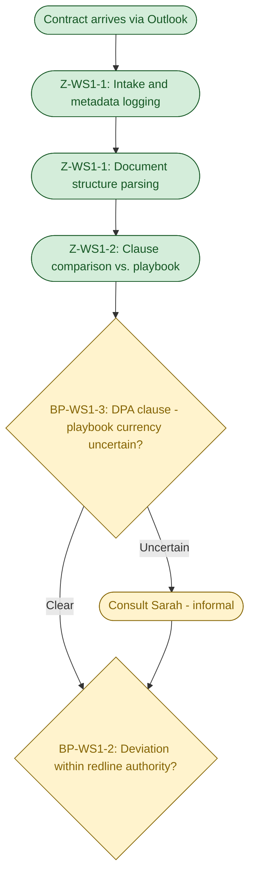
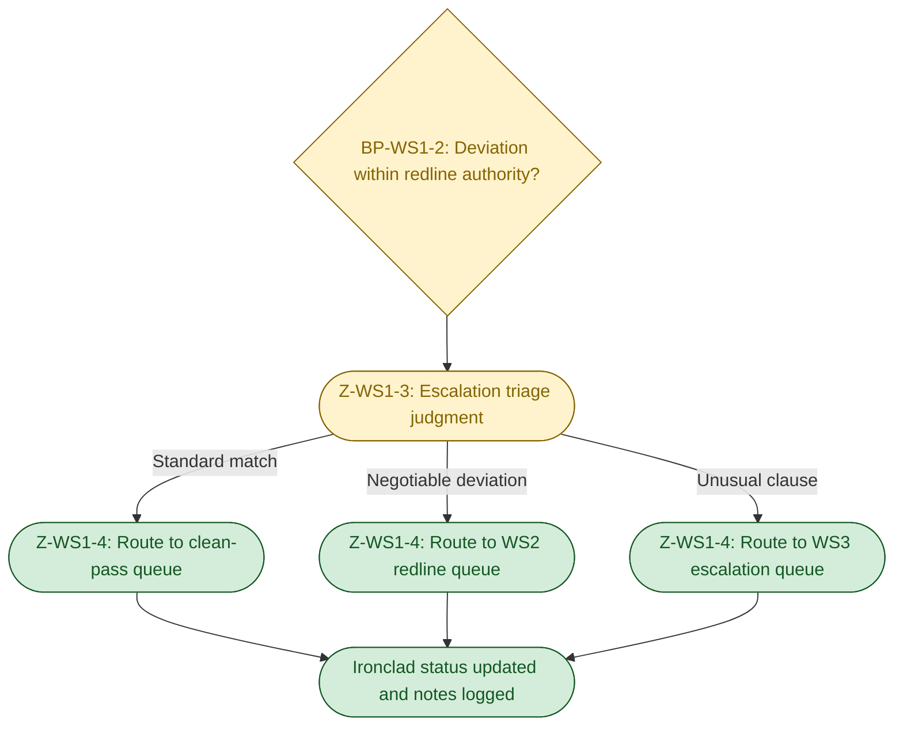
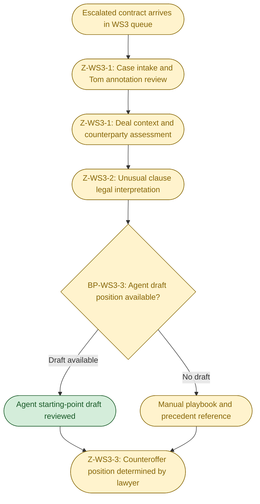
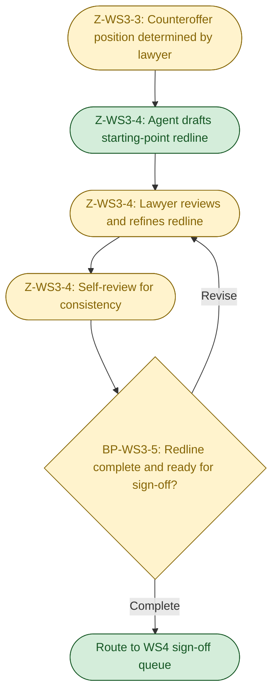

# D1 — Cognitive Load Map
**Helix Workforce Software — Vendor Contract Clause Review**
**Produced:** 2026-05-04 | **Status:** Draft — awaiting FDE approval

---

## 0. Executive Summary

- **Selected work streams:** WS1 (first-pass clause classification) and WS3 (escalated clause review) are selected because together they span the full delegation range of this process — WS1 has the highest delegation potential (300 cases/quarter through a single paralegal, primarily pattern-matching) and sufficient cognitive complexity at the escalation threshold to justify deep decomposition, while WS3 has the highest cognitive complexity (legal synthesis, tacit knowledge, commercial judgment) and defines the hard ceiling for delegation that agent design must respect.
- **Most significant breakpoint:** The escalation threshold judgment in WS1 — where Tom must decide whether a clause deviation requires a lawyer (WS3) or falls within his redline authority (WS2) — is the point of highest agent-value/human-judgment tension: the task is high-volume, the error consequence is material (under-escalation means risky clauses get lightweight treatment), yet the criteria are informal and undocumented, making neither pure agent execution nor pure human routing satisfactory in the current state.
- **Cross-work-stream design implication:** Both work streams depend on the same playbook document (SharePoint "Position Statements v3.4") as their authoritative standard — and that document is known-stale on the DPA section; any agent operating in either work stream will inherit and amplify the playbook's compliance gap unless playbook currency is treated as a first-class design constraint, not a pre-deployment task.

---

## 0b. Table of Contents

1. Work Stream Selection and Rationale
2. Cognitive Load Map — WS1: First-Pass Clause Classification
   - 2a. Lived process narrative
   - 2b. Jobs to be Done decomposition
   - 2c. Micro-task inventory with dimension scores
   - 2d. Cognitive zones and breakpoints
   - 2e. Process topology diagrams
3. Cognitive Load Map — WS3: Escalated Clause Review
   - 3a. Lived process narrative
   - 3b. Jobs to be Done decomposition
   - 3c. Micro-task inventory with dimension scores
   - 3d. Cognitive zones and breakpoints
   - 3e. Process topology diagrams
4. Cross-Work-Stream Observations
5. Assumption Log

---

## 1. Work Stream Selection and Rationale

**Selected: WS1 (First-pass clause classification) and WS3 (Escalated clause review).**

WS1 has the highest delegation potential of the four work streams: it processes every contract that enters the pipeline (300/quarter, ~23/week), the core task is clause comparison against a codified standard — a pattern-matching task an LLM can perform — and it is the throughput gate whose queue time propagates delay into all downstream work streams. Its cognitive complexity is not uniformly high, but concentrated at one critical point: the escalation threshold judgment, where the absence of explicit criteria creates an informal decision that an agent cannot reproduce reliably without codification. This makes WS1 the highest-value decomposition target — it reveals both where the agent opportunity is clear and precisely where the agent design must stop.

WS3 has the highest cognitive complexity: legal interpretation, commercial synthesis, and counteroffer position framing require tacit knowledge and judgment that cannot be fully encoded. Decomposing WS3 is essential not because it is the primary agent target, but because it defines the boundary the agent must not cross — the design must navigate up to WS3's inputs without crossing into its judgment. WS3 also receives its escalated cases from WS1, making the two work streams directly coupled: WS1 routing accuracy determines the quality of WS3's input set, and WS3's complexity justifies the care required at WS1's escalation threshold.

WS2 and WS4 are not selected for full decomposition because: WS2's delegation scope is conditional on an unresolved unknown (whether the playbook contains substitute clause language), making its decomposition premature until that is confirmed; and WS4's core step (named-lawyer sign-off) is a non-delegatable governance constraint that limits the decomposition's yield for agent design.

---

## 2. Cognitive Load Map — WS1: First-Pass Clause Classification

### 2a. Lived Process Narrative

*Reconstructed from scenario_context.md and artefacts. Inferences are labelled.*

Tom Reilly starts his morning and finds three new vendor contracts in his Outlook inbox — a typical day. Each arrived as a Word document attachment from the vendor's procurement team. He opens the first email, checks the sender and subject line to identify the counterparty and contract type, and logs the basics into Ironclad. Whether this logging step is manual or partly automated by Ironclad's email monitoring is not confirmed in the scenario [Assumption A-1]; from the email-bypass artefact, it is clear that some contracts arrive entirely outside of Ironclad's capture path and require manual entry.

He opens the Word document. Vendor documents have no standard structure — some number clauses sequentially, others group them under headings like "General Terms" or "Commercial Terms." Tom scans the document to locate the seven playbook-relevant clause categories: liability cap, DPA, termination, IP, SLA, governing law, indemnity. This is a reading task, not a judgment task — but it takes time because the structure varies.

*[PAUSE POINT]* Tom reaches the Limitation of Liability section. He reads the cap amount: £50,000. The playbook minimum is £250,000 for enterprise contracts. He pauses. As Artefact 2.1 confirms, he makes a note: "Cap is below playbook minimum. FLAG — but the term is borderline negotiable, not escalation." This is a judgment call. The playbook defines the position (£250k/12 months) but does not define the threshold at which a deviation requires a lawyer rather than a paralegal redline. Tom has internalised a threshold from experience, but it is not written anywhere. On a different day, or for a different contract, the same deviation might get a different call.

*[JUDGMENT CALL — informal criteria]* He works through the rest of the contract. The termination clause is standard; he notes it and moves on. The SLA section has a slightly lower uptime guarantee than the playbook asks for; he marks it for redline. Then he reaches the DPA section.

*[PAUSE POINT — compliance gap]* Tom reads the vendor's DPA language. He knows the playbook DPA section is stale — Artefact 2.1 confirms he flags this explicitly: "DPDI updates aren't reflected — playbook is stale on this." He cannot compare this clause against a current standard because the standard hasn't been updated. He writes: "Honestly not sure if this needs escalation. Will ask Sarah." This is not a documented escalation path. It is an informal consultation between colleagues, conducted outside any system, with no record kept of the question or the answer [Assumption A-2].

*[COORDINATION — informal]* Tom sends a message to Sarah — probably via Teams or email [Assumption A-3]. Sarah gives her view. Tom incorporates it into his classification. The informal consultation takes an unquantified amount of time, interrupts both Tom's and Sarah's workflows, and is invisible to the CLM.

After completing the full review, Tom updates his classification: this contract goes to WS2 (redline the liability cap, the SLA clause). He routes it in Ironclad and attaches his margin notes. The next contract in the queue begins.

*[WORKAROUND — email-only vendors]* When it comes time to send a redline, Tom checks whether this vendor accepts SharePoint links. This quarter, three vendors have flagged that they cannot. He must remember to check for each counterparty and send via Word attachment by email when required, bypassing the standard SharePoint workflow and creating an untracked delivery channel.

The total elapsed time for WS1 on this contract: approximately 25 minutes. Most of that time is reading and locating clauses. The judgment at the escalation threshold and the DPA consultation take only a few minutes each — but they are the minutes where errors have the highest consequence.

---

### 2b. Jobs to be Done Decomposition

| JtD ID | Cognitive contract | Trigger | Actor | Key decisions | Key systems/data | Primary cognitive type | Expected output |
|---|---|---|---|---|---|---|---|
| WS1-JtD-1 | Determine whether each clause in this vendor contract meets Helix's playbook standard, identify the overall risk tier, and produce a routing decision with classification notes | Vendor contract received in Outlook intake | Tom Reilly (Paralegal) | Is each clause compliant, deviating-but-negotiable, or escalation-worthy? What is the overall risk tier (clean / WS2 / WS3)? | Vendor Word document, Ironclad (logging), SharePoint playbook, Outlook | Pattern recognition + decision-making | Annotated contract with clause-level classifications and a routing decision (clean / WS2 / WS3) |
| WS1-JtD-2 | Determine whether the vendor's DPA clause meets Helix's current data-protection standard, accounting for the known gap between the playbook and post-DPDI Act requirements | DPA clause identified during first-pass review | Tom Reilly + Sarah (Commercial Lawyer) informally | Is the clause adequate per playbook? Is the playbook current? Does uncertainty about DPDI compliance require escalation? | SharePoint playbook section 12 (stale), DPDI Act reference (external, not in any Helix system), informal knowledge | Synthesis + exception handling | DPA clause classification (acceptable / redline / escalate) with flagged uncertainty if DPDI currency applies |

---

### 2c. Micro-Task Inventory with Dimension Scores

| Micro-task | Cognitive Load | Input Structure | Decision Determinism | Exception Frequency | Turn-Taking | Latency Constraint | Compliance/Risk | Tool/API Availability |
|---|---|---|---|---|---|---|---|---|
| MT1-1: Intake and metadata logging | L | M | H | L | L | L | L | M |
| MT1-2: Document structure parsing | L | L | M | M | L | L | L | H |
| MT1-3: Clause comparison vs. playbook | M | L | M | M | L | L | M | M |
| MT1-4: Escalation threshold judgment | H | L | L | H | M | L | H | M |
| MT1-5: DPA adequacy assessment | H | L | L | H | M | L | H | M |
| MT1-6: Route to WS2 / WS3 / clean-pass | L | M | H | L | L | L | L | H |

**Score justifications:**

*MT1-1 (Intake and metadata logging):* Cognitive Load L — no judgment; metadata is present in the email header and document front matter. Input Structure M — email header is semi-structured; document front matter varies by vendor [^1]. Decision Determinism H — log what exists; nothing to decide. Exception Frequency L — occasional missing fields but easily resolved. Compliance/Risk L — metadata logging has no compliance consequence; errors here are correctable. Tool/API M — Ironclad has REST APIs; Outlook integration capability is unconfirmed [Assumption A-1].

*MT1-2 (Document structure parsing):* Cognitive Load L — locating sections is a reading task; no interpretation required at this step. Input Structure L — vendor Word documents have no standardised structure; section numbering, headings, and clause placement vary by counterparty. Decision Determinism M — most clauses are locatable by keyword or heading; some may be embedded in non-standard locations requiring judgment about equivalence. Exception Frequency M — unusual document structures occur often enough (~20–30% of contracts) to require active searching rather than mechanical extraction [Assumption A-4]. Tool/API H — LLM document parsing handles variable structure well.

*MT1-3 (Clause comparison vs. playbook):* Cognitive Load M — requires reading both the vendor clause and the playbook position and recognising matches and deviations; not pure rule-application because language varies. Input Structure L — both documents are natural language; neither is structured data. Decision Determinism M — clear matches and clear deviations are both recognisable; the borderline cases (like Artefact 2.1's liability cap) require the judgment assessed in MT1-4. Compliance/Risk M — incorrect classification (treating a deviation as a match) propagates undetected risk downstream.

*MT1-4 (Escalation threshold judgment):* Cognitive Load H — Tom must apply implicit criteria that are not written down; Artefact 2.1 confirms unsanctioned judgment calls occur. Input Structure L — the input is a human assessment of a natural-language clause; no structured signal. Decision Determinism L — judgment-dependent by definition; the same deviation could reasonably be classified differently by different reviewers. Exception Frequency H — approximately 30% of contracts (90/quarter, the WS2+WS3 combined volume) involve at least one deviation requiring this judgment; it is not a rare edge case. Turn-Taking M — informal consultation with Sarah occurs for ambiguous cases (Artefact 2.1). Compliance/Risk H — under-escalation is the primary error mode; a WS3 case routed to WS2 receives insufficient legal scrutiny.

*MT1-5 (DPA adequacy assessment):* Cognitive Load H — requires simultaneous awareness of the vendor's clause, the playbook standard, and the known gap between the playbook and the current DPDI Act requirements; three-way comparison under uncertainty. Decision Determinism L — the ground truth (the updated standard) is not in the playbook; Tom cannot apply a definitive rule because the rule is stale. Exception Frequency H — every DPA clause in every contract requires this assessment; the DPDI gap is a systematic, not occasional, source of uncertainty. Compliance/Risk H — data protection compliance failure (accepting a DPA clause that violates DPDI Act requirements) creates regulatory exposure.

*MT1-6 (Route to WS2/WS3/clean-pass):* Cognitive Load L — follows mechanically from MT1-4's classification decision; no new judgment. Decision Determinism H — routing rule is clear once classification is complete. Tool/API H — Ironclad status update and queue routing are well within REST API capability.

---

### 2d. Cognitive Zones and Breakpoints

**Zones:**

| Zone ID | Zone name | Micro-tasks | Dominant cognitive type | Data dependencies | Error tolerance |
|---|---|---|---|---|---|
| Z-WS1-1 | Document Ingestion and Parsing | MT1-1, MT1-2 | Deterministic execution — locate, extract, log | Outlook (email), Ironclad (record), vendor Word document | High tolerance — errors here are caught in Z-WS1-2; mislocated clauses become obvious when comparison fails |
| Z-WS1-2 | Clause Comparison and Classification | MT1-3 | Probabilistic reasoning — pattern-match vendor language against playbook positions | Playbook (SharePoint), vendor clause (Word document) | Medium tolerance — classification errors propagate but are partially catchable at the WS2/WS3 review stage |
| Z-WS1-3 | Escalation Triage and DPA Assessment | MT1-4, MT1-5 | Human sense-making — informal threshold judgment; metacognitive awareness of playbook currency | Playbook, informal knowledge of DPDI Act gap, Sarah as informal consultant | Low tolerance — under-escalation and DPA misclassification create downstream compliance risk |
| Z-WS1-4 | Routing and Record Update | MT1-6 | Deterministic execution — update Ironclad status and assign to queue | Ironclad, classification output from Z-WS1-3 | High tolerance — routing errors are correctable; the downstream reviewer can re-route if needed |

**Breakpoints:**

| BP ID | Description of handoff | From | To | Why this is a breakpoint | Agent opportunity or risk |
|---|---|---|---|---|---|
| BP-WS1-1 | Contract arrives in Outlook → enters Ironclad intake | Vendor email (external) | Tom / Ironclad intake workflow | Human-to-system intake: first moment a contract enters the system of record; currently manual or semi-manual | Agent opportunity: automate intake from Outlook, extract metadata, create Ironclad record, and trigger the WS1 classification task — eliminates manual entry and ensures no contract bypasses the CLM |
| BP-WS1-2 | Clause comparison complete → escalation threshold judgment required | Z-WS1-2 (probabilistic agent comparison) | Z-WS1-3 (human sense-making) | Rule-to-judgment shift: the classification can be agent-assisted up to the point where the deviation magnitude must be assessed against an informal threshold; this is where agent execution must hand off to human judgment unless explicit criteria are codified | Critical design point: if escalation criteria are codified (e.g., "liability cap below X% of playbook floor = escalation"), this breakpoint moves to a lower-confidence edge case handler; if not codified, the agent must route all deviations to human review at this point |
| BP-WS1-3 | DPA clause identified → DPDI Act currency check required | Z-WS1-2 (clause comparison) | Z-WS1-3 (human sense-making) | Rule-to-exception shift: the playbook is the agent's ground truth; when the playbook is stale, the agent cannot detect its own inadequacy — only a human aware of the gap can flag it | Agent risk: an agent operating against the stale playbook will classify DPA clauses as compliant or deviant against an outdated standard, potentially accepting clauses that violate the DPDI Act; playbook update is a hard pre-condition for delegating this micro-task |
| BP-WS1-4 | Classification complete → routing executed | Z-WS1-3 (human judgment finalised) | Z-WS1-4 (deterministic routing) | Human-to-system: the routing action follows from the human's classification decision; no further judgment required at this step | Agent opportunity: once the human confirms the classification, the agent executes routing in Ironclad and triggers the appropriate downstream work stream; fully delegatable |

---

### 2e. Process Topology Diagrams

**Phase 1 — Ingestion and Classification**
*(Covers Z-WS1-1 and Z-WS1-2; ends at the escalation threshold decision.)*
 Green = agent-owned zone. Amber = human-in-the-loop zone.

**Phase 2 — Triage and Routing**
*(Covers Z-WS1-3 and Z-WS1-4; entry point repeated from Phase 1 end node.)*

---

## 3. Cognitive Load Map — WS3: Escalated Clause Review

### 3a. Lived Process Narrative

*Reconstructed from scenario_context.md and artefacts. Inferences are labelled.*

Sarah — one of the three commercial lawyers — opens Ironclad and sees a new escalated contract in her queue. Tom has flagged two unusual clauses: an IP ownership provision that assigns all derivative works to the vendor, and a DPA clause that Tom couldn't classify because of the DPDI uncertainty. The contract came from VendorCo, a sales-tools vendor; the deal is mid-size. Sarah notes that Tom's classification notes are brief — there is no context about the deal, the counterparty relationship, or why procurement is under pressure to sign quickly. She will need to reconstruct this context herself [Assumption A-5].

*[PAUSE POINT — context loading]* Sarah pulls up the contract and reads the flagged clauses. The IP provision is unusual — it's not a standard formulation she recognises. She reads the full section, not just the flagged clause, to understand how it interacts with the surrounding terms. This reading takes longer than Tom's first-pass because she is doing legal interpretation, not pattern matching: she is asking "what does this clause actually bind Helix to, and under what circumstances could it create a problem?"

*[JUDGMENT CALL — legal interpretation]* She identifies that the derivative works clause could, in the event of a dispute, be interpreted to assign ownership of any software configurations Helix builds on top of the VendorCo platform. This is not obviously within the vendor's intent, but the language is broad enough to be dangerous. The playbook's IP section states Helix's preferred position (joint ownership of integration work, vendor retains platform IP) but the vendor's clause goes further than the scenarios the playbook envisioned. There is no pre-packaged answer.

*[PAUSE POINT — deal context assessment]* Sarah wants to understand how critical this vendor is and how much leverage Helix has. She cannot answer this from the contract alone. The deal's commercial importance lives in Salesforce — but whether she checks Salesforce or simply asks the Account Manager by email is not specified in the scenario [Assumption A-6]. This context check may add significant time. If the vendor is a commodity provider with alternatives, Sarah will take a hard position; if the vendor is a strategic partner with no near-term substitute, she will consider accepting a narrower version of the clause to close the deal.

*[JUDGMENT CALL — counteroffer position]* After assessing the legal risk and the commercial context, Sarah decides on Helix's position: propose narrowing the derivative works clause to exclude any software configurations built on the platform ("modifications to Vendor's software" rather than "derivative works"). She also decides on a walk-away position: if the vendor insists on the broad formulation, the deal needs GC review before proceeding. This is a professional judgment call that synthesises legal training, commercial context, and institutional knowledge about Helix's risk appetite.

*[EXECUTION — redline drafting]* Sarah opens the Word document and drafts the redline using Track Changes. She writes the substitute language for the IP clause, adjusting the clause numbering to match the vendor's document structure. For the DPA clause, she applies the updated DPDI Act standard that she knows from memory — not from the playbook, which is stale — and marks the redline accordingly. This is an instance where Sarah's tacit knowledge is substituting for the absent updated standard.

*[ASYNC WAIT]* The completed redline moves to WS4. Sarah routes it in Ironclad to the WS4 counteroffer sign-off queue. If Amelia is the named sign-off, the contract waits in Amelia's queue until she has time to review. This wait is invisible to the procurement team.

Total elapsed time: approximately 90 minutes. The majority is split between the initial context-loading and legal interpretation phase (~30 min) and the counteroffer position synthesis phase (~30 min). The drafting phase is the most execution-like (~20 min), and self-review takes the remainder.

---

### 3b. Jobs to be Done Decomposition

| JtD ID | Cognitive contract | Trigger | Actor | Key decisions | Key systems/data | Primary cognitive type | Expected output |
|---|---|---|---|---|---|---|---|
| WS3-JtD-1 | Determine the legal risk this unusual clause creates for Helix and identify a viable counteroffer position that protects Helix's interests while remaining acceptable to the counterparty | Escalated contract routed from WS1 with unusual clause flagged | Senior Commercial Lawyer (Sarah or equivalent) | What legal risk does this clause create? What is the commercial context? What position will the counterparty accept? What is the walk-away? | Vendor contract, SharePoint playbook, deal context (Salesforce or informal — Assumption A-6), informal knowledge of counterparty | Synthesis + decision-making | Defined counteroffer position with rationale |
| WS3-JtD-2 | Draft the precise contractual language that achieves Helix's counteroffer position within the structure of the vendor's document, and verify it for consistency and unintended consequences | Counteroffer position determined (WS3-JtD-1 complete) | Senior Commercial Lawyer | What specific language achieves the position? How does it interact with the surrounding clauses in the vendor's document? Are there unintended consequences? | Vendor Word document, playbook substitute clauses (if available — Unknown), prior redlines for this counterparty (if available — Assumption A-7) | Execution + synthesis | Redlined Word document ready for WS4 sign-off |

---

### 3c. Micro-Task Inventory with Dimension Scores

| Micro-task | Cognitive Load | Input Structure | Decision Determinism | Exception Frequency | Turn-Taking | Latency Constraint | Compliance/Risk | Tool/API Availability |
|---|---|---|---|---|---|---|---|---|
| MT3-1: Intake and context review | M | M | M | M | M | L | M | M |
| MT3-2: Unusual clause legal interpretation | H | L | L | H | L | L | H | L |
| MT3-3: Deal context and counterparty assessment | H | L | L | M | M | L | H | L |
| MT3-4: Counteroffer position determination | H | L | L | M | L | L | H | L |
| MT3-5: Redline clause drafting | M | M | M | M | L | L | H | M |
| MT3-6: Self-review for consistency | M | M | M | L | L | L | H | M |

**Score justifications:**

*MT3-1 (Intake and context review):* Cognitive Load M — reading and contextualising Tom's classification notes and the flagged clauses; judgment required when Tom's rationale is incomplete or unclear. Input Structure M — Tom's margin notes are informal (as seen in Artefact 2.1); the contract is unstructured. Decision Determinism M — usually clear why it was escalated; occasionally Tom's framing is ambiguous [Assumption A-8]. Turn-Taking M — may require follow-up with Tom if escalation rationale is unclear. Compliance/Risk M — misreading the escalation reason leads to reviewing the wrong clause.

*MT3-2 (Unusual clause legal interpretation):* Cognitive Load H — requires legal training, contract law knowledge, and sector knowledge; the clause is unusual by definition (it is in WS3 because it doesn't fit standard patterns). Input Structure L — natural language legal clause; legal language is often deliberately complex. Decision Determinism L — legal interpretation is not mechanical; what a clause "means" under contract law is often contested. Exception Frequency H — these are all exceptions; WS3 exists precisely because standard patterns don't apply. Tool/API L — legal interpretation requires tacit knowledge; tools can support research but cannot make the interpretive judgment.

*MT3-3 (Deal context and counterparty assessment):* Cognitive Load H — synthesis of commercial importance, relationship history, leverage, and negotiation precedent; most of this context is not in structured systems. Input Structure L — counterparty relationship context is informal/tacit; Salesforce may provide deal value but not relationship nuance [Assumption A-6]. Decision Determinism L — context assessment is highly judgment-dependent. Tool/API L — most context is in people's heads or in unstructured email threads; the relationship history gap noted in D0A domain research applies directly here.

*MT3-4 (Counteroffer position determination):* Cognitive Load H — synthesis of legal risk (MT3-2) + commercial context (MT3-3) + playbook position; the output is a novel judgment, not a lookup. Decision Determinism L — outcome depends on context-specific weighting of competing considerations; no formula. Compliance/Risk H — wrong position either accepts harmful terms or unnecessarily loses the deal.

*MT3-5 (Redline clause drafting):* Cognitive Load M — position is set (MT3-4 is complete); the task is translating that position into precise language; requires drafting skill but less novel judgment. Input Structure M — position is semi-structured (Sarah has decided what the clause must say); the vendor document structure is unstructured. Decision Determinism M — if the playbook contains substitute language, determinism is higher (H); if position-only, Sarah must draft from scratch (M). Compliance/Risk H — poorly drafted redline can introduce ambiguity or fail to close the legal gap the escalation was triggered by. Tool/API M — agent could draft a starting-point redline from the playbook position for Sarah to refine; Word Track Changes is accessible.

*MT3-6 (Self-review):* Cognitive Load M — review task requiring legal attention to detail; catches drafting errors and internal inconsistencies. Decision Determinism M — most errors are detectable; subtle semantic conflicts may require repeated reading. Exception Frequency L — most redlines are internally consistent after drafting. Compliance/Risk H — errors that pass self-review and reach WS4 sign-off can become part of the executed contract.

---

### 3d. Cognitive Zones and Breakpoints

**Zones:**

| Zone ID | Zone name | Micro-tasks | Dominant cognitive type | Data dependencies | Error tolerance |
|---|---|---|---|---|---|
| Z-WS3-1 | Case Intake and Context Loading | MT3-1, MT3-3 | Probabilistic reasoning — assembling a picture of the deal and the legal question from incomplete structured + unstructured data | Tom's annotation notes, Ironclad record, Salesforce (deal context — assumption), informal counterparty knowledge | Medium tolerance — incomplete context leads to a position that doesn't reflect commercial reality, but this is correctable in negotiation |
| Z-WS3-2 | Legal Analysis | MT3-2 | Human sense-making — interpreting ambiguous legal language and determining its business consequence | Vendor contract (unusual clause), legal knowledge (tacit), playbook (for reference) | Low tolerance — incorrect legal interpretation leads to accepting harmful terms; the consequence may not be apparent until the contract is executed |
| Z-WS3-3 | Position Synthesis | MT3-4 | Human sense-making — synthesising legal + commercial + institutional knowledge into a negotiation position; the highest-judgment zone in the entire process | Outputs of Z-WS3-1 and Z-WS3-2, institutional knowledge, risk appetite (tacit) | Low tolerance — wrong position creates either legal exposure (too lenient) or deal loss (too rigid); no mechanical check is available |
| Z-WS3-4 | Drafting and Review | MT3-5, MT3-6 | Deterministic execution (primarily) — translating a determined position into contractual language; review for consistency | Position (from Z-WS3-3), playbook substitute clauses (if available), vendor document | Medium tolerance — errors are partially catchable in self-review and at WS4 sign-off, but drafting precision matters |

**Breakpoints:**

| BP ID | Description of handoff | From | To | Why this is a breakpoint | Agent opportunity or risk |
|---|---|---|---|---|---|
| BP-WS3-1 | WS1 routing → WS3 case assignment | WS1 classification (Tom) | WS3 intake (senior lawyer) | Human-to-human handoff across authority levels; quality of WS1 classification directly determines quality of WS3 intake; under-escalation means WS3 never sees a case that requires it | Agent opportunity: improving WS1 classification accuracy reduces both under-escalation (missed cases) and over-escalation (unnecessary cases in WS3 queue); this is the most leveraged upstream intervention for WS3 quality |
| BP-WS3-2 | Context loading complete → legal analysis begins | Z-WS3-1 (probabilistic reasoning) | Z-WS3-2 (human sense-making) | Deterministic-to-judgment shift: context assembly has an agent-assistable portion (pulling deal metadata from Salesforce, assembling prior correspondence) but the legal interpretation requires human expertise | Agent opportunity (partial): agent can assemble the context package (deal value from Salesforce, prior redlines from Ironclad, relevant playbook sections) to reduce lawyer prep time; agent cannot perform the legal analysis |
| BP-WS3-3 | Legal analysis complete → counteroffer position must be set | Z-WS3-2 (human sense-making) | Z-WS3-3 (human sense-making) | Synthesis: this is purely human sense-making from synthesis inputs; no agent can reliably determine Helix's viable negotiation position because it requires contextual judgment about commercial viability | Agent risk: if an agent were to generate a "suggested position" at this point without explicit human override, it could anchor the lawyer's judgment at a sub-optimal starting point; agent-drafted position should be clearly labelled as a starting-point draft, not a recommendation |
| BP-WS3-4 | Position determined → redline drafting begins | Z-WS3-3 (human sense-making) | Z-WS3-4 (execution) | Human sense-making to execution: once the position is set, the drafting task has a meaningful agent-assistable component — generating a starting-point redline from the playbook position for the lawyer to modify | Agent opportunity: agent drafts a starting-point redline from the playbook's standard substitute language (if available) or from the position statement; lawyer reviews, modifies, and approves; this is the primary agent intervention point in WS3 |
| BP-WS3-5 | Redline complete → WS4 sign-off queue | Z-WS3-4 (drafting complete) | WS4 (named-lawyer sign-off, Amelia's hard rule) | Compliance gate: the counteroffer cannot leave legal's queue without a named lawyer's sign-off; this is the governance checkpoint owned by Amelia Forsythe | Agent opportunity: agent can prepare the WS4 review package (highlight what changed, flag specific clauses requiring sign-off, route to the correct named lawyer); this reduces WS4 time-per-case but does not substitute for the sign-off act |

---

### 3e. Process Topology Diagrams

**Phase 1 — Context Loading and Legal Analysis**
*(Covers Z-WS3-1 and Z-WS3-2; ends at counteroffer position determination.)*

**Phase 2 — Drafting and WS4 Preparation**
*(Covers Z-WS3-4 and the handoff to WS4; entry point repeated from Phase 1.)*

---

## 4. Cross-Work-Stream Observations

**Observation 1 — Shared playbook dependency as a shared failure mode.**
Both WS1 and WS3 use the same SharePoint playbook as their primary reference standard. In WS1, the stale DPA section causes Tom to classify against an outdated standard. In WS3, Sarah compensates by applying her tacit knowledge of the DPDI Act update rather than the written standard. This creates a divergence: the agent in WS1 will apply the stale standard (because it reads what is written); the lawyer in WS3 corrects it (because she knows what should be written). Any agent design that reuses the same playbook reference for both work streams will inherit this inconsistency as a systematic DPA misclassification in WS1 that WS3 must then manually correct. A shared playbook update mechanism — with version-stamped content and automated staleness warnings — is a prerequisite component for both work streams, not a per-work-stream concern.

**Observation 2 — The escalation threshold in WS1 is the primary quality gate for WS3.**
The calibration of BP-WS1-2 (escalation threshold judgment) directly determines what arrives in WS3's queue. Under-escalation floods WS2 with cases requiring lawyer attention; over-escalation floods WS3 with cases Tom could have handled. In the current state, Tom's informal threshold is doing real work that no system is recording. If the agent in WS1 improves classification accuracy for clearly standard and clearly escalated cases, it will concentrate the judgment load at the genuine borderline — improving WS3's input quality without eliminating the need for human review at the edge. The design implication: WS1 and WS3 must share an explicit, versioned escalation criteria document that both the agent classifier and the lawyers use; this document does not currently exist.

**Observation 3 — Both work streams have an unstructured context assembly step that consumes time without producing a directly usable artefact.**
In WS1, Tom must locate clause categories within a variable-structure document before comparison can begin. In WS3, the lawyer must reconstruct deal context from Salesforce and informal sources before legal analysis can begin. Neither step is currently agent-assisted. A shared document ingestion and context assembly component — that parses the contract structure, extracts clause content, and assembles relevant metadata from Ironclad and Salesforce — would reduce setup time in both work streams and create a consistent structured input that both the WS1 classifier and the WS3 lawyer use. This is a reusable agent component, not two separate ones.

**Observation 4 — Informal consultation (Tom → Sarah) crosses the boundary between WS1 and WS3 without entering any system.**
When Tom consults Sarah about DPDI uncertainty (Artefact 2.1), he is performing an informal micro-escalation that is not documented in Ironclad and creates no audit trail. This consultation happens at the boundary between WS1's Z-WS1-3 and WS3's Z-WS3-2 — it is a partial escalation that resolves the uncertainty without formally entering the WS3 queue. Any agent design must account for this: if the agent encounters DPA uncertainty and escalates formally to WS3, it will increase WS3 volume; if it handles it informally (routes to human with a flag), it replicates the current undocumented consultation path. The design choice here — formal escalation vs. flagged routing — has audit trail implications that must be resolved against the governance constraint.

**Observation 5 — Agent-assistable drafting in WS3-Z4 and potential agent-assistable drafting in WS2 are the same reusable component.**
Both WS2 (standard-deviation redlining) and WS3 (escalated clause review) end with a redline drafting step. In WS2, the position is set by the playbook; in WS3, the position is set by the lawyer's judgment. In both cases, the drafting step translates a position into contractual language in a Word document. If a "draft-from-position" agent component is built for WS3's Z-WS3-4, the same component — with a simpler playbook-lookup input — can serve WS2 as well. This suggests a shared drafting assistant rather than two separately built tools, with the input being either a playbook position (for WS2) or a lawyer-determined position (for WS3).

---

## 5. Assumption Log

> **Assumption [A-1]:** Ironclad intake logging is currently manual (Tom logs each contract from the email) rather than automated via Ironclad's email monitoring capability.
> **Why it matters:** If intake is already automated, BP-WS1-1 (the agent intake opportunity) is partially solved and the agent design starts at the clause comparison step. If manual, intake automation is the first agent contribution and the design must include Outlook monitoring and Ironclad API write access.
> **If wrong:** Agent scope narrows (if already automated) or expands (if more manual than assumed).
> **Confidence:** Medium — the email-bypass pattern in Artefact 2.2 (Tom manually attaches files and sends via email) suggests manual handling is the norm; but whether the in-Ironclad contracts are logged manually is unconfirmed.

> **Assumption [A-2]:** Tom's informal consultations with Sarah (e.g., the DPDI uncertainty question in Artefact 2.1) are conducted via Teams or email and are not captured in any structured system.
> **Why it matters:** If untracked, there is no dataset of ambiguous cases and their resolutions to use as training or calibration data for the WS1 escalation classifier. If tracked (e.g., via a Teams thread that is searchable), this institutional knowledge may be partially recoverable.
> **If wrong:** A discoverable consultation log would be a high-value input for calibrating the escalation threshold — it captures exactly the borderline cases that the agent design must handle.
> **Confidence:** High — informal ad hoc consultations are structurally unlikely to be systematically logged.

> **Assumption [A-3]:** Tom and Sarah communicate informally via Microsoft Teams (available at Helix as part of the Microsoft 365 stack implied by Outlook and SharePoint use). This is not confirmed in the scenario.
> **Why it matters:** The consultation channel affects whether the informal escalation path can be captured or formalised as part of the agent design (e.g., routing a flagged uncertainty to a Teams message for lawyer response).
> **If wrong:** If the consultation is face-to-face or via a non-integrated channel, capturing it is harder and the consultation history is truly unrecoverable.
> **Confidence:** Medium — Microsoft 365 stack is common; Teams presence is an inference.

> **Assumption [A-4]:** Approximately 20–30% of vendor contracts have non-standard document structures that require active searching to locate relevant clause categories, rather than simple sequential reading.
> **Why it matters:** Document structure parsing complexity (MT1-2) affects the agent's accuracy at the clause-location step; poor parsing leads to missed clauses, which is a worse failure mode than slow parsing.
> **If wrong:** If vendor documents are more standardised than assumed (e.g., because Helix's vendor base primarily uses enterprise CLM templates), the parsing task is easier and agent accuracy at MT1-2 is higher.
> **Confidence:** Low — no data on vendor document consistency is available in the scenario.

> **Assumption [A-5]:** When a WS3 case arrives, the escalating lawyer has limited context about the commercial deal — the Ironclad record contains the contract and Tom's notes, but not deal value, strategic importance, or relationship history.
> **Why it matters:** If deal context is automatically surfaced with the escalation (e.g., Ironclad pulls Salesforce data), the context-loading step (MT3-3) is much shorter and partly agent-automatable. If context is not surfaced, the lawyer must retrieve it manually, which adds to the WS3 time estimate.
> **If wrong:** If Ironclad-Salesforce integration already surfaces deal context, MT3-3 time drops and the agent context assembly component is less valuable than assumed.
> **Confidence:** Medium — Salesforce and Ironclad are both confirmed tools; integration depth is unconfirmed.

> **Assumption [A-6]:** The senior lawyer assessing deal context in WS3 either (a) checks Salesforce directly or (b) contacts the Account Manager informally; both paths are plausible given the scenario. No formal context-provision step is described.
> **Why it matters:** If context retrieval is informal (email to Account Manager), it adds asynchronous wait time to WS3 and makes the 90 min/case estimate more variable. If it is a direct Salesforce lookup, it is faster and more agent-automatable.
> **If wrong:** If the process has no systematic context retrieval step (lawyers make do without commercial context), the counteroffer position quality depends heavily on the individual lawyer's prior knowledge of the counterparty.
> **Confidence:** Low — deal context retrieval is not described in the scenario; this is an inference from standard legal practice.

> **Assumption [A-7]:** Prior redlines for the same counterparty are stored in Ironclad or SharePoint and are accessible during WS3 review — but are not systematically surfaced to the reviewing lawyer.
> **Why it matters:** Negotiation history with a specific counterparty is a key input for determining what positions they will and will not accept. If this history is accessible but not surfaced, the agent context assembly component can add significant value by retrieving and summarising it.
> **If wrong:** If prior redlines are not systematically stored (e.g., held in individual email archives), the negotiation history gap noted in D0A is confirmed — and the agent design must accommodate its absence rather than rely on it.
> **Confidence:** Low — the D0A domain research flagged this as a common gap; the scenario artefacts do not confirm or deny it.

> **Assumption [A-8]:** Tom's classification notes at WS3 intake are typically brief (as seen in Artefact 2.1's margin notes) rather than detailed structured summaries, meaning the WS3 lawyer must re-read portions of the contract rather than relying entirely on Tom's framing.
> **Why it matters:** If intake notes are comprehensive, WS3 case setup is faster and an agent-assisted intake summary could bridge the WS1→WS3 handoff. If notes are routinely thin, the lawyer is effectively doing a partial re-review, which adds to WS3 time.
> **If wrong:** More detailed WS1 classification notes would reduce WS3 intake time (MT3-1) and represent an easier quick win than agent-assisted drafting.
> **Confidence:** High — Artefact 2.1 shows Tom's notes are brief and informal.
