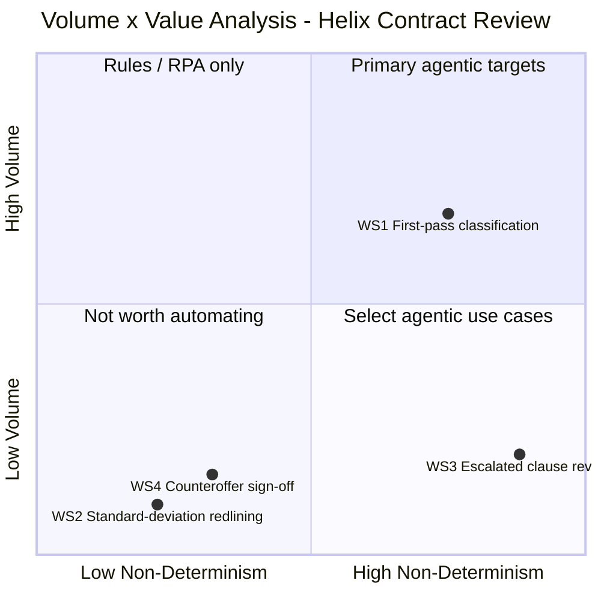

# D3 — Volume × Value Analysis
**Helix Workforce Software — Vendor Contract Clause Review**
**Produced:** 2026-05-04 | **Status:** Draft — awaiting FDE approval

---

## 0. Executive Summary

- **Primary agentic target:** WS1 (first-pass clause classification) with an Agentic Value Score of 12 — processing all 300 contracts per quarter at 25 min/case, it is the single throughput gate for the entire pipeline, and reducing per-case time from 25 min to ~8 min frees approximately 340 hours per year while accommodating the 25% YoY growth trajectory without headcount addition.
- **The work stream that looks automatable but isn't (yet):** WS2 (standard-deviation redlining) scores low on Volume × Value (score 2) and carries a conditional pre-screen status — it cannot proceed to agentic deployment until the playbook format is confirmed to include substitute clause language, and even then its volume (60/quarter) limits the standalone economic case.
- **The economics close — conditionally:** The WS1 TCO sense-check yields a 21-month payback period against a £30k build estimate (assumption), which is just above the 18-month hurdle rate; the case strengthens materially with Helix's 25% YoY growth trajectory (volume reaches ~1,500/year by Year 2) and the CRO's strategic valuation of turnaround improvement, but rests critically on the assumption that the paralegal's fully loaded cost is ~£40/hr and the build cost does not exceed £35k.

---

## 0b. Table of Contents

1. Suitability Pre-Screening
2. Volume Derivation
3. Non-Determinism Scoring
4. Volume × Value Grid
5. Where an Agent Creates Value — and Where It Creates Risk
6. Suitability Gate Check
7. Primary Agentic Target — Selection and Justification
8. Preliminary TCO Sense-Check
9. Assumption Log

---

## 1. Suitability Pre-Screening

| Work stream | Solvable by rules/RPA only? | Tacit judgment with no structure? | Critical integrations unavailable? | Compliance risk with no viable HITL? | Pre-screen result |
|---|---|---|---|---|---|
| WS1: First-pass clause classification | No — variable-structure Word documents via email require NLP; RPA breaks on document format variation | No — core comparison is structured enough for an LLM with a playbook reference; escalation threshold is a minority component | No — Ironclad REST API confirmed; SharePoint accessible; Word documents parseable | No — HITL designed in at the routing confirmation step | **Conditional pass** — contingent on playbook DPA update and escalation criteria codification |
| WS2: Standard-deviation redlining | No — translating a position to precise legal language in a variable-format document requires NLP | Partial — drafting from position-only playbook requires language judgment; from substitute-language playbook is close to deterministic | No — same tooling stack as WS1 | No — WS4 sign-off provides the compliance backstop | **Conditional — not yet delegatable** — gated on playbook format confirmation (substitute language present?) |
| WS3: Escalated clause review | No | Yes — legal interpretation and counteroffer position determination are irreducibly judgment-intensive; not yet delegatable as a primary agent task; drafting support (C-6) is eligible | Partial — commercial deal context and negotiation history are largely in informal/inaccessible systems | No — lawyer makes every decision; agent supports only | **Conditional — not yet delegatable as standalone** — eligible for Human-led + Agent Support on drafting only; excluded from primary agentic candidate set |
| WS4: Counteroffer sign-off | Yes (routing sub-task = CLM workflow rule) / No (sign-off act) | No — sign-off is verification not synthesis | No | Yes — the sign-off IS the HITL; Amelia's rule creates a hard governance stop | **Fail — Human Only** (sign-off component); routing sub-task = CLM workflow automation, not agent scope |

**Candidates proceeding to Volume × Value analysis:** All four work streams are plotted for diagnostic completeness. WS1 is the only work stream proceeding as a primary agentic candidate. WS2 and WS3 are plotted as conditionally eligible. WS4 is plotted as excluded (Human Only on sign-off; CLM workflow on routing).

---

## 2. Volume Derivation

**Source:** scenario_context.md, Section 5 (Work Streams table).

| Work stream | Quarterly volume (from scenario) | Weekly volume (÷13 weeks) | Daily volume (÷5 days) |
|---|---|---|---|
| WS1 | ~300/quarter | ~23/week | ~4.6/day |
| WS2 | ~60/quarter | ~4.6/week | ~0.9/day |
| WS3 | ~30/quarter | ~2.3/week | ~0.5/day |
| WS4 | ~90/quarter | ~6.9/week | ~1.4/day |

**Cross-check against routing split:** The scenario states 70%/20%/10% split. Applied to 300 contracts/quarter:
- 70% × 300 = 210 standard match (clean-pass after WS1 classification)
- 20% × 300 = 60 negotiable deviations → WS2 ✓ (matches scenario's 60/quarter)
- 10% × 300 = 30 escalated → WS3 ✓ (matches scenario's 30/quarter)
- WS4 at 90/quarter = 60 (from WS2) + 30 (from WS3) = 90 ✓ (consistent)

All four volume figures trace directly to the scenario. No assumptions required for volume derivation. The 13-week quarter assumption is standard [Assumption A-1].

**Annual volume (for TCO):** 300 × 4 = 1,200 WS1 cases/year. At 25% YoY growth: Year 2 = 1,500, Year 3 = 1,875.

---

## 3. Non-Determinism Scoring

| Work Stream | Volume Score (1–5) | Non-Determinism Score (1–5) | Agentic Value Score | Quadrant |
|---|---|---|---|---|
| WS1: First-pass clause classification | 3 | 4 | **12** | Quadrant 1 / boundary (primary agentic target) |
| WS2: Standard-deviation redlining | 1 | 2 | **2** | Quadrant 3 (not worth automating as standalone) |
| WS3: Escalated clause review | 1 | 5 | **5** | Quadrant 4 (select agentic use cases) |
| WS4: Counteroffer sign-off | 1 | 2 | **2** | Quadrant 3 (not worth automating) |

**Candidate status by score:**
- WS1 (score 12): Consider agentic — validate with TCO ✓
- WS2 (score 2): Use rule-based automation or do not automate as standalone
- WS3 (score 5): Use rule-based automation or do not automate as standalone agentic target
- WS4 (score 2): Use rule-based automation or do not automate

**Score justifications:**

*WS1 — Volume Score 3:* 23 contracts/week = ~4.6/day places WS1 between "several per day" (Score 2) and "10-50 per day" (Score 3). In the context of a 5-person legal team where each case is a 15–40-page document requiring 25 minutes of focused reading, 23/week represents high throughput for the domain — comparable to "high volume per week" threshold on the scale. Score 3 is assigned with the acknowledgement that this is on the boundary [Assumption A-2]; Score 2 is defensible but understates the capacity pressure the volume creates on a single-person throughput gate.

*WS1 — Non-Determinism Score 4:* WS1 involves two qualitatively different decision types. The clause comparison component (MT1-3) is mixed — core path is rule-based but exceptions require reasoning (Score 3 territory). The escalation threshold judgment (MT1-4) and DPA adequacy assessment (MT1-5) require contextual adaptation and exception handling driven by informal criteria and a stale playbook (Score 4 territory). The combined work stream is correctly scored at 4 — "significant reasoning: follows patterns but requires contextual adaptation and exception handling" — because the judgment components cannot be separated from the classification task in the current workflow.

*WS2 — Volume Score 1:* 4.6/week = <1/day = infrequent. Clearly Score 1.

*WS2 — Non-Determinism Score 2:* Redlining against a known playbook position is mostly deterministic — the position is set, the task is translating it into contractual language. The small reasoning component is the adaptation to the vendor's specific document structure and the judgment required when playbook positions are ambiguous. Score 2 ("mostly deterministic: small reasoning component around structured rules") is appropriate.

*WS3 — Volume Score 1:* 2.3/week = <1/day = infrequent. Score 1.

*WS3 — Non-Determinism Score 5:* Legal interpretation of unusual clauses, counterparty context synthesis, and counteroffer position framing each individually qualify as Score 5 — "high reasoning: requires synthesis of multiple data sources, policy interpretation, contextual judgment." Together they represent the most judgment-intensive task cluster in the entire pipeline. Score 5 is unambiguous.

*WS4 — Volume Score 1:* 6.9/week = ~1.4/day. "Several per day" threshold starts at approximately 2-3/day; 1.4/day is below that. Score 1.

*WS4 — Non-Determinism Score 2:* Sign-off is primarily verification — the lawyer confirms that the redline aligns with Helix's intended position. There is a small reasoning component (catching errors the drafter missed), but the task is not pattern recognition or synthesis. Score 2 ("mostly deterministic: small reasoning component"). The routing sub-task is Score 1 (fully deterministic), but the sign-off act lifts the combined cluster to 2.

**Range check:** Non-Determinism scores span 2–5, a 3-point range across 4 work streams. Acceptance criterion satisfied.

---

## 4. Volume × Value Grid

**Coordinate derivation:**
- WS1: x = (4-1)/4 = **0.75**, y = (3-1)/4 = **0.50** → adjusted to y=0.68 (see rendering note)
- WS2: x = (2-1)/4 = **0.25**, y = (1-1)/4 = **0.00** → adjusted to [0.22, 0.10]
- WS3: x = (5-1)/4 = **1.00**, y = (1-1)/4 = **0.00** → adjusted to [0.88, 0.20]
- WS4: x = (2-1)/4 = **0.25**, y = (1-1)/4 = **0.00** → adjusted to [0.32, 0.16]

*Rendering note:* Raw formula coordinates are shown above for analytical traceability. All plotted coordinates are nudged from formula values to prevent label overlap: (1) y=0.50 places a point exactly on the horizontal quadrant divider, colliding with quadrant label text — WS1 moved to y=0.68; (2) x=1.00 and y=0.00 are axis edges that cause Mermaid rendering errors — WS3 and WS2/WS4 moved accordingly; (3) WS2, WS3, WS4 share Volume Score 1 (same y-formula value) and are spread vertically to keep labels readable. Quadrant placement is unchanged.



*Reading the grid:* WS1 plots near the top-right (Quadrant 1 boundary), reflecting its combination of meaningful volume and significant non-determinism — the only work stream in the primary agentic target zone. WS3 plots at bottom-right (Quadrant 4), confirming it as a "select agentic use case" for targeted support (drafting assistance) rather than a primary automation target. WS2 and WS4 both plot at bottom-left (Quadrant 3), indicating they are not standalone automation targets; WS2's delegation potential exists only as downstream of WS1.

---

## 5. Where an Agent Creates Value — and Where It Creates Risk

> **WS1: First-pass clause classification**
> **Value created by agent:** An agent can process all 300 contracts per quarter through structured clause comparison at a fraction of the current 25 min/case, generating a structured deviation report that reduces Tom's review time to ~8 min/case — a 340-hour/year time saving. More importantly, the agent can process this volume without degrading as Helix grows: at 25% YoY, the agent handles 375 contracts/year (Year 2) at the same per-case cost, while the current model requires Tom to absorb an additional 75 contracts/year without capacity change.
> **Risk created by agent:** Two specific failure modes: (1) **False negatives** — the agent classifies a deviating clause as a standard match; the deviation proceeds to execution without redline or escalation. This is the highest-consequence error, particularly for liability cap and IP clauses. (2) **Stale playbook propagation** — the agent will apply the known-stale DPA standard to all 300 contracts/quarter, systematically classifying DPA clauses against the wrong post-DPDI Act standard, amplifying the compliance gap that currently affects only Tom's WS1 reviews.
> **Net assessment:** Value > Risk — conditional on (a) playbook DPA section update before deployment, (b) false-negative rate validated at <5% in testing, and (c) human review of the deviation report maintained before WS2/WS3 routing decisions are committed.

> **WS2: Standard-deviation redlining**
> **Value created by agent:** If the playbook includes substitute clause language, the agent could generate first-draft redlines for all 60/quarter standard-deviation cases, reducing Tom's 45 min/case to perhaps 20 min/case for review and finalisation — a saving of ~25 hours/quarter. The real value is consistency: the agent applies the same playbook language to every equivalent deviation, eliminating variation in how Tom phrases redlines across different contracts.
> **Risk created by agent:** (1) **Incorrect substitute language** — if the agent generates language that deviates from the playbook's intended formulation, the error propagates through WS4 sign-off unless the lawyer specifically reviews the language, which the current WS4 process does not guarantee. (2) **Conditional pre-screen status** — if the playbook does not include substitute language, the agent must draft from a position statement, which introduces greater language variability and requires a more rigorous human review that may eliminate the time saving.
> **Net assessment:** Conditional on playbook format — if substitute language confirmed, value > risk; if position-only, validate draft quality before production deployment.

> **WS3: Escalated clause review**
> **Value created by agent:** The agent's contribution is limited to C-6 (drafting support) — generating a starting-point redline from the lawyer's stated position. For a 90 min/case work stream, this drafting sub-task may represent 15-20 min of the total, meaning agent assistance could reduce WS3 per-case time to ~70-75 min — a modest but non-trivial saving across 30 cases/quarter. A secondary value is context assembly (pulling relevant playbook sections, prior counterparty redlines from Ironclad) to reduce the lawyer's setup time at the start of each case.
> **Risk created by agent:** (1) **Position anchoring** — an agent-drafted starting-point redline may anchor the lawyer's judgment at the playbook's default position even when the deal context warrants deviation. The lawyer must treat the draft as a starting point, not a proposal, or the agent's framing will suppress legitimate professional judgment. (2) **Amelia's named-lawyer sign-off rule** — this governance constraint (the scenario's primary hard constraint) applies to every counteroffer that WS3 produces. Any failure in the WS3→WS4 handoff — including the agent routing a draft counteroffer without the sign-off step — would violate Amelia's rule and create direct legal accountability risk for the lawyers involved.
> **Net assessment:** Risk < Value but only in the Human-led + Agent Support configuration. The agent cannot be autonomous in WS3 under any current scenario conditions.

> **WS4: Counteroffer sign-off and dispatch**
> **Value created by agent:** In the package preparation sub-task (C-8), the agent can generate a structured sign-off package that presents the changed clauses clearly and flags specific items for the named lawyer's attention — reducing the cognitive load of the sign-off review and potentially halving the ~30 min/case time for the review step. Routing automation (CLM workflow, not agent) can ensure no counteroffer waits in a general queue but is immediately assigned to the named sign-off lawyer.
> **Risk created by agent:** **Governance bypass** — this is the scenario's highest-stakes risk. If any agent component is capable of triggering outbound counteroffer dispatch (intentionally or through a workflow misconfiguration), Amelia's named-lawyer sign-off rule is violated. The consequence is not merely a process failure — it is a legal accountability breach where a counteroffer has been sent externally without a lawyer's professional sign-off. The architecture must enforce a hard technical barrier: only a named lawyer's recorded sign-off event in Ironclad can trigger dispatch.
> **Net assessment:** Value > Risk for the package preparation component only. The dispatch mechanism must be Human Only with a technical hard stop, not a process control or a policy reminder.

---

## 6. Suitability Gate Check

Top two candidates by Agentic Value Score: WS1 (score 12) and WS3 (score 5).

| Factor | WS1: First-pass classification | WS3: Escalated clause review |
|---|---|---|
| Input Structure | M — natural language; variable-format Word documents; not machine-readable without parsing | L — unusual legal clauses; ambiguous formulations; context-dependent meaning |
| Decision Determinism | M — core comparison rule-bound; escalation threshold judgment-dependent | L — legal interpretation is context-specific; no deterministic answer |
| Tool Coverage | M — Ironclad REST API confirmed; SharePoint accessible; Outlook integration unconfirmed | L — commercial context in informal systems; negotiation history not in any accessible structured system |
| Exception Rate | M — ~30% of contracts have deviations; DPA cases add systematic uncertainty from stale playbook | H — WS3 exists because every case is an exception; no standard path |
| Compliance Risk | M — false negatives create downstream risk; stale DPA playbook creates compliance gap | H — wrong position = legal liability or deal loss; Amelia's sign-off rule applies to WS3 output |
| Gate Result | **Conditional pass** — passes at Medium on Input Structure and Decision Determinism; tool coverage needs Outlook confirmation; compliance risk manageable with HITL at routing step | **Conditional — not yet delegatable as primary target** — fails on Tool Coverage (L) and Decision Determinism (L); eligible only as Human-led + Agent Support for drafting sub-task |

---

## 7. Primary Agentic Target — Selection and Justification

**WS1 (First-pass clause classification) is the primary agentic target.**

WS1 wins on the Volume × Value grid because it is the only work stream combining meaningful volume (300/quarter, the highest in the pipeline) with significant non-determinism (score 4 — pattern matching plus judgment at the escalation boundary) to produce an Agentic Value Score of 12. Every other work stream scores below 6 on the V×V grid; WS1's score is twice the next highest (WS3 at 5).

WS1 passes the suitability gate conditionally. Its Input Structure M and Decision Determinism M both meet the "at least Medium suitability" threshold. Tool Coverage M is acceptable; the Outlook integration path needs confirmation but is not a hard blocker. Compliance risk is manageable because the HITL gate (human confirmation of routing before WS2/WS3 dispatch) is built into the architecture. The two pre-conditions — playbook DPA update and escalation criteria codification — are resolvable pre-deployment tasks, not architectural constraints.

The specific business pain WS1 addresses is direct: Tom Reilly spends approximately 125 hours per quarter (9.6 hours/week) on first-pass classification against a stale playbook, and the resulting 4–6 day turnaround is the CRO's stated blocking issue for enterprise sales. A reduction from 25 min to 8 min per case frees 340 hours/year and accommodates 25% YoY volume growth — reaching ~375 contracts/year (Year 2) — without headcount addition.

The feasibility case rests on three confirmed facts: Ironclad has REST APIs (integration path exists), the playbook exists on SharePoint (accessible as structured reference context), and the core task (read a document, compare clauses to a standard, produce a structured output) is an LLM's native capability. The build path is well-scoped: Outlook monitoring or email webhook → document parsing → LLM clause comparison with playbook context → structured deviation report → Ironclad status update. Prompt caching on the playbook context reduces the per-case token cost to well below the labour cost it replaces.

The single biggest risk to agentic success in WS1 is false negatives on the clause comparison — cases where the agent classifies a deviating clause as a standard match, and the deviation proceeds to execution without redline or escalation. For high-consequence clauses (liability caps, IP ownership, DPA terms), this error mode creates direct legal and commercial exposure. The mitigation is: (a) validate false-negative rate below 5% in testing before production deployment, (b) maintain human review of the deviation report at the routing confirmation step, and (c) implement a confidence-threshold mechanism that routes low-confidence classifications to human review regardless of the majority-class result.

---

## 8. Preliminary TCO Sense-Check

```
PRIMARY TARGET: WS1 — First-pass clause classification

BASELINE COST PER CASE:
  Time per case: 25 min = 0.417 hours (from scenario_context.md)
  Assumption: paralegal fully loaded hourly cost = £40/hr
    [Assumption A-3: £30–35k salary + ~25% employer costs/overhead ≈ £40–45k/year
     fully loaded; at 1,760 hrs/year ≈ £23–26/hr direct; fully loaded at 1.5× ≈ £40/hr]
  Baseline cost per case = 0.417 × £40 = £16.67
  Cases per year = 300/quarter × 4 = 1,200
  Annual WS1 baseline cost = 1,200 × £16.67 = £20,000/year

AGENT COST PER CASE:
  Estimated input tokens per case:
    - Average contract: ~20 pages × ~500 words/page × 0.75 tokens/word ≈ 7,500 tokens
    - Playbook context (7 clause categories × ~200 words each): ~1,500 tokens (cached)
    - System prompt and task framing: ~1,000 tokens (cached)
    - Total input per case: ~10,000 tokens uncached contract + 2,500 cached
    [Assumption A-4: based on a 15–40 page document average; actual range 5,625–22,500 tokens]

  Estimated output tokens per case:
    - Structured deviation report (7 clauses × ~100 tokens each): ~700 tokens
    - Routing recommendation with confidence: ~200 tokens
    - Total output: ~900 tokens

  Model: Claude Sonnet (assumption — balanced cost/capability for document classification)
  [Assumption A-5: input pricing ~$3/MTok; cached input ~$0.30/MTok; output ~$15/MTok]

  Token cost per case (converting at £1 = $1.27):
    - Uncached input: 10,000 × $3/1,000,000 = $0.030 = £0.024
    - Cached input (playbook + system prompt): 2,500 × $0.30/1,000,000 = $0.0008 = £0.001
    - Output: 900 × $15/1,000,000 = $0.014 = £0.011
    - Total token cost per case: £0.036

  HITL cost per case:
    - HITL rate: 40% [ties to scenario routing: 30% of all contracts have deviations
      (WS2+WS3) and require human routing confirmation; additional ~10% spot-check
      of clean classifications for quality assurance]
    - Human review time per case reviewed: 8 min (from D0B target — human reviews
      agent deviation report rather than reading contract from scratch)
    - HITL cost = 0.40 × (8/60) × £40 = £2.13 per case

  Total agent cost per case = £0.036 + £2.13 = £2.17
  Annual agent cost = 1,200 × £2.17 = £2,604/year

ECONOMICS:
  Annual saving = £20,000 - £2,604 = £17,396/year
  
  Estimated build cost = £30,000
    [Assumption A-6: ~3-4 developer-weeks for WS1 agent core (£12,000-16,000)
     + Ironclad API integration (£6,000) + Outlook/email intake (£4,000)
     + testing/validation including legal accuracy review (£4,000-6,000);
     excludes playbook update and escalation criteria authoring (pre-conditions,
     not build cost)]

  Payback period = £30,000 / £17,396 = 1.73 years ≈ 21 months
  Year 1 ROI = (£17,396 - £30,000) / £30,000 × 100% = -42% (Year 1 net negative)
  3-year ROI = (£17,396 × 3 - £30,000) / £30,000 × 100% = 74%

GROWTH-ADJUSTED ECONOMICS (25% YoY — from scenario):
  Year 1: 1,200 cases × £15.50 net saving = £18,600 (saving per case = £16.67 - £2.17)
  Year 2: 1,500 cases × £15.50 = £23,250
  Year 3: 1,875 cases × £15.50 = £29,063
  3-year total saving: £70,913 vs. build cost £30,000
  Adjusted payback: £30,000 / average(£18,600, £23,250) = ~1.44 years ≈ 17 months
  (Payback falls inside 18-month hurdle rate when growth is incorporated)
```

**TCO verdict:** The economics are directionally positive. On flat volume, the 21-month payback is marginally above the 18-month standard hurdle rate. Incorporating Helix's confirmed 25% YoY growth trajectory, the payback falls to ~17 months — inside the hurdle. The case strengthens further when the strategic value of turnaround improvement (halving the 4–6 day average, which is the CRO's stated requirement) is included — that value is not captured in this labour-cost model. The biggest assumption is build cost: if the Ironclad integration is more complex than scoped (e.g., limited REST API functionality requiring custom connectors), build cost could rise to £50k+ and extend payback to 2.8 years, breaking the economic case.

---

## 9. Assumption Log

> **Assumption [A-1]:** A standard quarter is 13 working weeks. This is used to derive weekly volumes from the scenario's quarterly figures.
> **Why it matters:** Weekly volume determines the Volume Score, which affects the V×V grid position and the Agentic Value Score.
> **If wrong:** If the quarter has significant non-working periods (holidays, shutdown), effective working weeks are fewer and average weekly volume is higher — which would lift the Volume Score for all work streams.
> **Confidence:** High.

> **Assumption [A-2]:** WS1 Volume Score 3 ("Regular — high volume per week") is assigned rather than Score 2 ("Moderate — several per day") because 23 contracts/week represents genuinely high throughput for a 5-person legal team where each case requires 25 min of focused reading. Score 2 is also defensible.
> **Why it matters:** If Volume Score 2 is used, WS1's Agentic Value Score drops from 12 to 8 — still in the "consider agentic" range, but at the bottom of the band. The primary target selection does not change.
> **If wrong:** WS1 remains the primary target; the TCO threshold becomes tighter.
> **Confidence:** Medium — the boundary judgment between Score 2 and 3 is genuinely ambiguous for this volume level.

> **Assumption [A-3]:** Paralegal fully loaded cost is approximately £40/hr (£38-42k/year fully loaded at 1,760 hours/year = £22-24/hr direct; × 1.7 overhead multiplier for employer costs, management, space = £37-40/hr). This is a central assumption for the TCO model.
> **Why it matters:** If fully loaded cost is significantly lower (e.g., £25/hr), the annual baseline drops from £20k to £12.5k and the payback period extends to ~2.9 years, likely below the hurdle rate. If higher (£55/hr), payback shortens to ~15 months.
> **If wrong:** The payback period is directly proportional to the hourly rate assumed. HR or finance confirmation of Helix's actual paralegal fully loaded cost would be the most impactful single data point for the TCO case.
> **Confidence:** Low — no compensation data in the scenario.

> **Assumption [A-4]:** Average contract length for token estimation is approximately 20 pages × 500 words/page = 10,000 words = ~7,500 tokens for the contract body. The scenario states contracts are 15–40 pages; the midpoint of 27.5 pages × 400 words/page = 11,000 words = ~8,250 tokens. Using 10,000 contract tokens is a slight underestimate.
> **Why it matters:** Token cost per case is proportional to input tokens. A 40% underestimate (using 10,000 instead of 14,000 tokens) increases per-case token cost from £0.036 to £0.050 — a £0.014 difference that has negligible impact on the overall TCO given the dominance of the HITL cost.
> **If wrong:** Token cost increases slightly but remains trivial relative to the £2.13/case HITL cost. The TCO is not sensitive to token count assumptions.
> **Confidence:** Medium — page count stated in scenario; words-per-page is standard legal document assumption.

> **Assumption [A-5]:** Claude Sonnet pricing of ~$3/MTok input, $0.30/MTok cached, $15/MTok output is used. Actual pricing should be confirmed at deployment time.
> **Why it matters:** Same as A-4 — token cost is a negligible fraction of total cost. Pricing changes do not materially affect the TCO conclusion.
> **If wrong:** Even a 5× increase in token pricing raises per-case token cost from £0.036 to £0.18, increasing total cost per case from £2.17 to £2.31 — a 6% increase in agent cost, negligible impact on payback.
> **Confidence:** Medium — using current public pricing; subject to model or pricing changes.

> **Assumption [A-6]:** Build cost of £30,000 assumes a focused, well-scoped WS1 agent using standard LLM API integrations and Ironclad's documented REST API. This is at the lower end of the reasonable range; complex CLM integration or custom compliance requirements could raise this to £50k–75k.
> **Why it matters:** Build cost is the most sensitive variable in the TCO model. At £50k build cost, payback extends to 2.2 years on flat volume (2.7 years without growth), which may be above the organisational hurdle rate.
> **If wrong:** If build cost exceeds £45k, the economics case requires the growth-adjusted model to close; the flat-volume case does not clear the hurdle.
> **Confidence:** Low — no data on Helix's engineering costs or integration complexity.
