# D1 — Cognitive Load Map
**Scenario:** Helix Workforce Software — Vendor Contract Clause Review

---

## 1. Work Stream Selection and Rationale

**Selected: WS1 (First-pass clause classification) and WS2 (Standard-deviation redlining).**

WS1 is the obvious primary selection: it handles all 300 contracts per quarter, consumes ~125 hours of legal time on work that is structurally an LLM-suitable extraction and comparison problem, and is the bottleneck that gates every downstream work stream. Its cognitive complexity is high — unstructured document parsing, semantic clause identification across varied vendor drafting styles, and a borderline triage judgment that the current playbook does not codify — yet its delegation potential is also high because the core task is comparison against a reference document that can be structured and indexed.

WS2 is selected over WS3 and WS4 because it sits at the intersection of high delegation potential and cognitively interesting synthesis work. WS3 (escalated clause review) has high per-case cognitive complexity but low delegation potential — the judgment involved is precisely the kind that should remain human. WS4's sign-off act is human-anchored by the GC's hard rule; the remaining preparation and routing sub-tasks are low-complexity and not worth a full decomposition. WS2, by contrast, involves genuine synthesis (translating a policy position into legally precise clause language), has bounded scope (only flagged clauses from WS1), and feeds directly into the sign-off gate — making it the most instructive second work stream for understanding the full automation surface.

---

## 2. Cognitive Load Map — Work Stream A: First-Pass Clause Classification

### 2a. Lived Process Narrative

*[Reconstructed from Artefacts 2.1, 2.2, 2.3 and scenario. Labelled assumptions noted.]*

A VendorCo MSA lands in Tom's Outlook at 9:15am — 32 pages, attached as a Word document. He downloads it, renames it to the Helix file convention, uploads it to the matter folder on SharePoint, and logs a new case in Ironclad. He opens the document in Word on his left monitor and the SharePoint playbook page in a browser tab on his right.

He starts at the top. Section 7.3 is "Limitation of Liability." He reads the cap: "the lesser of (a) fees paid in the six (6) months preceding the event or (b) £50,000." He checks the playbook — enterprise standard is 12 months / £250,000. The vendor's clause is unambiguously below both floors. He annotates his working copy: *"Cap is below playbook minimum (12 months / £250k for enterprise). FLAG — but the term is borderline negotiable, not escalation. Will redline to playbook position."* He types a note into the Ironclad case record and moves on.

Section 11.2 is the DPA. He reads the vendor's language: standard UK GDPR / DPA 2018 reference, data may be processed outside the UK. He opens the playbook DPA section (Artefact 2.3). The playbook requires sub-processor list disclosure, UK/EEA data residency, 72-hour breach notification, and an SCC fallback clause. He checks: sub-processor disclosure — not mentioned in the vendor clause. Breach notification — not mentioned. He also knows, without the playbook telling him, that the DPDI Act's new legitimate interests test and data subject access changes aren't in this playbook version (Artefact 2.3 sticky note). He pauses. *Is this a redlineable deviation or an escalation?* He isn't sure whether the DPDI gap changes the legal analysis enough to require escalation. He sends an informal message to Sarah [assumption: via Teams or email — not stated in scenario]: *"Hey, can you look at the VendorCo DPA — not sure if DPDI updates push this to escalation."* He continues reviewing other clauses rather than blocking on her reply.

Section 14.1 is termination for convenience — 90 days' notice, either party. He checks the playbook: Helix's standard paper calls for 30 days. The vendor's paper uses 90 days, which is their paper, so it's routine — different from Helix's standard but within normal commercial range. He annotates: *"Routine — accept."*

By the time he has worked through all seven clause types, Sarah hasn't replied. He writes up a draft classification in Ironclad: liability cap → negotiable deviation; DPA → pending lawyer clarification; termination → standard/accept. The case sits in a partial-classification state while he waits. This is the queue point: the contract cannot be routed until the DPA question resolves. Tom has other inbound contracts to work through in the meantime.

**What this reveals beyond the SOP:** The 70/20/10 routing split assumes each contract produces a single routing decision. In practice, a single contract can have clauses in multiple buckets simultaneously — standard, negotiable, and pending-escalation — which creates a partial-classification state that is not tracked as a distinct workflow status in any system. Tom's informal consultation with Sarah ("will ask Sarah") is a third routing path that exists entirely outside the documented process, generates no audit trail, and introduces untracked latency into the 4–6 day turnaround.

---

### 2b. Jobs to be Done Decomposition

| JtD ID | Cognitive contract | Trigger | Actor | Key decisions | Key systems/data | Primary cognitive type | Expected output |
|--------|-------------------|---------|-------|--------------|-----------------|----------------------|-----------------|
| WS1-1 | Determine, for every major clause in an inbound vendor contract, whether the language is compliant with Helix's playbook, and if not, whether the deviation is within the paralegal's authority to redline or requires senior-lawyer escalation | Inbound vendor contract arrives via Outlook or is flagged in Salesforce | Tom (Paralegal) | (1) Which sections contain each of the 7 clause types? (2) Does extracted clause language fall within playbook tolerance? (3) Is a deviation within Tom's redline authority or does it require escalation? (4) Does the clause touch a regulatory area where the playbook is stale? | Vendor contract (Word via Outlook/SharePoint), SharePoint playbook, Ironclad (case logging) | Decision-making (triage) + Synthesis (semantic comparison of unstructured legal text against semi-structured policy) | Per-clause classification (compliant / negotiable deviation / escalation-required / regulatory gap) and contract-level routing decision |
| WS1-2 | Identify where the playbook does not provide a reliable policy position for a clause in the inbound contract, flag the gap, and determine who needs to resolve it before the contract can be classified | During clause comparison, Tom recognises the playbook position for a clause type is absent, outdated, or ambiguous relative to current law | Tom (Paralegal), with informal escalation to a named lawyer ("Sarah") | (1) Is the playbook position for this clause type currently reliable? (2) Is this gap significant enough to affect the classification outcome? (3) Which lawyer should be consulted? | SharePoint playbook (version history/last-revised date), informal lawyer knowledge, Amelia's awareness of DPDI updates | Exception-handling — recognising the boundaries of the current policy reference and acting accordingly | Provisional classification with documented uncertainty flag routed to a lawyer, or a pause pending playbook clarification |

---

### 2c. Micro-Task Inventory with Dimension Scores

| Micro-task | Cognitive Load | Input Structure | Decision Determinism | Exception Frequency | Turn-Taking Degree | Latency Constraint | Compliance/Risk Sensitivity | Tool/API Availability |
|---|---|---|---|---|---|---|---|---|
| MT1: Receive and log inbound contract | L | M | H | L | L | M | L | H |
| MT2: Parse document structure — locate each of the 7 clause types | H | L | M | M | L | L | M | L |
| MT3: Extract clause text for each clause type | M | L | M | M | L | L | H | L |
| MT4: Compare extracted clause against playbook position | H | M | M | M | L | L | H | M |
| MT5: Apply triage judgment — negotiable vs. escalation-required | H | M | L | H | M | L | H | L |
| MT6: Detect regulatory/playbook coverage gap | H | L | L | M | H | L | H | L |
| MT7: Record per-clause classification in Ironclad | L | H | H | L | L | M | M | H |
| MT8: Make contract-level routing decision and trigger next work stream | M | H | M | M | L | M | H | H |

**Footnotes — score justifications:**

- **MT1 Cognitive Load (L):** Mechanical intake action — download, save, log. No legal judgment.
- **MT1 Input Structure (M):** Email arrives in Outlook with a Word attachment — semi-structured (identifiable source, variable attachment format).
- **MT1 Tool/API (H):** Outlook, SharePoint, and Ironclad all have documented APIs.
- **MT2 Cognitive Load (H):** Reading a 15–40 page unstructured Word document to identify which sections contain each of 7 clause types requires sustained legal reading against varied vendor section heading conventions. A section labelled "General" may contain liability, indemnity, and governing law language in adjacent paragraphs.
- **MT2 Input Structure (L):** Unstructured Word document — no standardised clause headings, no embedded metadata indicating clause type locations.
- **MT2 Tool/API (L):** No current tool in the scenario's toolset can semantically locate clause types in an unstructured Word document without LLM involvement. Word's search function matches strings, not clause semantics.
- **MT3 Input Structure (L):** Clause text boundaries within legal prose are often ambiguous — a liability clause may span multiple sub-sections; an indemnity obligation may appear mid-paragraph within a "General Terms" section.
- **MT3 Compliance/Risk (H):** Incorrectly extracting a clause (wrong text boundary, or missing a clause entirely) means the comparison in MT4 is performed on wrong text — misclassification propagates downstream.
- **MT3 Tool/API (L):** No current tool supports automated clause boundary extraction from unstructured legal prose.
- **MT4 Cognitive Load (H):** Semantic comparison of legal text against policy. Example from Artefact 2.1: "the lesser of (a) fees paid in the six (6) months preceding the event or (b) £50,000" must be mapped to the playbook minimum of "12 months / £250,000 for enterprise" — this is interpretation, not string matching.
- **MT4 Input Structure (M):** Extracted clause text is unstructured prose; playbook positions are semi-structured bullet points (per Artefact 2.3) — partially machine-readable but not formally structured.
- **MT4 Decision Determinism (M):** Numeric threshold comparisons are deterministic; qualitative comparisons (e.g., "materially different DPA terms") require interpretation. The DPDI Act gap makes DPA comparisons indeterminate until the playbook is updated.
- **MT4 Tool/API (M):** Playbook is in SharePoint (API-accessible); clause text comparison still requires semantic reasoning, not just retrieval.
- **MT5 Cognitive Load (H):** Tom's Artefact 2.1 annotation — "borderline negotiable, not escalation" — illustrates the exact judgment this micro-task requires. The threshold between the 20% and 10% buckets is not explicitly codified in the playbook; Tom applies institutional knowledge.
- **MT5 Decision Determinism (L):** The decision rule is tacit, not documented. Multiple reasonable lawyers might reach different conclusions on the same borderline case.
- **MT5 Exception Frequency (H):** By definition, 30% of contracts hit the deviation zone (20% negotiable + 10% escalation); the uncertainty is concentrated at the boundary between these — estimated 5–10% of all contracts involve genuine borderline judgment [assumption — not stated in scenario].
- **MT5 Turn-Taking (M):** Borderline cases generate the "will ask Sarah" informal consultation — a turn-taking event that introduces untracked latency.
- **MT5 Tool/API (L):** No tool supports this triage judgment — it is entirely Tom's expertise applied to the comparison output.
- **MT6 Cognitive Load (H):** Tom must know not only what the playbook says but what it *does not say* relative to current law. Recognising that a DPA clause referencing only "UK GDPR and DPA 2018" may be non-compliant with DPDI Act requirements requires a meta-level awareness of regulatory currency that goes beyond reading the playbook.
- **MT6 Input Structure (L):** The "input" here is an absence — the playbook does not reflect the current regulatory requirement. Tom detects this from prior knowledge, not from a system prompt.
- **MT6 Decision Determinism (L):** No rule tells Tom when the playbook is stale — this is knowledge-bound exception detection.
- **MT6 Turn-Taking (H):** Always generates an informal consultation ("will ask Sarah") before Tom can proceed.
- **MT6 Tool/API (L):** No tool currently flags playbook staleness or regulatory changes relevant to clause types under review.
- **MT7 Decision Determinism (H):** Recording is a transcription act — the classification decisions are already made. No new decisions at this step.
- **MT7 Tool/API (H):** Ironclad has REST APIs that support case record updates.
- **MT8 Input Structure (H):** By this point, per-clause classifications are structured outputs — the contract-level routing follows from them.
- **MT8 Decision Determinism (M):** Mostly deterministic (any escalation-required clause → escalate entire contract), but edge cases arise when one clause is escalation-required and five are standard — does the whole contract escalate or just the flagged clause? [Unknown — see D0 U-5.]
- **MT8 Compliance/Risk (H):** Routing errors propagate into subsequent work streams. Routing an escalation-required contract to WS2 instead of WS3 means a non-standard clause is redlined by a paralegal instead of reviewed by a senior lawyer.

---

### 2d. Cognitive Zones and Breakpoints

**Zones:**

| Zone ID | Zone name | Micro-tasks in zone | Dominant cognitive type | Data dependencies | Error tolerance |
|---------|-----------|---------------------|------------------------|-------------------|-----------------|
| Z-1 | Document Ingestion & Structure Mapping | MT1, MT2 | Deterministic execution (MT1) → Probabilistic reasoning (MT2) | Vendor contract file (Outlook/SharePoint); knowledge of the 7 playbook clause types | Moderate at MT1 (intake errors correctable); Low at MT2 (missed clause locations produce unreviewed clauses — a missed DPA clause is a compliance failure) |
| Z-2 | Clause Extraction | MT3 | Probabilistic reasoning | Full document text; clause type semantics | Low — incorrect extraction means MT4 comparison runs on wrong text, producing invalid classification |
| Z-3 | Playbook Comparison | MT4 | Deterministic execution (numeric thresholds) + Probabilistic reasoning (qualitative comparisons) | Extracted clause text (Z-2); playbook position statements (SharePoint); current regulatory position for DPA clauses (not in stale playbook) | Low — comparison errors directly cause misclassification |
| Z-4 | Deviation Triage & Gap Detection | MT5, MT6 | Human sense-making | Comparison outputs (Z-3); institutional knowledge of Helix's negotiation posture; awareness of current regulatory landscape | Very low — misclassifying an escalation-required clause as negotiable routes it to WS2 without senior review; missed regulatory gap means a non-compliant clause is accepted |
| Z-5 | Classification Recording & Routing | MT7, MT8 | Deterministic execution | Per-clause classification outputs (Z-4); Ironclad (case record and routing) | Moderate — recording errors correctable; routing errors have downstream consequences but are detectable at the next work stream |

**Breakpoints:**

| BP ID | Description of handoff | From | To | Why this is a breakpoint | Agent opportunity or risk |
|-------|------------------------|------|----|--------------------------|--------------------------|
| BP-1 | Low-confidence clause location — agent cannot reliably identify a clause type's location in the document | Agent (document structure parsing, Z-1/Z-2) | Tom (human disambiguation) | Probabilistic-to-human-sense-making shift — when confidence in clause location falls below threshold (e.g., clause type not found, or found in ambiguous multi-topic section), proceeding risks missed clause review | Opportunity — agent handles ~75% of cases where clause location is unambiguous [assumption]; Risk — agent over-confidence on ambiguous locations is worse than flagging them |
| BP-2 | Borderline triage judgment — deviation falls at the negotiable/escalation boundary | Agent (threshold comparison output, Z-3) | Tom (triage judgment, Z-4) and potentially a lawyer for informal consultation | Rule-to-judgment shift — agent can produce a comparison result (deviation = X% below playbook minimum) but the decision of whether X% constitutes negotiable or escalation requires a playbook rule that does not currently exist | Opportunity once playbook codifies explicit deviation thresholds per clause type; Risk if agent makes this call unilaterally against tacit thresholds |
| BP-3 | Regulatory gap detection — clause touches an area where the playbook is stale | Tom (Z-4 gap detection) | Lawyer (informal consultation — "will ask Sarah") | Knowledge boundary — Tom's meta-awareness of playbook staleness is not computable from the playbook itself; DPDI Act gap is the current instance | Risk — agent trained against the current playbook will classify DPDI-affected DPA clauses as "compliant"; Opportunity — regulatory monitoring feed could automate the gap detection Tom currently performs from institutional knowledge |
| BP-4 | Contract-level routing — per-clause results aggregated to a contract-level routing decision | Agent (MT8 routing logic) | Ironclad (automated routing) with human override capability | Deterministic execution for clear cases; judgment for edge cases (e.g., one escalation-required clause among five standard ones — routing rule not codified) | Opportunity — once routing rules are codified, fully automatable; Risk — ambiguous routing rules create silent errors not visible until the next work stream |

---

### 2e. Process Topology Diagram — Work Stream A

```mermaid
flowchart LR
    START([Contract arrives\nOutlook / Salesforce]) --> Z1

    Z1([Z-1 Document Ingestion\n& Structure Mapping\nMT1–MT2])
    Z1 --> BP1{BP-1\nClause location\nconfidence?}
    BP1 -->|Confident| Z2
    BP1 -->|Ambiguous / not found| HUM1([Human: Tom\ndisambiguates])
    HUM1 --> Z2

    Z2([Z-2 Clause\nExtraction\nMT3])
    Z2 --> Z3

    Z3([Z-3 Playbook\nComparison\nMT4])
    Z3 --> BP2{BP-2\nDeviation at\nboundary?}
    BP2 -->|Clear threshold| Z4
    BP2 -->|Borderline| HUM2([Human: Tom\njudges])
    HUM2 --> Z4

    Z4([Z-4 Deviation Triage\n& Gap Detection\nMT5–MT6])
    Z4 --> BP3{BP-3\nRegulatory /\nplaybook gap?}
    BP3 -->|No gap| Z5
    BP3 -->|Gap detected| HUM3([Lawyer consult\n'will ask Sarah'])
    HUM3 --> Z5

    Z5([Z-5 Classification\nRecording & Routing\nMT7–MT8])
    Z5 --> BP4{BP-4\nContract-level\nrouting}
    BP4 -->|Standard| OUT1([Close WS1])
    BP4 -->|Negotiable deviation| OUT2([Route to WS2])
    BP4 -->|Escalation required| OUT3([Route to WS3])

    style Z1 fill:#d4edda
    style Z2 fill:#d4edda
    style Z3 fill:#d4edda
    style Z5 fill:#d4edda
    style Z4 fill:#fff3cd
    style HUM1 fill:#fff3cd
    style HUM2 fill:#fff3cd
    style HUM3 fill:#fff3cd
```

*Green = agent-owned zones. Amber = human-in-the-loop zones and consultations.*

---

## 3. Cognitive Load Map — Work Stream B: Standard-Deviation Redlining

### 3a. Lived Process Narrative

*[Reconstructed from Artefacts 2.1, 2.2, 2.3 and scenario. Labelled assumptions noted.]*

Tom picks up the VendorCo contract from his WS2 queue in Ironclad — it was routed from WS1 with two flagged negotiable deviations: the liability cap (below playbook minimum) and the DPA (standard but missing sub-processor disclosure and breach notification SLA). He opens the Word document from SharePoint and the playbook DPA and liability sections side by side.

He starts with the liability cap. The playbook says: enterprise standard is 12 months' fees or £250,000, whichever is greater. VendorCo's clause reads "the lesser of (a) fees paid in the six (6) months preceding the event or (b) £50,000." He needs to redline this. The playbook gives him the floor, not the clause language. He has to compose the replacement language himself — adapting it to fit VendorCo's grammatical structure. He types a tracked-changes deletion of "[the lesser of (a) fees paid in the six (6) months preceding the event or (b) £50,000]" and a tracked-changes insertion of "[the greater of (a) all fees paid by Customer in the twelve (12) months preceding the event giving rise to liability or (b) £250,000]." He reads it back in context. It fits.

He then notices that Section 13 of the contract — indemnity — says "subject to the liability caps set out in Section 7." His liability cap redline changes Section 7. He re-reads Section 13 to check whether the new cap creates an internal inconsistency. He decides it doesn't — the indemnity clause references the cap section generically and will pick up the new figure automatically. He makes a mental note [assumption: no formal cross-clause checklist exists for this step].

He moves to the DPA. The playbook requires sub-processor list disclosure, UK/EEA data residency preference, 72-hour breach notification, and an SCC fallback clause. He knows from WS1 that the DPDI Act gap is flagged. He checks — the DPA deviation was classified as "negotiable" (Sarah confirmed it didn't need escalation). He drafts four redlined additions to Section 11.2, inserting each missing requirement. This takes longer than the liability cap — qualitative legal language has more degrees of freedom than a numeric threshold.

He saves the redlined Word document back to SharePoint with a new version number. He routes it through Ironclad to a named lawyer's sign-off queue [assumption: Ironclad routing mechanism — not described in scenario]. While doing so, he checks his inbox and sees an earlier email from VendorCo: their procurement tool can't accept SharePoint links, they need the redlined Word document as an email attachment. He makes a note in the Ironclad case record: "VendorCo delivery — email attachment only." The signed-off document will need to go out via Outlook, not the standard SharePoint link.

**What this reveals beyond the SOP:** MT-C (drafting redlined clause language) requires legal generation skill, not just policy lookup — the playbook provides position statements, not ready-to-paste clause templates. The cross-clause consistency check (MT-D) is entirely informal — there is no checklist, no tool, and no documented step. VendorCo's delivery preference exception (Artefact 2.2) is tracked only in Tom's memory and a note in the case record; there is no vendor delivery preference registry that an agent or another paralegal could consult.

---

### 3b. Jobs to be Done Decomposition

| JtD ID | Cognitive contract | Trigger | Actor | Key decisions | Key systems/data | Primary cognitive type | Expected output |
|--------|-------------------|---------|-------|--------------|-----------------|----------------------|-----------------|
| WS2-1 | Produce legally precise redlined clause language that achieves Helix's playbook position for each flagged deviation, within the structure and grammar of the vendor's contract | WS1 output routes a contract to WS2 with one or more flagged negotiable deviations | Tom (Paralegal) | (1) What exactly is the playbook position for this clause type? (2) How should that position be expressed as redlined clause text that fits the surrounding contract structure? (3) Does the redline create any internal consistency conflicts with other clauses? | Word document (Track Changes), SharePoint playbook (position statements), prior redline examples [assumption: not mentioned in scenario] | Synthesis — translating a policy position (semi-structured bullet points) into legally precise clause language (unstructured legal prose) | Redlined Word document with tracked changes replacing non-compliant clause text with playbook-compliant language, ready for sign-off routing |
| WS2-2 | Deliver the signed-off redlined document to the vendor procurement contact via the channel they can actually receive it | Sign-off obtained from a named lawyer (WS4 gate cleared) | Tom (Paralegal) | (1) Does this vendor accept SharePoint links or require an email attachment? (2) Who is the correct procurement contact? | Ironclad (vendor contact info), Outlook (delivery), SharePoint (document storage), vendor delivery preference — tracked informally, not in any system [inference from Artefact 2.2] | Communication + Execution | Redlined document delivered to vendor procurement contact; delivery logged |

---

### 3c. Micro-Task Inventory with Dimension Scores

| Micro-task | Cognitive Load | Input Structure | Decision Determinism | Exception Frequency | Turn-Taking Degree | Latency Constraint | Compliance/Risk Sensitivity | Tool/API Availability |
|---|---|---|---|---|---|---|---|---|
| MT-A: Retrieve playbook position for flagged clause type | L | M | H | L | L | L | M | H |
| MT-B: Interpret playbook position as a concrete redline target | M | M | M | M | L | L | H | M |
| MT-C: Draft redlined clause language in Track Changes | H | M | L | M | L | L | H | M |
| MT-D: Review redline for cross-clause consistency | H | L | L | M | L | L | H | L |
| MT-E: Save and version the redlined document in SharePoint | L | H | H | L | L | M | L | H |
| MT-F: Route redline draft to named lawyer for sign-off | L | M | M | M | H | M | H | M |
| MT-G: Deliver signed-off redline to vendor via correct channel | L | H | M | M | M | M | L | H |

**Footnotes — score justifications:**

- **MT-A Cognitive Load (L):** Navigating to the correct playbook section is mechanical once the clause type is known from WS1 output. The cognitive work of identifying the clause type happened in WS1.
- **MT-A Input Structure (M):** SharePoint playbook is semi-structured — organised by clause type with bullet-point criteria (per Artefact 2.3), but not a formally structured data format with machine-readable fields.
- **MT-A Tool/API (H):** SharePoint has APIs; the playbook page is accessible programmatically.
- **MT-B Cognitive Load (M):** Understanding the policy position requires interpretation — "12 months / £250,000" is a floor, not an exact mandate; "materially different DPA terms" requires judgment about what "material" means. Moderate because the scope is bounded by the clause type.
- **MT-B Decision Determinism (M):** Clear for numeric thresholds; judgment-dependent for qualitative positions. DPDI Act staleness makes DPA positions indeterminate.
- **MT-B Compliance/Risk (H):** Misinterpreting the playbook position means drafting a redline that does not achieve Helix's required legal position — the error is subtle and may not be caught until the vendor accepts the (incorrectly redlined) clause.
- **MT-C Cognitive Load (H):** This is the most cognitively demanding micro-task in WS2. Tom must generate legally coherent substitute clause text that: (a) achieves the playbook position, (b) fits the grammatical and structural conventions of the surrounding contract, (c) uses appropriate legal formulation. The playbook provides policy positions, not ready-to-paste clause language [inferred from Artefact 2.3 which shows bullet-point criteria, not drafting templates].
- **MT-C Decision Determinism (L):** Multiple valid redline formulations exist for any given clause type; Tom exercises judgment on which formulation best achieves Helix's interests in the context of this specific vendor relationship.
- **MT-C Tool/API (M):** Word has APIs for Track Changes manipulation; generating the clause text itself requires synthesis capability — LLM-assisted for an agent, manual for Tom currently.
- **MT-D Cognitive Load (H):** Cross-clause consistency checking requires reading the full redlined contract to identify whether the redlined clause creates conflicts elsewhere. Example: a modified liability cap clause may interact with an indemnity clause that caps recoveries by reference to the same aggregate limit.
- **MT-D Input Structure (L):** Checking for internal consistency requires reading across the unstructured full document — no tool currently supports semantic cross-clause dependency analysis.
- **MT-D Decision Determinism (L):** Whether a cross-clause interaction constitutes a genuine conflict or a merely stylistic inconsistency is a judgment call requiring legal expertise.
- **MT-D Tool/API (L):** No current tool in the scenario's toolset supports automated cross-clause consistency checking.
- **MT-E Tool/API (H):** SharePoint file management via API is straightforward.
- **MT-F Turn-Taking (H):** Routing initiates a human-to-human handoff — Tom must identify an available named lawyer, route the draft, and then wait. This is the primary source of queue-forming latency in WS2/WS4.
- **MT-F Compliance/Risk (H):** If routing fails or is delayed, the sign-off gate is blocked and the counteroffer cannot be sent — directly affecting turnaround time and the GC's hard rule.
- **MT-G Decision Determinism (M):** Delivery channel is not systematically recorded anywhere — Tom must recall or re-check per-vendor preferences. For the VendorCo-type exception, the email thread from Artefact 2.2 contains the preference, but no system records it.
- **MT-G Exception Frequency (M):** Three vendors this quarter required email attachments — approximately 5% of the 60 redlining cases [inference: 3/60 = 5%].

---

### 3d. Cognitive Zones and Breakpoints

**Zones:**

| Zone ID | Zone name | Micro-tasks in zone | Dominant cognitive type | Data dependencies | Error tolerance |
|---------|-----------|---------------------|------------------------|-------------------|-----------------|
| Z-A | Policy Retrieval & Interpretation | MT-A, MT-B | Deterministic execution (retrieval) → Probabilistic reasoning (interpretation of policy intent) | WS1 output (which clause types are flagged); SharePoint playbook (policy positions); awareness of playbook currency | Low — errors here corrupt the redline target; a wrong interpretation of the playbook position means the redline cannot achieve Helix's required legal position |
| Z-B | Clause Drafting | MT-C | Human sense-making — synthesising a policy target into legally coherent clause language | Playbook position interpretation (Z-A output); original vendor clause text; legal drafting convention | Very low — the redline is the substantive legal work product; drafting errors are the direct cause of legal risk in outbound counteroffers |
| Z-C | Cross-Clause Consistency Review | MT-D | Human sense-making — reading across an unstructured document for semantic interactions between clauses | Full redlined contract document | Low — undetected cross-clause inconsistencies create legal ambiguity exploitable by the counterparty in a dispute |
| Z-D | Document Management & Sign-off Routing | MT-E, MT-F | Deterministic execution | Signed-off document in SharePoint; Ironclad (routing); lawyer availability [currently untracked — assumption] | Moderate — administrative errors correctable; routing delays directly affect turnaround time |
| Z-E | Vendor Delivery | MT-G | Deterministic execution with exception-handling branch for non-standard delivery preferences | Signed-off document; vendor contact info (Ironclad); vendor delivery preference (not in any system — inferred from Artefact 2.2) | Moderate — delivery via wrong channel is fixable; sending to wrong recipient is more serious but detectable |

**Breakpoints:**

| BP ID | Description of handoff | From | To | Why this is a breakpoint | Agent opportunity or risk |
|-------|------------------------|------|----|--------------------------|--------------------------|
| BP-A | Playbook position is ambiguous or known to be stale for the flagged clause type | Tom (Z-A policy interpretation) | Lawyer (clarification before drafting begins) | Rule-to-judgment shift plus a system knowledge gap — the DPA section is 9 months stale (Artefact 2.3); the DPDI Act's new legitimate interests test and data subject access changes are not reflected; trigger is recognising the clause type falls in a known stale area, not general uncertainty | Risk — an agent drafting from the current stale playbook will produce DPDI-non-compliant redlines without flagging the issue; Mitigation: explicit playbook staleness flag that blocks drafting until the playbook is updated |
| BP-B | Clause drafting requires novel legal synthesis beyond template application | Agent (standard template application for numeric-threshold clauses) | Tom or lawyer (for qualitative or complex clause synthesis) | The agent-delegatable portion of MT-C is constrained to clause types where the playbook position maps to a known redline pattern (e.g., replace cap amount with "12 months' fees or £250,000"); clause types requiring qualitative judgment — DPA terms, IP ownership, indemnity scope — require human synthesis; triggered when the clause type has a qualitative playbook position rather than a numeric threshold | Opportunity for numeric-threshold clause types (liability cap, SLA commitments with quantified parameters); Risk for qualitative clause types — agent-generated legal language that looks plausible but achieves the wrong legal effect is harder to catch than a blank draft |
| BP-C | Sign-off gate — draft counteroffer must be approved by a named lawyer before dispatch (GC hard rule) | Tom (redline draft complete, Z-D routing) | Named lawyer (sign-off via WS4) | Non-negotiable compliance gate — the GC's hard rule is categorical: no counteroffer leaves legal's queue without named-lawyer sign-off on the specific clauses being negotiated; this is an accountability breakpoint, not a quality-review step | Opportunity — agent prepares the sign-off package: extracts specific redlined clauses, annotates each with the playbook position applied and deviation magnitude, routes to available lawyer with SLA context; reduces lawyer's sign-off preparation time [assumption: from 30 min to 10–15 min] |
| BP-D | Vendor delivery preference exception — vendor requires email attachment rather than SharePoint link | Standard delivery workflow (Z-E, SharePoint link) | Exception workflow (Outlook email attachment) | Recurring operational exception with no current systematic record — at least 3 vendors this quarter required this workaround (Artefact 2.2); each time, Tom must recall or rediscover the preference | Opportunity — agent maintains a vendor delivery preference registry built from email thread history; routes deliveries appropriately without Tom's manual intervention; eliminates recurring error mode of sending a SharePoint link to a vendor who can't open it |

---

### 3e. Process Topology Diagram — Work Stream B

```mermaid
flowchart LR
    START([WS1 output: contract with\nflagged negotiable deviations]) --> ZA

    ZA([Z-A Policy Retrieval\n& Interpretation\nMT-A–MT-B])
    ZA --> BPA{BP-A\nPlaybook position\nambiguous or stale?}
    BPA -->|Clear position| ZB
    BPA -->|Ambiguous / stale| HUMA([Lawyer consult\nbefore drafting])
    HUMA --> ZB

    ZB([Z-B Clause\nDrafting\nMT-C])
    ZB --> BPB{BP-B\nNovel synthesis\nrequired?}
    BPB -->|Standard template| ZC
    BPB -->|Qualitative / complex| HUMB([Human: Tom or\nlawyer drafts])
    HUMB --> ZC

    ZC([Z-C Cross-Clause\nConsistency Review\nMT-D])
    ZC --> ZD

    ZD([Z-D Document Mgmt\n& Sign-off Routing\nMT-E–MT-F])
    ZD --> BPC{BP-C\nSIGN-OFF GATE\nGC hard rule}
    BPC -->|Approved| ZE
    BPC -->|Revision requested| ZB

    ZE([Z-E Vendor\nDelivery\nMT-G])
    ZE --> BPD{BP-D\nVendor delivery\npreference?}
    BPD -->|SharePoint link| OUT1([Delivered\nvia SharePoint])
    BPD -->|Email attachment| OUT2([Delivered\nvia Outlook])

    style ZA fill:#d4edda
    style ZD fill:#d4edda
    style ZE fill:#d4edda
    style ZB fill:#fff3cd
    style ZC fill:#fff3cd
    style HUMA fill:#fff3cd
    style HUMB fill:#fff3cd
```

*Green = agent-owned zones. Amber = human-in-the-loop zones.*

---

## 4. Cross-Work-Stream Observations

**Observation 1 — Shared policy authority: the playbook is a single point of failure for both work streams.**
Both WS1 (comparison) and WS2 (redline drafting) use the same SharePoint playbook as their sole policy reference. The 9-month staleness of the playbook is not a WS1-only problem — it corrupts both the classification in Z-3/Z-4 and the redline target in Z-A/Z-B. Any agent architecture must treat the playbook as a dependency to be verified before deployment. A single RAG index over a structured, current playbook version would serve both work streams from the same retrieval layer — but only after Amelia's DPDI Act updates are incorporated.

**Observation 2 — Shared retrieval component: clause type → policy position lookup appears in both work streams.**
In WS1 (MT4), Tom retrieves the playbook position to compare against the extracted clause text. In WS2 (MT-A/MT-B), Tom retrieves the same playbook position to interpret as a redline target. These are two instances of the same retrieval pattern. A shared retrieval component — a vector index or structured lookup over the playbook, keyed by clause type — can serve both agents, reducing build cost and ensuring consistency between the classification agent's reference and the drafting agent's reference.

**Observation 3 — Regulatory gap detection is a shared exception that is currently untracked in both work streams.**
BP-3 in WS1 (DPDI gap → "will ask Sarah") and BP-A in WS2 (playbook stale for DPA redline) are the same regulatory gap manifesting at two different points in the workflow. Both are handled informally through a lawyer consultation that generates no audit trail. A shared regulatory monitoring component — triggered by confirmed legislative changes and applied to specific clause type entries in the playbook — would surface the gap at the earliest possible point (playbook versioning), preventing it from reaching either work stream as an unresolved ambiguity.

**Observation 4 — Informal consultation is the primary source of untracked latency across both work streams.**
The "will ask Sarah" pattern appears in WS1 (MT6, borderline cases and regulatory gaps) and implicitly in WS2 (BP-A, before drafting begins on uncertain clauses). Neither consultation is tracked in any system. Cumulative latency from these informal loops is a hidden contributor to the 4–6 day turnaround that the signed-off case metrics in Ironclad do not capture. Any agent design that aims to halve the turnaround must surface these consultations as tracked, SLA-bound workflow steps — not replace them, but make them visible.

**Observation 5 — Disproportionate exception concentration at the zone boundary.**
In both work streams, the most cognitively demanding zones (Z-4 in WS1 — deviation triage judgment; Z-B/Z-C in WS2 — clause drafting and consistency review) are also where skilled human time is disproportionately consumed relative to the frequency of cases that reach them. An agent designed on the assumption that all cases require Z-4/Z-B effort will be over-specified for the 70–80% of cases that are clear-cut and under-supported for the 20–30% that are genuinely hard. The correct design pattern is a confidence-gated architecture: the agent handles the clear-cut cases autonomously and surfaces the ambiguous ones for human review with structured context — not a human reviewing everything the agent produces, but a human reviewing only what the agent cannot confidently resolve.

---

## Summary — main 3 points

1. **The playbook is the shared dependency and the shared failure mode.** Both work streams' classification accuracy (WS1) and redline quality (WS2) are entirely contingent on the playbook being current. The DPDI Act staleness is not a background risk — it is an active compliance gap affecting the DPA clause type in both work streams right now. No agent should be deployed against the current playbook without Amelia incorporating the Q1 updates first.

2. **The highest-value agent opportunity is in Z-1 through Z-3 and Z-A (the deterministic and probabilistic zones), not in the human-sense-making zones.** Clause location (MT2), extraction (MT3), numeric comparison (MT4), and policy retrieval (MT-A) are all LLM-tractable tasks where an agent can operate with high throughput. The triage judgment (Z-4) and clause drafting (Z-B/Z-C) are where human oversight remains essential — a confidence-gated architecture that routes only the ambiguous cases to Tom is the correct design, not a human reviewing all agent output.

3. **The "will ask Sarah" informal path and the vendor delivery workaround are the two hidden latency sources the metrics do not show.** Both appear as normal throughput in Ironclad's case records while adding hours or days to the actual turnaround. The agent design must make these visible — as tracked escalation events with SLA clocks, not informal sidebar conversations — before any claim can be made about halving the 4–6 day turnaround.

---

## Self-check against acceptance criteria

- [x] Work stream selection justified by reference to delegation potential and cognitive complexity — not assumed
- [x] Lived process narrative present for both work streams (§2a, §3a) — describes actual work including pauses, informal consultations, workarounds, and informal knowledge
- [x] Both work streams fully decomposed (JtDs, micro-task tables, zones, breakpoints, topology diagrams)
- [x] JtDs are cognitive contracts — outcome-focused, not task descriptions
- [x] Micro-task tables have 8 rows (WS1) and 7 rows (WS2), all with dimension scores — exceeds minimum of 5
- [x] Cognitive zones distinguished by dominant cognitive type: deterministic execution / probabilistic reasoning / human sense-making — no zone is labelled generically as "review"
- [x] 4 breakpoints per work stream — exceeds minimum of 3
- [x] Process topology diagrams present for both work streams as Mermaid flowcharts
- [x] GC hard rule reflected in BP-C (WS2) — explicitly named as a non-negotiable compliance gate requiring named-lawyer approval before any counteroffer is dispatched
- [x] No scores asserted without justification in footnotes — all footnote entries reference specific scenario facts or labelled inferences
