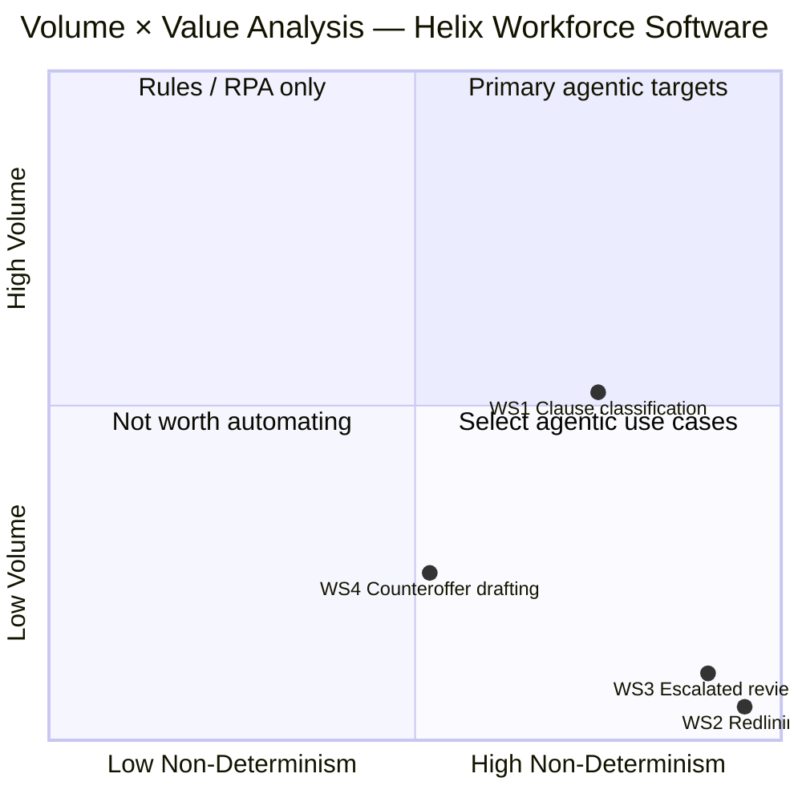

# D3 — Volume × Value Analysis
**Scenario:** Helix Workforce Software — Vendor Contract Clause Review

---

## 1. Suitability Pre-screening (ATX Step 1)

Before scoring volume or value, each work stream is screened against the four disqualifying criteria from `references\atx-scoring.md` Step 1. Work streams that fail do not proceed as agentic candidates; they may appear on the grid for diagnostic completeness.

| Work stream | Solvable by rules/RPA only? | Tacit judgment with no structure? | Critical integrations unavailable? | Compliance risk with no viable HITL? | Pre-screen result |
|-------------|---|---|---|---|---|
| WS1: First-pass clause classification | No — semantic comparison of unstructured legal prose against policy requires LLM reasoning, not deterministic rules | No — 7 known clause types with documented playbook positions provide structure; numeric thresholds are codified | No — Ironclad, SharePoint, Outlook APIs confirmed in scenario | No — confidence-gated HITL is viable; DPDI staleness is a deployment condition, not a hard block | **Conditional pass** — proceed to scoring; deployment gate: playbook DPDI update required before go-live |
| WS2: Standard-deviation redlining | No — legal prose generation is not rule-based | Yes (at current state) — redline drafting for qualitative clause types (DPA, IP, indemnity) requires synthesis judgment with no codified clause template; playbook provides policy positions, not substitute language | No | No — HITL on all agent-generated redlines is architecturally viable | **Conditional — not yet delegatable** for qualitative clause types; included in grid for completeness; re-evaluate after playbook provides explicit clause-language templates and WS1 outputs improve input structure |
| WS3: Escalated clause review | No | Yes — senior lawyer reviews clauses the playbook explicitly does not cover; no rule, pattern, or policy position is available for these cases | No | Yes — compliance risk is extreme; no viable HITL path for legal position framing on novel clause types; research support only | **Fail — Human Only**; core judgment is non-delegatable; agent research support (precedent retrieval) is scoped as D2 C-6 assist only |
| WS4: Counteroffer drafting & sign-off | Partially — C-8 sign-off is a Human Only legal judgment act; C-7 package assembly is not purely deterministic | No for C-7 — structured assembly with communication framing requires contextual reasoning | No — Ironclad, Outlook APIs confirmed | No for C-7 — C-8 sign-off gate is the architectural HITL; GC hard rule enforced as hard stop | **Conditional pass for C-7 component** — proceed to scoring; C-8 sign-off excluded from automation scope |

**Pre-screen summary:** WS1 and WS4 (C-7 component) proceed to volume × value scoring. WS2 and WS3 are included in the grid for diagnostic completeness — their grid positions explain why WS1 is the primary target — but neither is an agentic candidate at current playbook and data maturity.

---

## 2. Volume Derivation

**Quarter to week conversion:**
- 1 quarter ≈ 13 weeks (52 ÷ 4); ≈ 65 working days (13 × 5)

**Per-work-stream volumes from scenario:**

| Work stream | Volume/quarter | Per week | Per day |
|-------------|---------------|----------|---------|
| WS1: First-pass clause classification | ~300 | 300 ÷ 13 ≈ **23/week** | ≈ 4.6/day |
| WS2: Standard-deviation redlining | ~60 | 60 ÷ 13 ≈ **4.6/week** | ≈ 0.9/day |
| WS3: Escalated clause review | ~30 | 30 ÷ 13 ≈ **2.3/week** | ≈ 0.5/day |
| WS4: Counteroffer drafting & sign-off | ~90 | 90 ÷ 13 ≈ **6.9/week** | ≈ 1.4/day |

**Cross-check against 70/20/10 split:**
- 70% standard: 300 × 0.70 = **210 contracts** — close WS1, no further work stream
- 20% negotiable: 300 × 0.20 = **60 contracts** → WS2 ✓ matches scenario exactly
- 10% escalation: 300 × 0.10 = **30 contracts** → WS3 ✓ matches scenario exactly
- WS4 at 90 = WS2 (60) + WS3 (30) = **90** ✓ — every contract requiring a counteroffer (both redlined and escalated) passes through WS4

**Volume scoring note for WS1:** At contract level, WS1 processes 4.6 contracts/day. However, each contract contains up to 7 clause types requiring individual extraction and comparison — the unit of cognitive work in WS1 is the clause comparison, not the contract. At 7 clause types × 4.6 contracts/day ≈ **32 clause comparisons/day**, WS1 operates at a substantially higher task volume than the contract count suggests. This clause-level framing is used for the Volume score below and labelled accordingly.

**Annual volumes** (for TCO):
- WS1: 300 × 4 quarters = **1,200 contracts/year**; ~8,400 clause comparisons/year
- WS2: 60 × 4 = **240 contracts/year**
- WS3: 30 × 4 = **120 contracts/year**
- WS4: 90 × 4 = **360 contracts/year**

---

## 3. Non-Determinism Scoring

**Calculation: Agentic Value Score = Volume Score × Non-Determinism Score (1–25 scale)**
Candidate thresholds: ≥ 15 = Strong agentic candidate | 8–14 = Consider agentic, validate with TCO | < 8 = Rule-based automation or do not automate

| Work Stream | Volume Score (1–5) | Non-Determinism Score (1–5) | Agentic Value Score (V × ND) | Candidate status | Quadrant |
|-------------|-------------------|-----------------------------|------------------------------|-----------------|---------|
| WS1: First-pass clause classification | 3 | 4 | 3 × 4 = **12** | Consider agentic — validate with TCO | Primary agentic target |
| WS2: Standard-deviation redlining | 1 | 5 | 1 × 5 = **5** | Rule-based automation or do not automate | Select agentic use cases |
| WS3: Escalated clause review | 1 | 5 | 1 × 5 = **5** | Rule-based automation or do not automate | Select agentic use cases |
| WS4: Counteroffer drafting & sign-off | 2 | 3 | 2 × 3 = **6** | Rule-based automation or do not automate | Select agentic use cases (boundary) |

**Score justifications:**

**WS1 — Volume: 3.** At clause-comparison level (32/day), WS1 sits in the 10–50/day range (score 3: "Regular: 10–50 per day"). At contract level only (4.6/day), it would score 2; clause-level scoring is the more accurate representation of the agent's actual task volume and is labelled as such.

**WS1 — Non-Determinism: 4.** The core comparison task (MT4) follows known patterns — 7 clause types against named playbook positions — placing it clearly in the "patterns" zone. But the work also requires contextual adaptation (the DPA comparison is indeterminate due to DPDI staleness; numeric thresholds require interpretation of "enterprise" applicability) and exception handling (the "will ask Sarah" path, the regulatory gap detection in MT6). This is score 4: "patterns + contextual adaptation + exception handling." It does not reach 5 because the majority of clause comparisons are bounded by documented policy positions.

**WS2 — Volume: 1.** At 0.9 contracts/day (< 1/day on average), WS2 falls below "several per day" (score 2). Score 1 ("infrequent: weekly or monthly") is the honest assignment — Tom does fewer than one redlining job per day on average.

**WS2 — Non-Determinism: 5.** Redline drafting (MT-C) requires synthesis of a policy position into legally precise clause language within the structure of a specific vendor contract. This is not pattern-matching — it requires generating original legal text that (a) achieves the playbook target, (b) fits the contract's grammatical conventions, and (c) does not create cross-clause inconsistencies (MT-D). This meets score 5: "synthesis + policy interpretation + contextual judgment." The fact that the numeric-threshold cases (liability caps, SLAs) are less demanding does not lower the score — the DPA and qualitative clause types that constitute a material share of WS2 cases require full synthesis.

**WS3 — Volume: 1.** At 0.5 contracts/day (one every two working days), this is firmly score 1: "weekly or monthly." 30 cases per quarter = 10 per month is low-frequency by any measure.

**WS3 — Non-Determinism: 5.** The senior lawyer reviews unusual clauses that fall outside playbook coverage — by definition, these are cases where no rule, pattern, or policy position provides a reliable answer. Framing the counteroffer position requires synthesis across: the specific clause language, Helix's business relationship with the vendor, current regulatory position, and the GC's risk appetite. This is unambiguously score 5.

**WS4 — Volume: 2.** At 1.4 contracts/day (7/week), WS4 sits at the low end of "several per day." Score 2 ("several per day or high volume per month"; 30/month) is appropriate — it is the second-highest volume work stream after WS1.

**WS4 — Non-Determinism: 3.** Once approved redlines are available from WS2 or WS3, WS4's work is predominantly structured: compile the sign-off package, draft a standard procurement response communication, route for sign-off, dispatch. The communication drafting has limited judgment (score 3's "rule-based core" fits). The sign-off itself is human judgment — but the sign-off is a Human Only gate (D2 C-8), not an agentic task. The automatable portion of WS4 is largely deterministic assembly and dispatch. Score 3: "rule-based core + exceptions needing reasoning" (the delivery channel exception from Artefact 2.2 being the main exception).

**Range check:** Non-determinism scores span 3–5, a 2-point range ✓. Volume scores span 1–3, a 2-point range ✓.

---

## 4. Volume × Value Grid

Coordinates: `x = (Non-Determinism Score − 1) / 4`, `y = (Volume Score − 1) / 4`. WS2 and WS3 share identical scores (1 × 5); WS3 is offset by 0.05 to keep points visually distinct — see collision note below.



**Notes:**
- WS1 (score 12) is the only work stream in the top-right "Primary agentic target" quadrant (high ND, high volume), using clause-level volume scoring.
- WS2 and WS3 fall in the bottom-right "Select agentic use cases" quadrant (high ND, low volume) — both score 5 on non-determinism but are severely constrained by volume (score 1 each). WS3 is plotted at (0.90, 0.10) rather than (0.95, 0.05) to avoid overlap; both positions represent the same 1 × 5 scores.
- WS4 sits on the ND boundary (score 3 → x=0.52) in the bottom-right zone — low volume, borderline ND. The automatable C-7 package preparation component has select agentic potential; the sign-off gate (C-8) is Human Only and excluded from the score.
- No work stream falls in "Rules/RPA only" (top-left: high volume, low ND) — none of the four work streams combine high volume with low non-determinism.

---

## 5. Where an Agent Creates Value — and Where It Creates Risk

> **Work Stream 1: First-pass clause classification**
> **Value created by agent:** An agent eliminates the ~125 hours/quarter (300 × 25 min ÷ 60) Tom currently spends reading 15–40 page contracts and manually comparing each clause against the SharePoint playbook. For the 70% standard cases, the agent produces a complete per-clause classification with no human review required, cutting WS1 time for those contracts from 25 min to near-zero. For the 30% deviation cases, the agent provides structured comparison outputs and confidence scores that reduce Tom's triage time materially — he reviews the agent's findings rather than conducting the full comparison himself.
> **Risk created by agent:** The primary risk is a false-negative classification: the agent categorises an escalation-required clause as negotiable (or standard), routing it to WS2 without senior review. From Artefact 2.1, the liability cap deviation was flagged by Tom as "borderline negotiable, not escalation" — the agent must make this same judgment call, currently undocumented in the playbook. A second risk: the agent, trained against the current stale playbook, will classify DPDI-affected DPA clauses as compliant because the playbook says so. This is a compliance failure that would not be caught until downstream review — if at all.
> **Net assessment:** Value > Risk — conditional on (a) playbook updated before deployment to incorporate DPDI Act changes, and (b) confidence-gated HITL design that routes all low-confidence and all deviation classifications to Tom for review rather than proceeding autonomously.

> **Work Stream 2: Standard-deviation redlining**
> **Value created by agent:** For numeric-threshold clause types (liability caps, SLA commitments with quantified parameters), an agent can generate a candidate redline reducing Tom's drafting time from ~45 min to a review-and-accept workflow of ~10–15 min [assumption]. The volume is 60 cases/quarter — smaller than WS1 but each case saves more per-case time than WS1 when drafting is automated.
> **Risk created by agent:** Incorrect redline language is the central risk — an agent that generates plausible but legally imprecise clause text is harder to catch than a blank draft. If Tom accepts an agent-generated redline without full review, an incorrect negotiating position exits to the vendor under Helix's name. For DPA redlines specifically: an agent working from the stale playbook will generate DPDI-non-compliant language. A second risk: cross-clause consistency checks (MT-D) require reading the full document — an agent that skips this produces redlines that may create undetected conflicts elsewhere in the contract.
> **Net assessment:** Value > Risk — conditional on (a) human review of every agent-generated redline before sign-off routing, (b) playbook staleness resolved, and (c) agent scoped to numeric-threshold clause types only until qualitative drafting quality is validated.

> **Work Stream 3: Escalated clause review**
> **Value created by agent:** Limited — WS3 is Human Only for the core judgment. The agent's value is in preparation: retrieving similar prior clauses from historical contracts [assumption: these exist in Ironclad], pulling current regulatory guidance relevant to the clause type, and summarising the deviation from playbook position. This reduces the senior lawyer's reading and research time before framing their position.
> **Risk created by agent:** If the agent is asked to propose a counteroffer position (beyond preparation), the risk is that a plausible-sounding but legally incorrect position is adopted without sufficient lawyer scrutiny — especially for novel clause types. The GC's hard rule (no counteroffer without named-lawyer sign-off on specific clauses) exists precisely because these are the cases where agent error has the highest business consequence. An agent that outputs recommendations here must be explicitly scoped as "support only, no recommendations."
> **Net assessment:** Risk > Value for any automation beyond research preparation. The 30 cases/quarter volume does not justify the governance complexity of agentic involvement in legal position framing.

> **Work Stream 4: Counteroffer drafting & sign-off**
> **Value created by agent:** The sign-off package preparation (C-7 from D2) is the highest-value agent opportunity within WS4. By assembling the structured package from Ironclad records — identifying the specific redlined clauses, annotating each with the playbook position applied and the deviation magnitude, and identifying the correct vendor delivery channel (Artefact 2.2 pattern) — the agent reduces the named lawyer's sign-off preparation time from the scenario's ~30 min/case toward an estimated 10–15 min/case [assumption]. At 90 cases/quarter, this is a meaningful saving on senior lawyer time.
> **Risk created by agent:** The GC's hard rule is the binding constraint: no counteroffer may leave Legal's queue without named-lawyer sign-off on the specific clauses being negotiated. An agent that dispatches a counteroffer before a sign-off token is recorded in the case record violates this rule — even if the content is correct. The risk is not content quality but process integrity. Any automation in WS4 must treat the absence of a sign-off token as an absolute stop condition.
> **Net assessment:** Value > Risk for the package preparation component — conditional on sign-off gate enforcement being architecturally enforced (hard stop, not a warning). The dispatch step (sending the document) can be fully agentic once the sign-off token is recorded.

---

## 6. Suitability Gate Check

Top 2 candidates by Agentic Value Score: **WS1 (12)** and **WS4 (6)**.

| Factor | WS1: First-pass clause classification | WS4: Counteroffer drafting & sign-off |
|--------|--------------------------------------|--------------------------------------|
| Input Structure | M — unstructured Word documents; semi-structured email delivery | H — structured Ironclad records by WS4; vendor contact data available |
| Decision Determinism | M — numeric comparisons deterministic; qualitative comparisons and triage judgment-dependent | M — package assembly deterministic; communication framing has minor judgment component |
| Tool Coverage | H — Outlook, SharePoint, Ironclad REST APIs; Word parsing libraries available | H — Ironclad REST, Outlook, Word APIs all available |
| Exception Rate | M — DPDI gap creates active exceptions; borderline triage cases are ~5–10% [assumption] | L — delivery channel exception ~5% (Artefact 2.2); otherwise routine once redlines approved |
| Compliance Risk | H — misclassification of escalation-required contract as negotiable violates GC's process integrity; DPDI non-compliance risk | H — dispatch before sign-off token violates GC hard rule; non-recoverable if counteroffer sent prematurely |
| Gate Result | **Conditional pass** — passes on Input (M), Decision (M), Tool (H); compliance risk requires HITL design and playbook update before deployment | **Conditional pass** — passes on Input (H), Decision (M), Tool (H); compliance risk managed by sign-off gate as architectural hard stop |

**Gate notes:**
- WS1 passes with conditions: playbook must be updated (DPDI Act) before deployment; confidence-gated HITL for deviation classification is required.
- WS4 passes with conditions: the sign-off token check must be an architectural hard stop, not a soft validation; the package preparation component is gated-pass but the sign-off act itself remains Human Only.
- WS2 would fail the gate on two required dimensions (Input Structure: L; Decision Determinism: L) — it is excluded from the top-2 despite its non-determinism score. The value of WS2 is best captured by improving WS1's output quality (which feeds WS2 with structured inputs) rather than building a standalone WS2 agent.
- WS3 would also fail — Human Only for the core judgment; excluded from gate.

---

## 7. Primary Agentic Target — Selection and Justification

**Primary target: WS1 — First-pass clause classification.**

WS1 wins the Volume × Value grid with the only score ≥ 8 (Agentic Value Score: 12), placing it as the sole occupant of the top-right "Primary agentic target" quadrant. Its volume score of 3 reflects the actual task volume at clause-comparison level (~32/day), and its non-determinism score of 4 correctly captures the mix of pattern-based comparison and contextual judgment required for triage and gap detection. No other work stream comes close on volume; WS2 and WS3 score higher on non-determinism but are severely constrained by volume.

WS1 passes the suitability gate conditionally: tool coverage is High (all required APIs exist), and both input structure and decision determinism score Medium — the minimum threshold. The conditions are manageable: playbook DPDI update and confidence-gated HITL. These are resolvable before deployment and do not require architectural workarounds.

The specific business pain is concrete: 300 contracts × 25 min = **125 hours of paralegal time per quarter** consumed by a task that is structurally an LLM comparison problem. At 25% YoY growth, this reaches ~190 hours/quarter in two years without headcount increase — and the CRO's demand to halve the 4–6 day turnaround is directly driven by WS1 being the intake bottleneck for all 300 contracts.

The feasibility case is strong: Ironclad (REST APIs), SharePoint (API-accessible playbook), and Outlook (email intake) are all confirmed in the scenario. The playbook's semi-structured format (bullet-point criteria per clause type, per Artefact 2.3) is directly suitable for RAG indexing. The primary integration work is document parsing (Word → structured text) and playbook retrieval — both well-understood engineering problems with existing libraries and patterns.

The single biggest risk is **playbook staleness**. An agent trained on the current 9-month-old playbook will classify DPDI-affected DPA clauses as compliant. This is not a model limitation — it is a knowledge base limitation. If Amelia's DPDI Act updates are not incorporated before deployment, the agent will produce compliance failures at scale on every DPA clause it reviews. The playbook update is the deployment gate, not an optional pre-condition.

---

## 8. Preliminary TCO Sense-Check

```
BASELINE COST (WS1 — First-pass clause classification)
  Time per case:             25 min (from scenario)
  Fully loaded hourly cost:  £75/hr [assumption: UK paralegal fully loaded rate
                             including salary, NI, benefits, management overhead]
  Baseline cost per case:    (25 ÷ 60) × £75 = £31.25
  Cases per year:            300/quarter × 4 = 1,200 contracts/year
  Annual baseline:           1,200 × £31.25 = £37,500

AGENT COST ESTIMATE
  Tokens per case:           ~15,000 input tokens (avg 25-page contract ≈ 6,500 tokens
                             + playbook context ≈ 7,000 tokens + system prompt ≈ 1,500 tokens)
                             + ~2,000 output tokens (per-clause classifications + routing
                             decision) [all assumptions — validated in mock testing]
  Model:                     Claude Sonnet (latest) [assumption]
  Input token cost:          15,000 ÷ 1,000 × £0.0024 = £0.036
                             [assumption: ~$3/M input tokens at £1=~$1.26]
  Output token cost:         2,000 ÷ 1,000 × £0.012 = £0.024
                             [assumption: ~$15/M output tokens]
  Token cost per case:       £0.036 + £0.024 = £0.06

  HITL rate:                 30% of cases (the 20% negotiable + 10% escalation
                             deviation cases — all reviewed by Tom; standard 70%
                             processed autonomously)
  HITL time per case:        8 min [assumption: Tom reviews agent's flagged clauses
                             and classification rationale, not re-doing the full review]
  HITL cost per case:        0.30 × (8 ÷ 60) × £75 = £3.00
  Estimated agent cost/case: £0.06 (tokens) + £3.00 (HITL) = £3.06
  Annual agent cost:         1,200 × £3.06 = £3,672

ECONOMICS
  Annual saving (WS1):       £37,500 - £3,672 = £33,828
  Annual saving (WS4 C-7):   360 cases × 15 min saved × £100/hr [assumption: lawyer
                             rate] ÷ 60 = 360 × £25 = £9,000 [assumption: 15 min
                             saved per case on sign-off package preparation]
  Combined annual saving:    £33,828 + £9,000 = £42,828

  Estimated build cost:      £60,000 [assumption: 3 months development including
                             Ironclad/SharePoint/Outlook integration, Word parsing,
                             playbook RAG, HITL routing, testing — UK professional
                             services rates]
  Payback period:            £60,000 ÷ £42,828 = ~17 months
  Year 1 ROI:                (£42,828 - £60,000) ÷ £60,000 = -28% (build year)
  Year 2 ROI:                (£42,828 × 2 - £60,000) ÷ £60,000 = +43%
  3-year ROI:                (£42,828 × 3 - £60,000) ÷ £60,000 = +114%
```

**Economic assessment:** The economics close within 17 months — within the 18-month target threshold in the ATX scoring reference. This estimate is conservative: it excludes (a) the value of turnaround improvement enabling enterprise deals (CRO's stated priority), (b) scalability at 25% YoY growth without headcount addition, and (c) the compounding value of the Ironclad + SharePoint + playbook RAG integrations serving future agents. Even the base-case WS1-only saving (£33,828/year) produces a payback of 21 months — directionally positive and within normal enterprise investment tolerance for a compliance-adjacent capability. The economics likely close.

---

## Summary — main 3 points

1. **WS1 is the clear primary agentic target with an Agentic Value Score of 12 — the only work stream above the "consider agentic" threshold.** It wins on both volume (32 clause comparisons/day at clause level) and non-determinism (score 4 — pattern-based comparison with contextual triage judgment). The 125 hours/quarter of paralegal time it consumes on a structurally LLM-tractable task is the most straightforward value case in the process.

2. **WS2 and WS3 are both high non-determinism but low volume — they are "select agentic" rather than primary targets, and WS2 in particular fails the suitability gate on input structure and decision determinism.** The correct strategy is not to build standalone agents for these work streams, but to improve WS1's structured outputs so they reduce the cognitive load in WS2 (Tom redlines from agent-provided comparison context rather than starting from scratch) and capture WS4 package preparation as a companion quick-win.

3. **The playbook is the deployment gate, not just a data source.** The DPDI Act staleness means an agent deployed today against the current playbook will produce compliance failures at scale on every DPA clause. The TCO analysis shows a 17-month payback under reasonable assumptions — but that payback only materialises if Amelia's DPDI updates are incorporated before go-live. Resolving playbook staleness is the critical path item, not the engineering work.
