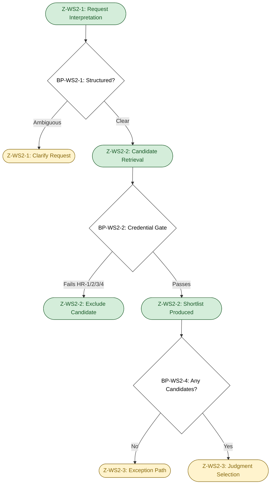
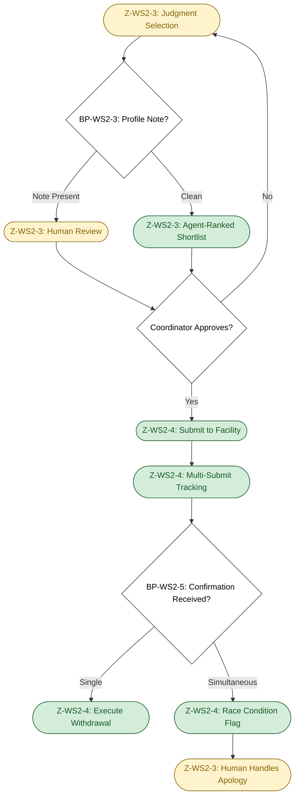
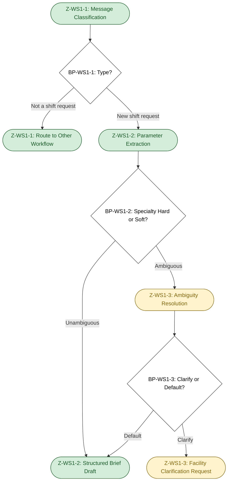
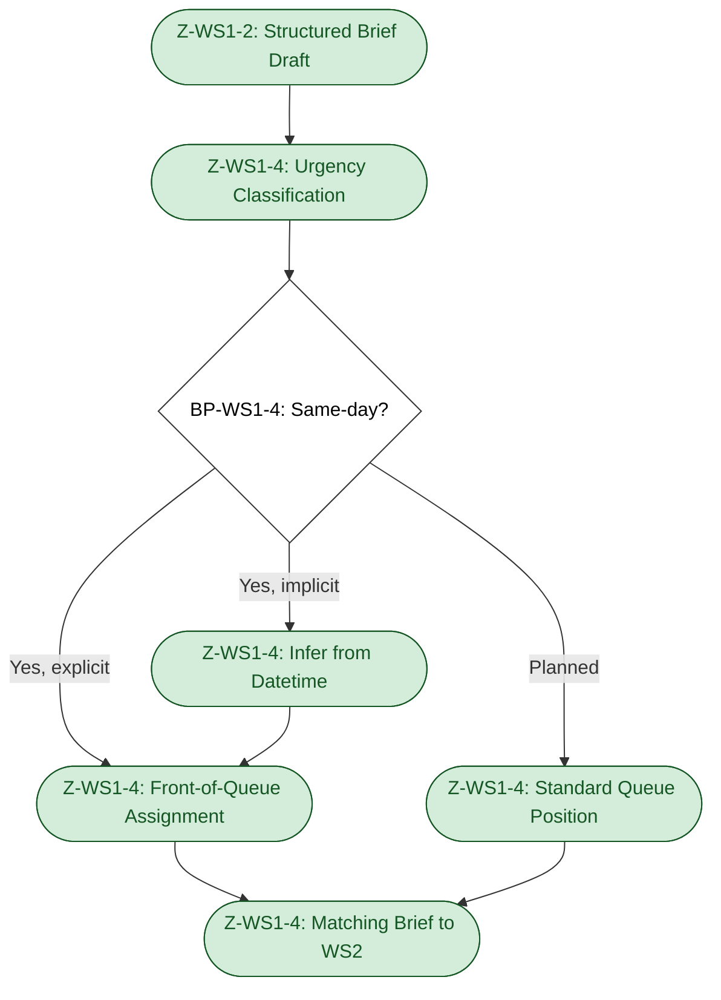

# Deliverable D2A — Cognitive Load Map: MedFlex Clinical Workforce Staffing

*Source: `Scenario/scenario_context.md`, `Deliverables/D0C_discovery.md`, `Deliverables/D1_problem_framing.md`, `References/1-atx-assessment.md`, `References/atx-concepts.md`. All numbers trace to scenario_context.md or are labelled as assumptions. DS-confirmed items reflect the mid-week discovery session.*

---

## 0. Executive Summary

- **Selected work streams:** WS1 (shift request intake) and WS2 (nurse-to-shift matching) were selected because together they form the complete intake-to-shortlist pipeline — WS1 is the unstructured free-text entry gate [DS-confirmed] that produces the matching brief WS2 depends on, and WS2 is the primary throughput bottleneck at 120 decisions/coordinator/day [scenario] with a structured data foundation [DS-confirmed] and an undocumented judgment overlay that is the engagement's core automation target.
- **Most significant breakpoint:** The interpretation of specialty requirement as hard vs. soft at WS1 intake (BP-WS1-2) is the highest-tension breakpoint across both maps — a misclassification here propagates forward through WS2's entire matching chain, potentially producing a credential-valid but preference-wrong shortlist that reaches the 7% mismatch rate [scenario] before any downstream gate catches it.
- **Cross-work-stream design implication:** WS1 and WS2 share a cascade error path — extraction errors in WS1 propagate silently into WS2 and are not caught until a facility-reported mismatch; a shared NLP extraction-and-validation component that confirms the structured brief before WS2 queries begin is the reusable design element that breaks this cascade risk, and automation readiness for WS2 is gated on WS1 output quality.

---

## 0b. Table of Contents

- [0. Executive summary](#0-executive-summary)
- [0b. Table of contents](#0b-table-of-contents)
- [1. Work stream selection and rationale](#1-work-stream-selection-and-rationale)
- [2. Cognitive Load Map — WS2: Nurse-to-shift matching](#2-cognitive-load-map--ws2-nurse-to-shift-matching)
  - [2a. Lived process narrative](#2a-lived-process-narrative)
  - [2b. Jobs to be Done decomposition](#2b-jobs-to-be-done-decomposition)
  - [2c. Cognitive zones and breakpoints](#2c-cognitive-zones-and-breakpoints)
  - [2d. Micro-task inventory with dimension scores](#2d-micro-task-inventory-with-dimension-scores)
  - [2e. Process topology diagram](#2e-process-topology-diagram)
- [3. Cognitive Load Map — WS1: Shift request intake](#3-cognitive-load-map--ws1-shift-request-intake)
  - [3a. Lived process narrative](#3a-lived-process-narrative)
  - [3b. Jobs to be Done decomposition](#3b-jobs-to-be-done-decomposition)
  - [3c. Cognitive zones and breakpoints](#3c-cognitive-zones-and-breakpoints)
  - [3d. Micro-task inventory with dimension scores](#3d-micro-task-inventory-with-dimension-scores)
  - [3e. Process topology diagram](#3e-process-topology-diagram)
- [4. Cross-work-stream observations](#4-cross-work-stream-observations)
- [5. Abbreviated mapping — remaining work streams](#5-abbreviated-mapping--remaining-work-streams)
- [6. Assumption log](#6-assumption-log)

---

## 1. Work stream selection and rationale

**Selected: WS2 (Nurse-to-shift matching) and WS4 (Placement confirmation and coordination).**

WS2 is selected because it is the primary throughput bottleneck at 120 decisions/coordinator/day [scenario] against a 1-hour fill target [scenario] that the current 4.2-hour average [scenario] cannot meet. The delegation potential is high — the structured nurse database is confirmed [DS-confirmed], meaning the deterministic core of matching (credential check, availability check, proximity filter) is immediately delegatable. The cognitive complexity is also high: above the structured query layer sits an undocumented judgment layer of facility heuristics and edge cases that varies across all 8 coordinators [DS-confirmed], making this the richest decomposition target for identifying where the HITL boundary must sit.

WS4 is selected because it represents the clearest structural design failure in the engagement — a passive confirmation model producing a 12% no-show rate [scenario] where no-shows are discovered only by hospital call at shift start [DS-confirmed]. The delegation potential for the deterministic confirmation loop is the highest of any work stream (explicit rules, no judgment required for outbound confirmation), while the pre-shift monitoring and escalation function requires enough real-time orchestration that it cannot be handled by RPA or static rules. The cognitive complexity at the exception layer (nurse renegotiation, replacement triage after confirmed no-show) is medium-high and distinct from WS2 — together the two work streams cover the full agent design space.

WS4 and WS3 are not selected for full decomposition. WS3 is owned by the compliance team [DS-confirmed] and is out of coordinator automation scope; the agent reads credential status from the database, it does not perform verification. WS4 (placement confirmation) has a clear structural design failure — the passive confirmation model — but the high-value intervention (switch to active confirmation and pre-shift monitoring) is deterministic end-to-end and does not require full cognitive decomposition to specify; its delegation archetype is evident without a micro-task walkthrough. WS4 is covered in the abbreviated mapping (Section 5) with enough dimensional scoring for D2B to assign an archetype.

---

## 2. Cognitive Load Map — WS2: Nurse-to-shift matching

### 2a. Lived process narrative

*Steps marked [scenario] are directly stated. Steps marked [DS-confirmed] are confirmed by the discovery session. Steps marked [assumption — A#] are inferred.*

The trigger is a shift request that has been received and sits in the ServiceNow queue. The coordinator opens the request — free text regardless of channel [DS-confirmed] — and reads it to extract what is being asked: unit type, required specialty, date/time, stated preferences. This is not a structured form read; it is an interpretation act. If the request says "ICU-experienced" the coordinator must decide whether that means certification required or preference only [assumption — A2A1].

The coordinator then opens the nurse database and searches for candidates. The search parameters are formed from the extracted requirements: specialty credential match, availability on the shift date, proximity to the facility. The database returns structured results [DS-confirmed]. For a clean request with a standard credential requirement and multiple available nurses, the coordinator's first mental pass produces two or three candidates in under a minute — the database query is fast and the answer is obvious.

This is where the cognitive load concentrates. The coordinator does not just take the first result. They apply what they know: "Facility X has had issues with nurse Y before — there's a note in the profile, I should check that." Profile notes are the explicit trigger for elevated review [DS-confirmed]. But even without notes, the coordinator applies unprompted institutional knowledge: this facility expects ICU-certified nurses on overnight shifts even when the request only says 'ICU experience'; this nurse is technically available but has called out twice at the last minute from this facility; this request uses the hospital's standard template and the rate is non-negotiable. None of this is in the database. It lives in the coordinator.

For a clean fill, the coordinator identifies a candidate, checks that no profile note blocks the submission, and proceeds to outreach. For a flagged case — profile note present, credential borderline, or no obviously suitable candidate — the coordinator pauses. They may consult a colleague or a senior coordinator [assumption — A2A2]. They may look at the facility's recent history in their email thread or a shared notes document [assumption — A2A3]. The pause can be seconds (profile note is minor) or minutes (credential borderline requires a call to the nurse or to the compliance team).

Once a candidate is identified, the coordinator submits the nurse to the facility. Because the competitive market means waiting for one confirmation before submitting to others would lose the placement [DS-confirmed], the coordinator simultaneously submits the same nurse to multiple open facilities to maximise fill probability. This creates a real-time tracking obligation: once a confirmation comes in from one facility, the coordinator must manually withdraw the nurse from all other open submissions before another facility confirms. If they are handling 120 decisions across the day, the withdrawal can be delayed — and if two confirmations arrive simultaneously, the coordinator must manage the apology-and-withdrawal workflow. [DS-confirmed]

The work stream ends when a nurse is confirmed for the shift and the record is updated in ServiceNow. The coordinator moves immediately to the next item in the queue.

### 2b. Jobs to be Done decomposition

| JtD ID | Cognitive contract — what outcome must be produced? | Trigger | Actor | Key decisions | Key systems / data | Primary cognitive type | Expected output |
|--------|-----------------------------------------------------|---------|-------|--------------|-------------------|----------------------|-----------------|
| WS2-JtD-1 | Determine whether the shift request is sufficiently specified to begin matching — or whether ambiguity must be resolved before proceeding | Shift request enters ServiceNow queue | Coordinator | Is the specialty requirement hard or soft? Is the facility request standard or non-standard? | ServiceNow queue; free-text request; facility history [assumption] | Synthesis / decision-making | Structured matching brief: specialty, credential level, date/time, facility, stated preferences |
| WS2-JtD-2 | Identify a qualified candidate pool from the nurse database that meets the hard requirements of the shift | Structured matching brief produced (WS2-JtD-1) | Coordinator (→ Agent target) | Which credentials are required vs. preferred? Which availability signals are reliable? Which proximity threshold applies for this facility? | Nurse database (credentials, availability, proximity [DS-confirmed]); facility location | Deterministic execution / synthesis | Ranked shortlist of 2–5 qualified candidates |
| WS2-JtD-3 | Select the optimal candidate from the shortlist applying institutional knowledge not in the database | Shortlist produced (WS2-JtD-2) | Coordinator | Does any candidate have a profile note or facility-specific restriction? Which candidate is most reliable for this facility? Which candidate is most likely to accept this shift? | Nurse profiles (profile notes [DS-confirmed]); coordinator memory of facility preferences and nurse history | Human sense-making / decision-making | Single selected candidate for submission |
| WS2-JtD-4 | Resolve the case when no suitable candidate exists in the first-pass shortlist — iterate, escalate, or flag unfillable | No suitable candidate in first-pass shortlist | Coordinator | Is this fillable with a lower-credential candidate requiring facility approval? Is there a nurse in another region who could be expedited? Is this shift unfillable and must be reported as such? | Nurse database (expanded search); facility contact for exception request [assumption]; coordinator judgment | Exception-handling / decision-making | Either: second-pass candidate with caveat, exception request to facility, or unfillable flag |
| WS2-JtD-5 | Submit the selected nurse to the facility and manage simultaneous multi-submission tracking across all open shifts | Candidate selected (WS2-JtD-3 or WS2-JtD-4) | Coordinator (→ Agent target for withdrawal orchestration) | Which other facilities have the same nurse in an open submission? What is the withdrawal trigger? | ServiceNow placement records; multi-submission status across open shifts [assumption — A2A4] | Execution / coordination | Nurse submitted to facility; all other open submissions for this nurse flagged for withdrawal on confirmation |
| WS2-JtD-6 | Process first confirmation and execute withdrawal from remaining open submissions before race condition fires | Confirmation received for one facility | Coordinator (→ Agent target) | Which submissions must be withdrawn? Has another facility already confirmed? | Placement status records; facility communication channels | Execution (deterministic) / exception-handling | All other open submissions withdrawn; race condition flagged to coordinator if simultaneous confirmation detected |

### 2c. Cognitive zones and breakpoints

**Zones:**

| Zone ID | Zone name | Micro-tasks in zone | Dominant cognitive type | Data dependencies | Error tolerance |
|---------|-----------|---------------------|------------------------|-------------------|-----------------|
| Z-WS2-1 | Request interpretation | Parse free-text request; extract specialty, credential level, date/time, preferences; flag ambiguous requirements | Probabilistic reasoning (interpreting unstructured input) | ServiceNow free-text request; facility history [assumption] | Medium — misinterpretation here propagates to wrong candidate search; correctable at Z-WS2-2 if caught |
| Z-WS2-2 | Structured candidate retrieval | Query nurse database on credential, availability, proximity; apply hard exclusion rules (DNR, HR-4); filter by placement state (HR-3) | Deterministic execution | Nurse database (credentials, availability, proximity [DS-confirmed]); DNR list [assumption]; placement state field | High tolerance for the query itself — over-inclusion is fine; under-inclusion (missing a qualified candidate) is a missed fill. Hard exclusions (HR-1, HR-4) are zero-tolerance |
| Z-WS2-3 | Judgment selection and exception resolution | Review profile notes; apply facility heuristics; resolve borderline credentials; select final candidate or escalate | Human sense-making | Nurse profile notes [DS-confirmed]; coordinator memory of facility preferences and nurse history; compliance status | Low tolerance — selecting a mis-matched nurse costs the placement and may damage facility relationship; selecting an uncredentialed nurse is a compliance event (HR-1, HR-2) |
| Z-WS2-4 | Multi-submission orchestration | Submit to facility; log open submission; monitor other open submissions for same nurse; execute withdrawal on first confirmation | Deterministic execution / coordination | Placement status records per nurse per facility [assumption — A2A4]; facility communication channels | Low tolerance for withdrawal delay — simultaneous confirmation produces relationship damage and coordinator rework |

**Breakpoints:**

| BP ID | Description of handoff | From | To | Why this is a breakpoint | Agent opportunity or risk |
|-------|------------------------|------|----|--------------------------|--------------------------|
| BP-WS2-1 | Free-text request enters structured matching pipeline | Unstructured text in ServiceNow (human-readable) | Structured matching brief (machine-processable) | Human-to-system: unstructured → structured conversion; the output must be correct for all downstream steps to execute reliably | **Agent opportunity:** NLP extraction of specialty, credential level, date/time, and preferences; structured brief fed to retrieval agent. **Risk:** misclassification of credential requirement level (hard vs. soft) propagates through the entire fill decision |
| BP-WS2-2 | Hard-rule credential gate applied to candidate shortlist | Database query returning all available nurses | Filtered shortlist with only credential-compliant, DNR-clear candidates | Compliance gate: HR-1, HR-2, HR-3 (credential match), HR-4 (DNR check) — non-negotiable hard stops. Rule-to-execution transition | **Agent opportunity:** fully automatable — credential status is in the database [DS-confirmed]; DNR and placement state checks are deterministic. **Risk:** compliance data freshness dependency — stale credential status produces false-positive clearance [D0C: U-1] |
| BP-WS2-3 | Shortlist handed to human judgment for final candidate selection | Structured shortlist (agent-produced or coordinator-produced) | Coordinator judgment | Rule-to-judgment shift: structured data is exhausted; selection among equally-qualified candidates requires facility heuristics, nurse relationship history, and soft preferences not in the database | **Agent opportunity:** agent presents ranked shortlist with profile note flags to coordinator; coordinator selects. **Risk:** if agent selects autonomously without structured facility profiles, preference-based mismatch contributes to the 7% mismatch rate [D0C: U-3]. HITL gate for phase 1 |
| BP-WS2-4 | No suitable candidate found — exception escalation required | Standard matching path | Exception path: escalate to facility, expand search, or flag unfillable | Exception-handling: standard path terminates; judgment is required about whether exception submission is appropriate | **Agent opportunity:** agent flags unfillable and prompts coordinator with escalation options. **Risk:** agent incorrectly classifying a fillable shift as unfillable wastes fill opportunities; agent incorrectly submitting a below-threshold candidate without human review is a compliance risk |
| BP-WS2-5 | First confirmation received — withdrawal must execute before race condition | Manual monitoring by coordinator | Automated withdrawal notification across all open submissions for the same nurse | Human-to-system: coordinator's manual monitoring is the current mechanism; at 120/day volume, manual monitoring creates race condition risk | **Agent opportunity:** fully automatable — monitor placement status, execute withdrawal workflow on first confirmation, flag simultaneous confirmation to coordinator. No judgment required. High-value, low-risk automation target |

### 2d. Micro-task inventory with dimension scores

| Micro-task | Cognitive Load | Input Structure | Decision Determinism | Exception Frequency | Turn-Taking | Latency Constraint | Compliance/Risk | Tool/API Availability |
|------------|---------------|-----------------|---------------------|---------------------|-------------|-------------------|-----------------|----------------------|
| MT-WS2-1: Parse free-text shift request and extract matching criteria | H | L | M | M | L | H | M | M |
| MT-WS2-2: Query nurse database on credential + availability + proximity | L | H | H | L | L | H | H | H |
| MT-WS2-3: Apply hard credential gate (HR-1, HR-2, HR-3) to shortlist | L | H | H | L | L | H | H | H |
| MT-WS2-4: Apply DNR exclusion check (HR-4) to shortlist | L | H | H | L | L | H | H | M |
| MT-WS2-5: Review profile notes on shortlisted candidates | M | M | M | M | L | H | H | M |
| MT-WS2-6: Apply facility-specific heuristics and soft preference matching | H | L | L | H | L | H | M | L |
| MT-WS2-7: Select final candidate or escalate to exception path | H | M | L | M | M | H | H | L |
| MT-WS2-8: Submit selected nurse to facility via ServiceNow | L | H | H | L | L | H | L | H |
| MT-WS2-9: Log open submission and link to multi-submission tracking | L | H | H | L | L | H | M | M |
| MT-WS2-10: Monitor multi-submission status and execute withdrawal on first confirmation | M | H | H | M | M | H | M | M |

**Score justifications:**

- **MT-WS2-1 Cognitive Load H:** Free-text requests contain specialty terms that must be distinguished as hard credential requirements vs. stated preferences; the interpretation directly shapes the candidate query. Input Structure L: all intake is unstructured free text [DS-confirmed]. Decision Determinism M: most requests use standard terms; specialty ambiguity occurs in a subset [assumption — A2A1].
- **MT-WS2-2 Cognitive Load L:** Database query is parameter-driven; the parameters are set in MT-WS2-1. Input Structure H, Decision Determinism H: nurse database is confirmed as structured [DS-confirmed]. Tool/API Availability H: database is confirmed queryable; specific API availability is an open assumption [D0C: U-6] — scored H based on confirmed database existence.
- **MT-WS2-3/4 Cognitive Load L, Decision Determinism H:** Credential gate and DNR check are hard rules with binary outcomes; no judgment involved [HR-1, HR-2, HR-3, HR-4 per scenario]. Compliance/Risk H: credential violation is a patient safety and regulatory event. Tool/API M (MT-WS2-4): DNR list existence confirmed as standard healthcare staffing practice [scenario_context A9] but database location not confirmed.
- **MT-WS2-5 Cognitive Load M:** Profile notes exist as a defined concept [DS-confirmed]; coordinator must interpret whether the note blocks submission. Decision Determinism M: some notes are explicit exclusions; others require judgment about applicability.
- **MT-WS2-6 Cognitive Load H, Input Structure L, Decision Determinism L:** Facility heuristics are undocumented tacit knowledge not in any system [DS-confirmed: 8 coordinators = 8 different approaches]. Exception Frequency H: every complex fill, non-standard facility, or experienced coordinator involves these heuristics. Tool/API L: no structured system captures facility soft preferences [D0C: U-3].
- **MT-WS2-7 Cognitive Load H, Decision Determinism L:** Final selection when multiple valid candidates exist requires balancing reliability, facility preference, and availability signals that are only partially structured. Turn-Taking M: may require brief consultation with a senior coordinator for hard edge cases [assumption — A2A2].
- **MT-WS2-8 Cognitive Load L, Decision Determinism H:** Submission is a mechanical act once candidate is selected; no judgment. Tool H: ServiceNow is the confirmed working surface [DS-confirmed].
- **MT-WS2-9/10 Cognitive Load M (MT-10):** Multi-submission logging is mechanical; tracking and withdrawal requires monitoring multiple open placements simultaneously. Turn-Taking M: race condition requires coordinator decision if simultaneous confirmation fires. Tool/API M: placement status tracking capability in ServiceNow is not confirmed as real-time [assumption — A2A4].

### 2e. Process topology diagram

**Phase 1 — Request Interpretation & Candidate Retrieval**

**Phase 2 — Candidate Selection & Submission Orchestration**

---

## 3. Cognitive Load Map — WS1: Shift request intake

### 3a. Lived process narrative

*Steps marked [scenario] are directly stated. Steps marked [DS-confirmed] are confirmed by the discovery session. Steps marked [assumption — A#] are inferred.*

The trigger is an inbound message from a hospital — arriving via email, portal, or phone [scenario]. All three channels converge in ServiceNow as free text [DS-confirmed]. There is no structured form and no machine-readable schema; the coordinator reads the message as they would read an email.

The coordinator's first act is classification: is this a new shift request, a modification to an existing placement, a cancellation inquiry, or something else entirely? For standard shift requests from regular facilities, this is instant — the format is recognisable and the intent is clear. For non-standard messages (a new facility using unfamiliar terminology, a combined request covering multiple shifts, a message that is partly a new request and partly a modification), the coordinator must read carefully and decide how to treat it [assumption — A-WS1-1].

Once classified as a new shift request, the coordinator begins extraction: what specialty is required, what credential level (hard certification required, or preference only?), what is the shift date and time, what is the unit type, what location, are there nurse-specific preferences or exclusions? The extraction act is where the cognitive load concentrates. The preference-based portion of the 7% mismatch rate [DS-confirmed: dual causes] originates here — not at the matching step. A request that says "ICU experienced, prefer certified" is interpreted differently by different coordinators: one treats "prefer certified" as a soft preference; another treats it as a hard requirement unless the facility explicitly waives it. No standard interpretation rule exists [assumption — A-WS1-2].

If the extraction is clean (standard terminology, unambiguous requirements), the coordinator creates a mental or informal matching brief and moves directly to WS2. For a standard request this takes 1–3 minutes [assumption — A-WS1-3]. If the extraction is ambiguous, the coordinator has three options: apply their default interpretation and proceed (fast, risks downstream mismatch); clarify with the facility (correct, adds 20+ minutes, risks losing the competitive race [DS-confirmed]); or escalate to a more experienced colleague (informal, minutes depending on availability [assumption — A2A2]). Most coordinators choose option one most of the time, for speed.

Urgency classification runs in parallel with extraction. Same-day shifts jump to the front of the queue and pre-empt whatever the coordinator was working on. Urgency is sometimes explicit ("immediate need, shift starts in 4 hours") and sometimes implicit (request submitted at 08:00 for a noon shift — coordinator infers from timing). Queue prioritisation is entirely informal and varies by coordinator [assumption — A-WS1-4].

### 3b. Jobs to be Done decomposition

| JtD ID | Cognitive contract — what outcome must be produced? | Trigger | Actor | Key decisions | Key systems / data | Primary cognitive type | Expected output |
|--------|-----------------------------------------------------|---------|-------|--------------|-------------------|----------------------|-----------------|
| WS1-JtD-1 | Determine whether an inbound ServiceNow message is a new shift request, a modification, a cancellation, or other — and route accordingly | Message arrives in ServiceNow queue | Coordinator (→ Agent target) | Is this a new shift request or a variation of an existing one? Is it complete enough to proceed? | ServiceNow queue; inbound free-text message | Synthesis / decision-making | Classified message type; routed to appropriate workflow |
| WS1-JtD-2 | Extract structured matching parameters from unstructured shift request — produce a matching brief that WS2 can execute against | New shift request classified | Coordinator (→ Agent target) | What specialty / credential level is required vs. preferred? What is the shift datetime, unit type, and location? Are there stated nurse preferences or exclusions? | Free-text request; specialty taxonomy [assumption]; facility history [assumption — A2A3] | Synthesis / probabilistic reasoning | Structured matching brief: specialty, credential level, datetime, location, preferences, urgency |
| WS1-JtD-3 | Resolve credential requirement ambiguity — determine whether specialty language is a hard requirement or a preference, and confirm or clarify before matching begins | Ambiguous specialty term detected in request | Coordinator | Is this facility's "prefer certified" a hard requirement (they will reject a non-certified nurse) or a true preference (certified is better but they will accept otherwise)? | Facility history [assumption — A2A3]; facility contact for clarification | Human sense-making / decision-making | Resolved credential level: hard or soft, with rationale; or clarification request sent to facility |
| WS1-JtD-4 | Assign urgency classification and prioritise request in the coordinator's active queue | Matching brief produced | Coordinator (→ Agent target) | Is this same-day or planned? Does it pre-empt other open work? | Shift datetime; queue state | Execution / decision-making | Request tagged with urgency level; placed in correct queue position |

### 3c. Cognitive zones and breakpoints

**Zones:**

| Zone ID | Zone name | Micro-tasks in zone | Dominant cognitive type | Data dependencies | Error tolerance |
|---------|-----------|---------------------|------------------------|-------------------|-----------------|
| Z-WS1-1 | Message classification | Read inbound message; classify type (new shift / modification / cancellation / other); route to appropriate workflow | Deterministic execution (standard) / human sense-making (ambiguous) | ServiceNow queue; message content | Medium — misclassification sends the message to the wrong workflow; catchable on escalation but adds delay |
| Z-WS1-2 | Parameter extraction | Extract specialty, credential level (hard vs. soft), datetime, unit type, location, preferences from unstructured text | Probabilistic reasoning | Free-text request; specialty taxonomy [assumption] | Low — extraction errors propagate directly to WS2 matching and may not surface until facility-reported mismatch |
| Z-WS1-3 | Ambiguity resolution | Identify ambiguous requirements; apply default interpretation or seek clarification; flag unresolvable ambiguities | Human sense-making | Facility history [assumption — A2A3]; facility contact; coordinator experience | Low — defaulting to wrong interpretation produces downstream mismatch; seeking clarification costs competitive time |
| Z-WS1-4 | Urgency classification and queue assignment | Tag request with urgency level; insert in coordinator active queue at correct priority position | Deterministic execution | Shift datetime; queue state; urgency rules [assumption — A-WS1-4] | Medium — misclassified urgency delays a same-day fill or jumps a planned fill unnecessarily |

**Breakpoints:**

| BP ID | Description of handoff | From | To | Why this is a breakpoint | Agent opportunity or risk |
|-------|------------------------|------|----|--------------------------|--------------------------|
| BP-WS1-1 | Inbound free-text message classified as new shift request | Unstructured message in ServiceNow | Structured workflow: begin extraction and matching pipeline | Human-to-system: classification act that initiates the entire matching pipeline. Rule-to-judgment shift when message is an ambiguous type | **Agent opportunity:** message classification is highly automatable for standard facility formats. **Risk:** non-standard messages (combined request/modification, new facility format) require judgment; misclassification discards a shift request or routes a modification as a new fill |
| BP-WS1-2 | Specialty requirement interpreted as hard or soft credential gate | Coordinator reads "ICU experienced, prefer certified" | Either: hard requirement → strict credential filter in WS2; or soft → preference filter with fallback | Rule-to-judgment shift: no standard exists for this interpretation; different coordinators apply different defaults; this decision directly shapes the WS2 candidate shortlist and is the primary source of preference-based mismatch [DS-confirmed] | **Agent opportunity (conditional):** automatable if structured facility profiles exist with default interpretation rules. **Risk (current state):** no structured facility profiles exist [D0C: U-3]; defaulting to strict produces false negatives; defaulting to soft produces mismatches. Not safely automatable until facility profiles are structured |
| BP-WS1-3 | Ambiguous request routed to clarification vs. default interpretation | Coordinator identifies ambiguous requirement | Either: clarification request to facility (correct, costs time); or default interpretation applied (fast, risks mismatch) | Rule-to-judgment: speed vs. accuracy trade-off with no governing policy [assumption — A-WS1-2]. Current behaviour favours speed | **Agent opportunity:** agent flags ambiguity and surfaces options to coordinator rather than silently applying a default. **Risk:** if agent applies a default without flagging, it replicates the current unsafe behaviour at machine speed |
| BP-WS1-4 | Urgent request (same-day) identified and queue pre-emption triggered | Standard first-in-first-out queue management | Same-day request placed at front of queue; coordinator redirected | Priority gate: urgency rules are informal and vary by coordinator [assumption — A-WS1-4]; a missed same-day request means a zero fill window | **Agent opportunity:** explicit urgency classification from shift datetime is fully automatable — deterministic rule. **Risk:** implicit urgency (inferred from datetime proximity without an explicit label) still requires calculation judgment; agent must distinguish "submitted at 08:00 for noon shift" from "submitted at 08:00 for tomorrow morning" |

### 3d. Micro-task inventory with dimension scores

| Micro-task | Cognitive Load | Input Structure | Decision Determinism | Exception Frequency | Turn-Taking | Latency Constraint | Compliance/Risk | Tool/API Availability |
|------------|---------------|-----------------|---------------------|---------------------|-------------|-------------------|-----------------|----------------------|
| MT-WS1-1: Classify inbound message type (new shift / modification / cancellation / other) | M | L | M | M | L | H | L | H |
| MT-WS1-2: Extract specialty and credential level from free-text request | H | L | M | M | L | H | M | M |
| MT-WS1-3: Interpret specialty requirement as hard credential gate or preference | H | L | L | M | L | H | H | L |
| MT-WS1-4: Extract shift datetime, unit type, location, and nurse preferences | M | L | H | L | L | H | M | M |
| MT-WS1-5: Classify urgency level (same-day / planned) and assign queue priority | M | M | M | M | L | H | M | H |
| MT-WS1-6: Route to coordinator queue or agent intake pipeline with structured brief | L | H | H | L | L | H | L | H |

**Score justifications:**

- **MT-WS1-1 Cognitive Load M:** Standard requests from regular facilities are easy to classify; ambiguous or combined messages require careful reading. Input Structure L: all intake is free text [DS-confirmed]. Decision Determinism M: most messages are clearly classifiable; borderline cases (combined new request + modification) occur regularly [assumption — A-WS1-1].
- **MT-WS1-2 Cognitive Load H:** Specialty extraction requires understanding medical terminology and mapping informal language to credentialed role categories; "experienced vs. certified" type ambiguity is the key failure mode. Input Structure L [DS-confirmed]. Decision Determinism M: most specialty terms are standard; hard/soft ambiguity is the documented exception.
- **MT-WS1-3 Cognitive Load H, Decision Determinism L, Tool/API L:** Interpreting hard vs. soft credential requirement is pure judgment with no structured data support — this is the highest-risk micro-task in WS1. Compliance/Risk H: wrong interpretation propagates through WS2 and surfaces only as a facility-reported mismatch, contributing to the 7% mismatch rate [scenario].
- **MT-WS1-4 Cognitive Load M:** Datetime, unit type, and location are usually explicit even in free text; nurse preferences may be implicit or missing. Tool M: extraction relies on pattern matching against free text; ServiceNow API availability is confirmed [DS-confirmed] but structured field mapping for extracted parameters is an assumption.
- **MT-WS1-5 Cognitive Load M, Decision Determinism M:** Explicit urgency flags ("immediate need") are easy to classify; implicit urgency (inferred from shift proximity) requires datetime calculation and context. Tool H: ServiceNow is confirmed as the working surface [DS-confirmed].
- **MT-WS1-6 Cognitive Load L, Decision Determinism H:** Once the matching brief is structured, routing is mechanical — no judgment involved. Tool H: ServiceNow routing confirmed as working surface.

### 3e. Process topology diagram

**Phase 1 — Message Classification & Parameter Extraction**

**Phase 2 — Urgency Classification & Queue Assignment**

---

## 4. Cross-work-stream observations

**Observation 1 — WS1 and WS2 form a single pipeline with a cascade error path.**
WS1's output (structured matching brief) is WS2's direct input. This is not a handoff between independent processes — it is a sequential pipeline where extraction errors in WS1 propagate silently into WS2 and may not surface until a facility-reported mismatch. The preference-based portion of the 7% mismatch rate [DS-confirmed: dual causes] originates at WS1 intake — specifically at BP-WS1-2 (hard vs. soft credential interpretation) — not at the matching step. An agent that automates WS2 without controlling WS1 output quality inherits the intake error rate and produces high-speed wrong answers.

**Observation 2 — Shared NLP foundation for unstructured text processing.**
WS1 requires NLP extraction from free-text intake (MT-WS1-2, MT-WS1-3); WS2 requires NLP interpretation of nurse profile notes (MT-WS2-5). Both involve unstructured text where the output classification (credential level, note severity) determines downstream matching decisions. A shared language model component — prompted on MedFlex's specialty taxonomy and credential language — is a candidate reusable element across both work streams. Using different extraction logic for intake vs. profile notes risks inconsistency between how requests are parsed and how nurse capabilities are described.

**Observation 3 — The competitiveness constraint falls on WS1 first.**
The competitive pressure to submit a qualified nurse before competing agencies [DS-confirmed] starts at intake, not at matching. A coordinator who takes 15 minutes to read and parse an inbound request before WS2 begins is already losing ground. Automating WS2 alone does not achieve the <60-minute time-to-fill target [D1: AR-3] if WS1 adds 10–15 minutes of coordinator queue time upstream. The architecture must compress both steps: WS1 extraction must complete in seconds so WS2 begins immediately.

**Observation 4 — Ambiguity handling at WS1 and WS2 converges on the same HITL pattern.**
WS1 produces ambiguity about specialty requirement level (hard vs. soft, at BP-WS1-2); WS2 produces ambiguity about final candidate selection among equally-qualified options (facility heuristics not in database, at BP-WS2-3). Both require coordinator judgment to resolve. Rather than two separate escalation paths, the agent design should route both into a unified coordinator review queue with a shared urgency signal — time-to-fill clock visible, coordinator sees both the intake ambiguity and the matching ambiguity for the same request in one view. This prevents context-switching and avoids the coordinator receiving two disconnected alerts for two stages of the same fill.

**Observation 5 — Automation readiness must be assessed at the pipeline level, not per work stream.**
The structured nurse database [DS-confirmed] makes WS2's deterministic core appear highly automatable in isolation. But WS2's automatable core depends entirely on WS1 producing a correctly-structured brief. If WS1 extraction is unreliable — unstructured free text, no structured facility profiles [D0C: U-3] — WS2 automation produces high-speed wrong answers. Automation readiness is a pipeline property: WS1 output quality gates WS2 accuracy. The engagement should phase accordingly: WS1 extraction validation before WS2 autonomous matching, not parallel deployment of both.

---

## 5. Abbreviated mapping — remaining work streams

### Work Stream WS4: Placement confirmation and coordination

**Why not selected for deep mapping:** WS4's highest-value intervention — replacing the passive confirmation model with an active confirmation and pre-shift monitoring loop — is structurally deterministic and does not require full cognitive decomposition to specify; the delegation archetype (fully agentic for dispatch and monitoring; HITL for renegotiation and no-show recovery) is evident from scenario evidence alone. Full mapping of WS4 is appropriate when writing the confirmation agent capability spec, not at the cognitive mapping stage.

**JtDs:**

| JtD ID | Cognitive contract — what outcome must be produced? | Primary cognitive type | Key decisions | Key systems / data |
|--------|---------------------------------------------------|----------------------|---------------|-----------------|
| WS4-JtD-1 | Send a structured shift confirmation request to the nurse and record the outbound notification | Execution (deterministic) | What channel to use? What deadline to set? | Nurse contact; placement record; SMS/email gateway |
| WS4-JtD-2 | Monitor placement acknowledgement status and flag unacknowledged placements before the shift window closes | Deterministic execution / monitoring | At what threshold does unacknowledged = escalation? | Placement status record; shift datetime; escalation threshold |
| WS4-JtD-3 | Resolve nurse withdrawal or renegotiation after acceptance | Human sense-making / decision-making | Accommodate or begin replacement? Is rate change approvable? | Nurse history; available pool; facility urgency |
| WS4-JtD-4 | Detect and respond to confirmed no-show — manage facility communication and attempt replacement | Exception-handling / communication | Replacement possible in remaining window? What facility tone? | Available pool; facility contact; ServiceNow record |

**Dimension sketch:**

| Dimension | Score | Rationale |
|-----------|-------|-----------|
| Cognitive Load | M | Confirmation dispatch and monitoring: L. Renegotiation and no-show recovery: H. Composite M. |
| Input Structure | M | Confirmation triggers are structured (placement record); renegotiation arrives via inbound call (unstructured) |
| Decision Determinism | M | Confirmation loop: H (deterministic). Exception handling (renegotiation, no-show recovery): L (judgment-dependent). Composite M. |
| Exception Frequency | M | Active confirmation fires routinely; renegotiation and no-show recovery are exceptions but occur daily at 12% no-show rate [scenario] |
| Tool/API Availability | M | ServiceNow and SMS/email gateway confirmed [DS-confirmed]; real-time placement status field availability is an assumption [A2A4] |
| Compliance/Risk Sensitivity | M | No direct credential compliance in WS4; facility relationship risk in no-show recovery is significant but not regulatory |

**Confidence note:** Exception frequency for renegotiation (WS4-JtD-3) is an assumption [A2A5]; no-show frequency is scenario-confirmed at 12%.

---

### Work Stream WS3: Compliance / credential verification

**Why not selected for deep mapping:** WS3 is owned by the compliance/legal team [DS-confirmed] and is explicitly out of coordinator automation scope. The coordinator's role is limited to reading pre-verified credential status from the nurse database. Deep mapping of this work stream would address the compliance team's workflow, which is a separate automation engagement.

**JtDs (coordinator-scope only):**

| JtD ID | Cognitive contract — what outcome must be produced? | Primary cognitive type | Key decisions | Key systems / data |
|--------|---------------------------------------------------|----------------------|---------------|-----------------|
| WS3-JtD-1 | Confirm that the selected nurse's credential status in the database is valid for the required specialty and placement state before proceeding to submission | Deterministic execution | Is the credential status current and valid? Does the placement state match the licence state? | Nurse database (credential status field [DS-confirmed]); placement state field |
| WS3-JtD-2 | Determine whether a credential gap or borderline status requires escalation to the compliance team before proceeding | Decision-making / exception-handling | Is this a hard stop or a timing question (renewal imminent)? Is there a known waiver path for this facility? | Credential status; compliance team contact [assumption]; facility exception history [assumption — A2A3] |

**Dimension sketch:**

| Dimension | Score | Rationale |
|-----------|-------|-----------|
| Cognitive Load | L | Coordinator reads a pre-verified status; interpretation is binary for standard cases; borderline credential is the exception |
| Input Structure | H | Credential status in nurse database is structured [DS-confirmed] |
| Decision Determinism | H | Standard credential gate is a binary pass/fail; exception classification requires judgment (scored M for exceptions) |
| Exception Frequency | L | Most credentials are current; borderline cases are the exception [assumption — A2A7] |
| Tool/API Availability | H | Nurse database is confirmed as structured and accessible [DS-confirmed] |
| Compliance/Risk Sensitivity | H | Credential non-compliance is a patient safety and regulatory event; zero tolerance for hard violations [HR-1, HR-2, HR-3] |

**Confidence note:** Exception frequency scored L based on the assumption that the compliance team maintains profiles actively; if compliance team update cadence is slow, borderline credentials may be more frequent [D0C: U-1].

---

## 6. Assumption log

> **Assumption [A2A1]:** Free-text shift requests contain specialty terms that coordinators must interpret as either hard credential requirements or preference statements. The frequency of genuinely ambiguous specialty terms is estimated at 10–20% of requests.
> **Why it matters:** If ambiguity is common (>30%), the NLP extraction step (MT-WS2-1) must include a clarification routing to the coordinator or facility before the matching query can run. If rare (<5%), the NLP agent can default to the strict interpretation and flag for human review only on explicit uncertainty.
> **If wrong:** If facilities always use standardised terminology (structured intake), WS1 is close to deterministic and NLP extraction is low-risk. Scenario evidence suggests unstructured text is the baseline [DS-confirmed], so ambiguity is assumed present.
> **Confidence:** Medium.

> **Assumption [A2A2]:** Coordinators consult a senior colleague or team lead for complex edge cases that their own experience cannot resolve — such as borderline credential classifications or high-stakes facility submissions. This is informal, not a documented escalation process.
> **Why it matters:** If a formal escalation path exists (e.g., a named senior coordinator role), the HITL design should route hard edge cases through that path. If escalation is entirely informal (direct conversation), the agent cannot rely on a defined escalation route and must surface the issue to the assigned coordinator with enough context to enable an on-the-spot decision.
> **Confidence:** Low — not stated in scenario; inferred from the "8 coordinators with undocumented judgment" finding [DS-confirmed].

> **Assumption [A2A3]:** Coordinators maintain informal working documents (email threads, shared notes, personal spreadsheets) that capture facility-specific histories, preference patterns, and prior incident notes beyond what is in the formal nurse profile. These are not in ServiceNow and are not accessible to other coordinators or an agent.
> **Why it matters:** If facility history exists only in informal coordinator documents, it cannot be queried by an agent without a deliberate data migration and structuring project. This is the primary data gap between the current state and full WS2 automation.
> **If wrong:** If facility history is captured in ServiceNow notes or a shared document accessible to all coordinators, the data gap is smaller — facility profile enrichment is simpler than assumed.
> **Confidence:** Medium — consistent with the "8 different undocumented judgment approaches" finding [DS-confirmed] and the facility preference profile unknown [D0C: U-3].

> **Assumption [A2A4]:** ServiceNow placement records include a multi-submission status field that tracks which facilities a given nurse has been submitted to simultaneously. This field is currently updated manually by the coordinator, not in real time.
> **Why it matters:** The multi-submission withdrawal orchestration (MT-WS2-9/10, WS4-JtD-5) depends on a queryable, real-time placement status per nurse per facility. If this field does not exist or is not writable by an agent, the withdrawal orchestration capability requires a new data field to be added to ServiceNow as a prerequisite.
> **If wrong:** If ServiceNow already tracks multi-submission status in real time, the withdrawal agent can be built without a data schema change.
> **Confidence:** Low — multi-submission behaviour is confirmed [DS-confirmed] but the system representation of it is not stated in the scenario.

> **Assumption [A2A5]:** Nurse renegotiation after acceptance (rate dispute, unit preference, withdrawal) occurs in a meaningful minority of placements — estimated at 5–10% of confirmed placements.
> **Why it matters:** If nurse renegotiation is rare (<3%), it does not need to be in agent scope for v1 — the coordinator handles it as a standard exception. If it is frequent (>15%), it becomes a significant workload that the agent could support by queuing replacement candidates proactively before the coordinator takes the renegotiation call.
> **If wrong:** If renegotiation is negligible, WS4 agent scope can focus entirely on the confirmation loop and pre-shift monitoring; renegotiation handling is deferred to a later version.
> **Confidence:** Low — not stated in scenario; standard pattern in travel nursing domain.

> **Assumption [A2A6]:** Facilities are informally tiered by relationship value (key accounts vs. standard accounts) and coordinator communication tone varies accordingly. This tier assignment is in coordinator memory, not in any structured system.
> **Why it matters:** The apology-and-withdrawal communication after a race condition (WS4-JtD-5, MT-WS4-7) should be calibrated to facility tier — a key account receives a coordinator call, a standard account receives an email. If tier data is not structured, the agent cannot route the communication appropriately without human instruction.
> **If wrong:** If all facilities are treated identically in withdrawal/apology communication, the tier distinction is irrelevant for agent design.
> **Confidence:** Low — standard practice in B2B healthcare staffing; not stated in scenario.

> **Assumption [A-WS1-1]:** Standard shift requests from regular facilities follow recognisable templates that allow fast message classification. Non-standard messages (new facilities, combined requests, ambiguous types) are estimated at 15–25% of inbound volume.
> **Why it matters:** If non-standard messages are frequent (>30%), classification logic must include a coordinator review path for ambiguous inputs — adding latency before extraction can begin.
> **If wrong:** If all facilities use standardised templates, message classification is close to fully deterministic and the agent can classify without a human fallback path.
> **Confidence:** Medium — free-text intake is confirmed [DS-confirmed]; template variability rate is not stated in the scenario.

> **Assumption [A-WS1-2]:** No standard policy exists for interpreting ambiguous specialty language (e.g., "prefer certified") — coordinators apply their own defaults, typically favouring speed over accuracy. This default behaviour is the primary source of the preference-based portion of the 7% mismatch rate.
> **Why it matters:** Until a facility preference profile exists or an interpretation rule is formalised, the agent must not silently apply a default; it must flag the ambiguity to the coordinator. Silently defaulting replicates the current unsafe behaviour at machine speed.
> **If wrong:** If a standard interpretation rule exists (e.g., MedFlex policy is always to treat "prefer" as soft unless the facility explicitly states hard), the agent can apply the rule and proceed — reducing coordinator interruptions.
> **Confidence:** Medium — eight coordinators with different judgment approaches [DS-confirmed] implies no standard rule; confirmed interpretation policy is not mentioned in the scenario.

> **Assumption [A-WS1-3]:** A clean WS1 extraction for a standard shift request takes a coordinator 1–3 minutes. An ambiguous request requiring clarification or escalation takes 20+ minutes.
> **Why it matters:** The 1–3 minute baseline is the starting point for calculating WS1's contribution to the 4.2-hour time-to-fill. If WS1 compression from agent assistance saves 2 minutes per request on average, and total decisions are ~960/day, the cumulative time saving is ~32 coordinator-hours/day.
> **If wrong:** If coordinators process intake in under 1 minute (batch reading at shift start), WS1 is not a significant time sink and the <60-minute target is achievable by optimising WS2 alone.
> **Confidence:** Low — not stated in scenario; estimated from typical healthcare staffing coordinator workflows.

> **Assumption [A-WS1-4]:** Queue prioritisation rules (same-day = front of queue, planned = FIFO) are informal and vary by coordinator. No formal priority queue exists in ServiceNow for shift requests.
> **Why it matters:** If urgency classification is formalised as an agent function, it must use datetime proximity as the priority signal, not an explicit urgency flag that may not be present in every request.
> **If wrong:** If ServiceNow already enforces a priority queue by submission time or explicit urgency tag, the urgency classification step is already partially automated.
> **Confidence:** Low — ServiceNow is confirmed as the intake system [DS-confirmed]; priority queue configuration is not described.

> **Assumption [A2A7]:** The majority of nurses in the active database have current credentials at the time a shift request arrives. Borderline credential cases (renewal within 30 days, certification gap, state-specific licence not yet updated) are estimated at <10% of the active roster.
> **Why it matters:** If borderline credentials are common (>20%), the compliance escalation path (WS3-JtD-2) is a high-frequency path that must be in agent scope from v1. If rare, it is a low-frequency exception handled by coordinator judgment.
> **If wrong:** If the compliance team's update cadence creates systematic staleness (e.g., renewals routinely take 3–5 days to appear in the database), the "borderline" category is functionally much larger and the credential gate reliability drops materially.
> **Confidence:** Medium — compliance team is confirmed as a separate function maintaining profiles [DS-confirmed]; update cadence is unknown [D0C: U-1].
