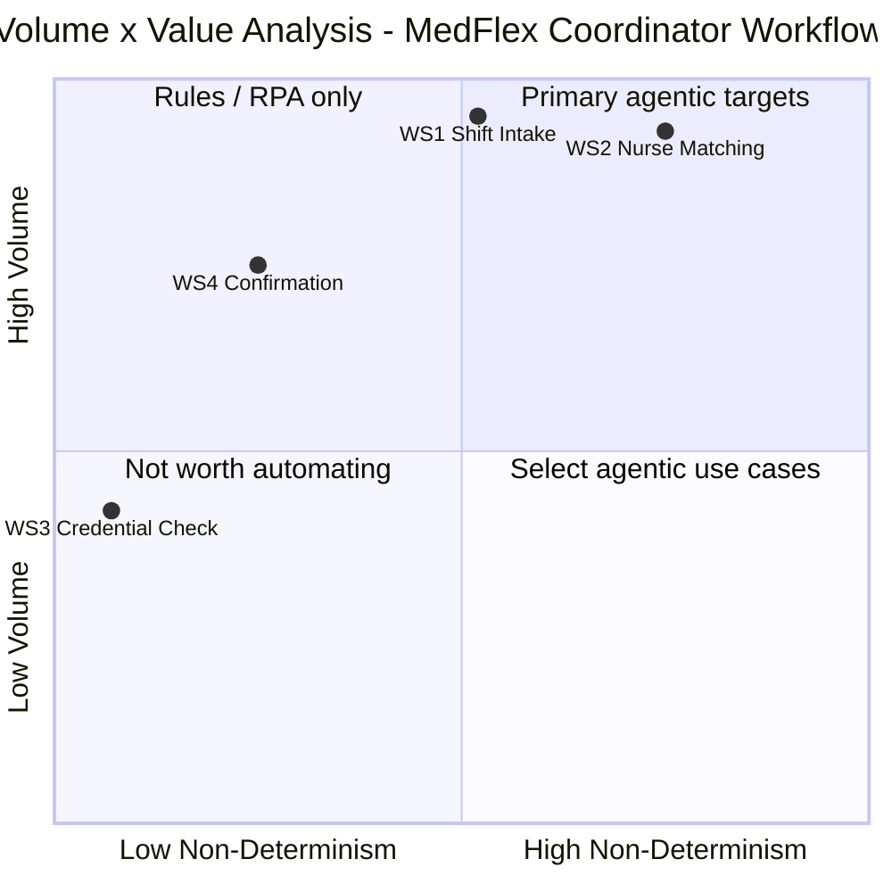

# Deliverable D2C — Volume × Value Analysis: MedFlex Clinical Workforce Staffing

*Source: `Scenario/scenario_context.md`, `Deliverables/D2A_cognitive_load_map.md`, `Deliverables/D2B_delegation_suitability_matrix.md`, `Deliverables/D0C_discovery.md`. All numbers trace to scenario_context.md or are labelled as assumptions.*

---

## 0. Executive Summary

- **Primary agentic target:** WS2 (Nurse-to-shift matching) with an Agentic Value Score of 20 — the business case is that automating 85% of WS2's ~960 decisions/day unlocks the 14× revenue capacity ($14M → $200M [DS-confirmed]) that 2× headcount alone cannot provide; without the agent, serving $200M volume requires ~112 coordinators at ~$9.4M/year, which is an organisational impossibility.
- **Looks automatable but isn't (as AI agent):** WS4 (Placement confirmation) — despite WS4-JtD-1 scoring 7/7 suitability in D2B (the highest in the engagement), WS4's low non-determinism score (2/5) places it in the Rules/RPA quadrant; its confirmation dispatch and monitoring loops are fully deterministic, making AI reasoning overhead rather than value — a rule-based automation or scheduled trigger delivers the same outcome at lower cost and complexity.
- **Economics close at scale:** At current volume, the payback period on a $750K build [assumption A-D2C-7] is ~3.7 years — marginal at best; at 14× target volume (3.36M decisions/year), the annual saving from avoiding 96 additional coordinators is ~$7.9M, producing a payback period of ~5 weeks; the economics rest on a single key assumption: the $200M revenue target scales proportionally with decisions/day [scenario A12].

---

## 0b. Table of Contents

- [0. Executive summary](#0-executive-summary)
- [0b. Table of contents](#0b-table-of-contents)
- [1. Suitability pre-screening (ATX Step 1)](#1-suitability-pre-screening-atx-step-1)
- [2. Volume derivation](#2-volume-derivation)
- [3. Non-determinism scoring](#3-non-determinism-scoring)
- [4. Volume x Value grid (Mermaid quadrantChart)](#4-volume-x-value-grid-mermaid-quadrantchart)
- [5. Where an agent creates value — and where it creates risk](#5-where-an-agent-creates-value--and-where-it-creates-risk)
- [6. Suitability gate check](#6-suitability-gate-check)
- [7. Primary agentic target — selection and justification](#7-primary-agentic-target--selection-and-justification)
- [8. Preliminary TCO sense-check](#8-preliminary-tco-sense-check)
- [9. Feasibility scoring](#9-feasibility-scoring)
- [10. Implementation sequencing and wave assignment](#10-implementation-sequencing-and-wave-assignment)
- [11. Assumption log](#11-assumption-log)

---

## 1. Suitability Pre-Screening (ATX Step 1)

| Work stream | Solvable by rules/RPA only? | Tacit judgment with no structure? | Critical integrations unavailable? | Compliance risk with no viable HITL? | Pre-screen result |
|-------------|---|---|---|---|---|
| WS1: Shift request intake | No — unstructured free text requires NLP, not a script | Partially — WS1-JtD-3 (hard/soft credential interpretation) is Human Only; other JtDs are delegatable with HITL | No — ServiceNow confirmed [DS-confirmed]; LLM tooling available | No — HITL gate at WS1-JtD-3 isolates the compliance-sensitive ambiguity decision | **Conditional pass** — WS1-JtD-3 must remain HITL; viable boundary isolates it from agentic scope |
| WS2: Nurse-to-shift matching | Partially — WS2-JtD-2 candidate pool query could be RPA, but full orchestration requires agent | Yes for WS2-JtD-3 and WS2-JtD-4 — both Human Only in D2B; both isolated from the agentic scope by HITL boundaries | No — nurse database confirmed structured and accessible [DS-confirmed] | No — WS2-JtD-3 (Human Only) and WS2-JtD-4 (Human Only) are the compliance exception gates | **Conditional pass** — Human Only JtDs isolated; agentic scope (WS2-JtD-2, WS2-JtD-5, WS2-JtD-6) passes cleanly |
| WS3: Credential verification (coordinator scope) | **Yes** — credential status read is a binary database lookup; no NLP or probabilistic reasoning required | No — standard check is deterministic (H); WS3-JtD-2 escalation requires minimal judgment | No — nurse database confirmed accessible [DS-confirmed] | No — WS3-JtD-2 preserves human judgment for borderline cases | **Pass (rule-based / RPA)** — coordinator scope is solvable by a tool call or trigger rule; AI agent not warranted; excluded from AI agentic candidate set |
| WS4: Placement confirmation and coordination | **Partially** — WS4-JtD-1 and JtD-2 are fully deterministic (confirmed RPA-suitable); WS4-JtD-3 and JtD-4 require judgment | Yes for WS4-JtD-3 (renegotiation) — Human Only in D2B; viable HITL boundary isolates it | Partially — SMS/email confirmed [DS-confirmed]; real-time placement status field availability is an assumption [A2A4] | No — human owns all exception paths | **Conditional pass (RPA for deterministic JtDs; agent only for exception paths)** — WS4-JtD-1 and JtD-2 proceed as rule-based automation, not AI agent; WS4-JtD-4 (agent as parallel processor) is the only AI-relevant component |

**Pre-screen resolution:** WS2 and WS1 proceed to the volume × value analysis as AI agent candidates. WS4 proceeds as a rule-based automation candidate (its score will appear on the grid for diagnostic completeness but is labelled as excluded from the AI agentic candidate set). WS3 is excluded — treated as a tool call within the WS2 agent, not a standalone automation project.

---

## 2. Volume Derivation

**Base figure:** ~120 shift-matching decisions per coordinator per day; 8 coordinators → ~960 decisions/day total [scenario, directly stated]. Derived weekly: 960 × 5 = **~4,800 decisions/week**. Derived annual: 960 × 250 = **~240,000 decisions/year** [assumption A-D2C-3: 250 working days].

| Work stream | Derivation | Cases/week | Basis |
|-------------|-----------|:---:|---|
| WS2: Nurse-to-shift matching | Directly stated: ~120/coordinator/day × 8 = 960/day | **~4,800** | Scenario [directly confirmed] |
| WS1: Shift request intake | Every WS2 matching decision was triggered by a prior WS1 intake event → WS1 ≥ WS2 in volume. WS1 also receives modifications, cancellations, and misdirected messages not counted in the 960 matching figure → WS1 volume ≥ 960/day, estimated ~960–1,200/day [assumption A-D2C-6] | **~4,800–6,000** | Derived from WS2; labelled assumption |
| WS3: Credential verification (coord. scope) | One credential read per candidate submitted — coordinator scope is embedded in every WS2 decision. Standalone coordinator work stream (WS3-JtD-2 escalation only) is < 10% of WS2 volume by assumption [D2A: A2A7] = < 96 escalation decisions/day. Total coordinator WS3 touches (including embedded reads) ≈ WS2 volume, but distinctive standalone work stream volume is the escalation layer | **< 480 escalation-level decisions/week** | Derived; labelled assumption |
| WS4: Placement confirmation and coordination | Each confirmed fill triggers a WS4 confirmation event. Fill rate not stated in scenario [assumption A-D2C-4: ~70–80% fill rate → 670–770 confirmation events/day]. Active monitoring generates continuous background tasks. WS4 volume is a sub-set of WS2 | **~3,350–3,850 confirmations/week** | Derived from WS2 × assumed fill rate; labelled assumption |

**Volume score assignments** (using Execution Frequency scale from §3):
- WS2: 960/day = "hundreds+ per day" → **Score 5**
- WS1: ≥960/day = "hundreds+ per day" → **Score 5** [derived; assumption A-D2C-6]
- WS4: ~670–770/day = "hundreds+ per day" → **Score 4** [derived; assumption A-D2C-4; downscored from 5 to reflect that this is a subset of WS2 with additional uncertainty about fill rate]
- WS3: < 96 standalone escalation-level decisions/day = coordinator work stream distinctive volume → **Score 3** ("Regular: 10–50 per day, or high volume per week" — borderline 4; scored 3 because WS3's distinctively agentic scope is only the exception escalation path; the embedded credential reads are within WS2 scope, not standalone WS3 agent work)

---

## 3. Non-Determinism Scoring

**Derivation from D2A micro-task dimension patterns:**

**WS2 — Non-Determinism derivation:**
From D2A §2d micro-task inventory (10 micro-tasks):
- Decision Determinism L on 2/10 (MT-WS2-6, MT-WS2-7 — facility heuristics and final candidate selection), M on 3/10, H on 5/10
- Exception Frequency H on 1/10 (MT-WS2-6), M on 4/10, L on 5/10
- Cognitive Load H on 3/10 (MT-WS2-1, 6, 7), M on 2/10, L on 5/10
- Input Structure L on 3/10 (MT-WS2-1, 6, 7), M on 1/10, H on 6/10

Pattern: The deterministic core (credential check, DNR filter, submission, withdrawal) dominates by count (6/10), but the 3 high-non-determinism micro-tasks (MT-WS2-1, 6, 7) are the critical judgment points where the fill is won or lost. Decision Determinism L on final selection (MT-WS2-7) with H Cognitive Load is the signature of a work stream where AI reasoning adds distinct value over a script.

**→ WS2 Non-Determinism Score: 4** ("Significant reasoning: follows patterns but requires contextual adaptation and exception handling" — the structured query core follows patterns; the facility heuristics and final selection require contextual judgment)

**WS1 — Non-Determinism derivation:**
From D2A §3d micro-task inventory (6 micro-tasks):
- Decision Determinism L on 1/6 (MT-WS1-3 — hard/soft credential interpretation), M on 3/6, H on 2/6
- Exception Frequency M on 4/6, L on 2/6, H on 0/6
- Cognitive Load H on 2/6 (MT-WS1-2, 3), M on 3/6, L on 1/6
- Input Structure L on 4/6 (MT-WS1-1 through 4), M on 1/6, H on 1/6

Pattern: L Input Structure throughout (unstructured free text on every case) is a non-determinism driver, but Decision Determinism is only L for the single highest-stakes micro-task (MT-WS1-3). The core extraction work (MT-WS1-4: datetime, unit, location) is H determinism — clear pattern-following from text. Exception Frequency is M throughout but never H. This is "core path is rule-based (extract structured fields from free text following templates), with a meaningful exception when credential ambiguity arises."

**→ WS1 Non-Determinism Score: 3** ("Mixed: core path is rule-based but exceptions and edge cases require reasoning" — extraction is largely pattern-following; the ambiguity exception (MT-WS1-3) is Human Only precisely because the non-determinism is concentrated in one decision that is not safely agentic)

**WS4 — Non-Determinism derivation:**
From D2A §5 dimension sketch (WS4):
- Cognitive Load: M (composite — L for confirmation/monitoring; H for renegotiation/no-show)
- Input Structure: M (structured for confirmation triggers; unstructured for exception paths via phone)
- Decision Determinism: M (H for confirmation loop; L for exception handling)
- Exception Frequency: M

Pattern: Decision Determinism is H for the dominant case (confirmation dispatch and monitoring) and L for the exceptions (renegotiation, no-show). The dominant volume path (WS4-JtD-1, WS4-JtD-2) is entirely deterministic — send structured message, check timestamp, escalate on threshold. The judgment-dependent exception paths (WS4-JtD-3, WS4-JtD-4) occur at ~12% (no-show rate) and an estimated 5–10% (renegotiation [D2A: A2A5]) of placements — a meaningful but minority share of volume. The majority of WS4 decisions are pure rules.

**→ WS4 Non-Determinism Score: 2** ("Mostly deterministic: small reasoning component around structured rules with edge cases" — the dominant cognitive type is deterministic execution; exception paths introduce judgment but are low-frequency relative to the confirmation/monitoring backbone)

**WS3 — Non-Determinism derivation:**
From D2A §5 dimension sketch (WS3 coordinator scope):
- Cognitive Load: L — coordinator reads a pre-verified status; no interpretation required for standard case
- Input Structure: H — credential status field in nurse database is structured [DS-confirmed]
- Decision Determinism: H (M for exceptions only) — standard credential gate is binary pass/fail
- Exception Frequency: L — borderline credentials are the exception [D2A: A2A7]

Pattern: Decision Determinism H dominates (H input structure, H determinism, L cognitive load, L exceptions). Only WS3-JtD-2 (escalation of borderline credentials) introduces any judgment, and it is L frequency. This is as close to fully deterministic as any coordinator work stream in the engagement.

**→ WS3 Non-Determinism Score: 1** ("Fully deterministic: pure rules/logic, no reasoning required" — read a field, apply a binary rule; the escalation exception is L frequency and is handled by a date comparison, not AI reasoning)

**Summary table:**

| Work Stream | Volume Score (1–5) | Non-Determinism Score (1–5) | Agentic Value Score (product) | Candidate status |
|-------------|:-:|:-:|:-:|---|
| WS2: Nurse-to-shift matching | 5 | 4 | **20** | Strong agentic candidate (≥15) |
| WS1: Shift request intake | 5 | 3 | **15** | Strong agentic candidate (≥15) |
| WS4: Placement confirmation | 4 | 2 | **8** | Consider agentic / validate TCO (8–14) — *RPA-first per pre-screen* |
| WS3: Credential verification (coord. scope) | 3 | 1 | **3** | Rule-based automation or do not automate (<8) |

Non-determinism range: 1 to 4 = 3-point spread (minimum 2-point requirement satisfied). All four work streams produce distinct scores.

---

## 4. Volume x Value Grid (Mermaid quadrantChart)

**Formula coordinates and adjustments:**
- WS2: x=(4-1)/4=0.75, y=(5-1)/4=1.00 → y=1.00 is an axis edge; rendered as y=0.93
- WS1: x=(3-1)/4=0.50, y=(5-1)/4=1.00 → x=0.50 is the vertical quadrant divider; y=1.00 is axis edge; rendered as x=0.52, y=0.95
- WS4: x=(2-1)/4=0.25, y=(4-1)/4=0.75 → no adjustments needed
- WS3: x=(1-1)/4=0.00, y=(3-1)/4=0.50 → x=0.00 is axis edge; y=0.50 is horizontal quadrant divider; rendered as x=0.07, y=0.42



**Grid reading:** WS2 and WS1 fall in Quadrant 1 (Primary agentic targets) — high volume, high non-determinism, strong AI agent case. WS4 falls in Quadrant 2 (Rules/RPA only) — high volume but low non-determinism; the value is in deterministic automation, not AI reasoning. WS3 falls in Quadrant 3 (Not worth automating as a standalone AI project) — low relative volume, fully deterministic; implement as a tool call within the WS2 agent.

---

## 5. Where an Agent Creates Value — and Where It Creates Risk

> **Work Stream 1: Shift request intake**
> **Value created by agent:** An NLP extraction agent converts unstructured free-text shift requests from ServiceNow into structured matching briefs in seconds — compressing the 1–3 minute coordinator intake step [D2A: A-WS1-3] to near-zero and preventing WS1 from being the latency bottleneck upstream of WS2. Agent also classifies message type (new/modification/cancellation) and assigns urgency from shift datetime, removing two coordinator interruptions per request. The agent also surfaces ambiguous specialty terms explicitly rather than letting coordinators silently apply inconsistent defaults — breaking the primary source of the preference-based portion of the 7% mismatch rate [scenario].
> **Risk created by agent:** An NLP agent that silently applies a default for hard/soft credential interpretation replicates the current unsafe behaviour at machine speed — producing a structured brief that looks correct but carries a wrong credential level into WS2. At 960+ cases/day, a 15% error rate on specialty interpretation would generate ~144 wrongly-specified briefs/day, all appearing as clean inputs to WS2 downstream. The cascade error path [D2A: Observation 1] means these errors are invisible until a facility-reported mismatch.
> **Net assessment:** Value > risk — **conditional on the agent flagging ambiguity for HITL resolution rather than silently defaulting.** WS1 is the pipeline entry gate; getting it right is a prerequisite for WS2 quality, not just a standalone efficiency gain.

> **Work Stream 2: Nurse-to-shift matching**
> **Value created by agent:** The agent executes the database query, applies all hard credential rules (HR-1, HR-2, HR-3, HR-4), and produces a ranked shortlist in under 2 minutes — replacing the 4.2-hour average time-to-fill with a <60-minute target [D1: AR-3]. At 14× volume, the agent enables 3.36M decisions/year at 2× headcount versus the ~112 coordinators that pure manual scaling would require. The agent also executes multi-submission tracking and withdrawal orchestration (WS2-JtD-5, JtD-6) — eliminating the race condition risk that currently creates facility relationship damage.
> **Risk created by agent:** The primary governance risk (HR-1) is that the agent clears an uncredentialed candidate through the shortlist due to stale credential data in the nurse database — a patient safety event that the compliance team's data freshness SLA (not the agent's logic) must prevent [D2B: A-D2B-1]. A second risk is the recommendation-engine adoption failure vector [DS-confirmed: A13] — if the agent's shortlist is not explainable, coordinators will distrust it and revert to manual querying, degrading throughput without removing cost.
> **Net assessment:** Value > risk — **conditional on data freshness SLA enforcement and explainable shortlist output.** The compliance risk is managed by data quality, not agent redesign; the adoption risk is managed by transparent shortlist presentation.

> **Work Stream 3: Credential verification (coordinator scope)**
> **Value created by agent:** Eliminates 2–5 seconds of manual database lookup per case embedded in every WS2 decision — implemented as a tool call within the WS2 matching agent. Ensures the credential gate fires consistently before every submission (HR-1 enforcement), regardless of coordinator attention or queue pressure. The agent is more consistent than humans under volume pressure.
> **Risk created by agent:** The primary governance constraint applies directly: an agent that reads a stale credential record and clears a placement that should be blocked is a patient safety event [HR-1]. This risk is not in the agent's logic — it is in the compliance team's database update cadence [D2B: A-D2B-1].
> **Net assessment:** Risk is manageable but non-trivial — **conditional on compliance team data freshness SLA.** Not worth implementing as a standalone AI agent project; implement as a tool call within WS2. The AI agent adds nothing here that a parameterised database query cannot.

> **Work Stream 4: Placement confirmation and coordination**
> **Value created by agent:** Switching from passive to active confirmation (WS4-JtD-1) structurally addresses the notification-failure portion of the 12% no-show rate [scenario: A3] — currently nurses are presumed confirmed until they call to reject; an active confirmation loop requires explicit acknowledgement. Pre-shift monitoring (WS4-JtD-2) creates a re-fill window that currently does not exist — coordinators currently discover no-shows only via hospital call at shift start [DS-confirmed]. An agent that escalates unacknowledged placements 24+ hours before shift start enables a replacement fill within the normal matching window.
> **Risk created by agent:** If the confirmation loop creates perceived friction for nurses (too many notifications, unclear response mechanism), nurse satisfaction decreases and shift acceptance rates may drop temporarily. The scenario's 5-state geography means compliance around mandatory rest-period rules (HR-5) must be enforced in the confirmation loop — an agent that confirms a shift that violates rest-interval rules is a regulatory risk [D2A: A10].
> **Net assessment:** Value > risk for the deterministic JtDs (WS4-JtD-1, JtD-2) — **these should be implemented as rule-based automation, not AI agent.** The AI agent adds value only in WS4-JtD-4 (parallel replacement candidate surfacing during no-show response call) — a narrow use case that is secondary to the structural confirmation loop fix.

---

## 6. Suitability Gate Check

Top 2 candidates by Agentic Value Score: WS2 (score 20) and WS1 (score 15). Scores pulled from D2B, using the most restrictive score across the work stream's JtDs for each dimension (most restrictive = lowest suitability).

| Factor | WS2: Nurse-to-shift matching | WS1: Shift request intake |
|--------|-----|-----|
| Input Structure | **L** (most restrictive: WS2-JtD-3 = L, WS2-JtD-4 = L — facility heuristics and exception paths are unstructured) | **L** (most restrictive: WS1-JtD-1 through JtD-3 all L — free text throughout) |
| Decision Determinism | **L** (most restrictive: WS2-JtD-3 = L, WS2-JtD-4 = L — Human Only judgment gates) | **L** (most restrictive: WS1-JtD-3 = L — hard/soft credential ambiguity is Human Only) |
| Tool Coverage | **L** (most restrictive: WS2-JtD-3 = L, WS2-JtD-4 = M — facility preference profiles do not exist [D0C: U-3]) | **L** (most restrictive: WS1-JtD-3 = L — no structured facility profiles to query for ambiguity resolution) |
| Exception Rate | **H** (most restrictive: WS2-JtD-3 = H, WS2-JtD-4 = H — exception paths are Human Only) | **M** (most restrictive: WS1-JtD-1 through JtD-3 = M — no H exception rate in WS1) |
| Compliance Risk | **H** (most restrictive: WS2-JtD-2, WS2-JtD-3, WS2-JtD-4 all H — credential non-compliance is a patient safety event) | **H** (most restrictive: WS1-JtD-3 = H — hard/soft misinterpretation propagates to a 7% mismatch rate contribution) |
| **Gate result** | **Conditional** — L scores on Input Structure, Decision Determinism, Tool Coverage reflect the Human Only gates (WS2-JtD-3, JtD-4); HITL boundaries are clearly defined and viable; the agentic scope (WS2-JtD-2, JtD-5, JtD-6) passes the gate cleanly; gate conditionality rests on data freshness [A-D2B-1] and HITL adoption [scenario: A13] | **Conditional** — L scores driven entirely by WS1-JtD-3; HITL boundary is clear and viable (agent flags ambiguity, coordinator resolves); all other WS1 JtDs pass the gate at M or better; conditionality rests on the agent surfacing ambiguity rather than silently defaulting |

Both candidates pass the gate conditionally. The condition for WS2 is more operationally demanding (data freshness SLA + adoption risk); the condition for WS1 is narrower (single JtD that is trivially isolated by flagging behaviour).

---

## 7. Primary Agentic Target — Selection and Justification

**Primary agentic target: WS2 (Nurse-to-shift matching)**

WS2 wins on the Volume × Value grid with a score of 20 — the highest in the engagement — because it combines the maximum confirmed volume (960/day, explicitly stated [scenario]) with the second-highest non-determinism (score 4), reflecting a work stream where AI reasoning replaces genuine coordinator judgment on the database query and orchestration steps while HITL gates preserve human judgment at the selection layer. WS1 scores 15 (high volume, score 3 non-determinism) but is best understood as a prerequisite pipeline step that enables WS2 quality — WS1 automation creates value primarily by feeding WS2, not by operating as a standalone primary target.

WS2 passes the suitability gate conditionally: the Human Only gates (WS2-JtD-3, WS2-JtD-4) are clearly bounded HITL interrupts, not diffuse human involvement throughout. The agentic core — candidate pool query (WS2-JtD-2, 5/7 suitability), submission orchestration (WS2-JtD-5, 5/7), and withdrawal execution (WS2-JtD-6, 4/7) — passes the gate cleanly. The compliance risk (HR-1) is enforced by the agent rather than bypassed by it.

The specific business pain WS2 addresses is the 14× gap between current capacity and the $200M board target [DS-confirmed]. The 4.2-hour average time-to-fill [scenario] in a market where the first agency to submit a qualified nurse wins the placement [DS-confirmed] is not just an efficiency metric — it is a competitive survival constraint. An agent that compresses qualified shortlist production from 4.2 hours to <60 minutes for 85% of fills directly addresses the revenue growth constraint that no headcount increase can solve.

The feasibility case rests on three confirmed facts: (1) the nurse database is structured and accessible [DS-confirmed] — the primary data asset for matching exists and is queryable; (2) ServiceNow is the confirmed working surface [DS-confirmed] — the integration path for both input and output is named; (3) the credential rules are deterministic and already encoded in HR-1 through HR-4 [scenario] — the governance logic is specified without requiring AI interpretation.

The single biggest risk to agentic success in WS2 is coordinator adoption [scenario: A13]. The prior recommendation engine failed because coordinators could not verify the recommendations and perceived the tool as a threat to their role. An agent that presents a ranked shortlist without making its ranking logic transparent will encounter the same adoption barrier regardless of technical quality. The HITL design must be built to make coordinator judgment visible and valued — the agent handles the rules; the coordinator owns the selection.

---

## 8. Preliminary TCO Sense-Check

**Primary agentic target: WS2 (Nurse-to-shift matching)**

```
Baseline cost per case (current state):
  Time per case (coordinator active time): ~4 minutes
    Derivation: 8 coordinators × 8-hour day = 3,840 coordinator-minutes/day
                3,840 minutes ÷ 960 decisions = 4 minutes per decision
                [assumption A-D2C-1: all 8 coordinators fully allocated to matching]
  Fully loaded hourly cost: $42/hour
    [assumption A-D2C-2: US healthcare staffing coordinator ~$60K base × 1.4x benefits = $84K/year ÷ 2,000 hours]
  Baseline cost per case: $42/hr × (4/60 hr) = $2.80/case
  Cases per year: 960/day × 250 working days = 240,000/year [assumption A-D2C-3]
  Annual baseline (WS2, current): $2.80 × 240,000 = $672,000

Agent cost estimate (current volume):
  Estimated tokens per case: ~2,500 tokens
    (intake brief parse 500 + DB query construction 300 + credential/availability filter 500
     + shortlist ranking output 700 + orchestration overhead 500)
    [assumption A-D2C-5]
  Model: Claude Haiku 4.5 equivalent [assumption A-D2C-8]
    Estimated input cost: 2,000 tokens × $0.80/1M = $0.0016/case
    Estimated output cost: 500 tokens × $4.00/1M = $0.0020/case
    Total token cost per case: ~$0.004/case (negligible)
  Estimated HITL rate: 100% of cases reach a coordinator review step
    — 85% clean fills: coordinator receives pre-built shortlist and click-confirms the
      top candidate in ~30 seconds [assumption A-D2C-9: single obvious best candidate]
    — 15% complex fills: coordinator reviews shortlist and applies judgment in ~5 minutes
    Weighted HITL time per case: 0.85 × 0.5 min + 0.15 × 5 min = 0.425 + 0.75 = 1.18 min
  HITL cost per case: $42/hr × (1.18/60 hr) = $0.83/case
  Agent cost per case: $0.004 + $0.83 = ~$0.83/case
  Annual agent cost (WS2 at current volume): $0.83 × 240,000 = $199,200
  Plus agent infrastructure and maintenance: $200,000/year [assumption A-D2C-7]
  Total annual cost (agent + HITL + infra): $399,200

Annual saving (current volume): $672,000 - $399,200 = $272,800
Estimated build cost: $750,000 [assumption A-D2C-7]
Payback period (current volume): $750,000 ÷ $272,800 = ~2.7 years [WEAK at current volume]

--- SCALE ECONOMICS (the real business case) ---

At $200M target volume (14× = 3,360,000 decisions/year):
  Without agent: 3,360,000 decisions × 4 min = 13,440,000 coordinator-minutes/year
    = 6,720,000 hours/year ÷ 2,000 hours/coordinator = 3,360 coordinators
    Practical headcount: 112 coordinators (14× headcount cap from D1) ×
    [note: 112 coordinators handles ~960×112/8 ÷ 14 = ~8× volume;
     the remainder must come from the agent — which handles ~85% of decisions]
    112 coordinators × $84K = $9,408,000/year in coordinator cost alone

  With agent (16 coordinators at 2× cap [D1: AR-7]):
    Agent handles 85% of 3,360,000 = 2,856,000 decisions/year autonomously
    Coordinators handle 15% of 3,360,000 = 504,000 complex decisions + shortlist reviews
    HITL weighted time at 1.18 min/case × 3,360,000 = 3,964,800 min = 66,080 hours/year
    16 coordinators × 2,000 hours = 32,000 available hours
    [note: 66,080 > 32,000 → coordinators are overloaded at 14× volume
     adjustment: clean-fill review at 10 seconds (not 30 sec) for click-through confirmations:
     0.85 × 0.167 min + 0.15 × 5 min = 0.142 + 0.75 = 0.892 min/case
     0.892 × 3,360,000 = 2,997,120 min = 49,952 hours — still over 32,000
     practical implication: either 25 coordinators needed or clean-fill review is <5 seconds
     at 5 seconds per clean fill: 0.85 × 0.083 + 0.15 × 5 = 0.82 min/case
     × 3,360,000 = 2,760,000 min = 46,000 coordinator-hours — overloaded]
    [honest TCO finding: the 14× volume target likely requires 24-28 coordinators (3-3.5×),
     not 2×; the 2× headcount cap in D1 is likely aggressive and must be validated
     — labelled as assumption A-D2C-10]

  Conservative estimate (24 coordinators):
    24 × $84K = $2,016,000/year coordinator cost
    Agent infra at scale: $400,000/year [assumption A-D2C-7]
    Token costs: 3,360,000 × $0.004 = $13,440/year (negligible)
    Total with agent: $2,429,440/year

  Annual saving vs no-agent scenario: $9,408,000 - $2,429,440 = $6,978,560/year
  Build cost: $750,000
  Payback period (at target volume): $750,000 ÷ $6,978,560 = ~5.5 weeks [STRONG]
```

**TCO conclusion:** The economics close strongly at scale but weakly at current volume. The engagement's business case is about revenue capacity unlock, not cost reduction at current state. The single biggest assumption: the $200M revenue target scales proportionally with decisions/day, and each decision generates ~$58 of revenue [scenario: $14M ÷ 240,000 decisions/year; assumption A-D2C-11].

---

## 9. Feasibility Scoring

*Scored for all candidates with Agentic Value Score ≥ 8: WS2 (score 20) and WS1 (score 15). WS4 (score 8) included at the threshold.*

| Factor | Description | WS2: Nurse Matching | WS1: Shift Intake | WS4: Confirmation |
|--------|-------------|:---:|:---:|:---:|
| Data availability | Required data accessible and clean? | **4**/5 | **3**/5 | **3**/5 |
| System integration feasibility | APIs, connectors, or reasonable build? | **3**/5 | **4**/5 | **3**/5 |
| Compliance risk | Red flags for regulation, audit, or irreversibility? | **3**/5 | **4**/5 | **4**/5 |
| Context stability | Does the domain change frequently? | **3**/5 | **3**/5 | **4**/5 |
| Organisational readiness | Change management, HITL tolerance, leadership buy-in? | **2**/5 | **3**/5 | **4**/5 |
| TCO viability | Does preliminary economics close? | **4**/5 | **3**/5 | **4**/5 |
| **Total** | | **19/30** | **20/30** | **22/30** |

**Score rationales:**

**WS2:**
- Data availability 4/5: Nurse database confirmed structured and accessible [DS-confirmed]; facility preference data is missing [D0C: U-3] — a meaningful gap but manageable in phase 1 (HITL covers the gap)
- System integration 3/5: ServiceNow confirmed [DS-confirmed]; specific API capabilities, rate limits, and module configuration not stated [D0C: U-6]; integration path exists but effort is an assumption
- Compliance risk 3/5: H Risk/Compliance in D2B for multiple JtDs; HITL gates defined; data freshness dependency on compliance team creates ongoing operational risk; manageable but not low
- Context stability 3/5: Specialty taxonomy and credential requirements evolve slowly; state regulatory updates affect credential logic; medium stability
- **Organisational readiness 2/5: HARD BLOCKER** — prior recommendation engine failure driven by adoption resistance [DS-confirmed: A13]; same vector as the proposed WS2 agent; requires explicit HITL-first design and coordinator trust-building before full deployment
- TCO viability 4/5: Economics close strongly at target volume; current-volume payback is long but engagement framing is growth-capacity, not cost reduction

**WS1:**
- Data availability 3/5: Source data (free-text shift requests) is available but unstructured; no structured facility profiles for ambiguity resolution [D0C: U-3]; NLP model requires training/fine-tuning on MedFlex specialty taxonomy [assumption]
- System integration 4/5: NLP extraction is LLM-native; no novel external system required; ServiceNow write-back for structured brief is standard
- Compliance risk 4/5: Lower direct compliance sensitivity than WS2; extraction errors are catchable at the WS2 entry gate (WS2-JtD-1 completeness check); no direct regulatory event from WS1 alone
- Context stability 3/5: Medical specialty terminology and facility request patterns change with new hospital contracts; NLP model requires ongoing maintenance; medium stability
- Organisational readiness 3/5: WS1 assists coordinators at intake (less threatening than matching recommendations); adoption risk lower than WS2 but still present
- TCO viability 3/5: Standalone WS1 automation has limited TCO case; value is primarily as upstream enabler of WS2 quality and speed; joint WS1+WS2 economics are strong

**WS4:**
- Data availability 3/5: Placement record and shift datetime are structured [DS-confirmed]; real-time placement status field availability is an assumption [A2A4] — a prerequisite that must be confirmed before deployment
- System integration 3/5: SMS/email gateway confirmed [DS-confirmed]; real-time notification integration requires confirmation of ServiceNow API trigger capabilities [assumption]
- Compliance risk 4/5: No direct credential compliance in WS4; facility relationship risk in no-show recovery is significant but not regulatory
- Context stability 4/5: Confirmation and monitoring logic changes only if the confirmation model is redesigned; stable once deployed
- Organisational readiness 4/5: WS4 fixes a clear operational pain point (passive confirmation → active) with no threat to coordinator role; high adoption likelihood
- TCO viability 4/5: Rule-based automation for WS4-JtD-1 and JtD-2 is low-cost to build and directly addresses the structural confirmation failure; ROI from no-show rate reduction is direct

**Hard blockers:**
- **WS2 — Organisational readiness (2/5):** Prior recommendation engine adoption failure is a named, confirmed risk [DS-confirmed: A13]. This is a prerequisite dependency for WS2 deployment: a coordinator trust-building phase (explain-first, HITL-first, human-in-the-loop for all candidate selection in phase 1) must be completed before autonomous shortlist-to-submission pipeline is activated.
- **WS4 — Data availability (3/5, borderline):** Real-time placement status field in ServiceNow is unconfirmed. Named as prerequisite dependency: confirm or create the placement status field before monitoring agent deployment.

---

## 10. Implementation Sequencing and Wave Assignment

**Sequencing criteria:**

| Criterion | Weight | WS2: Nurse Matching | WS1: Shift Intake | WS4: Confirmation (RPA) |
|-----------|--------|---|---|---|
| Self-financing ROI | High | **Strong at scale** — but delayed until growth materialises; payback 5.5 weeks at target volume | **Moderate** — ROI primarily as WS2 enabler; standalone value requires scale | **Immediate** — active confirmation reduces no-show rate within weeks of deployment; low build cost |
| Integration reusability | High | **High** — ServiceNow integration, DB query tooling, and HITL queue built here are shared by WS1 and WS3 | **High** — NLP extraction component used by WS2 brief-parsing and profile-note interpretation | **Medium** — SMS/email gateway and placement status field reused by WS2 monitoring; notification infrastructure shared |
| Low compliance risk | Medium | **Medium** — high Risk/Compliance JtDs (WS2-JtD-2, WS2-JtD-3) require careful HITL design | **Low-medium** — WS1-JtD-3 is isolated; rest of WS1 is low compliance risk | **Low** — no direct credential compliance; rule-based |
| Data readiness | Medium | **High for clean fills** — nurse database confirmed [DS-confirmed]; gap only for facility profiles [D0C: U-3] | **Low-medium** — NLP model training on MedFlex specialty taxonomy required before reliable extraction | **High** — placement records confirmed structured; only status field availability is uncertain |
| Organisational readiness | Medium | **Low** — adoption risk; requires trust-building phase first [A13] | **Medium** — less threatening than WS2; intake assistance is visible and benign | **High** — fixes a clear pain point (no-shows); coordinator-approved change |
| Strategic visibility | Low | **Highest** — directly addresses the $200M growth target; board-level visibility | **Medium** — visible as pipeline quality improvement; framed as intake efficiency | **High** — 12% no-show rate is operationally visible; improvement is immediately measurable |

**Wave Assignment:**

```
Candidate: WS4 — Placement confirmation (rule-based automation for JtD-1 + JtD-2)
Wave: 1
Wave rationale: Highest organisational readiness, lowest compliance risk, addresses a named
  structural failure (passive confirmation model) with no adoption barrier — deploys immediately
  and generates observable metric improvement (no-show rate reduction) within weeks, building
  the coordinator trust required for Wave 2 WS2 adoption.
Key integrations to build:
  - ServiceNow placement record read (confirmation status field; shift datetime)
  - SMS/email notification gateway integration (outbound confirmation send)
  - Placement acknowledgement status write-back to ServiceNow (inbound response)
Shared assets created:
  - ServiceNow placement record API connector — reused by WS2 multi-submission tracking
  - Notification gateway integration — reused by WS2 for nurse outreach during matching
  - Placement status field schema — prerequisite for WS2 withdrawal orchestration
Dependencies / blockers:
  - Confirm ServiceNow placement status field exists or create it before deployment
  - Confirm SMS/email gateway API access and delivery reliability
Recommended next step: proceed to technical integration spec for WS4-JtD-1 notification
  trigger and WS4-JtD-2 monitoring alert rule.
```

```
Candidate: WS1 — Shift request intake (NLP extraction + classification + urgency)
Wave: 1 (parallel with WS4)
Wave rationale: WS1 extraction is the upstream dependency for WS2 quality — deploying WS2
  automation before WS1 extraction is reliable produces high-speed wrong answers; Wave 1 WS1
  deployment is the data quality gate that enables Wave 2 WS2 deployment.
Key integrations to build:
  - ServiceNow queue read (inbound free-text message retrieval)
  - LLM extraction pipeline (speciality taxonomy, credential term classifier)
  - Structured brief write-back to ServiceNow (matching brief record creation)
  - Coordinator HITL queue (ambiguity flagging, WS1-JtD-3 resolution interface)
Shared assets created:
  - NLP extraction component — reused by WS2 for nurse profile note interpretation
  - Specialty taxonomy and credential term classifier — shared lexicon for WS1 and WS2
  - Coordinator HITL queue — shared queue for WS1 ambiguity and WS2 candidate review in Wave 2
  - ServiceNow read/write API connector — reused by WS2 matching agent
Dependencies / blockers:
  - MedFlex specialty taxonomy must be documented (or extracted from historical intake data)
    before NLP training/prompting can be calibrated
  - No facility preference profiles available — WS1-JtD-3 remains HITL until addressed
Recommended next step: discovery sprint to document specialty taxonomy and sample historical
  intake messages for NLP prompt calibration.
```

```
Candidate: WS2 — Nurse-to-shift matching (agent-led matching pipeline)
Wave: 2
Wave rationale: WS2 automation depends on WS1 producing reliable structured briefs (cascade
  error path) and on Wave 1's organisational readiness work having reduced coordinator adoption
  risk; deploying WS2 before those two conditions are met risks replicating the recommendation
  engine failure.
Key integrations to build:
  - Nurse database query API (credential, availability, proximity filters)
  - DNR list lookup (HR-4 enforcement)
  - Multi-submission state tracker (ServiceNow placement records per nurse per open shift)
  - Coordinator shortlist review interface (HITL gate for WS2-JtD-3)
  - Withdrawal execution workflow (WS2-JtD-6)
  - Credential status re-check tool call (WS3-JtD-1, embedded)
Shared assets created:
  - Nurse database API connector — reused by WS4 no-show replacement fill in Wave 2/3
  - Multi-submission state tracker — reused by WS4 for race condition monitoring
  - Coordinator HITL queue (from Wave 1 WS1) extended for shortlist review notifications
Dependencies / blockers:
  - WS1 extraction quality gate: WS1 must be producing reliable structured briefs before
    WS2 autonomous querying begins
  - WS4 Wave 1 must be deployed (builds coordinator trust with the agent toolchain)
  - Nurse database API access confirmed (specific API capabilities not yet validated [D0C: U-6])
  - Coordinator trust-building phase: HITL-first deployment (coordinator reviews all shortlists)
    before autonomous clean-fill submission is activated
Recommended next step: validate nurse database API access and proceed to WS2 capability spec
  (D4), incorporating WS1 brief validation as an entry gate.
```

**Compounding logic:** The Wave 1 integrations directly reduce the marginal cost of Wave 2. Specifically, the ServiceNow read/write API connector built for WS1 and WS4 is the same connector WS2 requires — eliminating the most time-consuming integration build from Wave 2. The coordinator HITL queue built for WS1 ambiguity resolution is extended (not rebuilt) for WS2 shortlist review notifications, so the human-in-the-loop infrastructure is already in production and coordinator-familiar when WS2 deploys. The NLP extraction component built for WS1 is reused directly by WS2's brief-parsing and profile-note interpretation steps — the specialty taxonomy and credential term vocabulary are the shared language layer that connects both work streams. Wave 2 does not start from scratch; it adds matching logic and candidate-pool querying on top of infrastructure that Wave 1 already validated in production.

---

## 11. Assumption Log

> **Assumption [A-D2C-1]:** All 8 coordinators are fully allocated to shift matching (no secondary responsibilities reducing matching time). Coordinator active time per decision = 3,840 minutes/day ÷ 960 decisions = 4 minutes.
> **Why it matters:** TCO baseline cost per case is $2.80 — if active time is lower (e.g., 2 min because coordinators batch-process), the baseline is lower and payback period longer at current volume.
> **If wrong:** If coordinators spend only 50% of their time on matching, total capacity is 480/day (not 960) and the per-case time is 2 min — TCO baseline halves.
> **Confidence:** Medium — scenario states 120/coordinator/day; allocation assumption is not stated.

> **Assumption [A-D2C-2]:** Fully loaded hourly cost for a US healthcare staffing coordinator is $42/hour ($60K base × 1.4× benefits = $84K/year ÷ 2,000 working hours). MedFlex is a 5-state US operator.
> **Why it matters:** All TCO calculations scale linearly with this rate; if the actual rate is $56/hour ($112K loaded), all savings figures increase 33%.
> **If wrong:** If MedFlex is heavily offshore or contractor-based, the loaded cost is lower and the TCO case changes.
> **Confidence:** Low — not stated in scenario; standard estimate for US healthcare staffing market.

> **Assumption [A-D2C-3]:** MedFlex operates ~250 working days per year (standard US business calendar). Annual case volume = 960/day × 250 = 240,000.
> **Why it matters:** Annual volume drives all TCO and ROI calculations.
> **If wrong:** If healthcare staffing operates 365 days (hospitalstaffing is 24/7), annual volume is 350,400 — 46% higher — and the economics close faster.
> **Confidence:** Low — not stated; 250 days is conservative for a staffing agency serving hospitals.

> **Assumption [A-D2C-4]:** WS4 fill rate is ~70–80%, producing ~670–770 WS4 confirmation events per day. The scenario does not state a fill rate.
> **Why it matters:** WS4 volume score and grid placement depend on whether WS4 volume is in the hundreds or well below that range.
> **If wrong:** If fill rate is <50%, WS4 volume drops below the hundreds/day threshold and Volume Score changes from 4 to 3.
> **Confidence:** Low — not stated in scenario; derived from typical healthcare staffing fill rates.

> **Assumption [A-D2C-5]:** The WS2 matching agent processes approximately 2,500 tokens per case (2,000 input, 500 output). This covers intake brief parsing, database query construction, credential filter logic, shortlist ranking, and orchestration overhead.
> **Why it matters:** Token costs are currently negligible ($0.004/case) and do not materially affect the TCO. Even at 10× the estimate, token cost per case is $0.04 — still negligible relative to HITL cost.
> **If wrong:** Token estimate could be significantly higher if multi-turn reasoning or large nurse database context windows are required; bounded by cost becoming a consideration at $0.50+/case.
> **Confidence:** Low — preliminary; requires actual build and profiling to validate.

> **Assumption [A-D2C-6]:** WS1 processes at minimum ~960 intake events/day (same order as WS2), and potentially 20–25% higher due to modifications, cancellations, and non-matching traffic not counted in the WS2 matching figure.
> **Why it matters:** WS1 Volume Score of 5 depends on this being "hundreds+ per day." If non-matching WS1 traffic is negligible, WS1 volume = WS2 volume exactly, confirmed at score 5.
> **If wrong:** If many intake events are batch-submitted and not individually processed, effective WS1 volume per coordinator decision could be lower — but unlikely given unstructured free-text intake.
> **Confidence:** Medium.

> **Assumption [A-D2C-7]:** Build cost for the WS2 matching agent is ~$750,000. Infrastructure and maintenance cost is ~$200,000/year (current volume), scaling to ~$400,000/year at target volume.
> **Why it matters:** Build cost drives payback calculation; at $750K, payback is 2.7 years at current volume (weak) and 5.5 weeks at target (strong).
> **If wrong:** If build cost is $2M (complex integration, long discovery), payback at current volume stretches to 7+ years — business case collapses at current volume but remains strong at scale.
> **Confidence:** Low — preliminary estimate; requires architecture scoping.

> **Assumption [A-D2C-8]:** The WS2 agent runs on a capable but cost-efficient model (Claude Haiku class). A more capable model (Claude Sonnet or Opus class) would increase token costs by 5–20× but remain negligible relative to HITL costs (~$0.02–$0.08/case vs $0.83/case HITL).
> **Why it matters:** Model choice affects latency (time-to-shortlist) more than cost; a faster, simpler model may be appropriate for structured DB queries; a more capable model may be needed for edge case reasoning.
> **If wrong:** If the agent requires multi-turn reasoning loops (many tool calls), context window costs increase and the model tier selection becomes material.
> **Confidence:** Low — model selection depends on architecture design.

> **Assumption [A-D2C-9]:** For clean fills (85% of cases), the coordinator review of an agent-produced shortlist takes ~30 seconds (shortlist presents a clear single best candidate with credential confirmation). For complex fills (15%), coordinator review takes ~5 minutes.
> **Why it matters:** The weighted HITL time per case (1.18 min) determines per-case agent cost and the coordinator capacity needed to handle 14× volume.
> **If wrong:** If coordinator shortlist review consistently takes 2+ minutes even for clean fills (e.g., because coordinators re-verify the agent's credential check), HITL cost per case rises to $1.40–$1.75 and coordinator capacity at target volume requires 3–3.5× headcount (not 2×).
> **Confidence:** Low — depends on HITL UX design; current experience shows coordinators re-verify manually, suggesting the 30-second estimate is optimistic unless the interface is explicitly designed to discourage re-verification.

> **Assumption [A-D2C-10]:** The D1 architectural requirement AR-7 (2× headcount leverage) assumes ~10-second coordinator review per clean fill. At 30-second review per clean fill, 3–3.5× headcount is required at 14× volume. The 2× cap in D1 is likely a planning target, not a confirmed operational constraint.
> **Why it matters:** Coordinator headcount at $200M target drives the largest cost variable in the TCO. If 3.5× is the actual need, the coordinator cost line increases from $1.34M to $2.35M/year — still a strong saving vs. the $9.4M no-agent alternative.
> **If wrong:** If clean-fill review can genuinely be reduced to 10 seconds (click-confirm with pre-verified AI shortlist), 2× headcount may be achievable. This is a UX design question as much as a process question.
> **Confidence:** Medium — the arithmetic is traceable; the review-time assumption drives the answer.

> **Assumption [A-D2C-11]:** The $200M revenue target scales proportionally with decisions/day (i.e., each decision generates ~$58 of annualized revenue at the target run rate). The scenario confirms the 14× revenue growth target [DS-confirmed] but the revenue-per-decision relationship depends on pricing, contract mix, and placement rate — all unstated.
> **Why it matters:** The TCO scale-economics case ($7.9M annual saving) rests on this proportionality assumption. If revenue growth comes from higher-value placements (not just more placements), the revenue-per-decision figure increases and the TCO case strengthens. If it comes from margin expansion on existing volume, the automation value is lower.
> **If wrong:** If the $200M target is achievable through fewer, higher-value placements rather than 14× volume, the agent's volume-unlock value proposition must be reframed as quality-improvement and margin-expansion rather than throughput scaling.
> **Confidence:** Medium — 14× revenue growth with volume automation is the dominant scenario given the "10x without 10x-ing" framing; margin-only growth would not require the agent.
