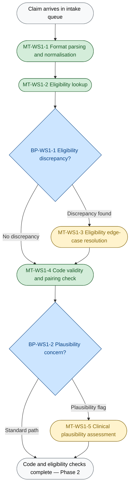
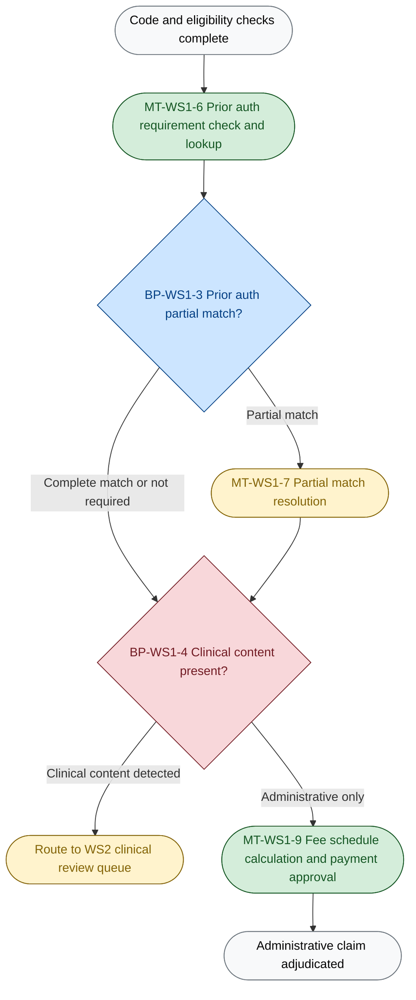
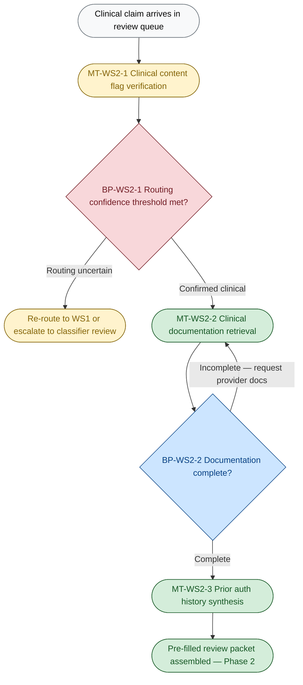
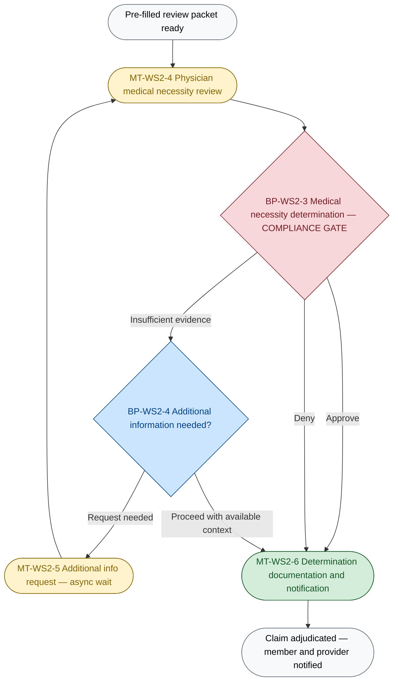
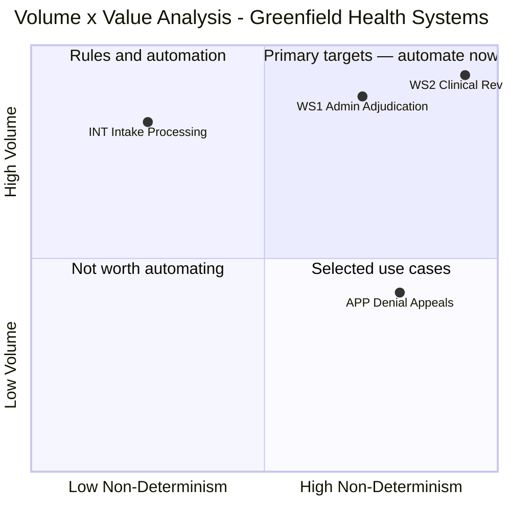
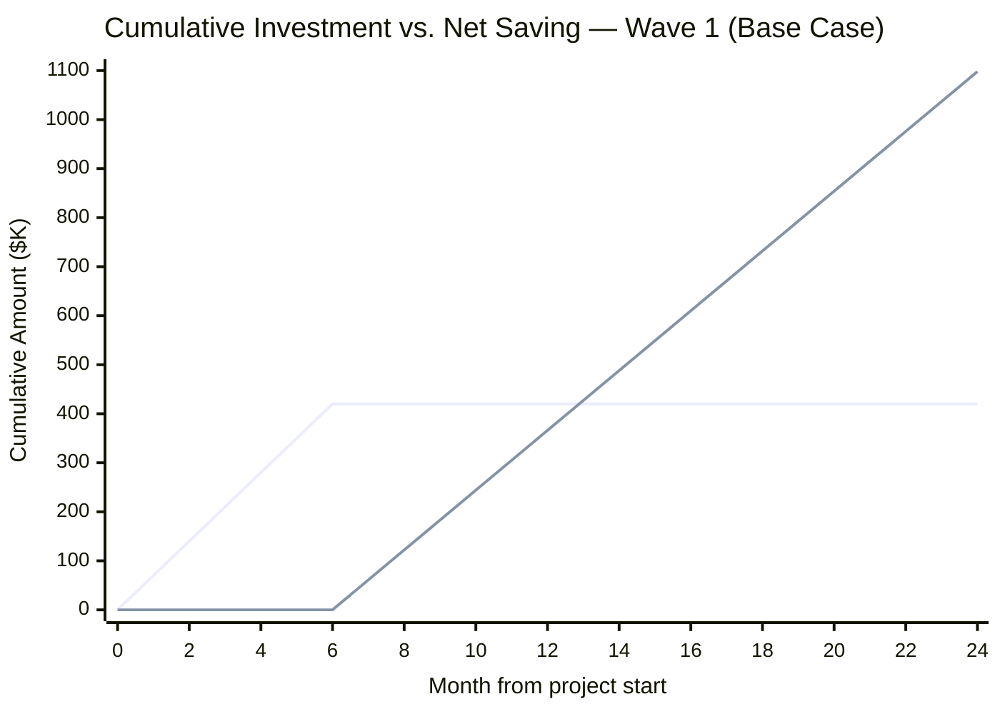

This proposal is submitted to Greenfield Health Systems on 2026-05-21. It covers the engagement scope of medical claims adjudication transformation and proposes an agentic pipeline that processes the administrative path without physician involvement and pre-fills the clinical review packet for the physician-reviewed path — reducing per-claim cost by 98.3%, recovering $732,000 per year against the current workforce baseline, and eliminating the active SLA penalty exposure documented by VP Operations James Liu.

---

## Table of Contents

- [1. Executive Summary](#1-executive-summary)
- [2. Problem Statement](#2-problem-statement)
  - [2.1 What we heard](#21-what-we-heard)
  - [2.2 What is broken](#22-what-is-broken)
  - [2.3 Why automation, not process change or hiring](#23-why-automation-not-process-change-or-hiring)
- [3. Stakeholder Map](#3-stakeholder-map)
- [4. Proposed Solution](#4-proposed-solution)
  - [4.2 Work streams and agents](#42-work-streams-and-agents)
  - [4.3 Delivery waves](#43-delivery-waves)
  - [4.4 Assumptions, constraints, and risks](#44-assumptions-constraints-and-risks)
- [5. Business Case](#5-business-case)
  - [5.1 Per-claim economics](#51-per-claim-economics)
  - [5.2 Annual economics — all waves](#52-annual-economics--all-waves)
  - [5.3 Sensitivity](#53-sensitivity)
  - [5.4 Break-even timeline](#54-break-even-timeline)
- [6. Success Metrics](#6-success-metrics)

---

## 1. Executive Summary

Greenfield Health Systems processes 2,000 claims per day at a 22% auto-adjudication rate — 63 points below the 85% industry benchmark — because every claim enters the same full-manual workflow regardless of complexity. The result is a $1.3M/year processing cost, active SLA penalty incurrence, and a 41% denial appeal overturn rate that signals systematic first-pass errors.

**Current state — the three numbers that define the problem:**

| Metric | Current | Benchmark / threshold |
|--------|---------|----------------------|
| Auto-adjudication rate | 22% | 85% industry benchmark |
| Average cycle time | 8–9 days | 7-day contractual SLA (penalties live) |
| Denial appeal overturn rate | 41% | Indicator of systematic first-pass routing errors |

**What the solution does:**
- Builds a clinical content classifier to separate the administrative path (est. 65% of claims) from the clinical path (est. 35%) — Dr. Webb's estimate, to be validated in mock calibration
- Deploys an administrative adjudication agent to handle the administrative path end-to-end — eligibility, coding, prior auth, and payment determination — without physician involvement
- Deploys a clinical pre-screening agent (Wave 2, conditional) to pre-fill the physician review packet, reducing physician review time from 35 min to ~3 min per claim
- Retains physician sign-off on every clinical determination — required by URAC/NCQA accreditation, preserved by design

**Business case at a glance:**
- Per-claim cost: $18.23 → $0.315 (98.3% reduction)
- Annual workforce cost: $1.3M → $568K (7 retained staff + agent infrastructure)
- Annual saving: $732,000 | Build cost: $420,000 | Payback: 6.9 months

---

## 2. Problem Statement

### 2.1 What we heard

Greenfield Health Systems processes ~50,000 medical claims per month (≈2,000/day). Claims arrive in three formats — EDI 837, PDF, and portal submissions — each requiring eligibility verification, coding validation, medical necessity review, and payment determination before a decision can be made.

Current state:
- **Auto-adjudication rate:** 22% (industry benchmark: 85%) — approximately 1,560 claims per day handled manually that do not need to be
- **Average cycle time:** 8–9 days against a 7-day contractual SLA — contractual penalties are active today, not a future risk
- **Denial appeal overturn rate:** 41% — systematic first-pass routing errors, not edge-case mistakes
- **Average processing time per claim:** 35 minutes, most of it spent on rule-governed lookups with deterministic correct answers

The core problem is structural. Eligibility checks, coding validation, prior auth completeness, and format verification are deterministic lookups — the answer either satisfies a rule or it does not. These tasks sit in the same undifferentiated workflow as genuine medical necessity decisions that require physician judgment. The result: deterministic work is being done at physician cost, and the absence of any formal triage mechanism means the clinical/administrative boundary is decided differently by every processor who handles a borderline claim.

Stakeholder alignment has converged on the resolution. CFO Sarah Chen requires cost reduction — a $400K budget commitment contingent on ≥8 FTE headcount reduction (Exchange 1). CMO Dr. Marcus Webb requires physician sign-off on every clinical determination as a non-negotiable URAC/NCQA requirement, and flags that "clinical content" has no formal definition — without it, no classifier can be built or certified (Exchange 2, Exchange 3). VP Operations James Liu requires cycle time below the 7-day SLA threshold and names the 41% overturn rate as evidence that incorrect routing is a systematic, not occasional, failure (Exchange 3). The resolution negotiated across those three positions is:

- **~65% of claims** have no clinical content — administrative path, agent adjudicates without physician involvement *(Dr. Webb's estimate, to be validated against historical data)*
- **~35% of claims** have genuine clinical content — physician review required by URAC/NCQA accreditation, but with an agent-assembled pre-filled packet reducing physician review time from 35 minutes to ~3 minutes per claim

The design question is already answered at the routing boundary. The build question is whether the clinical content classifier can reliably make that split.

---

### 2.2 What is broken

**B-1 — No mechanism to separate administrative from clinical work before processing starts**

Every claim enters the same 35-minute full-manual workflow regardless of complexity.

- **Symptom:** 22% auto-adjudication rate; ~1,560 claims/day in unnecessary full manual review; 8–9 day cycle time; live SLA penalties
- **Root cause:** No clinical content classifier exists — because "clinical content" has no agreed cross-functional definition. Sarah Chen asked Dr. Webb for one in Exchange 3. It has not been produced.
- **If fixed:** Est. 65% of claims processed by agent with no physician involvement; cycle time targets of ≤5 days (admin) and ≤7 days (clinical) become achievable

---

**B-2 — Routing and adjudication decisions made without formal criteria**

Processors route claims using personal pattern recognition; physicians assemble review context manually.

- **Symptom:** 41% denial appeal overturn rate — 4 in 10 first-pass denials were wrong; providers bear appeal overhead on correctly-submitted claims; Greenfield incurs full re-adjudication cost on every overturned decision
- **Root cause:** No documented clinical flagging criterion; no quality feedback loop surfacing routing errors back to processors; the overturn rate is lagging — thousands of incorrect decisions accumulate before it appears in reporting
- **If fixed:** Formal classifier eliminates routing errors at source; agent-generated pre-filled packet ensures physicians decide against complete, consistently structured evidence

---

### 2.3 Why automation, not process change or hiring

| Alternative | What it addresses | Why it doesn't close the gap |
|-------------|-------------------|------------------------------|
| **RPA / rules engine** | Binary rule lookups — eligibility checks, fee schedule calculation | Cannot classify clinical content. Routing requires pattern recognition across diagnosis codes, procedure codes, and provider specialty — the boundary is judgment-dependent and currently undefined. The 41% overturn rate is a classification accuracy failure, not a rules compliance failure. RPA does not fix it. |
| **Workflow / case management tool** | Queue visibility and task routing between processors | Doesn't reduce the 35 minutes of processing work inside each claim. Auto-adjudication rate stays at 22%. Cycle time stays above SLA. The bottleneck is per-claim work, not routing speed between processors. |
| **Hiring** | Raw throughput | Contradicts CFO mandate (Exchange 1: 40% headcount reduction is the condition for the $400K budget). Adds processors applying the same undocumented routing criteria at higher cost — produces more claims at the same 41% overturn rate. |

---

## 3. Stakeholder Map

| Stakeholder | Role | Primary concern | What success looks like for them |
|-------------|------|-----------------|----------------------------------|
| Sarah Chen | CFO | Cost per claim and headcount; $400K budget commitment contingent on ≥8 FTE reduction (Exchange 1) | Annual workforce cost reduced from $1.3M to $568K; payback inside 12 months; no budget overrun on Wave 1 build |
| Dr. Marcus Webb | CMO | URAC/NCQA accreditation; physician sign-off on all clinical determinations; clinical content definition produced before any routing automation goes live (Exchange 2, Exchange 3) | Physician sign-off preserved by design on every clinical claim; classifier certified before go-live; physician review time reduced to ≤3 min per claim with pre-filled packet |
| James Liu | VP Operations | Cycle time below 7-day SLA threshold; SLA penalty elimination; queue stability and predictable throughput (Exchange 3) | Zero claims exceeding 7-day threshold; administrative cycle time ≤5 days; clinical cycle time ≤7 days; denial overturn rate ≤15% |
| Claims processors and clinical reviewers | Operational team currently handling all claims manually | Role clarity and workload manageability after automation; concern about displacement and scope of the retained role | 7 retained staff with a clear exception-review function rather than full-manual adjudication; physician reviewers spending time on clinical judgment, not document assembly |

The key tension this solution resolves is the conflict between Sarah Chen's requirement for maximum cost reduction and Dr. Marcus Webb's requirement for physician sign-off on clinical determinations. These are not compatible goals if pursued simultaneously across all claim types — full automation would satisfy the CFO's cost target but violate URAC/NCQA accreditation; physician review of all claims would satisfy the CMO's compliance requirement but preserve the cost structure the CFO is mandated to reduce. The resolution, arrived at in Exchange 3, is the 65%/35% routing split: the administrative path — the estimated 65% of claims with no clinical content — is fully automated, satisfying the cost reduction mandate; the clinical path — the estimated 35% — retains physician review, satisfying the accreditation mandate, while the agent pre-fills the review packet to recover physician capacity within that constrained scope. This routing split is a stakeholder-negotiated design decision, not a proposition this proposal is introducing. The proposal implements and operationalises it.

---

## 4. Proposed Solution

**In scope — this engagement:**
- Claim intake normalisation: parsing EDI 837, PDF, and portal submissions into a canonical structured record; anomaly and duplicate detection
- Administrative adjudication agent: eligibility verification, coding validation, prior authorisation check, clinical content routing classification, and payment determination for the estimated 65% of claims on the administrative path
- Clinical pre-screening agent: routing verification and pre-filled physician review packet assembly for the estimated 35% of claims on the clinical path (Wave 2 — conditional on clinical notes API confirmation)
- Clinical content classifier: a shared component, built in Wave 1 and certified by Dr. Webb's team, that classifies each claim's routing path and is reused by the Wave 2 clinical review agent
- Denial appeals support agent (Wave 3): root cause classification and context assembly for denial appeals, conditional on Wave 1 steady-state quality data

---

### 4.2 Work streams and agents

**INT — Intake and Anomaly Detection**
- Receives inbound claim submissions in all formats Greenfield accepts — EDI 837 electronic files, PDFs, and portal submissions — and transforms them into a single canonical structured record before any downstream processing begins.
- Detects anomalies automatically: malformed submissions missing required fields, duplicate submissions matching a prior claim on member ID, service date, and procedure code.
- Returns rejected submissions to providers with a specific, actionable error code rather than a generic rejection, reducing the resubmission cycle that currently adds to queue volume.

---

**WS1 — Administrative Adjudication**
- Runs every normalised claim through the complete administrative adjudication pipeline: eligibility verification against the member's coverage record on the service date; coding validation for ICD-10/CPT code validity and clinical plausibility; prior authorisation check and partial-match resolution; and clinical content routing classification to determine whether the claim proceeds on the administrative path or routes to the physician review queue.
- For the approximately 65% of claims classified as administrative (stakeholder estimate, not a validated baseline), applies the fee schedule and produces a final payment determination without physician involvement — the agent either approves the claim with a payment amount, rejects it with specific failure codes, or escalates a flagged exception to HITL review.
- Escalates to a human reviewer when the clinical content classifier's confidence falls below the configured threshold, when eligibility shows a discrepancy requiring contextual judgment, when prior authorisation has a partial match without a clear rule resolution, or when a coding plausibility flag cannot be resolved deterministically.
- Escalated claims appear in an **exception review queue** — a lightweight reviewer interface that presents the agent's structured escalation reason, the specific signal that triggered the flag, and the full claim context. The reviewer sees a pre-populated entry and records their decision (approve, reject, or escalate to physician) without needing to re-gather claim documents. The queue is the handoff boundary between the agent and the retained exception-review staff.

*WS1 process flow — Phase 1 (eligibility, coding, plausibility):*

*WS1 process flow — Phase 2 (prior auth, clinical content routing, payment):*

---

**WS2 — Clinical Pre-Screening** *(Wave 2 — conditional on clinical notes API confirmation)*
- Receives claims routed from WS1 as requiring physician review and first verifies that the routing classification was correct — re-checking the clinical content flag against the certified classifier before proceeding, to prevent administrative claims accumulating in the physician queue.
- Retrieves and assembles all documentation a physician needs to make a medical necessity determination: diagnosis codes, procedure history, prior authorisation records, clinical notes summary, and member history — structured into a pre-filled review packet so physicians can begin their review immediately rather than spending time on document gathering.
- Manages the information-pending state for claims where clinical documentation is incomplete: drafts a provider outreach request, holds the claim in a monitored state, and re-queues it promptly when documentation arrives — rather than losing it in an untracked backlog.
- Delivers the assembled packet to a **physician review interface** — a structured layout presenting diagnosis codes, procedure history, prior authorisation records, clinical notes summary, and member history in a consistent format. The physician reviews the pre-filled packet, records their medical necessity determination, and signs off directly in the interface. The sign-off generates the URAC/NCQA-compliant audit record confirming licensed reviewer approval before any clinical payment determination is processed.

*WS2 process flow — Phase 1 (routing verification, documentation assembly):*

*WS2 process flow — Phase 2 (physician review and determination):*

---

**APP — Denial Appeals Support** *(Wave 3 — conditional on Wave 1 steady-state quality data)*
- Receives inbound denial appeal submissions and classifies each appeal by root cause — coding error, eligibility dispute, medical necessity determination, or prior authorisation gap — so the reviewing team knows immediately what category of error they are examining.
- Assembles the prior context needed for the appeal review: the original claim record, the denial reason codes, the relevant prior authorisation history, and — for clinical appeal sub-types — a structured evidence summary for physician review.
- For clinical appeal sub-types, flags mandatory physician review before any determination is issued, applying the same URAC/NCQA requirement that governs primary clinical determinations; the agent proposes a root cause classification and assembles context, but the determination in every case is human.

---

**Volume and value positioning of the four adjudication work streams:**

WS1 is the Wave 1 primary automation target because it combines high daily volume with the highest ratio of judgment-requiring decisions that are currently driving manual throughput failures — the administrative adjudication pipeline is where the clinical content routing decision and the coding plausibility assessment occur, and these are the steps that produce both the SLA backlog and the first-pass errors behind the 41% overturn rate. WS2 scores the highest on the judgment axis but cannot be the primary automation target: URAC/NCQA accreditation limits the agent's scope on the clinical path to context assembly only, which means the WS2 agent eliminates physician preparation time but cannot reduce physician review headcount — the physician review step remains human regardless of the agent's accuracy level.

---

### 4.3 Delivery waves

| Wave | Scope | Timeline | Agent components activated | Annual saving (incremental) | What this wave funds |
|------|-------|----------|----------------------------|-----------------------------|----------------------|
| **Wave 1** | Intake normalisation + administrative adjudication; clinical content classifier built and CMO-certified | Months 1–6 build; months 7+ running | Intake & Anomaly Agent, WS1 Administrative Adjudication Agent | $732,000/year (net of $113K agent running cost and $455K retained staff) | Sarah Chen's committed $400K budget; Wave 2 build funded by Wave 1 running savings |
| **Wave 2** | Clinical pre-screening — routing verification and pre-filled physician review packet | Months 7–12 build (conditional on clinical notes API confirmation); months 13+ running | Clinical Review Support Agent | $104,000/year incremental (net of $91K WS2 agent running cost) | Wave 1 accumulated savings ($366K by month 12) plus $112K build cost reduction from Wave 1 platform reuse |
| **Wave 3** | Denial appeals root cause classification and context assembly | Months 13+ planning; months 19+ build (conditional on 90-day WS1 steady state) | Appeals Support Agent | Dependent on residual appeal volume after WS1 quality improvement — not calculable before Wave 1 production data | Wave 1 + Wave 2 accumulated savings |

The compounding logic is material. The clinical content classifier — built in Wave 1 at a cost of $64,000 and certified by Dr. Marcus Webb's team — is the single platform asset that most reduces Wave 2's marginal build cost. Without reuse, Wave 2 would require not only an estimated $60,000 in classifier rebuild cost but, more significantly, a full CMO certification process before any Wave 2 clinical-path routing could begin. That certification is the highest-effort governance activity in the engagement: it requires establishing and validating the clinical content definition that Sarah Chen explicitly requested in Exchange 3. That process happens once in Wave 1. Wave 2 inherits a certified classifier that it extends rather than re-certifies, saving 4–6 weeks of CMO team engagement that does not appear as a line item in the cost model but is the primary reason Wave 2 can be delivered in 6 months rather than 9 or more. The prior authorisation and eligibility API integrations, each saving an estimated $16,000 in Wave 2 build cost, add a further compounding benefit: they are validated data pipelines whose schema issues are discovered and resolved in Wave 1, so Wave 2 production routing begins against integrations that have already been tested under live claim volume.

---

### 4.4 Assumptions, constraints, and risks

**Key assumptions:**

| Assumption | Source | Why it matters | If wrong |
|------------|--------|----------------|----------|
| 65%/35% administrative/clinical routing split is a stakeholder estimate, not a validated baseline | Dr. Marcus Webb, Exchange 3 ("honestly? maybe 30–35%") | Drives the economic model: if the clinical share is materially higher, the HITL physician queue is larger than modelled, cycle time targets for WS2 become harder to meet, and the headcount reduction from 20 to 7 reviewers may require more physician capacity than the current team can absorb | A higher clinical rate (e.g. 50%) requires either additional physician capacity or a more conservative classifier threshold; the FTE reduction target and Wave 2 physician throughput targets change materially — must be validated against historical claims data in the design phase |
| Clinical content definition does not yet exist and must be produced as a design output before classifier build | scenario_context.md; Sarah Chen, Exchange 3 | The classifier cannot be built or certified without a formally agreed definition; building without it produces a classifier that fails CMO certification and must be rebuilt | If the definition takes longer than expected to agree (stakeholder alignment risk between CMO and Operations), Wave 1 timeline extends; the clinical content definition is the critical-path item for Wave 1 |
| Eligibility, prior authorisation, fee schedule, and clinical notes source systems are accessible as programmatic APIs | All system names are absent from the current engagement documentation — this is an unconfirmed assumption | Wave 1 is dependent on at least three of these integrations; Wave 2 is wholly dependent on the clinical notes API. If any Wave 1 integration requires batch file transfer rather than API access, build scope and timeline increase; if the clinical notes system has no API, Wave 2 cannot be built as specified | Clinical notes integration infeasibility is a Wave 2 hard blocker — Wave 2 build cannot begin without confirmed API access; Wave 1 remains viable without the clinical notes integration |
| 25% HITL rate at 2-minute average exception review time — the economic model's primary calibration commitment | Derived from WS1 breakpoint exception frequency estimates; calibrated against Dr. Webb's 20 claims/hour clinical review benchmark | HITL cost is 82.5% of total agent cost per claim ($0.260 of $0.315); the HITL rate is the dominant variable in the cost model; the 2-minute estimate is the production readiness gate, not a post-launch aspiration | At 35% HITL, annual saving falls from $732K to approximately $697K — a $35K reduction that does not affect the investment verdict; the compliance concern at a high HITL rate is that the classifier is not ready for production, not that the economics fail |
| $65,000 fully loaded annual cost per reviewer — the FTE baseline the business case rests on | Assumption: US healthcare claims processor at mid-market compensation, 38% benefits/overhead multiplier; not stated in the scenario | The current $1.3M workforce cost and the $455K retained staff cost both derive from this figure; a 20% change in FTE rate shifts the annual saving by approximately $260K in either direction | At $50K/year FTE rate the business case is weak (payback ~26 months); at $80K/year it strengthens (payback ~8.7 months); must be confirmed during the design phase |

**Out of scope:**
- Medical necessity determination: a licensed physician or advanced practice provider must make every clinical determination — this boundary is set by URAC/NCQA accreditation, not by this design
- Clinical appeals determinations requiring physician review: same regulatory requirement as primary clinical determinations; agent provides context and root cause classification only
- Provider-facing systems and portals: no changes to provider claim submission interfaces
- Member communication systems: denial notice and explanation-of-benefits delivery remain in existing systems
- Wave 3 (appeals support) detailed build: not scoped until Wave 1 produces 90 days of steady-state appeal pattern data

**Constraints:**

1. **Budget:** Sarah Chen's committed Wave 1 budget is $400,000 (Exchange 1). The Wave 1 build estimate is $420,000 — 5% over the committed amount. Scope management recommendation: defer provider rejection notice templating and advanced analytics dashboard to Wave 2, targeting a $400,000 Wave 1 scope. Scope discipline within $400,000 holds payback at 6.6 months; at the unmanaged $420,000 estimate, payback is 6.9 months — both inside the 12-month threshold.

2. **Compliance:** URAC/NCQA accreditation requires physician or advanced practice provider sign-off on every clinical determination regardless of the agent's confidence level or accuracy metric. This constraint is categorical — it is not a risk to be managed through higher classifier accuracy, and it is not provisional on engagement milestones. The clinical pre-screening agent provides context; the physician makes the determination.

3. **Clinical content definition:** The definition of what constitutes "clinical content" does not currently exist in a formal, documented form. This definition must be produced as a design output — with CMO sign-off — before the clinical content classifier can be built or certified. The definition is the critical-path item for Wave 1.

4. **System integration availability:** The eligibility, prior authorisation, fee schedule, and clinical notes source systems are not named in the current engagement documentation. All four integrations are assumed to be accessible as APIs. This assumption is unconfirmed and must be validated during the discovery and design phase. The clinical notes API is a Wave 2 hard blocker.

**Risks:**

| Risk | Likelihood | Mitigation already designed |
|------|:----------:|------------------------------|
| Clinical content classifier confidence threshold set too conservatively — increases physician queue size and reduces cost saving | Medium | Threshold is a configurable parameter, not hardcoded; calibrated in mock testing before go-live with Dr. Webb's team; recall ≥99.5% is the hard gate, not a specific threshold value |
| Wave 1 build cost overrun — at 2× build cost, payback extends from 6.9 months to approximately 14 months | Medium | Itemised build estimate with explicit scope; Wave 1 scope reduction (defer analytics dashboard, provider notice templating) keeps estimate at $400K; payback remains inside 12-month threshold at any build cost below $840K |
| Clinical notes source system does not have a programmatic API — Wave 2 becomes a manual integration project or cannot proceed | High (unconfirmed) | Wave 2 scoped as a conditional wave; Wave 1 generates full business case return on its own; clinical notes integration feasibility validated before any Wave 2 commitment is made |
| HITL rate in production exceeds the 25% calibration target — primary quality signal that classifier is not ready | Medium | ≤25% HITL rate is a production release gate, not a post-launch optimisation target; if mock calibration testing cannot reach this threshold, the build is extended, not released; the financial impact of a 35% HITL rate is a $35K/year reduction in annual saving — not material; the compliance implication of a high HITL rate is the load-bearing concern |

---

## 5. Business Case

### 5.1 Per-claim economics

| Metric | Current state | With agent | Change |
|--------|:---:|:---:|:---:|
| Cost per administrative claim | $18.23 | $0.315 | −98.3% |
| Claims per day — administrative path | ~274 processable (20 staff × 8 hr × 60 min ÷ 35 min) | 1,300 | 5.7× throughput increase |
| FTE equivalent for WS1 review | 20 staff (all tasks) | 7 retained + 1.4 HITL equivalent | 12 staff displaced from WS1 manual processing |
| Cycle time — administrative path | 8–9 days | ≤5 days (target) | −3–4 days |
| Cycle time — clinical path | 8–9 days | ≤7 days (target) | −1–2 days |

---

### 5.2 Annual economics — all waves

**Wave 1 (INT + WS1 Administrative Adjudication):**
- Agent running cost: $113,000/year (token inference, tool call APIs, infrastructure, HITL labour at 25% rate × 2 minutes average)
- Retained staff: 7 FTEs × $65,000 = $455,000/year
- Total post-automation operating cost: $568,000/year
- Current workforce: $1,300,000/year (20 FTEs × $65,000)
- Annual cash saving: $732,000/year
- Wave 1 build cost: $420,000
- Payback period: 6.9 months from go-live

**Wave 2 (WS2 Clinical Pre-Screening — incremental):**
- Hard prerequisite: clinical notes source system API must be confirmed before Wave 2 build begins; if this integration is not technically feasible, Wave 2 cannot be delivered as specified
- Incremental build cost: $108,000 (with $112,000 Wave 1 platform reuse — eligibility and prior auth integrations, document extraction pipeline, and certified clinical content classifier)
- Annual saving (incremental): $104,000/year net of $91,000 WS2 agent running cost
- Payback: 12.5 months from Wave 2 go-live

**Wave 3 (APP Denial Appeals Support — conditional):**
- Condition: Wave 1 must be in production for 90 days before Wave 3 is scoped; residual appeal volume and root cause distribution after Wave 1 quality improvement are required inputs
- Estimated build cost: $150,000 (with Wave 1 and Wave 2 document extraction and claim record reuse)
- Annual saving: dependent on residual appeal volume — not calculable before Wave 1 production data is available

**3-year portfolio summary (Waves 1 and 2):**

| | |
|---|---|
| Total investment (Waves 1+2) | $528,000 |
| Total 3-year saving (Waves 1+2, phased from go-live) | $1,986,000 |
| Net 3-year value | $1,458,000 |
| Portfolio ROI | 276% |

---

### 5.3 Sensitivity

| Scenario | Annual saving | Payback from go-live |
|----------|:---:|:---:|
| All adverse (35% HITL, 2× build cost at $840K, $55K FTE rate) | ~$586,000 | ~17 months |
| Conservative — elevated HITL only (35% HITL, base build and FTE) | ~$697,000 | ~7.2 months |
| **Base case (25% HITL, $420K build, $65K FTE rate)** | **$732,000** | **6.9 months** |
| All optimistic (15% HITL, 0.67× build at $281K, $75K FTE rate) | ~$892,000 | ~3.8 months |

The business case holds under all tested adverse scenarios; the primary financial risk is build cost overrun, not HITL rate fluctuation.

---

### 5.4 Break-even timeline

> **Reading this chart:** The blue line (investment) rises during the 6-month build phase and flattens at $420K at go-live. The green line (net saving) begins at go-live and rises at $61K/month. The lines cross at approximately month 13 — the break-even point. Every month beyond month 13, the programme is in net positive territory. At month 24, cumulative net saving is $1,098K against a total investment of $420K.

---

## 6. Success Metrics

| Metric | Baseline | Target | Measured by | Stakeholder |
|--------|:---:|:---:|-------------|-------------|
| Auto-adjudication rate — administrative path | 22% of all claims | ≥80% of administrative-path claims resolved without human intervention | Monthly claims system report: claims resolved without HITL event ÷ total claims received | Sarah Chen |
| Cycle time — administrative path | 8–9 days (blended average) | ≤5 days (30-day rolling median) | Queue management system: submission date to adjudication decision date for WS1 claims | James Liu |
| Cycle time — clinical path | 8–9 days (blended average) | ≤7 days (30-day rolling median) | Queue management system: submission date to physician sign-off date for WS2 claims | James Liu |
| Physician review time per clinical claim | 35 min/claim (overall average, blended; WS2-specific baseline not available) | ≤3 min with agent pre-filled review packet (derived from Dr. Webb's 20 claims/hour estimate with pre-screening, Exchange 3) | Agent audit log: WS2 physician queue open-time to signed determination, 30-day rolling average | Dr. Marcus Webb |
| Denial appeal overturn rate | 41% of filed appeals overturned | ≤15% of filed appeals overturned (90-day rolling) | Appeals management system: overturned appeal decisions ÷ total appeals filed | All three stakeholders |
| Clinical content classifier recall (true positive rate for clinical claims) | Unmeasured — no current classifier exists | ≥99.5% in mock calibration testing before go-live | Mock calibration against labelled historical claims before any production routing; CMO sign-off required | Dr. Marcus Webb |
| SLA penalty incurrence | Active — claims routinely exceeding 7-day threshold (Exchange 3) | Zero claims exceeding 7-day threshold | Legal/operations reporting: claims with adjudication decision date > submission date + 7 calendar days, 30-day rolling | James Liu / Sarah Chen |

The clinical classifier recall target — ≥99.5% before go-live — is not a performance aspiration; it is a hard release gate. At 99.5% recall, fewer than 1 in 200 clinical claims reaches the payment path without physician review. Below that threshold, a clinical claim can receive an auto-approved payment determination without any physician involvement, which constitutes a URAC/NCQA accreditation event. The consequence is not a metric miss — it is suspension of the agent pending investigation, regardless of the claim volume involved or the economic impact of the suspension. Mock calibration testing against labelled historical claims, with CMO sign-off on the results, must be completed and passed before the first live claim enters production routing. This gate applies to both Wave 1 (WS1 routing classification) and Wave 2 (WS2 routing verification), and it applies to any future update to the clinical content definition that requires the classifier to be retrained.
