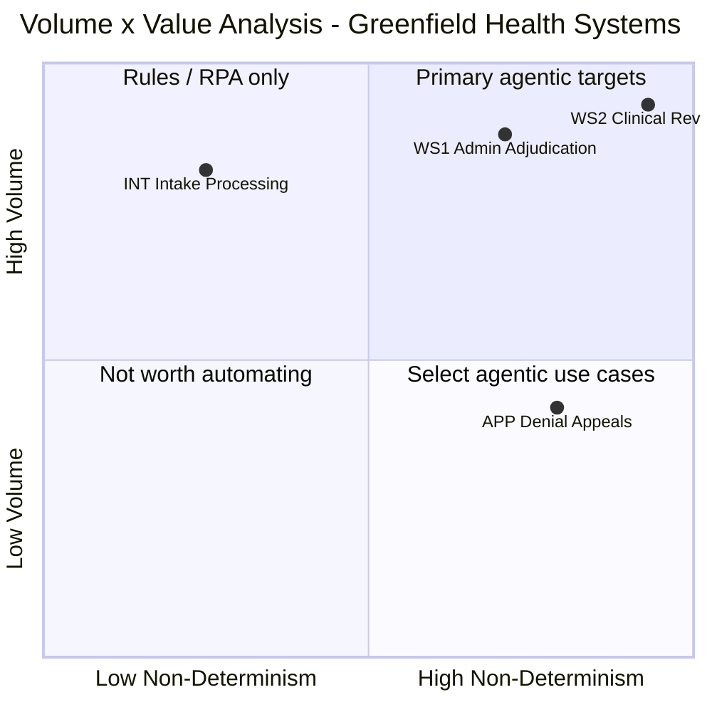

# D2C: Volume × Value Analysis
**Engagement:** Greenfield Health Systems — Medical Claims Adjudication Transformation
**Phase:** ATX Assessment Phase 4 — Candidate Prioritisation
**Prepared:** 2026-05-20
**Source of truth:** `Scenario/scenario_context.md`; informed by `Deliverables/D2A_cognitive_load_map.md`, `Deliverables/D2B_delegation_suitability_matrix.md`

---

## 0. Executive Summary

- **Primary agentic target:** WS1 — Administrative Adjudication, Agentic Value Score 20/25; the business case is a 63-point gap between Greenfield's 22% auto-adjudication rate and the 85% industry benchmark (scenario.md) representing ~1,300 claims/day currently processed manually at 35 minutes each — the administrative path is high-volume, proven automatable at industry scale, and directly eliminates the active SLA penalties James Liu is currently absorbing (Exchange 3).
- **Work stream that looks automatable but isn't:** WS2 — Clinical Review has the highest Agentic Value Score (25/25) but URAC/NCQA accreditation requires physician or advanced practice provider sign-off on every clinical determination regardless of agent confidence (Dr. Marcus Webb, Exchange 2), limiting the agent's scope to context assembly only and making it a supporting function rather than a primary agentic target.
- **Whether economics close:** Directional payback period of approximately 9 months using the CFO's 8-FTE reduction target ($520K/year saving, $400K build cost — scenario.md), which is inside the 12-month target; the single biggest assumption it rests on is that all 8 displaced FTE costs are removed from the payroll within 6 months of go-live, rather than redeployed to other roles.

---

## 0b. Table of Contents

- [0. Executive summary](#0-executive-summary)
- [0b. Table of contents](#0b-table-of-contents)
- [1. Suitability pre-screening (ATX Step 1)](#1-suitability-pre-screening-atx-step-1)
- [2. Volume derivation](#2-volume-derivation)
- [3. Non-determinism scoring](#3-non-determinism-scoring)
- [4. Volume × Value grid (Mermaid quadrantChart)](#4-volume--value-grid-mermaid-quadrantchart)
- [5. Where an agent creates value — and where it creates risk](#5-where-an-agent-creates-value--and-where-it-creates-risk)
- [6. Suitability gate check](#6-suitability-gate-check)
- [7. Primary agentic target — selection and justification](#7-primary-agentic-target--selection-and-justification)
- [8. Preliminary TCO sense-check](#8-preliminary-tco-sense-check)
- [9. Feasibility scoring](#9-feasibility-scoring)
- [10. Implementation sequencing and wave assignment](#10-implementation-sequencing-and-wave-assignment)

---

## 1. Suitability Pre-Screening (ATX Step 1)

*The four work streams analysed are: WS1 (Administrative Adjudication), WS2 (Clinical Review), INT (Intake Processing), and APP (Denial Appeals Management). These are the four work streams identified in D0C, D2A, and D2B as carrying independent delegation signal. Queue Management (QMG) is a valid agentic candidate but operates as infrastructure across all work streams rather than as an independent process with its own volume/value profile; it is excluded from the four-stream grid and treated as a shared platform component in §10.*

| Work stream | Solvable by rules/RPA only? | Tacit judgment with no structure? | Critical integrations unavailable? | Compliance risk with no viable HITL? | Pre-screen result |
|---|---|---|---|---|---|
| WS1 — Administrative adjudication | **Partially** — standard paths for eligibility, prior auth lookup, and fee schedule application are rules-solvable; clinical content routing (WS1-JtD-2) and coding plausibility (MT-WS1-5) require classification beyond deterministic rules | **No** — judgment tasks are pattern-based and partially codifiable once the clinical content criterion is defined; exception rates are manageable | **Conditional** — all systems unnamed; eligibility, code lookup, prior auth, and fee schedule APIs assumed available but unconfirmed (A-D0C-4) | **No** — no physician sign-off required on administrative path; HITL escalation at each breakpoint provides viable compliance design | **Conditional pass** — proceeds to analysis; integration feasibility must be confirmed in discovery (Unknown U-2 from D0C) |
| WS2 — Clinical review | **No** — context assembly (WS2-JtD-2) requires multi-source synthesis; clinical content verification (WS2-JtD-1) requires probabilistic classification | **Partially** — WS2-JtD-3 (medical necessity determination) is tacit clinical judgment with URAC/NCQA compliance lock; the agent scope excludes WS2-JtD-3 by design | **Conditional** — clinical notes source system unknown (A-D0C-7); this is the pre-requisite blocker for WS2-JtD-2 (Unknown U-5 from D0C) | **Conditional** — WS2-JtD-3 is Human Only (D2B); HITL boundary is viable because agent never produces a determination; physician sign-off is preserved structurally | **Conditional — not yet delegatable in full** — agent scope limited to WS2-JtD-1 and WS2-JtD-2; clinical notes integration must be confirmed before WS2 capability spec is finalised; proceeds to analysis with scope boundary noted |
| INT — Intake processing | **Yes (standard path)** — EDI 837 parsing and basic format validation are deterministic; PDF extraction exception handling and provider rejection drafting benefit from LLM capability beyond rules | **No** — even exception handling (malformed PDFs) follows diagnosable patterns | **No** — EDI 837 parsing is commodity; PDF extraction tools are established; portal intake systems are named in scenario.md | **No** — no clinical compliance dimension; intake errors are detectable and recoverable early | **Conditional pass** — standard path is RPA-eligible; agent adds value for exception handling; proceeds to analysis; note: standard path should be implemented as rules within the agent, not LLM reasoning |
| APP — Denial appeals management | **No** — root cause classification (APP-JtD-1) and appeal determination (APP-JtD-2) require synthesis of original decision + appeal evidence + applicable criteria | **Partially** — clinical appeal determinations share the WS2-JtD-3 tacit judgment constraint; administrative appeals are more structured | **Conditional** — appeal documentation may arrive as semi-structured PDFs; source systems unnamed | **Conditional** — clinical appeal determinations require physician review per same URAC/NCQA constraint; administrative appeals have viable HITL design | **Conditional pass** — administrative appeal path proceeds; clinical appeal determination isolated to Human Only by governance; volume unknown is the primary risk |

**Pre-screen summary:** All four work streams proceed to the volume × value analysis. WS2 carries a hard pre-requisite condition (clinical notes integration feasibility) that blocks full build until resolved. WS1 carries a softer pre-requisite (API confirmation). INT and APP pass with standard caveats.

---

## 2. Volume Derivation

**Total process volume anchor:**
- scenario.md states 2,000 claims/day; scenario_enriched.md states 50,000 claims/month
- Cross-check: 50,000/month ÷ 22 working days/month = 2,273/day; within ~14% of the 2,000/day figure
- Operative volume: **2,000 claims/day** per Assumption A-1 in scenario_context.md; 5-day working week assumed (Assumption A-D2C-1)
- Weekly volume: 2,000 × 5 = **10,000 claims/week**

**WS1 — Administrative adjudication:**
- 65% of claims routed to administrative path (scenario_context.md Section 4, negotiated split from Exchange 3)
- Daily (full pipeline, steps 1–8 — eligibility, coding, prior auth, routing classification): **2,000 claims/day** — all incoming claims pass through validation and routing before the split
- Daily (administrative path only, steps 9–10 — payment determination): 2,000 × 0.65 = **1,300 claims/day**
- Weekly (administrative path): 1,300 × 5 = **6,500 claims/week**
- *Note: the 65% split is a stakeholder-negotiated estimate, not a measured baseline (Assumption A-2, scenario_context.md). All WS1 volumes are derived figures. The routing decision at step 8 is what produces the 65%/35% split; steps 1–8 therefore operate on all 2,000 claims/day.*

**WS2 — Clinical review:**
- 35% of claims routed to clinical path (scenario_context.md Section 4)
- Daily: 2,000 × 0.35 = **700 claims/day**
- Weekly: 700 × 5 = **3,500 claims/week**
- *Same derivation caveat as WS1.*

**INT — Intake processing:**
- All inbound claims pass through intake normalisation before WS1 processing begins
- Daily: **2,000 claims/day** (100% of volume)
- Weekly: **10,000 claims/week**
- *Stated directly in scenario.md: three intake formats (EDI 837, PDF, portal); all claims subject to format parsing.*

**APP — Denial appeals management:**
- Neither denial volume nor appeal filing rate is stated in the scenario; the only evidence is the 41% appeal overturn rate (scenario.md)
- Derivation: Industry denial rate for commercial health plans: ~15–20% (Assumption A-D2C-2; labelled as external reference not in scenario). At 2,000 claims/day: 2,000 × 0.18 = ~360 denials/day. Industry appeal filing rate: ~10–15% of denials (Assumption A-D2C-2). At 12%: 360 × 0.12 = **~43 appeals/day; ~215 appeals/week**
- *Entire APP volume estimate is assumption-based — this is Unknown U-6 from D0C. The appeal volume estimate has low confidence and must be confirmed in discovery before appeals economics can be calculated.*

---

## 3. Non-Determinism Scoring

*Non-determinism scores are derived from D2A micro-task dimension patterns using the translation rule in the prompt. D2A is the authoritative evidence base — no independent re-scoring from the scenario is performed here.*

| Work Stream | Volume Score (1–5) | Non-Determinism Score (1–5) | Agentic Value Score | Quadrant |
|---|---|---|---|---|
| WS1 — Administrative adjudication | **5** (2,000/day through validation and routing; 1,300/day on the administrative path — hundreds+ per day either way) | **4** (significant reasoning; see justification) | **20** | Top-right — Primary agentic target |
| WS2 — Clinical review | **5** (700/day — hundreds+ per day) | **5** (high reasoning; see justification) | **25** | Top-right — Primary agentic target (compliance-constrained) |
| INT — Intake processing | **5** (2,000/day — hundreds+ per day) | **2** (mostly deterministic; see justification) | **10** | Top-left — Rules / RPA only |
| APP — Denial appeals | **3** (~43/day — 10–50 per day; estimate, see Assumption A-D2C-2) | **4** (significant reasoning; see justification) | **12** | Bottom-right — Select agentic use cases |

**Non-determinism score justifications:**

**WS1 — Administrative adjudication (Score 4):**
D2A micro-task inventory (§2d) has 10 tasks. Decision Determinism pattern: H on 4 tasks (MT-WS1-1, MT-WS1-2, MT-WS1-6, MT-WS1-9 — format parsing, eligibility standard lookup, prior auth lookup, fee schedule), L on 5 tasks (MT-WS1-3 eligibility discrepancy, MT-WS1-5 clinical plausibility, MT-WS1-7 prior auth partial match, MT-WS1-8 clinical content routing, MT-WS1-10 contract exceptions), M on 1 task. Cognitive Load: H on 5 tasks. Exception Frequency: H on 2 tasks (MT-WS1-5, MT-WS1-8), M on 3. The pattern has Decision Determinism = L on 5 of 10 tasks and Cognitive Load = H on 5 of 10 tasks. The most consequential tasks — clinical plausibility assessment and clinical content routing — are both L determinism and H cognitive load. However, the standard path for 5 tasks is fully deterministic. This mixed profile translates to Score 4: "follows patterns but requires contextual adaptation and exception handling." Score 3 was considered (core path rule-based) but rejected because the clinical content routing decision (MT-WS1-8: DD=L, EF=H, CL=H) is not an edge case — it determines the routing of 35% of all claims and is the structural root cause of the 41% overturn rate.

**WS2 — Clinical review (Score 5):**
D2A micro-task inventory (§3d) has 6 tasks. Decision Determinism: L on 2 tasks (MT-WS2-1 content flag verification, MT-WS2-4 medical necessity determination), H on 2 tasks (MT-WS2-3 prior auth synthesis, MT-WS2-6 documentation), M on 2 tasks. Exception Frequency: H on 4 of 6 tasks (MT-WS2-1, MT-WS2-2, MT-WS2-4, MT-WS2-5). The defining task — MT-WS2-4 medical necessity determination — has CL=H, DD=L, EF=H, IS=M: the highest non-determinism profile in the engagement. Clinical notes are unstructured (IS=L at MT-WS2-2). Synthesis across multiple data sources is required (WS2-JtD-2). Exception Frequency = H on 4 of 6 tasks indicates that the standard path is not dominant. This pattern translates to Score 5: "requires synthesis of multiple data sources, policy interpretation, contextual judgment." The physician's judgment at MT-WS2-4 is the archetypal Score 5 task. Score 5 is assigned to the work stream as a whole; the agent's delegatable scope (WS2-JtD-2 context assembly) is Score 3–4, but the work stream's total non-determinism drives its grid placement.

**INT — Intake processing (Score 2):**
D2A §5 dimension sketch: Cognitive Load=L, Decision Determinism=H, Exception Frequency=M, Input Structure=M. The dominant pattern is DD=H (deterministic parse-or-fail logic) with CL=L. Exception Frequency=M reflects malformed PDFs but the exception handling itself is rule-based (parse or return error). No synthesis across data sources is required; no policy interpretation; no contextual judgment. This translates to Score 2: "mostly deterministic, small reasoning component around structured rules." Score 1 was considered but the malformed PDF exception handling requires slightly more than pure rules — hence 2 not 1. The 2-point differentiation from WS1 (score 4) and WS2 (score 5) is achieved.

**APP — Denial appeals (Score 4):**
D2A §5 dimension sketch: Cognitive Load=H, Input Structure=M, Decision Determinism=M, Exception Frequency=H. The appeals process requires understanding an original denial decision and new appeal evidence simultaneously — a synthesis task (H CL). Exception Frequency=H is driven by the 41% overturn rate (scenario.md), which implies a high proportion of appeals require non-standard reasoning. Decision Determinism=M (administrative appeals have clearer rules than clinical appeals). This translates to Score 4: "significant reasoning; follows patterns but requires contextual adaptation and exception handling." Score 5 was considered but Decision Determinism is M (not L), distinguishing APP from the full clinical judgment of WS2 (which scores 5). Score 4 matches WS1, which is correct: both have mixed determinism and high exception frequency, but WS2 (physician judgment) is distinctly harder.

---

## 4. Volume × Value Grid (Mermaid quadrantChart)

**Formula coordinates:**
| Work Stream | Non-Det Score | Volume Score | x = (ND-1)/4 | y = (V-1)/4 | Rendering note |
|---|---|---|---|---|---|
| WS1 — Admin adjudication | 4 | 5 | 0.75 | 1.00 | y adjusted (axis); x offset for APP collision |
| WS2 — Clinical review | 5 | 5 | 1.00 | 1.00 | x and y both adjusted (axis) |
| INT — Intake | 2 | 5 | 0.25 | 1.00 | y adjusted (axis) |
| APP — Appeals | 4 | 3 | 0.75 | 0.50 | y adjusted (axis boundary at 0.50); x offset for WS1 collision |

*y=1.00 (WS1, WS2, INT) adjusted downward to avoid axis error; points spread vertically for readability. y=0.50 (APP) adjusted to 0.42 to avoid the horizontal quadrant divider. x=0.75 collision between WS1 and APP resolved by offset.*



*WS1 and APP have the same formula x-coordinate (0.75); WS1 adjusted to 0.71 and APP to 0.79. WS1, WS2, and INT share formula y=1.00; adjusted to 0.88, 0.93, and 0.82 respectively for readability.*

**Grid reading:** WS1 and WS2 both land in the top-right quadrant (primary agentic targets) but WS2 is effectively excluded from full agentic treatment by the URAC/NCQA constraint — it sits at the edge of the quadrant, visible as the highest-potential work stream, but WS2-JtD-3 is the structural ceiling on delegation scope. INT lands in the top-left (Rules/RPA only) — high volume, low non-determinism — confirming it should be automated with deterministic tooling, not a reasoning agent. APP lands in the bottom-right (select agentic use cases) — moderate volume by estimation, significant non-determinism — a candidate for a targeted human-led + agent support application once WS1 upstream quality improvements reduce the appeal backlog.

---

## 5. Where an Agent Creates Value — and Where It Creates Risk

> **Work Stream 1: WS1 — Administrative Adjudication**
> **Value created by agent:** An agent closes the 63-point gap between Greenfield's 22% auto-adjudication rate and the 85% industry benchmark (scenario.md) for the 1,300 administrative claims/day — replacing the 35 min/claim manual cycle with sub-minute processing on the standard path, eliminating the SLA penalty exposure on administrative claims (cycle time target: 4–5 days vs. current 9+, Exchange 3), and applying the clinical content classifier consistently across all claims rather than through processor pattern recognition, which is the root cause of the 41% denial overturn rate (scenario.md).
> **Risk created by agent:** The clinical content routing classifier (BP-WS1-4, WS1-JtD-2) is the highest-risk component: a false negative (clinical claim mis-routed to the administrative payment path) bypasses the physician sign-off requirement and constitutes a URAC/NCQA compliance violation — this is the scenario's primary governance constraint (Dr. Marcus Webb, Exchange 2). Coding plausibility errors (MT-WS1-5) at scale could shift the pattern of the 41% overturn rate rather than eliminating it if the classifier produces systematic plausibility errors. All tool integrations are unnamed, creating silent failure risk if API availability or data schema quality is lower than assumed.
> **Net assessment:** Value > risk, conditional on: (1) clinical content classifier certified by Dr. Webb's team before go-live, (2) API integration confirmed for all four named system types (eligibility, prior auth, code lookup, fee schedule), and (3) HITL escalation queue properly sized and staffed for the 25–30% exception rate estimated from D2A breakpoints.

---

> **Work Stream 2: WS2 — Clinical Review**
> **Value created by agent:** The pre-filled review packet (WS2-JtD-2) is the highest-leverage intervention for physician throughput: Dr. Marcus Webb's own estimate of 20 claims/hour with agent pre-screening (Exchange 3) implies the current throughput without pre-screening is materially lower, and the difference at 700 clinical claims/day is the amount of physician capacity currently consumed by context assembly rather than medical judgment. The agent frees physician time for clinical reasoning — the task that requires licensed expertise — while eliminating the manual information-gathering work that does not.
> **Risk created by agent:** The primary governance constraint lands here: WS2-JtD-3 (medical necessity determination) is Human Only with no permissible exceptions, regardless of classifier confidence or accuracy metrics (Dr. Marcus Webb, Exchange 2). A design that allows the agent to produce a determination for physician rubber-stamp — rather than genuine clinical review — violates the CMO's governance requirement even if the determination is correct. Additionally, incomplete context assembly (due to missing clinical documentation — Unknown U-5 from D0C) could lead a physician to make a determination on insufficient evidence; an agent that presents a partial packet without clear completeness flagging creates a quality risk that a manual process at least makes visible.
> **Net assessment:** Value > risk for the context assembly scope specifically, conditional on: (1) clinical notes source system integration being confirmed feasible (Unknown U-5 — the hard blocker for this work stream), (2) pre-filled packet completeness verification being explicitly designed as a physician-visible function before every determination, and (3) the physician review step being genuinely human-led (packet is an input to human judgment, not a pre-filled decision).

---

> **Work Stream 3: INT — Intake Processing**
> **Value created by agent:** Format normalisation is a prerequisite for every downstream work stream — all 10,000 claims/week pass through intake before WS1 or WS2 can process them. An automated intake pipeline eliminates the manual extraction work for PDF and portal submissions (which carry unknown but non-trivial overhead per MT-WS1-1's M exception frequency score in D2A), standardises the input format for WS1 and WS2 agents, and enables provider rejection notices to be returned with specific, actionable guidance rather than generic failure messages. This reduces the re-submission friction that contributes to pending state and cycle time.
> **Risk created by agent:** The primary risk is over-engineering: standard EDI 837 parsing and basic duplicate detection are fully deterministic and should be implemented as rules within the pipeline, not as LLM reasoning. Routing LLM tokens to format parsing tasks that a regex can handle produces unnecessary cost without quality benefit. Additionally, PDF extraction quality risk: if clinical PDFs (attached to WS2 claims) are extracted with errors, those errors propagate to the pre-filled review packet — intake accuracy is a data quality foundation for everything downstream.
> **Net assessment:** Value > risk. This work stream passes the anti-pattern threshold — the standard path should be a rules-based pipeline, not an LLM agent. The agent scope is narrow: exception handling for malformed submissions and rejection notice drafting. Treat INT as a platform infrastructure component, not a standalone agent use case.

---

> **Work Stream 4: APP — Denial Appeals**
> **Value created by agent:** If WS1 upstream quality improvement does not fully eliminate systematic first-pass errors, appeals management will continue at a material volume. An agent can classify appeal root causes (APP-JtD-1) and synthesise the relevant prior context for the human reviewer (APP-JtD-2), reducing the time a skilled reviewer spends on information gathering before making a determination. The 41% overturn rate (scenario.md) implies a high proportion of appeals involve errors that a well-structured root-cause classifier could flag and prioritise — helping the reviewer triage the actionable cases from the clearly correct denials.
> **Risk created by agent:** The scenario's primary governance constraint applies to clinical appeals: any appeal involving a medical necessity determination requires physician re-review per the same URAC/NCQA requirement that governs WS2-JtD-3. An agent that classifies a clinical appeal's root cause as "administrative" and routes it to a non-physician reviewer would create the same compliance violation as WS1-JtD-2 mis-routing. The appeal volume is entirely unknown, making it impossible to size the HITL requirement or close the economic case without additional discovery. Additionally, automating appeals before WS1 is stable risks building a sophisticated triage system for a problem that WS1 improvements will largely eliminate.
> **Net assessment:** Risk > value in Wave 1. The right sequencing is: WS1 first (reduce upstream errors), measure the residual appeal pattern at steady state, then design an appeals agent against the smaller, better-characterised residual volume. Treating APP as a Wave 1 target would build an appeals system sized for the current error rate and then have it become over-built once WS1 quality improves.

---

## 6. Suitability Gate Check

*Top 2 agentic candidates by Agentic Value Score: WS2 (AVS=25) and WS1 (AVS=20). D2B suitability scores are used; most restrictive JtD score per work stream per dimension.*

| Factor | WS2 — Clinical Review | WS1 — Administrative Adjudication |
|---|---|---|
| Input Structure | M (most restrictive: WS2-JtD-2 Input Structure=M; MT-WS2-2 clinical notes are L) | M (most restrictive: WS1-JtD-2 Input Structure=M) |
| Decision Determinism | L (most restrictive: WS2-JtD-3 DD=L; WS2-JtD-1 DD=L also) | L (most restrictive: WS1-JtD-2 DD=L; MT-WS1-5, MT-WS1-8 DD=L) |
| Tool Coverage | L (most restrictive: WS2-JtD-2 Tool Coverage=L — clinical notes source unknown) | L (most restrictive: WS1-JtD-2 Tool Coverage=L — no classifier tool exists yet) |
| Exception Rate | H (most restrictive: WS2-JtD-2 Exception Rate=H; WS2-JtD-1 Exception Rate=M) | M (most restrictive across WS1 JtDs: Exception Rate=M for WS1-JtD-1; H for individual MT-WS1-5 and MT-WS1-8) |
| Compliance Risk | H (URAC/NCQA; physician sign-off; patient care consequences) | H (41% overturn rate evidence; eligibility + coding compliance exposure) |
| Gate Result | **Conditional** — passes with scope restriction to WS2-JtD-1 + WS2-JtD-2; WS2-JtD-3 Human Only boundary must be structurally enforced; clinical notes integration must be confirmed before build | **Conditional pass** — all systems unnamed; Tool Coverage L on WS1-JtD-2 resolves once classifier is built and certified; API confirmation for eligibility, prior auth, code lookup, and fee schedule required before spec finalisation |

**Gate note:** The ATX suitability gate pass criteria require at least Medium on Input Structure, Decision Determinism, and Tool Coverage. Both candidates have DD=L and Tool Coverage=L on their most restrictive JtDs. Both are Conditional, not unconditional passes. The conditions are specific and resolvable: for WS1, API confirmation + classifier build; for WS2, clinical notes integration confirmation. Both should be treated as "proceed to capability spec with prerequisites" rather than "blocked."

---

## 7. Primary Agentic Target — Selection and Justification

**Primary target: WS1 — Administrative Adjudication**

WS1 wins on the Volume × Value grid by combining an Agentic Value Score of 20/25 with the absence of the structural ceiling that limits WS2 (no physician sign-off required on the administrative path). WS2 scores higher on the grid (AVS=25) but its agent scope is capped at context assembly — the most complex cognitive task (medical necessity determination, MT-WS2-4) is Human Only by regulatory mandate, making the agent a performance support tool rather than a primary throughput driver. WS1, by contrast, can be delegated end-to-end on the standard path: the agent takes a claim to a final adjudication decision (approve with payment amount or reject with specific failure codes) for 85% of the claims on the administrative path — that is the industry benchmark target and the direct source of the economic case.

WS1 passes the suitability gate with two resolvable conditions: API confirmation for the four system types (eligibility, code lookup, prior auth, fee schedule) and certification of the clinical content classifier by Dr. Webb's team. Neither condition is a hard blocker — both have a clear discovery and design path. The compliance risk is manageable because every WS1 JtD has a HITL escalation design and because errors are recoverable through the appeals process (unlike WS2 clinical determination errors, which carry patient care consequences).

The specific business pain WS1 addresses is the most quantified problem in the scenario: the 63-point auto-adjudication gap (22% current vs. 85% benchmark, scenario.md) produces ~1,560 claims/day of manual processing work against a 20-person review staff capacity of ~274 claims/day — a 5.7× daily deficit that is the direct structural cause of the 8–9 day cycle time and the SLA penalties James Liu is currently absorbing (Exchange 3). WS1 automation at 85% coverage closes this gap by reducing the manual workload to ~195 administrative exceptions/day plus the 700 physician-reviewed clinical claims, which is achievable with a reduced team of 7 reviewers (James Liu, Exchange 3).

The single biggest risk to agentic success in WS1 is the clinical content classifier. If the clinical content definition cannot be produced as a precise, classifier-compatible specification — or if Dr. Webb's team cannot certify a classifier at an acceptable false-negative rate — the routing architecture collapses and the 65%/35% split cannot be implemented. The entire WS1 economic case depends on correctly routing 65% of claims to the autonomous administrative path; a classifier that over-routes to WS2 (high false positive rate) degrades the economic case; one that under-routes (false negatives) creates URAC/NCQA compliance violations. The classifier design is the highest-leverage and highest-risk single component in the engagement.

---

## 8. Preliminary TCO Sense-Check

*Primary target: WS1 — Administrative Adjudication only*
*All figures not in scenario_context.md are labelled as assumptions. Goal is directional.*

```
BASELINE COST (CURRENT STATE)

Current claims review staff related to administrative adjudication:
  Total claims review staff: 20 (from CFO email Exchange 1 and James Liu Exchange 3)
  WS1 allocation: 20 × 65% = 13 FTEs assigned to administrative adjudication
    [Assumption A-D2C-3: review staff time is allocated proportionally to claim routing split;
    actual allocation may differ]

  Fully loaded annual cost per reviewer: $65,000
    [Assumption A-D2C-4: standard US claims processor fully loaded cost (salary + benefits +
    management overhead); not stated in scenario; must be confirmed in discovery]

  Annual WS1 labor baseline: 13 × $65,000 = $845,000/year

  Corroboration: time-based check
    Time per claim: 35 min/claim (scenario.md — blended average; administrative claims may differ)
    WS1 claims/year: 1,300/day × 260 working days = 338,000 claims/year
      [Assumption A-D2C-1: 5-day working week, 52 weeks]
    Person-hours/year for WS1: 338,000 × (35/60) = 197,167 person-hours
    At $65K/year / 2,080 working hours = $31.25/hour fully loaded
    Implied FTEs: 197,167 / 2,080 = 95 FTEs — materially higher than 13
    [Reconciliation note: the 95-FTE implied need vs. 13 allocated confirms the known
    capacity gap: Greenfield processes fewer claims than arrive each day, accumulating
    the backlog that produces the 9-day cycle time. The 13-FTE baseline reflects
    current allocation, not the theoretical staffing required for real-time processing.
    The annual baseline of $845K is therefore a floor, not a ceiling, on the labour cost.]

  Annual WS1 baseline (FTE-based): $845,000/year

AGENT COST ESTIMATE (TARGET STATE)

  Input tokens per claim:
    Claim record fields (member ID, diagnosis codes, procedure codes, provider info,
    service dates): ~400 tokens
    Prior auth record summary: ~200 tokens
    Eligibility record: ~100 tokens
    System prompt and task instructions (shared across claims, cache-eligible): ~500 tokens
    Total input per claim: ~1,200 tokens (Assumption A-D2C-5)
    [Note: with prompt caching, the 500-token system prompt is cached after first call;
    effective input tokens per incremental claim: ~700 tokens]

  Output tokens per claim:
    Validation decision + reason codes + HITL escalation rationale: ~300 tokens
    [Assumption A-D2C-5]

  Model: Claude Sonnet (current generation)
    Input: ~$3.00/MTok; Output: ~$15.00/MTok
    [Assumption A-D2C-6: pricing as of May 2026; must be confirmed at procurement]

  Token cost per claim:
    Input: 700 effective tokens × $3.00/1,000,000 = $0.0021
    Output: 300 tokens × $15.00/1,000,000 = $0.0045
    Token cost per claim: $0.0066
    [With cache savings on prompt; uncached would be ~$0.010/claim]

  Tool calls per claim: 4 API calls (eligibility lookup, code validation, prior auth check,
  fee schedule lookup)
    Cost per call: $0.01 [Assumption A-D2C-7 — rough API call cost assumption]
    Tool call cost per claim: $0.04

  HITL rate — derived from D2A breakpoints for WS1:
    BP-WS1-1 Eligibility discrepancy: ~5% of WS1 claims
      (EF=L at MT-WS1-2 standard path; EF=L at MT-WS1-3 but occurs when discrepancy found)
    BP-WS1-2 Coding plausibility flag: ~15% of WS1 claims
      (EF=H at MT-WS1-5 — high exception frequency; 15% is a conservative estimate;
      Assumption A-D2C-8)
    BP-WS1-3 Prior auth partial match: ~8% of WS1 claims
      (Assumption A-D2A-7 from D2B: 10–20% of prior-auth-required claims; prior auth
      required for ~40% of claims → 0.15 × 0.40 = ~6–8%; using 8%)
    BP-WS1-4 Clinical content routing below confidence threshold: ~10% of WS1 claims
      (Design target for HITL queue; configurable threshold; Assumption A-D2C-9)
    BP-WS1-5 Fee schedule contract exception: ~2% of WS1 claims
      (EF=L at MT-WS1-10 — rare in absolute volume)

    Combined HITL rate estimate: 5+15+8+10+2 = 40% if additive; applying ~60% overlap
    factor (a single claim may trigger multiple breakpoints): ~25% of WS1 claims require
    at least one human review event [Assumption A-D2C-8]

  HITL time per event: 10 min average for exception review
    [Assumption A-D2C-10: shorter than full 35-min manual processing; no full adjudication
    needed, just breakpoint resolution]

  HITL cost per WS1 claim:
    0.25 × (10/60) × $31.25 = 0.25 × $5.21 = $1.30/claim

  Infrastructure cost per claim: $0.01 [Assumption A-D2C-11]

  Agent cost per WS1 claim: $0.0066 + $0.04 + $1.30 + $0.01 = $1.36/claim

  Annual agent cost for WS1: 338,000 × $1.36 = $459,680/year ≈ $460K/year

  Remaining human staff for WS1 HITL:
    Claims requiring human review: 338,000 × 0.25 = 84,500 WS1 HITL events/year
    At 10 min/event: 84,500 × (10/60) = 14,083 person-hours/year
    At $31.25/hour: $440,234/year labour for WS1 HITL reviewers
    FTEs required: 14,083 / 2,080 = ~6.8 FTEs for WS1 HITL work alone

    [Note: this is slightly higher than the 7-reviewer target from James Liu (Exchange 3),
    which covers both WS1 HITL and some WS2 co-ordination. The 7-reviewer target is
    consistent with these estimates if WS2 physician reviewers handle WS2 independently
    and only ~3 staff are needed for WS1 HITL, with the 6.8-FTE estimate being an
    upper bound at 25% HITL rate.]

ANNUAL SAVING

  Current state WS1 labour: $845,000
  Target state WS1 cost: agent cost ($460K) + HITL labour for 3 remaining WS1 reviewers
    (3 × $65K = $195K) = $655,000
    [Using 3 WS1 reviewers rather than 6.8-FTE estimate; assumes 10-min HITL events
    are handled by the same 7 reviewers who also support WS2, not a dedicated WS1 HITL team]
  Annual saving (WS1 only): $845,000 - $655,000 = $190,000/year

  Scenario-grounded saving using CFO's FTE model:
    CFO targets 8 FTE reduction overall at $65K fully loaded = $520,000/year (Exchange 1)
    This covers both WS1 and WS2 combined headcount reduction
    WS1 share: 8 × 0.65 × $65K = $338,000/year [proportional assumption]
    Combined (WS1+WS2 total headcount savings): $520,000/year

BUILD COST AND PAYBACK

  Build cost: $400,000 [Sarah Chen's allocated budget, Exchange 1 — labelled as
  the committed implementation budget; actual build cost may differ]

  Payback period (CFO FTE model, combined WS1+WS2):
    $400,000 / $520,000 = 0.77 years ≈ 9.2 months ✓ (within 12-month target)

  Payback period (WS1 direct model):
    $400,000 / $190,000 = 2.1 years ✗ (exceeds 12-month target on WS1 alone)

  [Reconciliation: The WS1-only direct model undercounts the total return because
  (a) SLA penalty elimination is a quantified but unmodelable saving (penalty rate
  not stated in scenario), (b) WS2 context assembly enables additional physician
  throughput savings, and (c) the 41% overturn rate reduction generates rework
  avoidance savings across the appeals process. The CFO's FTE model accounts for
  the combined WS1+WS2 architecture and produces a 9-month payback that clears the
  economic gate. The economics close directionally on the CFO model.]

KEY ASSUMPTION GOVERNING TCO: All 8 displaced FTEs transition out of the claims
review headcount within 6 months of go-live. If any FTEs are redeployed rather than
eliminated, the $520K/year saving does not fully materialise and payback extends
beyond 12 months.
```

---

## 9. Feasibility Scoring

*All four candidates with AVS ≥ 8 are scored: WS2 (25), WS1 (20), APP (12), INT (10).*

| Factor | WS2 — Clinical Review | WS1 — Admin Adjudication | APP — Denial Appeals | INT — Intake |
|---|---|---|---|---|
| Data availability | **2/5** — clinical notes source system unknown (A-D0C-7; Unknown U-5); prior auth and codes available | **3/5** — claim data assumed in systems; training data for clinical content classifier requires historical annotated cases (unknown quality) | **2/5** — appeal documentation source and structure unknown; volume unknown (A-D2C-2) | **4/5** — EDI 837 is structured and accessible; PDF extraction quality depends on source document quality |
| System integration feasibility | **2/5** — clinical notes access is the hard blocker; no API confirmed; may require EHR vendor negotiation | **3/5** — all four system types unnamed; EDI clearinghouse access standard; eligibility/prior auth APIs likely exist but unconfirmed | **2/5** — appeal documentation system unknown; denial record access assumed | **4/5** — EDI 837 parsing is commodity; PDF extraction tools established; portal connector feasibility unknown |
| Compliance risk | **3/5** — physician sign-off preserved by design; URAC/NCQA path requires CMO certification but is a governance process, not a technical blocker | **4/5** — no physician sign-off on administrative path; errors recoverable via appeals; HITL design at each breakpoint covers compliance surface | **2/5** — regulatory timeliness requirements on appeals; clinical appeal sub-type requires physician review (URAC/NCQA extension); volume uncertainty compounds compliance sizing risk | **5/5** — no clinical compliance dimension; intake errors detectable before adjudication begins |
| Context stability | **4/5** — ICD-10, CPT codes and medical necessity criteria (e.g., InterQual) update on known annual schedules; changes are manageable | **4/5** — claim coding standards (ICD-10, CPT) and fee schedules update annually on known schedule; the clinical content definition adds a change management dependency | **3/5** — appeal patterns will shift as WS1 quality improves; the appeals agent must be re-calibrated after WS1 go-live | **5/5** — EDI 837 is a stable industry standard; format changes are rare and pre-announced |
| Organisational readiness | **4/5** — Dr. Webb explicitly endorses pre-screening (Exchange 3); physician buy-in is the best in the engagement; processor team transition unknown | **3/5** — James Liu (SLA urgency) and Sarah Chen (budget committed) support; Dr. Webb has consented to 65% administrative path; 13-FTE reduction requires HR planning not yet described | **2/5** — no stakeholder has expressed urgency for appeals automation; process details unknown; wave 3 timing means org readiness planning has not started | **4/5** — no significant change management required; intake normalisation is a technical prerequisite invisible to most stakeholders |
| TCO viability | **3/5** — physician throughput improvement valuable; economics depend on clinical notes integration feasibility (hard blocker); cannot close independently of WS1 | **4/5** — directional payback ~9 months (CFO FTE model); SLA penalty savings add unquantified additional value; key assumption is FTE transition | **2/5** — volume unknown; economic case cannot be calculated until appeal volume is confirmed in discovery | **3/5** — all 10,000 claims/week pass through; per-claim cost is low; processing overhead for PDFs unknown; ROI depends on scale of current PDF handling burden |
| **Total** | **18/30** | **21/30** | **13/30** | **25/30** |

**Hard blockers (score ≤ 2):**
- **WS2: Data availability (2/5) and System integration feasibility (2/5)** — clinical notes source system unknown (Unknown U-5 from D0C). This is the single pre-requisite discovery item that gates WS2 capability spec finalisation. Must be resolved before Wave 2 build begins.
- **APP: Data availability (2/5), System integration feasibility (2/5), Compliance risk (2/5), Organisational readiness (2/5), TCO viability (2/5)** — five hard blockers across five factors. APP is not a viable Wave 1 or Wave 2 candidate at current information level. Defer to Wave 3 pending WS1 steady-state quality data.

**Manageable risks (score 3):** WS1 data availability, system integration feasibility, and organisational readiness — all address-able through discovery, API confirmation, and HR planning. WS2 compliance risk and TCO viability — addressed by clinical notes integration confirmation and CMO certification process.

**Clear strengths (score 4–5):** INT on all technical dimensions (4–5/5) confirms it is a reliable Wave 1 infrastructure build. WS1 compliance risk (4/5) and context stability (4/5) confirm the regulatory environment is manageable. WS2 organisational readiness (4/5) is the engagement's strongest stakeholder buy-in signal for any complex work stream.

---

## 10. Implementation Sequencing and Wave Assignment

**Sequencing criteria assessment:**

| Criterion | Weight | WS1 — Admin Adjudication | WS2 — Clinical Review | INT — Intake | APP — Denial Appeals |
|---|---|---|---|---|---|
| Self-financing ROI | High | ✓ Strong — 9-month payback on CFO FTE model | Conditional — depends on WS1 integrations | Partial — infrastructure cost; ROI absorbed into WS1 | ✗ — appeal volume unknown; economics not closeable yet |
| Integration reusability | High | ✓ High — builds eligibility, prior auth, code lookup, fee schedule APIs reused by WS2 | Reuses WS1 integrations; requires additional clinical notes API | ✓ High — document extraction pipeline reused for WS2 clinical doc retrieval | Reuses all prior integrations + adds appeal doc access |
| Low compliance risk | Medium | ✓ — no URAC/NCQA on administrative path | Conditional — physician boundary preserved | ✓ — no clinical compliance | Medium — clinical appeal sub-type inherits URAC constraint |
| Data readiness | Medium | Conditional — systems unnamed; APIs unconfirmed | Blocked — clinical notes source unknown | ✓ — EDI standard; PDF tools available | Unknown — appeal doc structure unconfirmed |
| Organisational readiness | Medium | ✓ — executive sponsorship in place; HR planning needed | ✓ — Dr. Webb buy-in; no staff reduction from WS2 alone | ✓ — no change management required | ✗ — no stakeholder urgency; process unknown |
| Strategic visibility | Low | High — SLA penalty elimination is a board-visible metric | High — physician throughput is a CMO-visible metric | Low — background infrastructure | Low — improvement follows naturally from WS1 quality gains |

---

**Wave Assignments:**

```
Candidate: INT — Intake Processing
Wave: 1 (prerequisite infrastructure, concurrent with WS1)
Wave rationale: All claims pass through intake before WS1 can process them; the document
  extraction pipeline is a prerequisite for WS1 agent input data quality, not a separate
  build phase.
Key integrations to build:
  - EDI 837 clearinghouse connector
  - PDF extraction pipeline (OCR + structured field extraction)
  - Portal submission normalisation
  - Duplicate detection rules engine
Shared assets created:
  - Document extraction pipeline (reused by WS2-JtD-2 for clinical note extraction)
  - Structured claim record schema (canonical input format for all downstream agents)
Dependencies / blockers: Portal submission format details (unnamed in scenario)
Recommended next step: Proceed to Agent Mapping; confirm portal submission format
  in discovery
```

```
Candidate: WS1 — Administrative Adjudication
Wave: 1 (primary economic driver)
Wave rationale: Highest self-financing ROI, no structural blockers beyond API confirmation,
  and directly addresses the live SLA penalties — the most urgent operational problem in
  the scenario (Exchange 3).
Key integrations to build:
  - Member eligibility API (system unnamed; must be confirmed)
  - ICD-10 / CPT code validation API or reference data access
  - Prior authorisation system API (system unnamed; must be confirmed)
  - Fee schedule system API (system unnamed; must be confirmed)
  - Clinical content classifier (built and certified before go-live)
Shared assets created:
  - Member eligibility integration (reused by WS2-JtD-1 for member context in clinical review)
  - Prior authorisation integration (reused by WS2-JtD-2 for prior auth history in pre-fill)
  - Clinical content classifier (reused by WS2-JtD-1 for routing verification)
  - HITL escalation queue framework (reused by WS2 for low-confidence routing escalations)
Dependencies / blockers:
  1. Clinical content criterion definition — must be produced by Dr. Webb's team before
     classifier can be specified (Unknown U-1 from D0C)
  2. API confirmation for all four named system types (Unknown U-2 from D0C)
  3. CMO classifier certification process — must be completed before go-live
Recommended next step: Governance review (clinical content criterion definition); then
  proceed to capability specification
```

```
Candidate: WS2 — Clinical Review (context assembly scope only)
Wave: 2
Wave rationale: Depends on WS1 Wave 1 integrations (prior auth, eligibility) and reuses
  the WS1 clinical content classifier; the hard blocker (clinical notes integration
  feasibility) must be confirmed in Wave 1 discovery before Wave 2 build begins.
Key integrations to build:
  - Clinical notes source system API (hard blocker — system unknown; must be confirmed in
    Wave 1 discovery; Unknown U-5 from D0C)
  - Medical necessity criteria tool integration (InterQual/Milliman or proprietary —
    system unnamed; Assumption A-D2A-9)
  - Physician review queue and determination documentation interface
Shared assets created:
  - Clinical document extraction pipeline (extends Wave 1 document extraction from INT)
  - Pre-filled review packet schema (standard output format for physician review — reusable
    for any future clinical decision support work)
Dependencies / blockers:
  1. Clinical notes source system confirmed accessible and API-available (Hard blocker;
     must resolve before Wave 2 scope is finalised)
  2. WS1 Wave 1 complete and stable (provides prior auth and eligibility integrations)
  3. Physician HITL interface designed and tested in shadow mode before production routing
Recommended next step: Validate data (confirm clinical notes access in discovery);
  then proceed to Agent Mapping conditioned on discovery outcome
```

```
Candidate: APP — Denial Appeals Management
Wave: 3
Wave rationale: Appeal volume and pattern cannot be correctly sized until WS1 steady-state
  quality is established; building an appeals agent before WS1 quality improvement is like
  building a triage system for a problem that may largely resolve upstream.
Key integrations to build:
  - Appeal documentation system access (system unknown)
  - Denial record and original claim record access (reuses WS1 integrations from Wave 1)
  - Appeal determination documentation interface
Shared assets created:
  - Root cause classification patterns (may feed back into WS1 classifier refinement)
Dependencies / blockers:
  1. WS1 and WS2 stable and in production (establishes the residual appeal population
     the APP agent is designed for)
  2. Appeal volume confirmed in Wave 1 discovery (currently Unknown — A-D2C-2)
  3. Clinical appeal pathway confirmed as physician-reviewed (same URAC/NCQA structure)
Recommended next step: Do not proceed to Agent Mapping until Wave 1 is in steady state;
  schedule appeal volume audit 90 days post-WS1 go-live
```

**Compounding logic:**

The integrations built in Wave 1 create a shared platform that directly reduces the marginal cost of Wave 2 and Wave 3. The prior authorisation API, member eligibility API, and document extraction pipeline — all built for WS1 and INT — are the three most reused platform assets in the engagement: WS2-JtD-2 (context assembly) consumes prior auth history and member eligibility data, meaning two of the four WS1 integrations are available to the WS2 agent at zero additional integration cost. Equally important, the clinical content classifier built and certified for WS1-JtD-2 is the same component that WS2-JtD-1 (content verification) uses — the classifier does not need to be rebuilt for Wave 2, only reused and extended with the Wave 2 HITL verification interface. This means that the most expensive and highest-risk component of the Wave 2 build (the clinical content classification logic and its CMO certification process) is already funded, de-risked, and in production before Wave 2 begins.

---

## Assumption Log

> **Assumption [A-D2C-1]:** 5-day working week, 52 weeks per year = 260 working days per year; used for all annual volume derivations.
> **Why it matters:** All annual claim volumes, baseline costs, and payback calculations rest on this figure. A 6-day or 7-day processing operation would change annual volumes by 15–35%.
> **If wrong:** If Greenfield operates 7 days/week (common for large payers with continuous EDI intake), annual WS1 volume rises to 1,300 × 365 = 474,500/year, increasing both baseline cost and agent cost proportionally; payback period is unchanged.
> **Confidence:** Low — working week cadence not stated in scenario.

---

> **Assumption [A-D2C-2]:** Denial rate ~18% of claims; appeal filing rate ~12% of denials; produces ~43 appeal/day (215/week). Both rates are external healthcare industry benchmarks not stated in the scenario.
> **Why it matters:** APP volume score (3) and Agentic Value Score (12) rest on this estimate. If actual appeal volume is higher (e.g., 80+/day), APP moves into score 4 territory (50–200/day) and its AVS rises to 16 — still below WS1 but above INT.
> **If wrong:** If appeal volume is 10/day or less, APP falls to score 2 and becomes a low-priority use case. This is one of the most uncertain volume estimates in the analysis.
> **Confidence:** Low — entirely assumption-based; must be confirmed in discovery.

---

> **Assumption [A-D2C-3]:** Review staff time is allocated proportionally to the 65%/35% routing split (13 of 20 WS1, 7 of 20 WS2). Actual time allocation may differ if clinical claims require disproportionately more review time.
> **Why it matters:** Baseline labour cost split between WS1 ($845K) and WS2 ($455K) drives the TCO calculation. If WS2 takes a higher proportion of review time, WS1 savings are smaller than estimated.
> **If wrong:** If clinical claims take 3× as long as administrative claims (plausible given the additional physician involvement), WS2 may consume 50–60% of review staff time, and WS1's baseline is closer to $520K/year. Payback extends accordingly.
> **Confidence:** Low — time split not stated in scenario; the 35 min/claim average is undecomposed.

---

> **Assumption [A-D2C-4]:** Fully loaded cost of a claims reviewer is $65,000/year (salary + benefits + management overhead). Not stated in the scenario.
> **Why it matters:** Every FTE-based economic calculation depends on this figure. A 20% change in fully loaded cost changes the annual saving proportionally.
> **If wrong:** If fully loaded cost is $50K/year, the CFO's 8-FTE saving drops from $520K to $400K — payback rises to 12 months exactly (still passes the gate). If $80K/year, payback drops to 7.5 months (stronger case).
> **Confidence:** Medium — $65K is a standard fully-loaded estimate for US healthcare claims processor roles; consistent with the order of magnitude implied by the $400K budget for a meaningful FTE impact.

---

> **Assumption [A-D2C-5]:** Token consumption for WS1 agent: ~700 effective input tokens/claim (after prompt caching) and ~300 output tokens/claim. Based on estimated claim record size and validation output requirements.
> **Why it matters:** Token cost per claim ($0.0066) directly affects agent economics. The HITL cost ($1.30/claim) dominates the per-claim agent cost — token cost is a minor component. A 3× increase in token consumption changes agent cost by ~$0.014/claim, well within the economic margin.
> **If wrong:** Token costs are not the binding economic variable in this model; HITL rate and FTE transition assumptions are much more significant.
> **Confidence:** Low — token counts are rough estimates; actual prompt design and context inclusion will be determined during capability specification.
