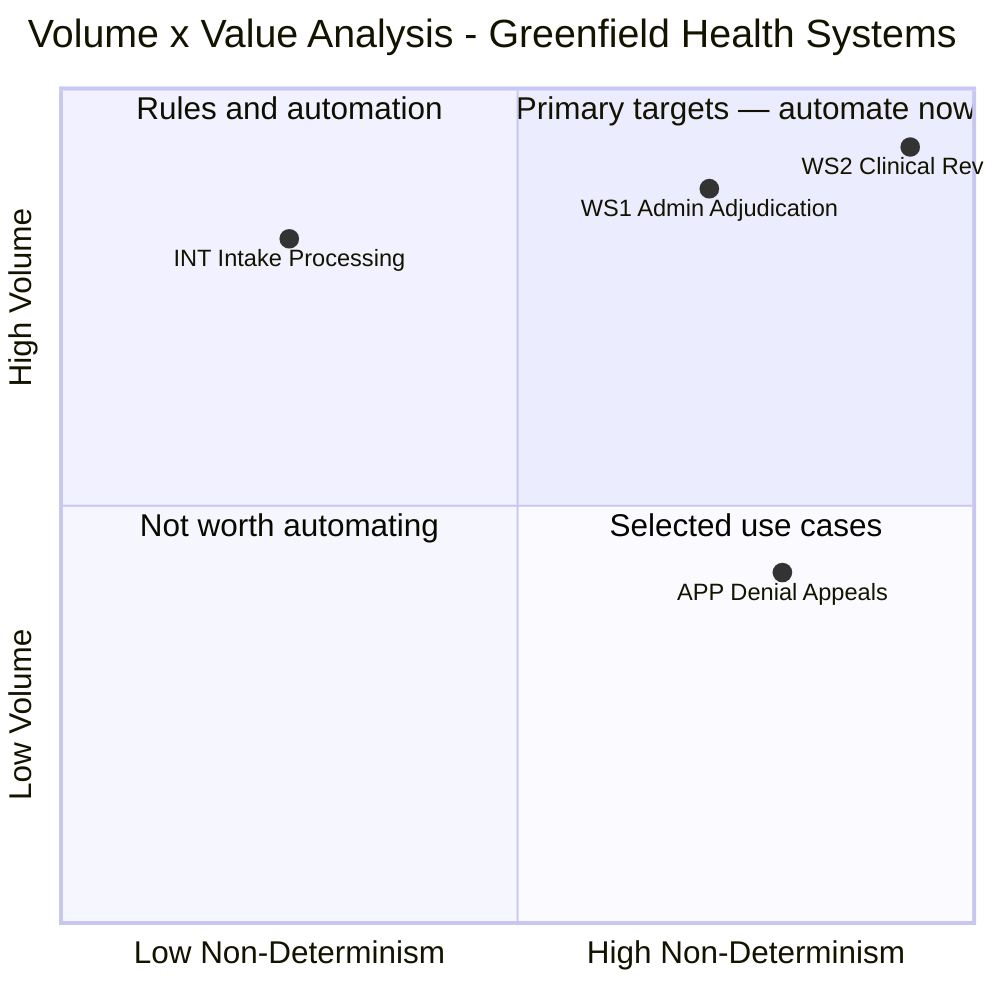

# Gate 4 — D6: Capstone Defense Pitch
**Scenario: Option A — Healthcare Claims Processing Transformation**
**Client: Greenfield Health Systems**
**Submitted by: Benoit Charrier, FDE**
**Updated: 2026-05-22**

---

## Timing

| Section | Content | Time |
|---------|---------|------|
| 1 | Problem framing | 30 sec |
| 2 | Success metrics | 20 sec |
| 3 | Solution architecture | 40 sec |
| 4 | Volume × Value analysis | 20 sec |
| 5 | Economics | 30 sec |
| 6 | Delivery waves | 30 sec |
| 7 | WS1 — how the agent works | 60 sec |
| 8 | The prototype | 40 sec |
| 9 | Why it's hard + what we expect to learn | 30 sec |
| **Total** | | **~5 min** |

*Coach challenge response: pre-loaded at the end — ready to deliver if challenged.*

---

## 1. Problem Framing

Greenfield Health Systems processes ~50,000 medical claims per month (≈2,000/day) with a team of 45 processors. Claims arrive from providers in three formats — EDI 837, PDFs, and portal submissions — each requiring eligibility verification, coding validation, medical necessity review, and payment determination.

Current state:
- **Average cycle time:** 8–9 days (payer SLA threshold is 7 days; contractual penalties are live)
- **Auto-adjudication rate:** 22% (industry benchmark: 85%)
- **Denial appeal overturn rate:** 41% — indicating systematic first-pass errors, not edge-case mistakes
- **Average processing time per claim:** 35 minutes, most of it spent on work that is verifiable against structured data sources

**The core problem — humans are doing deterministic work:**
- Every claim enters the same 35-minute full-manual workflow regardless of complexity
- Eligibility checks, coding validation, prior auth completeness — rule-governed lookups with fixed correct answers — treated identically to genuine clinical judgment
- Result: deterministic work done at physician cost; clinical review crowded out; cycle time and error rate both suffer

**Stakeholder alignment — already resolved:**

| Stakeholder | Requirement | Non-negotiable? |
|-------------|-------------|:---:|
| Sarah Chen (CFO) | 40% headcount reduction; $400K budget | Yes |
| Dr. Marcus Webb (CMO) | Physician sign-off on every clinical claim — URAC/NCQA accreditation requirement | Yes |
| James Liu (VP Ops) | Cycle time below 7-day SLA threshold — penalties are live | Yes |

**The negotiated resolution:**
- **65% of claims** — administrative path (billing, coding, prior auth completeness) → agent adjudicates, no physician required
- **35% of claims** — genuine clinical content → physician HITL, but agent pre-screening cuts review time from 35 min to ~3 min

The design question is settled. The build question is whether the clinical content classifier reliably makes that split.

---

## 2. Success Metrics

**Operational targets:**

| Metric | Baseline | Target |
|--------|----------|--------|
| Auto-adjudication rate | 22% | ≥80% of administrative-path claims |
| Cycle time — admin path | 8–9 days | ≤5 days |
| Cycle time — clinical path | 8–9 days | ≤7 days |
| Admin exception review time (HITL) | 35 min (full manual) | 2 min (focused exception packet) |
| Clinical physician review time | 35 min (full manual) | ≤3 min (agent pre-filled packet — Wave 2) |
| Denial appeal overturn rate | 41% | ≤15% |
| Clinical classifier recall | — | ≥99.5% (hard go-live gate, CMO sign-off required) |

---

## 3. Solution Architecture

Four agents, three waves.

**INT — Intake and Anomaly Detection:** Normalises EDI 837, PDF, and portal submissions into a single canonical structured record. Rejects malformed submissions with specific, actionable error codes rather than generic failures — reducing the resubmission cycle that currently adds to queue volume.

**WS1 — Administrative Adjudication (Wave 1):** Runs every claim through a 10-step pipeline — eligibility, coding, prior auth, clinical content classification, payment. For the estimated 65% of administrative claims: agent approves, rejects, or escalates to HITL exception queue. No physician required.

**WS2 — Clinical Pre-Screening (Wave 2, conditional):** For the 35% on the clinical path — assembles a pre-filled physician review packet, reducing physician review time from 35 minutes to ~3 minutes. Conditional on clinical notes API confirmation before build begins.

**APP — Denial Appeals Support (Wave 3, conditional):** Root cause classification and context assembly for denial appeals. Conditional on 90 days of Wave 1 production data.

---

## 4. Volume × Value Analysis

WS1 lands in Q1 — high volume, high judgment — which is why it is the Wave 1 primary target. WS2 scores highest on the judgment axis but URAC/NCQA limits the agent to context assembly only; the physician review step stays human regardless of classifier accuracy, so it cannot be the primary automation target.

---

## 5. Economics

| | Per claim | Annual |
|--|--|--|
| Current state | $18.23 | $1,300K (20 FTEs) |
| With agent — Wave 1 | $0.315 | $568K (7 retained staff + $113K agent running cost) |
| **Net saving** | **−98.3%** | **$732K/year** |

Wave 1 build: $420K. Payback: **6.9 months from go-live.**

Sensitivity tested across four scenarios:

| Scenario | Annual saving | Payback |
|----------|:---:|:---:|
| All adverse (35% HITL, 2× build cost, lower FTE rate) | ~$586K | ~17 months |
| Conservative (elevated HITL only) | ~$697K | ~7.2 months |
| **Base case** | **$732K** | **6.9 months** |
| All optimistic | ~$892K | ~3.8 months |

Business case holds under all tested adverse scenarios. 3-year portfolio (Waves 1+2): $1,986K saving on $528K investment — 276% ROI.

---

## 6. Delivery Waves

| Wave | Scope | Timeline | Condition |
|------|-------|----------|-----------|
| **1** | INT + WS1 admin adjudication | Months 1–6 build | Clinical content definition + classifier calibration gate (≥99.5% recall, CMO sign-off) before go-live |
| **2** | WS2 clinical pre-screening | Months 7–12 | Hard prerequisite: clinical notes API confirmation required before any Wave 2 build begins |
| **3** | APP denial appeals support | Months 13+ | 90-day Wave 1 steady-state data required before scoping |

Wave 1 is financially self-sufficient — generates $732K/year standing alone. The clinical content classifier built and CMO-certified in Wave 1 is the platform asset that makes Wave 2 feasible without a full rebuild. Wave 1 also validates the eligibility and prior auth API integrations, saving an estimated $112K in Wave 2 build cost and eliminating the schema discovery work from Wave 2's critical path.

---

## 7. WS1 — How the Agent Works

10-step pipeline. Orchestrator: **Haiku 4.5** (pipeline coordination, state management, tool sequencing). Sonnet 4.6 invoked as a targeted sub-call for clinical routing only.

| # | Step | Mechanism | Model |
|---|------|-----------|-------|
| 1 | Format parsing and field extraction | Rule-based parser | — |
| 2 | Member eligibility lookup | Structured API read | — |
| 3 | Eligibility discrepancy resolution | LLM contextual inference | Haiku 4.5 (~5% of claims) |
| 4 | Code validity and pairing check | Structured table lookup | — |
| 5 | Coding plausibility assessment | LLM semantic classification | Haiku 4.5 (~15% of claims) |
| 6 | Prior authorisation lookup | Structured API read | — |
| 7 | Prior auth partial-match resolution | Arithmetic + LLM judgment | Haiku 4.5 (~8% of claims) |
| **8** | **Clinical content routing classification** | **LLM multi-signal classification** | **Sonnet 4.6 (every claim)** |
| 9 | Payment calculation | Rate table + arithmetic | — |
| 10 | Contract exception handling | LLM document reasoning | Haiku 4.5 (~2% of claims) |

The clinical content classifier is the only Sonnet call because it is the only step requiring calibrated confidence scoring across three simultaneous signals: diagnosis code + procedure code + provider specialty. It produces three outputs: `admin`, `clinical`, or `uncertain`. Any `clinical` or `uncertain` result routes to the physician queue — enforced by queue architecture, not policy. There is no override path.

**Hard go-live gate:** ≥99.5% recall on clinical claims in mock calibration. Below this, clinical claims can reach the payment path without physician review — a URAC/NCQA compliance event. Not a performance aspiration; agent suspended pending investigation if breached. CMO sign-off required before any production routing begins.

Sonnet drives ~78% of per-claim LLM token cost despite being a single call, because it runs on every claim at 5× Haiku's rate.

---

## 8. The Prototype

**Features built:**
- Haiku 4.5 orchestrator sequencing all pipeline steps and maintaining claim state end-to-end
- Sonnet 4.6 clinical content classifier — three-state output: `admin` / `clinical` / `uncertain`
- Configurable confidence threshold (single named parameter, not hardcoded)
- Structured escalation object naming the specific signal the classifier could not resolve
- CLI reviewer interface closing the HITL loop with an audit record
- Full audit trail on the happy path (every step logged)
- Three pytest tests written before agent code — explicit definition of done for each path

**Step-by-step prototype scope:**

| # | Step | Status | Note |
|---|------|:------:|------|
| 1 | Format parsing and field extraction | **Out of scope** | Claim arrives as pre-structured JSON — no parsing needed |
| 2 | Member eligibility lookup | **Stub** | Returns `eligible`; returns `discrepancy` for fixture CLAIM-ELIG-01 |
| 3 | Eligibility discrepancy resolution | **Out of scope** | Dropped — escalation pattern demonstrated via clinical routing instead |
| 4 | Code validity and pairing check | **Stub** | Returns `valid` for all demo fixtures |
| 5 | Coding plausibility assessment | **Out of scope** | Would require a second LLM call; one real call is enough to demonstrate the pattern |
| 6 | Prior authorisation lookup | **Stub** | Returns `present_exact` for all demo fixtures |
| 7 | Prior auth partial-match resolution | **Out of scope** | Dropped in favour of the `uncertain` classifier state as the more interesting edge case |
| **8** | **Clinical content routing classification** | **Implement** | The single real LLM call — returns `{classification, confidence, reasoning}` |
| 9 | Payment calculation | **Stub** | Returns fee schedule rate from a mock rate table |
| 10 | Contract exception handling | **Out of scope** | No contract exception data to mock meaningfully |
| — | Exception reviewer interface | **Stub** | CLI: `python review_claim.py --claim-id <ID> --decision <...>` — proves escalation is not a terminal state |

**Three required paths:**

| Path | Fixture | What it proves | Expected output |
|------|---------|----------------|-----------------|
| **Happy path** | CLAIM-ADMIN-01 (99213 routine exam, PCP, Z00.00) | Full pipeline runs end-to-end; compliance boundary holds — no physician involvement on admin path; audit trail produced | `status: approved`, `confidence: 0.91`, full audit trail |
| **Failure-mode escalation** | CLAIM-CLINICAL-01 (27447 knee replacement, ortho surgeon, M17.11) | Threshold gate fires correctly; escalation is not terminal — HITL loop closes with structured packet the reviewer can act on | `status: escalated`, `confidence: 0.62` below threshold, escalation reason naming the ambiguous signal |
| **Edge case** | CLAIM-UNCERTAIN-01 (97110 therapeutic exercise, GP, M54.5 low back pain) | Third classification state fires explicitly; ambiguity doesn't collapse into silent auto-approval | `status: escalated`, `classification: "uncertain"`, `confidence: 0.48`, contradictory signals named |

Three pytest tests written before the agent code. Demo runs `python run_claim.py --fixture <ID>`. HITL loop closed by `python review_claim.py --claim-id <ID> --decision <approve|reject|escalate-to-physician>`.

---

## 9. Why It's Hard / What We Expect to Learn

**The difficulty:** Getting the Sonnet classifier to produce *calibrated* confidence scores that genuinely differentiate near-boundary claims. If it returns `0.90` for everything, the threshold gate is meaningless. The system prompt must instruct the model to reserve high confidence for claims where all three signals agree — and return `0.55–0.70` when any signal is ambiguous or contradictory. Mock claims must sit near the boundary by design; if borderline fixtures return high confidence, the calibration instruction failed.

**The asymmetry:** A false negative — clinical claim auto-approved without physician review — is a URAC/NCQA compliance event. The agent is suspended regardless of volume or economic impact. A false positive — admin claim routed to physician — floods the queue but is recoverable. The spec must err toward escalation, not toward straight-through processing.

**Primary question:** Does prompt engineering alone produce genuinely differentiated confidence scores near the clinical/administrative boundary, or do structural constraints in the system prompt need to force differentiation on borderline cases?

---

## Coach Challenge Response

**Challenge:** *"The CMO won't certify auto-approval for any claim. All 2,000 claims per day require physician sign-off."*

**Response: The architecture survives. The value proposition shifts, but the build does not change.**

Without the agent: 2,000 claims × 35 minutes of physician time = approximately 1,167 physician-hours per day. That is not operationally sustainable at any staffing level, regardless of the auto-approval question.

With WS1 screening and WS2 pre-filling running — even if every single claim ends in physician sign-off — physician review time drops from 35 minutes to ~3 minutes per claim. At 3 minutes per claim across 2,000 daily claims: approximately 100 physician-hours per day. That is a **91% reduction in physician burden** regardless of whether any claim is auto-approved.

The value proposition shifts from "65% straight-through processing" to "12× physician throughput across 100% of claims." The capability specification does not change. The routing output changes: instead of `auto-approve` on the administrative path, the agent pre-fills a structured packet for every claim and flags it as administrative or clinical for rapid physician disposition.

The cost model changes as well. Instead of headcount displacement from the admin path, the saving comes from making existing physician capacity dramatically more productive. The payback period extends because Wave 1 no longer eliminates 12 processor FTEs — but the clinical notes pre-filling value that was Wave 2 moves to Wave 1, and the physician capacity freed up becomes the measurable return.

**The answer to the CMO challenge is: agree with the constraint, preserve the value on a different axis.**
