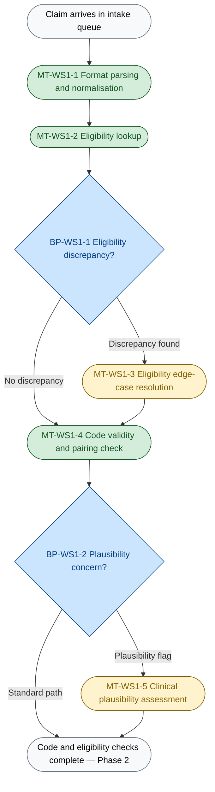
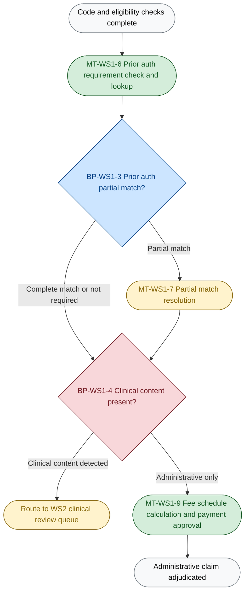

# WS1 Administrative Adjudication Agent — How It Works
**Greenfield Health Systems | Wave 1 Operational Description**
*Prepared: 2026-05-21*

---

## Table of Contents

1. [What This Document Covers](#section-1-what-this-document-covers)
2. [The Agent's Job](#section-2-the-agents-job-in-one-paragraph)
3. [Step-by-Step — What Happens to a Claim](#section-3-step-by-step--what-happens-to-a-claim)
4. [Process Flow Diagrams](#section-4-process-flow-diagrams)
5. [When a Claim Goes to a Human Reviewer](#section-5-when-a-claim-goes-to-a-human-reviewer)
6. [The Compliance Boundary](#section-6-the-compliance-boundary)
7. [Key Numbers at a Glance](#section-7-key-numbers-at-a-glance)

---

## Section 1: What This Document Covers

This document explains, step by step, how the Wave 1 administrative adjudication agent processes a claim from arrival to disposition — what the agent decides alone, where it pauses for a reviewer, and where a physician must be in the loop by regulatory requirement. It is not a technical specification; it is an operational description for decision-makers evaluating the build scope.

---

## Section 2: The Agent's Job in One Paragraph

The Wave 1 administrative adjudication agent takes a normalised claim record — already validated for format and field completeness by the intake agent — and runs it through the complete administrative processing pipeline. For every claim, it verifies member eligibility on the service date, checks whether the submitted diagnosis and procedure codes are valid and clinically plausible together, confirms that required prior authorisation is on file and matches the claim, and classifies each claim as either administrative or clinical. Claims without clinical content proceed to fee schedule calculation and payment determination; claims with clinical content are routed to the physician review queue. The agent produces one of four dispositions: auto-approved with payment amount, rejected with a specific failure code, routed to the physician queue for mandatory clinical review, or escalated to a human reviewer for exception resolution when the agent cannot reach a defensible conclusion on its own. The one outcome it cannot produce — regardless of the confidence level of any upstream check — is a coverage determination on a claim with clinical content: by URAC/NCQA accreditation standards, a licensed physician or advanced practice provider must review and sign off on every such claim before finalisation.

---

## Section 3: Step-by-Step — What Happens to a Claim

| Step | How it is handled | Why this approach |
|------|:---:|-------------------|
| Format parsing and field extraction (EDI 837, PDF, portal) | **Automated (rule / code)** | EDI 837 is a structured specification; the correct fields are enumerated — an LLM call adds latency and cost with zero quality benefit |
| Member eligibility lookup | **Automated (API call)** | The eligibility system returns a binary result (eligible / not eligible on service date); no reasoning required |
| Eligibility discrepancy resolution | **Agent judgment** | When the eligibility check returns an ambiguous result (e.g., termination date near service date), the agent distinguishes data-entry lag from a genuine coverage gap using contextual pattern recognition — a task no formal rule covers (~5% of claims) |
| Code validity and pairing check | **Automated (rule / code)** | ICD-10/CPT crosswalk rules are a structured lookup against a reference table; the standard path is a code-validity query, not LLM inference |
| Coding plausibility assessment | **Agent judgment** | The agent evaluates whether the code combination is clinically plausible given provider type and diagnosis — a judgment that varies by context and is not codifiable as a rule (~15% of claims trigger a flag) |
| Prior authorisation lookup | **Automated (API call)** | The prior auth system returns a record or its absence; deterministic binary check |
| Prior authorisation partial-match resolution | **Agent judgment** | When the auth on file differs from the claim (unit variance, code variant, date mismatch), the agent assesses whether the difference falls within a defensible tolerance — no documented threshold exists (~8% of claims) |
| Clinical content routing classification | **Agent judgment → mandatory physician review** | The agent classifies each claim as administrative or clinical using multi-factor pattern recognition across diagnosis codes, procedure codes, and provider specialty; any claim classified as clinical is sent to the physician queue without exception — this is a URAC/NCQA compliance requirement, not a design choice (~10% of claims escalated for confidence review before routing) |
| Payment calculation | **Automated (rule / code)** | Fee schedule application is arithmetic against a rate table; the correct answer is computed by formula — an LLM call produces no quality improvement |
| Contract exception handling | **Agent judgment** | When a fee schedule exception flag is raised, the agent reviews the contract carve-out context and produces a rate recommendation for human confirmation (~2% of claims) |

> **The five automated steps (format parsing, eligibility lookup, code validity check, prior auth lookup, payment calculation) consume no LLM tokens.** They run as in-process code or external API calls. This is the correct architecture: an LLM call on a binary eligibility lookup adds cost and latency for zero quality benefit. The five judgment steps (eligibility discrepancy resolution, coding plausibility, prior auth partial-match, clinical routing, contract exception) invoke the LLM only when no deterministic rule resolves the decision. Average LLM calls per claim: ~2.15 (routing classification and coding plausibility run on every claim; the other three run conditionally on ~15% of claims combined).

---

## Section 4: Process Flow Diagrams

> **Phase 1 — Intake through coding and eligibility.** Every claim enters here regardless of path. Steps shown in colour involve agent judgment; steps shown without fill are deterministic rule execution or API calls.

> **Phase 2 — Prior authorisation, clinical routing, and payment.** The routing decision at step 8 (clinical content classification) is the compliance gate: a claim classified as clinical is sent to the physician queue; a claim classified as administrative proceeds to payment determination. The routing decision cannot be reversed by the payment agent — physician review is enforced by the queue architecture, not by policy.

*BP-WS1-4 is shown in red to mark it as the critical compliance-boundary breakpoint.*

---

## Section 5: When a Claim Goes to a Human Reviewer

### Escalation Triggers

| Trigger | Condition | Approximate frequency | What the reviewer decides |
|---------|-----------|:---:|--------------------------|
| Eligibility discrepancy | Agent cannot resolve whether a near-term eligibility boundary is a data lag or a genuine coverage gap | ~5% of claims | Confirm eligibility or deny with specific reason |
| Coding plausibility flag | Agent scores a code combination as clinically implausible for the provider type or diagnosis | ~15% of claims | Confirm the code pairing is valid or reject the code |
| Prior auth partial match | Auth on file differs from the claim in units, dates, or code variant beyond the agent's defensible range | ~8% of claims | Approve the variance or require the provider to re-submit with a matching auth |
| Clinical routing confidence below threshold | The clinical content classifier's confidence score falls below the configured threshold — the agent is uncertain whether the claim contains clinical content | ~10% of claims | Confirm routing: administrative path or clinical physician queue |
| Contract exception | The fee schedule lookup surfaces a contract carve-out that requires rate determination beyond the standard rate table | ~2% of claims | Approve the agent's recommended rate or apply an alternate rate |

*Source: C3 §2 Agent 2 escalation triggers; rates from C1_token_economics §4f.*

### Reviewer Experience

**What the reviewer sees:** The reviewer receives a focused exception packet — not the raw claim file. The packet contains: the specific flag the agent raised, the relevant claim fields (member ID, service date, codes, provider), the agent's reasoning (what it found and why it cannot resolve it), and a single yes/no or choose-one decision prompt. The reviewer does not need to re-read the whole claim.

**How long it takes:** At the base case, a reviewer handles approximately 25% of claims as HITL events. The average review time is 2 minutes (1 minute for clear exceptions — confirming an eligibility check, approving a code pairing that the agent flagged conservatively; 3.5 minutes for complex exceptions — evaluating a prior auth tolerance call or confirming a clinical routing decision). Source: C1_token_economics §4f, calibrated against Dr. Marcus Webb's clinical review benchmark of 3 minutes per claim for a full pre-filled clinical packet — admin HITL is a narrower, targeted task and should be faster. At 1.4 FTE-equivalent for HITL volume, this is well within the 7-staff retention target.

**What the reviewer's decision produces:** The reviewer confirms, overrides, or escalates. A confirmation writes an audit record and releases the claim to the next step. An override writes the reviewer's decision with a reason code and releases. A further escalation flags the claim for supervisor review. Every reviewer action — including a confirmation — is logged with a timestamp, reviewer ID, and decision code. This audit trail is the primary evidence for URAC/NCQA compliance review.

---

## Section 6: The Compliance Boundary

- **What the boundary is:** Any claim classified as containing clinical content must be reviewed by a licensed physician or advanced practice provider before a coverage determination is made. This is not a design choice — it is required by URAC/NCQA accreditation standards (Dr. Marcus Webb, Exchange 2).
- **How it is enforced:** The clinical content classifier (step 8) routes clinical claims to the physician queue. The payment agent (step 9) cannot receive a claim that has not cleared the physician queue. The routing is enforced by the queue architecture — there is no manual override path that bypasses physician review.
- **What the calibration gate means:** Before go-live, the classifier must achieve ≥99.5% recall on clinical claims — meaning it must correctly identify at least 995 out of every 1,000 clinical claims. Below this threshold, clinical claims can reach the payment path without physician review, constituting a URAC/NCQA compliance event. This threshold is the single go-live gate that cannot be relaxed regardless of economic pressure. Source: C1_token_economics §11.

---

## Section 7: Key Numbers at a Glance

| Metric | Figure | Source |
|--------|--------|--------|
| Claims processed through WS1 pipeline daily (steps 1–8) | 2,000 | scenario_context.md |
| Claims on administrative path daily (steps 9–10) | 1,300 (65% of 2,000 — stakeholder estimate) | scenario_context.md, Exchange 3 |
| Current manual cost per admin claim | $18.23 (35 min × $31.25/hr) | C1_token_economics §2 |
| Agent cost per admin claim | $0.315 | C1_token_economics §6 |
| Per-claim cost reduction | 98.3% | C1_token_economics §6 |
| HITL rate (base case) | 25% of claims | C1_token_economics §4f |
| Average HITL review time | 2 minutes | C1_token_economics §4f |
| HITL FTE equivalent | 1.4 FTEs | C1_token_economics §7 |
| Annual agent running cost (Wave 1) | $113K/year | C1_token_economics §7 |
| Annual net saving (Wave 1) | $732K/year | C1_token_economics §7 |
| Payback period | 6.9 months from go-live | C1_token_economics §7 |
| Clinical classifier recall required for go-live | ≥99.5% | C1_token_economics §11 |
