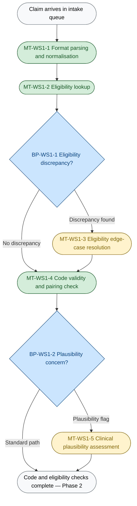
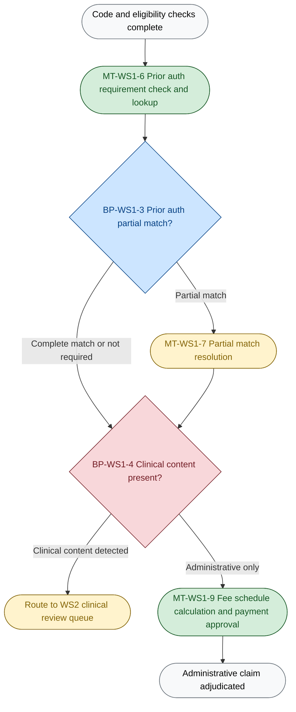
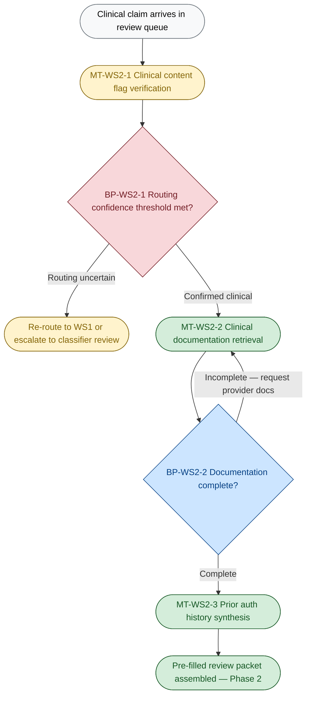
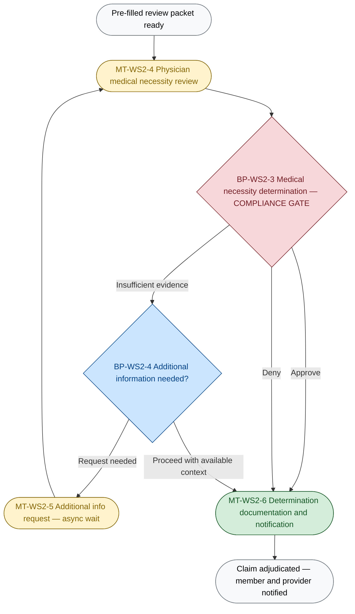

# D2A: Cognitive Load Map
**Engagement:** Greenfield Health Systems — Medical Claims Adjudication Transformation
**Phase:** ATX Assessment Phase 2 — Cognitive Load Mapping
**Prepared:** 2026-05-20
**Source of truth:** `Scenario/scenario_context.md`; informed by `Deliverables/D0C_discovery.md`

---

## 0. Executive Summary

- **Work streams selected:** WS1 (Administrative Adjudication) and WS2 (Clinical Review) are both selected for full decomposition — WS1 because it carries the highest-volume delegation opportunity (65% of claims on the administrative path, codifiable administrative steps, industry-proven 85% auto-adjudication benchmark) combined with the highest-stakes undocumented judgment call in the process (the clinical content routing decision that sits inside WS1 and determines whether WS2 is triggered); and WS2 because it contains the highest cognitive complexity (multi-source clinical synthesis, licensed physician judgment) and the hardest compliance constraint (URAC/NCQA physician sign-off), making it the defining boundary case for agent delegation scope in this engagement.
- **Most significant breakpoint:** BP-WS1-4 — the clinical content routing classification — is the breakpoint where agent value and compliance risk are simultaneously at their maximum: a correctly functioning classifier enables 65% of claims to clear without physician involvement, while a classifier error in the wrong direction (false negative: clinical claim routed as administrative) constitutes a URAC/NCQA compliance violation and bypasses the non-negotiable physician sign-off required by Dr. Marcus Webb (Exchange 2).
- **Most consequential cross-work-stream pattern:** Both WS1 and WS2 depend on a clinical content definition that does not yet exist — WS1 needs it to build the routing classifier (BP-WS1-4) and WS2 needs it to verify classifier output and define the pre-fill scope (WS2-JtD-1); this shared dependency means the clinical content classifier must be designed as a single shared component called by both agents, and producing that definition is the prerequisite design output that blocks both capability specifications.

---

## 0b. Table of Contents

- [0. Executive summary](#0-executive-summary)
- [0b. Table of contents](#0b-table-of-contents)
- [1. Work stream selection and rationale](#1-work-stream-selection-and-rationale)
- [2. Cognitive Load Map — WS1 Administrative Adjudication](#2-cognitive-load-map--ws1-administrative-adjudication)
  - [2a. Lived process narrative](#2a-lived-process-narrative)
  - [2b. Jobs to be Done decomposition](#2b-jobs-to-be-done-decomposition)
  - [2c. Cognitive zones and breakpoints](#2c-cognitive-zones-and-breakpoints)
  - [2d. Micro-task inventory with dimension scores](#2d-micro-task-inventory-with-dimension-scores)
  - [2e. Process topology diagram](#2e-process-topology-diagram)
- [3. Cognitive Load Map — WS2 Clinical Review](#3-cognitive-load-map--ws2-clinical-review)
  - [3a. Lived process narrative](#3a-lived-process-narrative)
  - [3b. Jobs to be Done decomposition](#3b-jobs-to-be-done-decomposition)
  - [3c. Cognitive zones and breakpoints](#3c-cognitive-zones-and-breakpoints)
  - [3d. Micro-task inventory with dimension scores](#3d-micro-task-inventory-with-dimension-scores)
  - [3e. Process topology diagram](#3e-process-topology-diagram)
- [4. Cross-work-stream observations](#4-cross-work-stream-observations)
- [5. Abbreviated mapping — remaining work streams](#5-abbreviated-mapping--remaining-work-streams)
- [6. Assumption log](#6-assumption-log)

---

## 1. Work Stream Selection and Rationale

Both formally defined work streams in the scenario — WS1 (Administrative Adjudication) and WS2 (Clinical Review) — are selected for full decomposition. WS1 warrants deep mapping because it processes the highest daily volume (~2,000 claims/day through the validation and routing pipeline — steps 1–8 apply to all incoming claims; 1,300/day on the administrative path after the routing split at step 8, derived from the 65%/35% split — assumption), contains the most delegation potential in absolute terms, and critically hosts the clinical content routing decision (BP-WS1-4), which is simultaneously the highest-value and highest-risk cognitive act in the entire process. WS2 warrants deep mapping because it contains the highest per-task cognitive complexity in the engagement — physicians synthesising multi-source clinical evidence under a hard regulatory constraint — and because the agent opportunity in WS2 (context assembly and pre-filling) is only meaningful if its scope boundary with the physician's judgment is precisely drawn. Together, these two work streams are not merely "important" — they are the entire cognitive architecture of the claims adjudication problem: WS1 is where the classification decision that structures everything downstream is made, and WS2 is where the compliance constraint that caps delegation is enforced. Decomposing both is required to produce a coherent delegation design.

---

## 2. Cognitive Load Map — WS1 Administrative Adjudication

### 2a. Lived Process Narrative

*Reconstructed from scenario_context.md, D0C discovery. Assumptions are labelled where the scenario is silent.*

**Trigger:** A claim arrives in the Greenfield intake system. It may be an EDI 837 file from a clearinghouse, a PDF from a provider's billing department, or a portal submission. The processor opens the work queue and picks up the next claim — there is no documented triage logic, so claims are processed roughly in order of arrival, with no visible SLA urgency scoring (assumption A-D2A-1).

**Intake and eligibility:** For EDI 837 claims, the structured data is already parseable. For PDFs and portal submissions, the processor extracts the key fields manually or via a tool (unnamed). The processor pulls up the claim's member ID and checks whether the member was enrolled on the date of service. For the majority of claims, this is a binary lookup. When the result is ambiguous — a termination date near the service date, a dependent whose eligibility is in question — the processor has to decide whether this looks like a data lag or a genuine gap. They apply informal knowledge: "this member has been on the plan for three years, this is probably a sync issue." There is no documented decision rule for this. The processor resolves it one way or another and moves on (assumption A-D2A-2).

**Coding validation:** The processor reviews the ICD-10 diagnosis codes and CPT/HCPCS procedure codes against formal pairing rules. A code lookup tool (unnamed) surfaces known invalid pairings. But the processor also applies a second layer of judgment: does this combination make sense given the provider type, place of service, and what the diagnosis says? A urologist billing for a gynecological procedure, a physical therapy claim with a cardiac diagnosis — these pass the formal pairing rules but feel implausible. The processor flags or passes based on experience. This pattern recognition is not in any rules engine and is not written down anywhere (assumption A-D2A-3).

**Prior auth check:** The processor must determine whether the procedure required prior authorisation and, if so, whether a valid auth is on file. This requires checking a second system (assumption A-D2A-4 — prior auth records are assumed to be in a separate system). Most of the time, the auth is either there or it isn't. When it's there but the codes don't precisely match — the auth was for 10 units of service, the claim is for 12; the auth was for a slightly different procedure code — the processor must decide: tolerance or denial? There is no documented tolerance threshold. The processor makes a call, often influenced by the provider's history. If the prior auth is genuinely missing, the processor pends the claim and sends a request to the provider. **The claim stops here** until the provider responds — this async wait is one of the primary drivers of the 8–9 day cycle time (scenario.md, Exchange 3).

**The routing decision (undocumented):** After these checks, the processor faces the most consequential decision in the process: does this claim have clinical content that requires physician review? The processor looks at the diagnosis code, the procedure code, the provider specialty. They apply a personal heuristic — certain patterns mean "send to clinical." There is no written criterion. The processor makes a judgment, and the claim either goes to a physician queue or proceeds to payment. Two processors working the same borderline claim may make different decisions. This inconsistency is the structural cause of the 41% denial appeal overturn rate (scenario.md) — claims are either mis-routed (clinical sent to payment, physician review bypassed) or correctly routed but then mis-decided by a physician working without a pre-filled context packet.

**Payment determination (administrative path):** For claims that clear the routing decision as administrative, the processor applies the fee schedule, checks for duplicate submissions, and calculates the member's cost-sharing. For standard procedures with listed fee schedule rates, this is mechanical. For carved-out procedures, out-of-network providers with negotiated rates, or bundled payment arrangements, the processor needs knowledge that may not be in the fee schedule system — it may exist in an email, a contract document, or a colleague's memory (assumption A-D2A-5). The claim is approved with a payment amount, and the record is closed.

---

### 2b. Jobs to be Done Decomposition

| JtD ID | Cognitive contract — what outcome must be produced? | Trigger | Actor | Key decisions | Key systems/data | Primary cognitive type | Expected output |
|---|---|---|---|---|---|---|---|
| WS1-JtD-1 | Determine whether the submitted claim is administratively valid — member was eligible, codes are correct, and required authorisation is present or satisfactorily resolved | Claim arrives in intake queue | Claims processor | Is the member eligible on the service date? Are submitted codes technically valid and clinically plausible? Is prior auth present and matching? | Member eligibility system (unnamed), claim record, code lookup tool (unnamed), prior auth system (unnamed) | Execution (standard path); exception-handling (edge cases) | Validated claim with disposition: administratively complete / incomplete / pending provider response |
| WS1-JtD-2 | Determine whether the validated claim contains clinical content that requires physician review, and route it to the correct downstream queue | Administrative validation complete (WS1-JtD-1 output) | Claims processor (current); clinical content classifier agent (target) | Does this claim's diagnosis-procedure combination constitute clinical content requiring physician sign-off? | Claim record (codes, provider specialty), clinical content criterion (currently undefined — must be produced as design output) | Decision-making (classification judgment; no formal criterion exists) | Routing decision: administrative path → WS1-JtD-3, or clinical path → WS2 queue |
| WS1-JtD-3 | Determine the correct payment amount for an administratively cleared claim and issue the payment approval | Claim confirmed as administrative (WS1-JtD-2 output) | Claims processor (current); payment determination agent (target) | What fee schedule rate applies? Are there applicable co-pays, deductibles, or out-of-pocket amounts? Is this a duplicate submission? | Fee schedule system (unnamed), member cost-sharing record, contract database (unnamed) | Execution (standard path); exception-handling (contract edge cases) | Signed payment approval with amount; or rejection with duplicate flag |

---

### 2c. Cognitive Zones and Breakpoints

**Zones:**

| Zone ID | Zone name | Micro-tasks in zone | Dominant cognitive type | Data dependencies | Error tolerance |
|---|---|---|---|---|---|
| Z-WS1-1 | Intake and Eligibility | Format parsing, eligibility lookup, eligibility discrepancy resolution | Deterministic execution (standard); probabilistic reasoning (discrepancy resolution) | Claim record, member eligibility system (unnamed) | Medium: eligibility errors are recoverable via appeal but contribute to cycle time and wrongful denial |
| Z-WS1-2 | Coding and Prior Auth Validation | Code validity check, clinical plausibility assessment, prior auth lookup, partial match resolution | Probabilistic reasoning (plausibility judgment, partial match tolerance); deterministic execution (standard code and auth lookup) | Claim record, code lookup tool (unnamed), prior auth system (unnamed) | Low: coding and prior auth errors are a documented driver of the 41% overturn rate; errors persist into the denial |
| Z-WS1-3 | Clinical Content Classification | Clinical content routing decision | Human sense-making (no formal criterion; processor pattern recognition) | Claim record (codes, provider specialty); clinical content criterion (does not exist in current process) | Critical: false negative = compliance violation (clinical claim bypasses physician review, URAC/NCQA violation per Exchange 2) |
| Z-WS1-4 | Administrative Payment Determination | Fee schedule lookup, cost-sharing calculation, duplicate check, contract exception handling | Deterministic execution (standard fee schedule); exception-handling (contract carve-outs) | Fee schedule system (unnamed), member cost-sharing record, contract database (unnamed) | Medium: payment errors are recoverable; contract exceptions carry moderate financial risk |

---

**Breakpoints:**

| BP ID | Description of handoff | From | To | Why this is a breakpoint | Agent opportunity or risk |
|---|---|---|---|---|---|
| BP-WS1-1 | Eligibility discrepancy resolution | Deterministic eligibility lookup (agent-ready) | Human judgment: is this a data error or a genuine coverage gap? | Rule-to-judgment shift: the binary eligibility check ends; contextual interpretation of an anomaly begins | Agent opportunity: train on historical discrepancy resolutions to classify edge cases; low-frequency exception means HITL escalation queue is small |
| BP-WS1-2 | Coding plausibility threshold | Deterministic code validity rules (agent-ready) | Human pattern recognition: is this combination clinically plausible? | Rule-to-judgment shift: formal crosswalk rules pass; tacit clinical plausibility knowledge activates | Agent opportunity: a classifier trained on historical plausibility flags can handle most cases; risk: if exception rate is high (unknown — see Unknown U-4 in D0C), HITL queue may be large |
| BP-WS1-3 | Prior auth partial match resolution | Deterministic match check (agent-ready) | Human tolerance judgment: is this variance acceptable? | Rule-to-judgment shift: exact match criteria fail; a configurable tolerance rule or human call determines outcome | Agent opportunity: tolerance thresholds can be encoded as configurable rules; partial matches that exceed tolerance escalate to HITL — threshold values are a design parameter requiring CMO/Ops alignment |
| BP-WS1-4 | Clinical content routing classification | All upstream checks complete | Routing decision: WS2 clinical queue or WS1 payment | Human-to-system (target state) / compliance gate: the routing criterion does not exist in written form; this must become a classifier with a defined confidence threshold | **Highest-value and highest-risk breakpoint in the engagement.** Agent opportunity: a correctly calibrated classifier handles this at scale. Risk: false negative = URAC/NCQA compliance violation; threshold design requires CMO certification |
| BP-WS1-5 | Fee schedule contract exception | Standard fee schedule lookup (agent-ready) | Human contract knowledge: what is the negotiated rate for this specific arrangement? | Rule-to-knowledge shift: formal fee schedule has no entry; institutional knowledge required | Agent risk: if contract exceptions are not encoded in accessible data, the agent cannot handle them; prerequisite is encoding contract rules before agent handles payment |

---

### 2d. Micro-Task Inventory with Dimension Scores

| Micro-task | Cognitive Load | Input Structure | Decision Determinism | Exception Frequency | Turn-Taking | Latency Constraint | Compliance/Risk Sensitivity | Tool/API Availability |
|---|---|---|---|---|---|---|---|---|
| MT-WS1-1: Format parsing and intake normalisation | L | M | H | M | L | M | M | M |
| MT-WS1-2: Eligibility lookup — standard path | L | H | H | L | L | M | H | M |
| MT-WS1-3: Eligibility discrepancy resolution | H | M | L | L | M | L | H | M |
| MT-WS1-4: Code validity and pairing check | M | H | M | M | L | M | H | M |
| MT-WS1-5: Clinical plausibility assessment | H | M | L | H | M | L | H | L |
| MT-WS1-6: Prior auth requirement check and lookup | L | H | H | L | L | M | H | M |
| MT-WS1-7: Prior auth partial match resolution | H | M | L | M | M | L | H | M |
| MT-WS1-8: Clinical content routing classification | H | M | L | H | L | M | H | L |
| MT-WS1-9: Fee schedule application and payment calculation | L | H | H | L | L | M | M | M |
| MT-WS1-10: Fee schedule contract exception handling | H | L | L | L | M | L | M | L |

**Score justifications:**

*MT-WS1-1:* Cognitive Load L — format parsing is mechanical extraction with no judgment; Input Structure M — EDI 837 is H, PDFs are L, portal is M, mixed format pool; Decision Determinism H — parse or fail; Exception Frequency M — malformed PDFs, missing fields occur with some regularity (assumption A-D2A-6); Compliance/Risk M — extraction errors propagate downstream but are detectable early; Tool/API M — EDI parsing is standard, PDF extraction requires tooling that is unnamed.

*MT-WS1-2:* Cognitive Load L — binary lookup; Input Structure H — eligibility records are structured; Decision Determinism H — eligible or not; Exception Frequency L — most members are straightforwardly enrolled; Compliance/Risk H — a wrong eligibility decision either pays an ineligible claim or wrongfully denies an eligible one; Tool/API M — eligibility system exists but is unnamed.

*MT-WS1-3:* Cognitive Load H — requires policy knowledge and contextual pattern recognition; Input Structure M — structured data with ambiguous interpretation; Decision Determinism L — two structurally identical data states (data error vs. genuine gap) require different resolutions; Exception Frequency L — most eligibility lookups are clean; Compliance/Risk H — same as MT-WS1-2; Tool/API M — same eligibility system.

*MT-WS1-4:* Cognitive Load M — rules lookup for standard cases, experience-based for edge cases; Input Structure H — ICD-10 and CPT codes are structured; Decision Determinism M — formal crosswalk rules cover standard cases; plausibility requires judgment; Exception Frequency M — a material proportion of claims have code combinations requiring interpretation (assumption A-D2A-3); Tool/API M — code lookup tools exist but are unnamed.

*MT-WS1-5:* Cognitive Load H — requires tacit clinical coding knowledge developed through experience; Input Structure M — codes are structured, plausibility is contextual; Decision Determinism L — no formal plausibility rule; experience-dependent; Exception Frequency H — because no formal criterion exists, any non-obvious combination is an exception requiring judgment; Compliance/Risk H — plausibility errors contribute to the 41% overturn rate (scenario.md); Tool/API L — no tool currently supports this; relies on processor tacit knowledge (assumption A-D2A-3).

*MT-WS1-6:* Cognitive Load L — lookup; Input Structure H — prior auth records are structured; Decision Determinism H — required or not; on file or not; Exception Frequency L — standard check; Compliance/Risk H — prior auth errors produce either wrongful approval (financial risk) or wrongful denial (appeal risk); Tool/API M — prior auth system assumed but unnamed (assumption A-D2A-4).

*MT-WS1-7:* Cognitive Load H — requires judgment on tolerance thresholds, provider intent, and policy; Input Structure M — both auth and claim records are structured; the mismatch interpretation is not; Decision Determinism L — no documented tolerance threshold; Experience and context drive the call; Exception Frequency M — partial matches occur with moderate frequency in prior auth-required procedures (assumption A-D2A-7); Tool/API M — same as MT-WS1-6.

*MT-WS1-8:* Cognitive Load H — undocumented pattern recognition across diagnosis codes, procedure codes, and provider specialty; Input Structure M — codes are structured; the classification criterion is not; Decision Determinism L — the routing criterion does not formally exist (scenario_context.md Assumption A-4); Exception Frequency H — because there is no formal criterion, every ambiguous case is an exception; Compliance/Risk H — false negative = clinical claim bypasses physician review = URAC/NCQA violation (Exchange 2); Tool/API L — no classifier or tool currently supports this decision.

*MT-WS1-9:* Cognitive Load L — fee schedule lookup; Input Structure H — fee schedules are structured rate tables; Decision Determinism H — standard procedure has a rate; Exception Frequency L — most procedures have a standard fee schedule entry; Compliance/Risk M — payment errors are financially recoverable; Tool/API M — fee schedule system unnamed.

*MT-WS1-10:* Cognitive Load H — requires contract-specific knowledge not in the fee schedule system; Input Structure L — contract exceptions may be in unstructured documents or email; Decision Determinism L — no formal rule for contract carve-outs; Exception Frequency L — rare in absolute volume; Compliance/Risk M — financially recoverable but carries contractual risk; Tool/API L — contract exception knowledge is not encoded in any accessible system (assumption A-D2A-5).

---

### 2e. Process Topology Diagram

**Phase 1 — Ingestion and Administrative Checks**

**Phase 2 — Prior Auth, Routing and Payment**

*BP-WS1-4 is shown in red to mark it as the critical compliance-boundary breakpoint.*

---

## 3. Cognitive Load Map — WS2 Clinical Review

### 3a. Lived Process Narrative

*Reconstructed from scenario_context.md, D0C discovery. Assumptions are labelled where the scenario is silent.*

**Trigger:** A claim arrives in the clinical review queue after being routed by a WS1 processor (or, in target state, by the WS1 classifier agent). The claim has already passed eligibility, coding validation, and prior auth checks. It was routed to clinical review because the processor (or classifier) determined it contains clinical content requiring physician sign-off.

**Content flag verification:** A physician or clinical reviewer opens the claim and must first satisfy themselves that the routing was correct — that this claim genuinely contains clinical content. In the current process, this check is informal: the physician looks at the diagnosis and procedure codes and confirms the routing makes intuitive sense. There is no verification criterion (the routing criterion itself doesn't exist in written form — see Assumption A-4 in scenario_context.md). If the routing seems wrong, the claim presumably gets sent back — but the scenario gives no information about what happens to misrouted claims. The physician proceeds on the assumption that the routing was correct (assumption A-D2A-8).

**Context assembly — the pre-judgment work:** Before the physician can assess medical necessity, they must gather the clinical context for this specific claim. This is information retrieval work, not clinical judgment, and it is the primary recoverable time cost in WS2. The physician opens the claim record, notes the procedure being claimed, the diagnosis code, and the member. They then need:
- Clinical notes from the treating provider: the rationale for the procedure, the supporting diagnosis narrative, any relevant history (source system unknown — assumption A-D2A-4)
- Prior authorisation history: was this procedure previously authorised? For a different date? What criteria were applied?
- Any prior claim history relevant to this member and this diagnosis

Gathering these materials may require accessing one or more separate systems, requesting documentation from the provider, or working with what is available and proceeding with partial context. There is no pre-assembled dossier. The physician assembles this ad hoc for every claim. Dr. Marcus Webb's estimate of 20 claims per hour with agent pre-screening (Exchange 3) implies the current context-assembly overhead is significant — without pre-screening, the per-claim time is materially higher.

**Medical necessity determination:** With context assembled, the physician applies medical necessity criteria. These criteria — InterQual, Milliman, or a proprietary equivalent (assumption A-D2A-9) — define whether the proposed procedure is supported by the clinical evidence. The physician reads the clinical notes, maps the diagnosis to the procedure, and determines: is this necessary? Is it supported by the documentation? The scenario states that physician review is required for every claim with clinical content before finalisation — this is Dr. Marcus Webb's non-negotiable position (Exchange 2). There is no confidence threshold above which an agent may substitute for this judgment. The physician makes a call: approve, deny, or pend for additional information.

**Additional information requests:** When the clinical documentation is absent, ambiguous, or insufficient, the physician cannot make a determination. They send a request for additional information to the provider. **The claim stops here.** The provider must respond before the review can proceed. This additional async wait compounds the cycle time further and is a key driver of claims running 9+ days (Exchange 3). The Turn-Taking Degree for this task is H — it involves structured back-and-forth between Greenfield and an external party.

**Determination and documentation:** Once the physician makes a determination, the decision must be documented with a reason code, the determination must be signed (physician sign-off is the compliance record), and notification must be sent to the member and provider. Denial notices have regulatory content requirements (assumption A-D2A-10) — the reason code must be specific, the member must receive appeal rights information, and the documentation must be audit-trail compliant.

---

### 3b. Jobs to be Done Decomposition

| JtD ID | Cognitive contract — what outcome must be produced? | Trigger | Actor | Key decisions | Key systems/data | Primary cognitive type | Expected output |
|---|---|---|---|---|---|---|---|
| WS2-JtD-1 | Verify that the claim has been correctly classified as clinical and that all required clinical context is present and accessible for physician review | Claim arrives in clinical review queue from WS1 routing | Clinical reviewer / agent (target: classification agent) | Was the clinical content routing correct? Is all required documentation present? | Claim record, clinical content criterion (undefined — must be design output) | Decision-making (routing verification); exception-handling (misrouted claims) | Verified clinical claim with completeness flag: ready for physician review / pending documentation / re-route to WS1 |
| WS2-JtD-2 | Assemble the complete clinical context required for a physician to make a medical necessity determination without manual document hunting | Claim verified as clinical and complete (WS2-JtD-1 output) | Physician (current — manual); pre-screening agent (target) | What clinical documentation is required for this procedure type? Is it all present? Is it current and relevant? | Clinical notes (source system unknown — assumption A-D2A-4), prior auth history, claim codes, member history | Synthesis (multi-source retrieval and organisation) | Pre-filled review packet: structured summary of diagnosis, procedure rationale, prior auth history, clinical notes |
| WS2-JtD-3 | Apply medical necessity criteria to the assembled clinical evidence and produce a signed determination with specific reason documentation | Pre-filled review packet delivered to physician (WS2-JtD-2 output) | Physician or advanced practice provider (always — hard HITL stop, no agent delegation regardless of confidence) | Does the clinical evidence support the medical necessity of the claimed procedure? Approve, deny, or pend for additional information? | Pre-filled review packet, medical necessity criteria tool (unnamed — assumption A-D2A-9), determination documentation system (unnamed) | Human sense-making (clinical judgment; regulatory compliance) | Signed determination: approve / deny with reason code / request additional information |

---

### 3c. Cognitive Zones and Breakpoints

**Zones:**

| Zone ID | Zone name | Micro-tasks in zone | Dominant cognitive type | Data dependencies | Error tolerance |
|---|---|---|---|---|---|
| Z-WS2-1 | Clinical Content Verification | Content flag check, routing validation, completeness assessment | Human sense-making (current, no formal criterion); deterministic execution (target, once criterion is defined) | Claim record; clinical content criterion (undefined) | Critical: misrouted claim either wastes physician time (false positive) or bypasses required clinical review (false negative = compliance violation) |
| Z-WS2-2 | Clinical Context Assembly | Clinical documentation retrieval, prior auth synthesis, evidence organisation | Deterministic execution (structured retrieval) + synthesis (organising multi-source inputs) | Clinical notes system (unknown), prior auth system (unnamed), claim record | High: incomplete context directly degrades determination quality; missing documentation is a root cause of additional-information request loops |
| Z-WS2-3 | Medical Necessity Determination | Criteria application, additional information request, determination decision | Human sense-making (clinical judgment; licensed reviewer required) | Pre-filled review packet, medical necessity criteria tool (unnamed) | Critical: URAC/NCQA compliance; patient care consequences; legal liability; physician sign-off is the audit record |
| Z-WS2-4 | Determination Documentation | Reason code assignment, determination sign-off, member/provider notification | Deterministic execution (structured documentation of a decided outcome) | Determination documentation system (unnamed), denial reason code set | High: denial notices have regulatory content requirements; documentation is the compliance audit record |

---

**Breakpoints:**

| BP ID | Description of handoff | From | To | Why this is a breakpoint | Agent opportunity or risk |
|---|---|---|---|---|---|
| BP-WS2-1 | Clinical content confidence threshold | Agent classifier output (target state) | Human verification queue: is this routing correct? | Human-to-system (target) with fallback: when classifier confidence falls below the configurable threshold, a human must verify the routing before physician time is committed | Agent opportunity: high-confidence classifications proceed to WS2-JtD-2 without human verification; risk: confidence threshold is the design parameter that determines HITL queue volume — must be certified by Dr. Webb |
| BP-WS2-2 | Documentation completeness gate | Agent context assembly (target) | Physician or provider outreach: documentation is missing or insufficient | Human-to-system-to-external: the agent attempts retrieval; when required documentation is unavailable, a human must determine whether to proceed with partial context or request more information | Agent opportunity: agent flags missing documentation and pre-drafts the additional information request, reducing physician decision time; risk: incomplete context risks a wrong determination — the physician must decide whether to proceed |
| BP-WS2-3 | Medical necessity determination — COMPLIANCE GATE | Pre-filled review packet (agent-assembled) | Physician final determination (always, no exception) | Compliance gate: URAC/NCQA accreditation requires a licensed physician or advanced practice provider to review and sign every determination involving clinical content (Dr. Marcus Webb, Exchange 2); no agent confidence level overrides this | **Hard stop — agent cannot cross this breakpoint.** Agent value is entirely in what arrives at this gate (completeness, structure, pre-fill quality), not in what happens after. Risk: any design that allows agent to produce a determination for physician rubber-stamp (rather than genuine review) violates the CMO governance constraint |
| BP-WS2-4 | Determination output and routing | Physician signed determination | Agent-assisted documentation and notification | System-to-human-to-system: physician makes the call; agent documents, codes, and routes the notification; physician sign-off triggers the documentation workflow | Agent opportunity: structured documentation of the physician's decision is fully automatable once the decision is made; risk: reason code assignment must reflect the actual determination and meet regulatory specificity requirements |

---

### 3d. Micro-Task Inventory with Dimension Scores

*Latency Constraint scores real-time SLA only (sub-second / synchronous call requirement). Steps that drive multi-day cycle time score L here but are the primary cycle time bottlenecks — see §4 Observation 2.*

| Micro-task | Cognitive Load | Input Structure | Decision Determinism | Exception Frequency | Turn-Taking | Latency Constraint | Compliance/Risk Sensitivity | Tool/API Availability |
|---|---|---|---|---|---|---|---|---|
| MT-WS2-1: Clinical content flag verification | M | H | L | H | L | M | H | M |
| MT-WS2-2: Clinical documentation retrieval | M | L | M | H | M | L† | H | L |
| MT-WS2-3: Prior auth history synthesis and organisation | M | H | H | L | L | L | M | M |
| MT-WS2-4: Medical necessity criteria application | H | M | L | H | M | M | H | M |
| MT-WS2-5: Additional information request and management | M | M | M | H | H | L† | H | M |
| MT-WS2-6: Determination documentation and notification | L | H | H | L | L | M | H | M |

*† L = no real-time SLA; these steps are the primary contributors to 8–9 day WS2 cycle time (§4 Observation 2).*

**Score justifications:**

*MT-WS2-1:* Cognitive Load M — requires familiarity with clinical content patterns; less demanding than the original routing decision; Input Structure H — claim codes are structured; Decision Determinism L — the routing criterion is undefined, making verification judgment-dependent; Exception Frequency H — any ambiguous clinical content case is an exception given the absence of a formal criterion; Compliance/Risk H — routing errors in either direction carry compliance or efficiency costs; Tool/API M — claim record is accessible; criterion tool does not yet exist.

*MT-WS2-2:* Cognitive Load M — knowing where to look and handling missing documentation; Input Structure L — clinical notes are semi-structured to unstructured; physician notes, operative reports, and clinical narratives vary in format; Decision Determinism M — retrieve what's available; handle gaps; Exception Frequency H — documentation is frequently incomplete, in the wrong format, or requires provider follow-up; Latency Constraint L — no real-time SLA on the retrieval call itself; however, documentation unavailability triggers the provider request loop that is the primary driver of WS2 multi-day cycle time (see §4 Observation 2); Compliance/Risk H — determination without complete documentation is a quality and liability risk; Tool/API L — source system for clinical notes is unknown and unnamed (assumption A-D2A-4).

*MT-WS2-3:* Cognitive Load M — organising structured records requires comprehension but not judgment; Input Structure H — prior auth records are structured; Decision Determinism H — retrieve and organise; no judgment required in the standard path; Exception Frequency L — prior auth either exists in the record or it doesn't; Turn-Taking L — internal retrieval only; Compliance/Risk M — prior auth history is relevant context but the determination judgment comes later; Tool/API M — prior auth system unnamed but assumed accessible.

*MT-WS2-4:* Cognitive Load H — requires clinical expertise, case-specific reasoning, and criteria application across potentially ambiguous evidence; Input Structure M — medical necessity criteria are structured; clinical evidence is mixed (structured codes + unstructured notes); Decision Determinism L — highly judgment-dependent; clinical evidence may support multiple conclusions; Exception Frequency H — many clinical cases involve unusual presentations, comorbidities, or unclear necessity; Compliance/Risk H — URAC/NCQA; physician sign-off required; patient care and legal consequences; Tool/API M — medical necessity criteria tool assumed accessible (assumption A-D2A-9) but unnamed.

*MT-WS2-5:* Cognitive Load M — determining what information is needed and from whom requires clinical knowledge; Input Structure M — request format is structured; provider response may not be; Decision Determinism M — standard information request forms exist; content specificity requires clinical judgment; Exception Frequency H — a significant proportion of clinical claims require additional information; Turn-Taking H — the defining back-and-forth pattern in WS2; this task creates the async wait cycles that contribute most to WS2 cycle time; Latency Constraint L — no real-time SLA on the request-dispatch itself; the async wait for provider response is the dominant cycle time factor in WS2 (see §4 Observation 2 and Observation 5); Compliance/Risk H — the request and response are part of the regulatory compliance record; Tool/API M — communication channel unnamed.

*MT-WS2-6:* Cognitive Load L — documenting a decided outcome is execution; Input Structure H — reason codes and determination fields are structured; Decision Determinism H — document the physician's decision; no additional judgment; Exception Frequency L — standard documentation for a decided claim; Compliance/Risk H — denial notices have regulatory content requirements (state and federal insurance law); the documentation is the audit record; Tool/API M — documentation system unnamed.

---

### 3e. Process Topology Diagram

**Phase 1 — Clinical Intake and Context Assembly**

*BP-WS2-1 shown in red — clinical content confidence threshold is the compliance-boundary breakpoint for WS2 entry.*

**Phase 2 — Physician Review and Determination**

*BP-WS2-3 shown in red — the URAC/NCQA physician sign-off compliance gate. The agent assembles context that arrives at this gate; it cannot cross it.*

---

## 4. Cross-Work-Stream Observations

**1. The clinical content classifier is a shared component required by both work streams.**
WS1 (BP-WS1-4) needs the classifier to route claims; WS2 (BP-WS2-1 and WS2-JtD-1) needs it to verify routing and scope context assembly. Both agents call the same underlying classification logic. Building this as two separate classifiers would introduce inconsistency at the routing boundary and make the definition maintenance problem twice as hard. The classifier must be specified as a single shared service with a versioned, auditable definition of "clinical content" — and that definition is the prerequisite design output that blocks both WS1 and WS2 capability specifications.

**2. Prior auth data is accessed in both work streams and should be a shared retrieval interface.**
WS1 (MT-WS1-6, MT-WS1-7) accesses prior auth records for completeness and match checking. WS2 (MT-WS2-3) accesses prior auth history for context synthesis. Both work streams are hitting the same underlying data source (the prior auth system, unnamed). A shared prior auth retrieval interface — a single tool the WS1 and WS2 agents both call — reduces integration surface area, makes API failure handling consistent, and ensures that both agents see the same prior auth record state at the same point in time.

**3. Documentation retrieval is the highest-exception-rate activity in both work streams — and in both cases the source system is unknown.**
In WS1, the "missing" resource is the prior auth record (MT-WS1-7 handles partial matches; MT-WS1-6 handles the absent case). In WS2, the "missing" resource is clinical documentation (MT-WS2-2). Both generate async wait cycles when the resource is absent. Both involve the agent attempting a retrieval, failing, and escalating. Designing a shared exception pattern — "resource not found → draft request → route to HITL for dispatch → pend claim with SLA countdown" — across both work streams would produce consistent behaviour and reduce the number of unique agent state machines to specify. The exception path is not edge-case in either work stream; it is a primary flow.

**4. The URAC/NCQA compliance gate (BP-WS2-3) shapes both work streams, not just WS2.**
The compliance gate defines the maximum possible delegation scope for the entire engagement. WS1's clinical content classifier must be calibrated specifically to avoid false negatives (clinical claims that slip through to WS1 payment without physician review). WS2's context assembly scope is bounded by what the physician actually uses to make their determination. Every design decision in both work streams should be evaluated against the question: does this design preserve or erode the physician's genuine review authority? A HITL pattern that gives the physician pre-filled context while preserving their judgment is compliant; a HITL pattern where the physician rubber-stamps an agent recommendation without genuine review is not — regardless of which work stream generates the outcome.

**5. The Turn-Taking exception in WS2 (additional information request) mirrors the async wait pattern in WS1 (missing prior auth), and both contribute disproportionately to cycle time.**
WS1 pends while waiting for a provider to supply missing prior auth. WS2 pends while waiting for a provider to supply missing clinical documentation. Both are external async waits outside Greenfield's control. Both drive claims past the 7-day SLA threshold. Both create the same queue management problem: a claim in pending state must be tracked, aged, and re-queued when the provider responds. An SLA-aware queue management layer that handles both types of pending states — with escalation logic when the response has not arrived within X days — is a shared infrastructure component that would serve both work streams.

---

## 5. Abbreviated Mapping — Remaining Work Streams

*Both formally defined work streams (WS1 and WS2) from scenario_context.md are fully mapped above. The following entries cover the three cross-cutting processes identified in D0C that carry independent delegation signal. These processes are not assigned WS designations in the scenario and are presented here as abbreviated entries for D2B input.*

---

#### Cross-Cutting Process: Claim Format Normalisation and Intake Processing

**Why not selected for deep mapping:** Low cognitive complexity — format parsing is largely structured extraction and normalisation with no judgment content on the standard path; it is a prerequisite to WS1 and WS2 but does not itself constitute a delegation-interesting problem.

**JtDs:**

| JtD ID | Cognitive contract — what outcome must be produced? | Primary cognitive type | Key decisions | Key systems/data |
|---|---|---|---|---|
| INT-JtD-1 | Transform an inbound claim from its submission format into a structured record that WS1 processing can act on | Execution | Is this a well-formed EDI 837 / PDF / portal submission? Are all required fields present and parseable? | EDI parser, PDF extraction tool (unnamed), portal intake system (unnamed) |
| INT-JtD-2 | Detect and flag intake anomalies — malformed submissions, missing required fields, duplicate submissions — before processing begins | Exception-handling | Is this submission a duplicate? Is it malformed? Can it be auto-corrected or must it be returned to the provider? | Duplicate detection logic, submission history record |

**Dimension sketch:**

| Dimension | Score | Rationale |
|---|---|---|
| Cognitive Load | L | Format parsing and field extraction require no clinical judgment; exception handling (malformed PDFs) is rule-based |
| Input Structure | M | EDI 837 is H; PDF is L; portal is M; the mixed intake creates moderate structure variability |
| Decision Determinism | H | Parse-or-fail for standard path; malformed submissions have defined handling rules |
| Exception Frequency | M | PDFs with poor quality, missing fields, and near-duplicate submissions are not rare (assumption A-D2A-6) |
| Tool/API Availability | M | EDI parsing is standard; PDF extraction requires tooling that is unnamed |
| Compliance/Risk Sensitivity | M | Intake errors propagate downstream but are detectable early in the process |

**Confidence note:** Scenario evidence is thin for this process — scenario.md lists three intake formats but provides no detail on how format variation is handled. Exception frequency (M) is an assumption.

---

#### Cross-Cutting Process: Denial Appeal Management

**Why not selected for deep mapping:** The scenario provides only the overturn rate (41%) as a metric — not the appeal process structure, volume, or cognitive steps involved. Deep mapping would require more scenario evidence to produce valid scores; this entry provides a D2B sketch only.

**JtDs:**

| JtD ID | Cognitive contract — what outcome must be produced? | Primary cognitive type | Key decisions | Key systems/data |
|---|---|---|---|---|
| APP-JtD-1 | Classify an inbound appeal by root cause — was the denial a routing error, a coding error, a medical necessity error, or a documentation gap? | Decision-making | What type of error produced the original denial? | Denial record, original claim, appeal documentation, reason codes |
| APP-JtD-2 | Determine whether the original denial should be overturned in light of the appeal evidence and produce a final determination | Human sense-making (clinical appeals) / Execution (administrative appeals) | Is the new evidence sufficient to overturn the denial? If clinical, does physician re-review apply? | Appeal record, supporting documentation, medical necessity criteria (if clinical) |

**Dimension sketch:**

| Dimension | Score | Rationale |
|---|---|---|
| Cognitive Load | H | Root cause classification requires understanding of both the original decision and the new appeal evidence; clinical appeals require physician judgment |
| Input Structure | M | Denial reason codes are structured; appeal documentation is semi-structured |
| Decision Determinism | M | Administrative appeals have clearer rules; clinical appeals require re-judgment |
| Exception Frequency | H | The 41% overturn rate implies a high proportion of appeals succeed — and each success is an exception to the original decision |
| Tool/API Availability | M | Claim and denial records are accessible (unnamed); appeal documentation may be submitted as PDF |
| Compliance/Risk Sensitivity | H | Appeal outcomes have regulatory timeliness requirements and patient access-to-care consequences |

**Confidence note:** Scenario evidence is limited to the 41% overturn rate metric. Root cause breakdown, appeal volume, and process steps are all unknown (see Unknown U-6 in D0C). All dimension scores reflect inferred patterns from the metric, not observed process steps.

---

#### Cross-Cutting Process: Queue Management and SLA Monitoring

**Why not selected for deep mapping:** This is a coordination and prioritisation function, not a primary cognitive work stream. Its delegation signal is moderate (automatable queue logic) but it does not contain the classification or judgment work that is the primary focus of this engagement.

**JtDs:**

| JtD ID | Cognitive contract — what outcome must be produced? | Primary cognitive type | Key decisions | Key systems/data |
|---|---|---|---|---|
| QMG-JtD-1 | Ensure that the processing queue is prioritised to avoid SLA breaches — claims nearing the 7-day threshold must be escalated before the penalty is triggered | Execution + decision-making | Which claims are at SLA risk? Who should receive them? What is the escalation path? | Claims queue, submission timestamps, SLA threshold rules, processor assignment logic |
| QMG-JtD-2 | Manage the pending-claims state — track claims awaiting provider response and re-queue them promptly when documentation arrives | Execution | Has the provider responded? Is the response complete? Should the claim be re-queued now or flagged for further review? | Pending claims record, provider communication log, response completeness check |

**Dimension sketch:**

| Dimension | Score | Rationale |
|---|---|---|
| Cognitive Load | L | Queue prioritisation rules and SLA countdown logic are mechanical; escalation decisions are rule-bound |
| Input Structure | H | Claim timestamps and SLA thresholds are structured; queue state is fully structured |
| Decision Determinism | H | SLA threshold is a fixed rule (7 days per scenario.md); escalation can be triggered deterministically |
| Exception Frequency | L | The SLA rule itself is fixed; most escalations follow the same pattern |
| Tool/API Availability | M | Queue and timestamp data are in the claims management system (unnamed) |
| Compliance/Risk Sensitivity | H | SLA breaches are subject to contractual penalties (Exchange 3); James Liu is currently absorbing these costs |

**Confidence note:** Queue management is inferred from the SLA penalty context in Exchange 3. The specific queue structure, assignment logic, and escalation path are all unknown.

---

## 6. Assumption Log

> **Assumption [A-D2A-1]:** Claims are processed roughly in order of arrival with no documented SLA-urgency triage logic. No priority queue or age-based escalation is described in the scenario.
> **Why it matters:** If no urgency scoring exists, all claims are treated equally regardless of their age or proximity to the 7-day SLA threshold — which is consistent with claims running 9+ days despite the known penalty. An SLA-aware queue management layer (see QMG-JtD-1 above) would be a high-value early addition to the agent system.
> **If wrong:** If an urgency scoring system already exists, the cycle time problem is more structural (per-claim processing time) than queue management, and queue prioritisation is less urgent as an agent capability.
> **Confidence:** Low — not stated in scenario; consistent with the observed SLA breach pattern.

---

> **Assumption [A-D2A-2]:** When an eligibility discrepancy is found, processors apply personal heuristics to resolve it without formal escalation protocols, creating team-level inconsistency.
> **Why it matters:** If this is correct, the historical exception resolution patterns that would train the agent's edge-case handling are not captured in any system — they exist in processors' memory. Training data for eligibility exception handling must be assembled through retrospective review of resolved cases.
> **If wrong:** If a formal escalation path exists and is consistently followed, exception patterns are more structured and training data is more accessible.
> **Confidence:** Low — inferred from the absence of any described escalation path in the scenario.

---

> **Assumption [A-D2A-3]:** Coding validation involves a meaningful proportion of cases where clinical plausibility judgment beyond formal rules is required — processors are applying tacit clinical coding pattern recognition that is not captured in any code lookup tool.
> **Why it matters:** If plausibility judgment is a primary cognitive act in coding validation (not an edge case), the WS1 coding agent needs a classifier component alongside the rules engine, and the exception rate for this component must be measured before HITL queue sizing can be done.
> **If wrong:** If coding validation is fully rules-bound with no plausibility judgment component, WS1 simplifies significantly and the coding step is more directly automatable than assumed.
> **Confidence:** Medium — supported by domain research in D0A; the 41% overturn rate provides indirect evidence of upstream quality problems in coding and routing.

---

> **Assumption [A-D2A-4]:** Clinical notes (source for WS2), prior auth records (source for WS1 and WS2), and the claims record itself are in separate systems requiring multi-system access. No single integrated platform contains all required data for either work stream.
> **Why it matters:** Multi-system access is the primary integration complexity driver. If all data is in one system, WS1 and WS2 agent architectures simplify significantly. If data is siloed across multiple systems, the integration surface is large and API availability for each system becomes a critical feasibility variable.
> **If wrong:** If a single integrated claims management platform contains eligibility, prior auth, clinical notes, and claim data, the integration complexity is much lower than this document assumes.
> **Confidence:** Low — no systems are named in the scenario (scenario_context.md Section 6); multi-system assumption is standard for commercial health insurance payer operations.

---

> **Assumption [A-D2A-5]:** Fee schedule contract exceptions (carved-out procedures, individually negotiated rates) are stored in documents or email rather than in a structured, API-accessible system.
> **Why it matters:** The WS1 payment determination agent cannot handle contract exceptions until these rules are encoded in accessible data. This may be a pre-agent data engineering prerequisite.
> **If wrong:** If all contract exceptions are encoded in the fee schedule system, payment determination is more directly automatable.
> **Confidence:** Low — not stated; inferred from standard operational patterns in payer environments.

---

> **Assumption [A-D2A-6]:** Missing required fields (specifically `diagnosis_codes`) and other intake anomalies occur with moderate frequency (scored M exception frequency for intake) for structured formats — EDI 837P/I and Portal JSON.
> **Why it matters:** If intake exception rate is high, the intake processing step requires more robust exception handling than a simple format-conversion pipeline, and the intake agent must be designed with provider communication capabilities (returning malformed submissions with guidance).
> **If wrong:** If submissions are consistently well-formed, the intake exception rate is lower and the intake processing agent is simpler.
> **Confidence:** Medium — **partially validated by Claims Pack mock data**: Tier 1 formats (EDI 837P/I + Portal JSON, 1,600 files) show a 6.7% PARSE_FAILED rate (107/1,600), consistent with M. Root cause in all 107 failures is missing `diagnosis_codes` — not format malformation. CMS-1500 OCR shows a 41% PARSE_FAILED rate, which would score H; that format is deferred scope (see `D4_canonical_claim_record.md` §9).

---

> **Assumption [A-D2A-7]:** Prior auth partial matches (unit variance, date mismatch, code variant) occur with moderate frequency (~10–20% of prior-auth-required claims).
> **Why it matters:** If partial matches are frequent, the WS1 prior auth agent's HITL escalation queue for partial match resolution will be a material workflow, requiring physician or operations sign-off on tolerance decisions. If rare, the standard-path prior auth check handles most cases.
> **If wrong:** If partial matches are rare, the prior auth check is largely automatable on the standard path with a small HITL exception queue.
> **Confidence:** Low — not stated; estimated from standard claims environment patterns.

---

> **Assumption [A-D2A-8]:** When a physician reviewer suspects a misrouted claim (administrative claim in the clinical queue), they return it informally with no formal re-routing protocol. The scenario provides no description of what happens to misrouted claims.
> **Why it matters:** If misrouting is common and there is no formal re-routing path, the clinical queue contains a proportion of claims that don't require physician review and are consuming physician time unnecessarily. The agent classifier's precision (false positive rate) directly affects physician queue efficiency.
> **If wrong:** If a formal re-routing path exists, misrouted claims are handled systematically and the cost of false positives is lower.
> **Confidence:** Low — not stated; inferred from the absence of any described re-routing mechanism.

---

> **Assumption [A-D2A-9]:** Greenfield uses a commercial medical necessity criteria tool (e.g., InterQual or Milliman) to guide physician determinations. The specific tool is not named in the scenario.
> **Why it matters:** The WS2 pre-filling agent may be able to map claim codes to the relevant criteria section in the tool, reducing the physician's lookup time. If Greenfield uses a proprietary criteria set, the agent integration point is different.
> **If wrong:** If Greenfield uses proprietary criteria, the criteria content must be provided as a design input; commercial tool integration patterns do not apply.
> **Confidence:** Low — standard in commercial health insurance payer environments; not stated in scenario.

---

> **Assumption [A-D2A-10]:** Denial notices have regulatory content requirements (state insurance law, ACA provisions) including specific reason codes, member appeal rights disclosures, and a defined mailing timeline. These requirements are not described in the scenario but are standard in US health insurance operations.
> **Why it matters:** The WS2 determination documentation agent must produce denial notices that meet these regulatory requirements. If Greenfield's current denial notices do not comply with all requirements, the agent may need to remediate existing notice quality as part of its documentation function.
> **If wrong:** If Greenfield already has a fully compliant denial notice generation system, this is a pass-through for the agent rather than a design challenge.
> **Confidence:** Medium — standard US health insurance regulatory requirement; not stated in scenario but applies universally to commercial payers.
