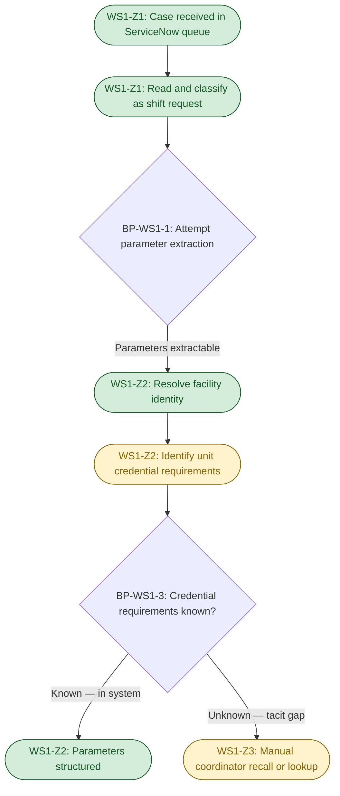
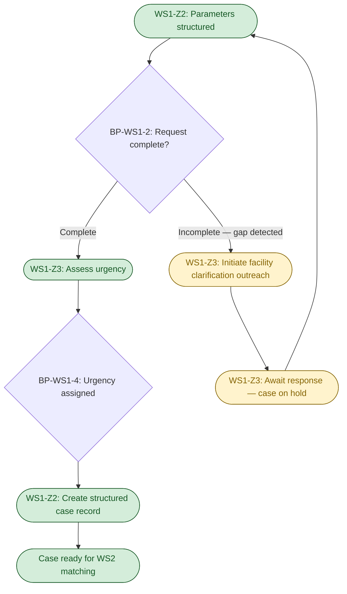
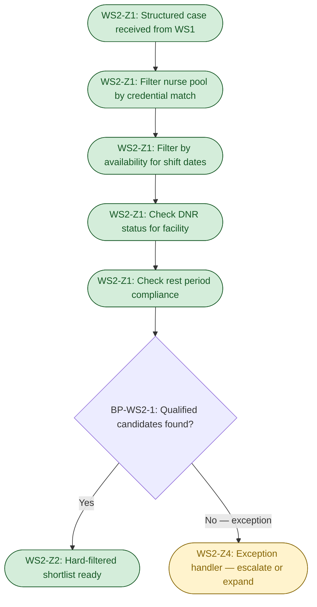
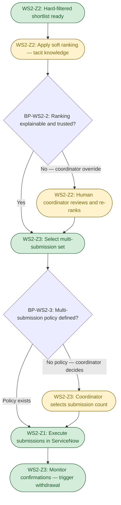

# D2A — Cognitive Load Map
## MedFlex: Clinical Workforce Staffing Coordination

---

## 0. Executive summary

- WS1 (shift request intake) and WS2 (nurse-to-shift matching) were selected for deep mapping because they combine the highest delegation potential with the highest cognitive complexity in the coordinator workflow: WS1 is the universal entry point for every fill and its unstructured free-text format is the root cause of the intake bottleneck, while WS2 is the primary volume driver (~960 decisions/day) and the step where coordinator tacit knowledge is most concentrated and least transferable.
- The most significant breakpoint across both maps is the transition from hard-filter matching to soft-preference ranking in WS2 (BP-WS2-2): this is where rule-based logic ends, tacit knowledge begins, and the agent's output becomes difficult to audit — the same failure mode that caused coordinators to abandon the prior recommendation engine.
- The most consequential cross-work-stream pattern for agent design is that both WS1 and WS2 depend on a shared facility-unit-credential mapping that is currently held entirely in coordinator memory and not queryable from ServiceNow — encoding this knowledge is a shared pre-condition for both intake classification and matching, and is the single highest-leverage investment in the agent's data architecture.

---

## 0b. Table of contents

- [0. Executive summary](#0-executive-summary)
- [0b. Table of contents](#0b-table-of-contents)
- [1. Work stream selection and rationale](#1-work-stream-selection-and-rationale)
- [2. Cognitive Load Map — WS1: Shift request intake](#2-cognitive-load-map--ws1-shift-request-intake)
  - [2a. Lived process narrative](#2a-lived-process-narrative)
  - [2b. Jobs to be Done decomposition](#2b-jobs-to-be-done-decomposition)
  - [2c. Cognitive zones and breakpoints](#2c-cognitive-zones-and-breakpoints)
  - [2d. Micro-task inventory with dimension scores](#2d-micro-task-inventory-with-dimension-scores)
  - [2e. Process topology diagram](#2e-process-topology-diagram)
- [3. Cognitive Load Map — WS2: Nurse-to-shift matching](#3-cognitive-load-map--ws2-nurse-to-shift-matching)
  - [3a. Lived process narrative](#3a-lived-process-narrative)
  - [3b. Jobs to be Done decomposition](#3b-jobs-to-be-done-decomposition)
  - [3c. Cognitive zones and breakpoints](#3c-cognitive-zones-and-breakpoints)
  - [3d. Micro-task inventory with dimension scores](#3d-micro-task-inventory-with-dimension-scores)
  - [3e. Process topology diagram](#3e-process-topology-diagram)
- [4. Cross-work-stream observations](#4-cross-work-stream-observations)
- [5. Abbreviated mapping — remaining work streams](#5-abbreviated-mapping--remaining-work-streams)
- [6. Assumption log](#6-assumption-log)

---

## 1. Work stream selection and rationale

**Selected: WS1 (shift request intake) and WS2 (nurse-to-shift matching).**

WS2 has the highest cognitive complexity in the coordinator workflow by a significant margin. Every matching decision requires the coordinator to simultaneously apply hard rules (credentials, availability, DNR), soft preferences (nurse facility familiarity, likelihood of acceptance, historical performance), and competitive strategy (multi-submission sequencing) — using knowledge that lives entirely in their heads and is not queryable from any system. At ~120 decisions per coordinator per day, it is also the primary volume driver. No other work stream combines this level of judgment complexity with this volume and this degree of tacit knowledge dependency, making it the most important map for agent design.

WS1 has the highest delegation potential: LLM-based parsing of unstructured free text to extract structured shift parameters is a well-understood AI capability, the agent can handle it without requiring hospitals to change their behaviour (the lesson from the prior chatbot failure), and it is the universal pre-condition for WS2 — every matching error that begins with a misread intake request traces back here. Mapping WS1's breakpoints determines where the intake agent needs to ask for human clarification, which directly shapes the agent's first touchpoint with coordinators.

WS4 (confirmation and coordination) was considered: it has meaningful delegation potential but the cognitive complexity is materially lower — most of the judgment work in WS4 is exception-handling (nurse declines, no-shows), which is narrow in scope and occurs after the matching decision. WS3 (credential verification) is out of coordinator scope and was excluded as a coordinator automation target per the scenario correction confirmed in discovery.

---

## 2. Cognitive Load Map — WS1: Shift request intake

### 2a. Lived process narrative

A shift request arrives in ServiceNow. It may have come from a hospital coordinator via email, been submitted through a web portal, or been called in by phone and transcribed by an administrative contact — but regardless of origin, it lands in ServiceNow as free text in a case record, and a coordinator opens it.

The coordinator reads the request. It might say: *"Hi, we need coverage for our ICU this Monday and Tuesday, both 12-hour nights. Needs CCRN. Thanks, St. Mary's."* That is a relatively clean request. More often it is something like: *"Need 2 nurses Riverside pediatric ward next weekend daytime, usual creds"* — where "usual creds" and "next weekend" and "Riverside" are all terms that require interpretation. "Riverside" might match three facilities in ServiceNow. "Usual creds" means whatever the coordinator already knows the pediatric ward at that specific Riverside facility requires. "Next weekend" depends on what day today is and whether the coordinator interprets it as the coming Saturday or the one after.

The coordinator does not start by reading through all the text carefully and then consulting ServiceNow. They read the request and their brain begins pattern-matching immediately against their mental model: *Is this a repeat hospital? Do I know this unit? Do I know what credentials they need?* For a facility they know well, the credential requirements are in memory — they don't look them up. For a new facility or a unit they haven't staffed before, they might search through previous cases, check the facility's record in ServiceNow, or ask a colleague. This happens in parallel with reading, not sequentially after.

The coordinator pauses when: (a) the facility name doesn't immediately match something they recognise — they'll search ServiceNow for partial matches, scan their email history, or ask a peer; (b) the credential requirement is ambiguous or unusual — *"ICU-certified"* covers several possible certifications and different facilities mean different things; (c) the dates or shift duration are unclear — *"this week"* without a specific date leaves them uncertain and they may need to contact the hospital; (d) the request is for a unit type or shift pattern they've never staffed.

When a request is too incomplete to proceed to matching, the coordinator contacts the hospital — by email if there's time, by phone if the urgency is high. This introduces a waiting period during which the request sits in a holding state. There is no SLA for how long a hospital takes to respond, and there is no proactive follow-up reminder in ServiceNow — the coordinator tracks it mentally or with a personal note. [Assumption: no formal SLA or system-driven follow-up reminder for clarification requests — see A-D2A-1.]

The output of WS1 is a structured case record in ServiceNow with: identified facility, unit type, shift dates and times, required credentials, and a priority level. In practice, the "structure" is only as clean as the coordinator's interpretation. The credential-requirement field may contain a free-text note (*"CCRN as usual"*) rather than a normalised credential code, which means WS2 must re-interpret it. This is a quality leak between WS1 and WS2 that currently adds matching time on busy shifts. [Assumption: credential field in ServiceNow is not normalised to a standard code — see A-D2A-2.]

### 2b. Jobs to be Done decomposition

| JtD ID | Cognitive contract — what outcome must be produced? | Trigger | Actor | Key decisions | Key systems/data | Primary cognitive type | Expected output |
|--------|------------------------------------------------------|---------|-------|---------------|-----------------|----------------------|----------------|
| WS1-J1 | Determine whether a new ServiceNow case is an actionable shift request and what type it represents | New case appears in coordinator queue | Coordinator | Is this a shift request? Is it complete enough to proceed? | ServiceNow case text | Execution | Case classified as shift request or routed elsewhere |
| WS1-J2 | Extract all parameters needed to run a matching search from a free-text shift request | Case classified as shift request | Coordinator | What facility? What unit? What dates/times? What credential requirements? | ServiceNow case text; coordinator memory of facility-unit-credential mappings | Synthesis | Structured parameter set: facility ID, unit type, dates, shift duration, credential requirements |
| WS1-J3 | Resolve ambiguities and fill gaps that prevent the request from proceeding to matching | Ambiguity or missing parameter detected during extraction | Coordinator | Is this resolvable from context or requires outreach? What is the minimum information needed? | ServiceNow case history; coordinator memory; hospital contact | Exception-handling | Clarified parameter set or flagged pending response |
| WS1-J4 | Validate the extracted parameters against known facility data and confirm the request is serviceable | Parameters extracted | Coordinator | Does MedFlex service this facility and unit? Are the credentials within scope? | ServiceNow facility record; coordinator memory | Decision-making | Confirmed serviceable request, or rejection/escalation |
| WS1-J5 | Assign urgency and queue priority so the matching step is sequenced correctly relative to other open requests | Request validated and structured | Coordinator | How time-critical is this request relative to others in queue? | Shift dates/times; current queue depth; coordinator judgment on competitive window | Decision-making | Queue priority assigned; structured case record created in ServiceNow |

### 2c. Cognitive zones and breakpoints

**Zones:**

| Zone ID | Zone name | Micro-tasks in zone | Dominant cognitive type | Data dependencies | Error tolerance |
|---------|-----------|---------------------|------------------------|-------------------|-----------------|
| WS1-Z1 | Ingestion & classification | Read case, identify request type, begin parameter extraction | Probabilistic reasoning — inferring intent from unstructured text | ServiceNow case text (free form) | Medium — misclassification is recoverable but adds delay |
| WS1-Z2 | Validation & structuring | Resolve facility identity, identify credential requirements, create structured record | Deterministic execution — lookup and match against known data | ServiceNow facility records; coordinator tacit knowledge of facility-credential mappings | High — errors here propagate to every downstream step; 7% mismatch rate is partly rooted here |
| WS1-Z3 | Triage & exception handling | Assess completeness, assign urgency, flag for clarification, manage outreach | Human sense-making — judgment about ambiguity threshold, urgency relative to competing requests | Queue state; hospital responsiveness; coordinator judgment | Medium — poor urgency assignment is recoverable; prolonged clarification cycles add fill time |

**Breakpoints:**

| BP ID | Description of handoff | From | To | Why this is a breakpoint | Agent opportunity or risk |
|-------|------------------------|------|----|--------------------------|--------------------------|
| BP-WS1-1 | Free-text case arrives → parameter extraction begins | Unstructured ServiceNow text | Agent NLP extraction | Human-to-system: this is where the coordinator's reading-and-interpreting step can be replaced by an LLM that extracts structured parameters from free text without requiring hospital workflow change | **High opportunity.** LLM extraction of shift parameters from natural language is well within current AI capability. Risk: extraction errors on ambiguous text that the agent cannot detect as ambiguous — must flag low-confidence extractions for human review |
| BP-WS1-2 | Extraction complete → ambiguity detected | Agent extraction | Human coordinator | Rule-to-judgment shift: automated extraction reaches its confidence threshold; a human must decide whether the gap is resolvable from context or requires facility outreach | **Medium opportunity, high risk if skipped.** Agent must surface ambiguity explicitly rather than silently proceeding with a low-confidence interpretation. The risk: an agent that fills in the gap with a plausible guess produces a well-formed but wrong case record that propagates through WS2 undetected |
| BP-WS1-3 | Parameters extracted → credential requirements identified | Structured parameters | Facility-unit-credential knowledge base | Human-to-system: identifying what credentials a specific facility requires for a specific unit is currently tacit knowledge. If encoded in a queryable knowledge base, this becomes a deterministic lookup; if not encoded, it remains human-dependent | **Highest-value encoding target.** The facility-unit-credential mapping is the single piece of tacit knowledge most directly responsible for the 7% mismatch rate. Encoding it transforms WS1-Z2 from human sense-making to deterministic execution |
| BP-WS1-4 | Request validated → urgency assigned | Coordinator judgment | Queue management | Human sense-making to rule-based execution: urgency assignment based on shift date/time and competitive window could be made deterministic (e.g., shifts within 48 hours = high; 48–96 hours = medium) once the rules are surfaced | **Medium opportunity.** Urgency assignment is currently a judgment call but could become a rules-based calculation once the criteria are made explicit |

### 2d. Micro-task inventory with dimension scores

| Micro-task | Cognitive Load | Input Structure | Decision Determinism | Exception Frequency | Turn-Taking Degree | Latency Constraint | Compliance/Risk Sensitivity | Tool/API Availability |
|------------|---------------|-----------------|---------------------|---------------------|-------------------|-------------------|----------------------------|----------------------|
| MT-WS1-1: Read and classify incoming ServiceNow case as shift request | L [^1] | M [^2] | H [^3] | L [^4] | L | M [^5] | L [^6] | H [^7] |
| MT-WS1-2: Extract shift parameters from free text (facility, unit, dates, duration, shift type) | H [^8] | L [^9] | L [^10] | H [^11] | M [^12] | M | M [^13] | L [^14] |
| MT-WS1-3: Resolve facility identity (match name variant in request to known ServiceNow record) | M [^15] | M [^16] | M [^17] | M [^18] | L | L | M [^19] | H [^20] |
| MT-WS1-4: Identify required credentials for this facility and unit type | H [^21] | L [^22] | M [^23] | M [^24] | L | L | H [^25] | L [^26] |
| MT-WS1-5: Assess request completeness and assign urgency | M [^27] | M [^28] | M [^29] | M [^30] | L | M | L | M [^31] |
| MT-WS1-6: Flag ambiguous or incomplete requests and initiate clarification outreach | M [^32] | L | L [^33] | H [^34] | H [^35] | H [^36] | M | M |
| MT-WS1-7: Create structured case record in ServiceNow and queue for matching | L | H [^37] | H | L | L | L | M [^38] | H |

**Dimension score footnotes — WS1:**

[^1]: Classification is recognition-level — most items in a coordinator's queue are shift requests; the cognitive demand is minimal.
[^2]: Cases arrive as free text but within a ServiceNow structured container; the case metadata (sender, channel) provides semi-structured context.
[^3]: "Is this a shift request?" is binary — ambiguous cases are rare.
[^4]: Mis-routed or non-request cases are uncommon; coordinators receive predominantly shift requests.
[^5]: Should happen promptly to avoid queue delay, but not real-time (seconds).
[^6]: Misclassification is easily corrected before any downstream action occurs.
[^7]: ServiceNow case contents are accessible to any system with API access.
[^8]: Parsing natural language under ambiguity — inferring dates, inferring credential shorthand, resolving facility names — requires significant reasoning effort.
[^9]: No schema; free text with no standard format across hospitals.
[^10]: Multiple valid interpretations are possible; "usual creds" or "next weekend" are not deterministic.
[^11]: Incomplete or ambiguous requests are common — hospitals frequently omit dates, use informal credential names, or abbreviate facility names.
[^12]: May require outreach to facility if parameters are unresolvable from context.
[^13]: Extraction errors propagate to matching — a wrong unit type means the wrong credential requirements are used, contributing to the 7% mismatch rate.
[^14]: No structured API exists for reading coordinator tacit knowledge; the mapping from "ICU at St. Mary's" to specific credential codes is not in ServiceNow.
[^15]: Mostly lookup, but partial or misspelled facility names require fuzzy matching and occasional judgment.
[^16]: Facility name is in the request text (unstructured); the known facility record is structured in ServiceNow.
[^17]: Exact matches are deterministic; partial matches require judgment about which facility is intended.
[^18]: New facilities, name changes, and acquisition events periodically create ambiguity.
[^19]: Wrong facility identity causes all downstream steps to be associated with the wrong facility record, including credential requirements and DNR lists.
[^20]: ServiceNow facility records are accessible and can be searched by name.
[^21]: Credential requirements per facility and unit type are predominantly held in coordinator memory, not in any queryable system; significant tacit knowledge required.
[^22]: This knowledge is not in ServiceNow in a structured form; coordinators retrieve it from memory.
[^23]: For well-known unit types (standard ICU, standard med-surg), coordinators know the requirements. For non-standard units or new facilities, judgment is required.
[^24]: New facility relationships, unit type expansions, and credential requirement changes create regular exceptions.
[^25]: Incorrect credential requirements at intake propagate directly to the 7% mismatch rate at placement.
[^26]: Facility-unit-credential mapping is tacit knowledge — not currently queryable from ServiceNow or any named system.
[^27]: Requires judgment about urgency relative to other open requests — not purely objective.
[^28]: Dates are in the request text but "next weekend" or "this week" require contextual interpretation.
[^29]: Urgency rules could be made explicit (shifts within N hours = high priority) but are currently coordinator judgment.
[^30]: Ambiguous timing language is common in hospital submissions.
[^31]: ServiceNow queue management tools exist but urgency assignment logic is not automated.
[^32]: Deciding whether a gap is resolvable from context (avoid outreach delay) or genuinely requires clarification is a judgment call with time-to-fill implications either way.
[^33]: No rule defines the ambiguity threshold — it is coordinator-calibrated.
[^34]: Incomplete requests requiring outreach are a common pattern, especially from hospital contacts who submit informally.
[^35]: Clarification outreach requires response from the hospital — multi-turn exchange.
[^36]: Outreach introduces a delay that directly extends time-to-fill and risks losing the competitive placement window.
[^37]: Structured form in ServiceNow once parameters are determined.
[^38]: Errors in the case record persist through the placement lifecycle and are difficult to detect once matching begins.

### 2e. Process topology diagram

**Phase 1 — Ingestion & Classification**

**Phase 2 — Triage & Structuring**

---

## 3. Cognitive Load Map — WS2: Nurse-to-shift matching

### 3a. Lived process narrative

The coordinator picks up a structured case from the matching queue. It shows: ICU, St. Mary's, Monday and Tuesday nights, requires CCRN and ACLS, urgency = normal. The first thing the coordinator does is not open a search. They pause and think: *Who do I know that works well at St. Mary's ICU?*

This is not a failure of process — it is the process. The coordinator's mental model of the nurse pool is their primary matching tool. They maintain a working set of perhaps 15–25 nurses they know well: their availability patterns, their preferred facilities, their likelihood of accepting a night shift on short notice, their history at specific hospitals. When a request arrives, they mentally scan this set first, before opening ServiceNow's nurse list. If a name surfaces, they open that nurse's profile to confirm credentials (reading the compliance team's verified status) and check availability.

If the first candidate looks good — credentials verified, available, no DNR flag at St. Mary's, not already submitted elsewhere — the coordinator may submit immediately. If they are uncertain about the credential freshness (they recall this nurse mentioned renewing a certification a few weeks ago), they check the timestamp on the last compliance update in ServiceNow. If it looks recent, they proceed. If it looks stale, they might call or text the compliance team to confirm, or they move to the next candidate.

The coordinator then decides how many nurses to submit simultaneously. If Monday night is in 2 days and this is a competitive hospital that submits to multiple agencies, they will submit 2–3 nurses at once. They are aware that submitting too many creates withdrawal work later; submitting too few risks losing the fill. This calculation is intuitive — there is no policy. They do it based on how urgently they need to win this placement, how many good candidates they have, and what other requests are competing for the same nurses.

If the first mental candidates are unavailable, the coordinator opens ServiceNow's nurse list and filters by credential and availability. This takes longer. The list may return 20–30 results. The coordinator scans them, and begins applying soft filters they cannot express as queries: *Does this nurse have experience with the ICU environment at this specific hospital? Have they had problems there before? Do they tend to respond quickly to notifications?* None of this is in the system. They pick the most promising candidates from memory and check their profiles.

The most common exception is a partial credential match — a nurse who has 7 of 8 required credentials. The coordinator must decide: push forward with this nurse and flag the gap to the facility, wait for the nurse to complete the credential (if renewal is imminent), or find another nurse. This is a judgment call with no documented rule. [Assumption: no formal partial-credential policy exists — see A-D2A-3.] The coordinator makes it based on their read of the facility (how strict are they about this specific credential?) and the availability situation (is there anyone else?).

A second exception is a zero-candidate scenario: no qualified, available, non-DNR nurse for this request. The coordinator escalates — tries to reach nurses who marked partial availability, contacts nurses whose availability has not been updated recently, or asks a supervisor to approve a geographic-radius expansion. This escalation path is informal. [Assumption: no formal escalation protocol for zero-candidate scenarios — see A-D2A-4.]

Multi-submission management runs as a parallel thread. While the coordinator is working new requests, they are also tracking outstanding submissions. When a confirmation arrives — typically SMS or email reply — they update ServiceNow and manually withdraw from competing submissions. If two facilities confirm the same nurse within minutes of each other, they must decide which placement to keep and which to withdraw from. This is done by phone, apologetically. It happens regularly and is a source of facility relationship friction they are aware of and cannot systematically prevent.

### 3b. Jobs to be Done decomposition

| JtD ID | Cognitive contract — what outcome must be produced? | Trigger | Actor | Key decisions | Key systems/data | Primary cognitive type | Expected output |
|--------|------------------------------------------------------|---------|-------|---------------|-----------------|----------------------|----------------|
| WS2-J1 | Determine the set of nurses who are technically eligible for this shift by clearing all hard gates (credentials, availability, DNR, rest periods) | Structured case received in matching queue | Coordinator (reading from compliance team's data) | Which nurses pass all hard rules? Are any credential records stale or borderline? | ServiceNow nurse profiles (credential status set by compliance team); availability data; DNR list | Execution | Hard-filtered candidate set: nurses who pass all rule-based gates |
| WS2-J2 | Rank the eligible candidate set by likelihood of successful placement using soft preference knowledge | Hard-filtered candidate set produced | Coordinator | Which candidate is most likely to accept, perform well, and not create facility friction? | Coordinator tacit knowledge of nurse preferences, facility histories, and relationship context | Synthesis | Ranked candidate shortlist with primary and backup selections |
| WS2-J3 | Determine the optimal multi-submission strategy given competitive pressure, candidate availability, and race-condition risk | Ranked candidate shortlist produced | Coordinator | How many candidates to submit simultaneously? In what order? How to manage withdrawal if multiple confirm? | Queue state; competitive window; coordinator judgment on fill probability | Decision-making | Submission set defined (N candidates, sequenced by priority) |
| WS2-J4 | Handle exceptions that prevent standard matching from completing (partial credentials, zero candidates, DNR conflicts, stale availability) | Exception detected during J1 or J2 | Coordinator | What is the nature of the exception? What alternative paths exist? When to escalate? | Ad hoc — depends on exception type; may involve compliance team, supervisor, or facility contact | Exception-handling | Exception resolved (alternative candidate found, escalation triggered, or request deferred) |
| WS2-J5 | Execute submissions and manage the withdrawal lifecycle to prevent double-booking | Submission set determined | Coordinator | Which nurse to submit first? When to withdraw from competing submissions? How to handle simultaneous confirmations? | ServiceNow submission tracking; coordinator mental tracking of pending cross-submissions | Execution | Submissions recorded in ServiceNow; nurse notifications triggered; withdrawals managed |

### 3c. Cognitive zones and breakpoints

**Zones:**

| Zone ID | Zone name | Micro-tasks in zone | Dominant cognitive type | Data dependencies | Error tolerance |
|---------|-----------|---------------------|------------------------|-------------------|-----------------|
| WS2-Z1 | Hard filtering | Apply credential gate, availability filter, DNR check, rest period check | Deterministic execution — rule application against structured data | ServiceNow nurse profiles (compliance-team-maintained); availability data; DNR list | Low — passing a nurse who fails a hard gate is a compliance incident; no tolerance |
| WS2-Z2 | Soft ranking | Apply tacit preference knowledge to rank filtered candidates | Probabilistic reasoning — multi-factor assessment of fit, acceptance likelihood, and relationship history | Coordinator memory; no system source | Medium — a suboptimal ranking increases no-show risk and may reduce fill quality, but is not a compliance failure |
| WS2-Z3 | Submission strategy | Select multi-submission set, sequence by priority, plan withdrawal logistics | Human sense-making — competitive judgment under time pressure | Queue state; coordinator intuition on competitive window | Medium — over-submission creates facility friction; under-submission risks losing the fill |
| WS2-Z4 | Exception handling | Diagnose partial credential gaps, zero-candidate scenarios, DNR conflicts, and resolve via escalation or workaround | Exception-handling — each exception is structurally different and requires different resolution paths | Ad hoc; depends on exception type | Low — exceptions are where compliance risk is highest; errors in this zone are consequential |

**Breakpoints:**

| BP ID | Description of handoff | From | To | Why this is a breakpoint | Agent opportunity or risk |
|-------|------------------------|------|----|--------------------------|--------------------------|
| BP-WS2-1 | Shift request enters matching → hard filtering begins | Human case review | Agent rule execution | Human-to-system: credential, availability, DNR, and rest period checks are fully deterministic given good data. This is the clearest candidate for full agent autonomy in WS2 | **High opportunity, high compliance sensitivity.** Agent can execute hard filtering faster and more consistently than a coordinator. Risk: data quality in ServiceNow is critical — stale credential records or missing DNR entries produce false-passes. Agent must surface data-staleness signals |
| BP-WS2-2 | Hard filtering complete → soft ranking begins | Deterministic rule execution | Tacit knowledge application | Rule-to-judgment shift: this is where the agent's output becomes difficult to audit. The prior recommendation engine failed here — coordinators could not trust rankings they could not verify. This breakpoint must include an explainability mechanism | **Highest-tension breakpoint.** Agent can score candidates on quantifiable soft factors (past placement history, facility match rate, response rate). But coordinators must see the reasoning, not just the output. Design must address explainability to avoid the prior failure |
| BP-WS2-3 | Soft ranking complete → multi-submission decision | Coordinator judgment | Agent-assisted execution | The number and sequence of submissions is a policy question currently answered by coordinator intuition. If a policy is defined (e.g., submit top 2 candidates for fills >48 hours out, submit top 3 for fills <24 hours), the decision becomes rule-based and agent-executable | **Medium opportunity.** Depends entirely on whether Marcus will define and enforce a multi-submission policy. Without a policy, the agent cannot decide autonomously; it can only execute the coordinator's decision |
| BP-WS2-4 | Exception detected → exception handled | Standard matching path | Human exception handler | Compliance gate: partial credentials, zero candidates, and DNR conflicts are not resolvable by the standard matching logic. Human judgment is required. This breakpoint is the primary HITL boundary in WS2 | **Clear HITL boundary.** Agent detects the exception and routes to coordinator with a structured exception summary (type, affected candidate, options). Agent does not attempt to resolve complex exceptions autonomously |
| BP-WS2-5 | Confirmation received → withdrawal triggered | Passive monitoring | Active withdrawal execution | Human-to-system: the agent can monitor for confirmation events and trigger withdrawal from competing submissions immediately, without coordinator action — eliminating the race condition lag that creates double-booking | **High opportunity, medium risk.** Agent-driven atomic withdrawal eliminates the race condition. Risk: if the withdrawal notification to a facility is poorly handled (tone, timing), it damages the relationship — this may warrant a human-authored note in the early deployment phase |

### 3d. Micro-task inventory with dimension scores

| Micro-task | Cognitive Load | Input Structure | Decision Determinism | Exception Frequency | Turn-Taking Degree | Latency Constraint | Compliance/Risk Sensitivity | Tool/API Availability |
|------------|---------------|-----------------|---------------------|---------------------|-------------------|-------------------|----------------------------|----------------------|
| MT-WS2-1: Filter nurse pool by credential match against required credentials | L [^39] | H [^40] | H [^41] | M [^42] | L | M | H [^43] | H [^44] |
| MT-WS2-2: Filter by nurse availability for shift dates and times | L [^45] | H [^46] | H [^47] | L [^48] | L | M | L | H |
| MT-WS2-3: Check DNR status for target facility | L [^49] | H [^50] | H [^51] | L [^52] | L | L | H [^53] | M [^54] |
| MT-WS2-4: Check rest period compliance for each candidate | L [^55] | H [^56] | H [^57] | L | L | L | H [^58] | M [^59] |
| MT-WS2-5: Apply soft ranking using tacit preference and fit knowledge | H [^60] | L [^61] | L [^62] | H [^63] | L | H [^64] | M [^65] | L [^66] |
| MT-WS2-6: Select multi-submission set and sequence | M [^67] | M [^68] | L [^69] | H [^70] | L | H | M [^71] | M [^72] |
| MT-WS2-7: Execute submissions and update ServiceNow case record | L | H | H | L | L | M | M [^73] | H |
| MT-WS2-8: Handle exception case (partial credentials, zero candidates, DNR conflict) | H [^74] | L [^75] | L [^76] | H [^77] | H [^78] | H [^79] | H [^80] | L [^81] |
| MT-WS2-9: Monitor pending submissions and execute withdrawal on confirmation | M [^82] | L [^83] | M [^84] | H [^85] | H [^86] | H [^87] | M [^88] | L [^89] |

**Dimension score footnotes — WS2:**

[^39]: Reading pre-verified credential status from the nurse profile is a lookup, not an analytical task.
[^40]: Nurse profiles in ServiceNow contain structured credential status fields maintained by the compliance team.
[^41]: Has credentials or does not — binary gate. Borderline cases (partial match) are escalated as exceptions.
[^42]: Credential renewals occasionally lag in ServiceNow (compliance team update latency is a known risk per scenario_context.md).
[^43]: Passing a nurse who fails the credential gate is a direct cause of the 7% mismatch rate.
[^44]: ServiceNow nurse profiles are accessible; compliance team maintains them.
[^45]: Nurses manage their own availability in ServiceNow; reading it is straightforward.
[^46]: Availability is a structured data field — available/unavailable for given dates.
[^47]: Available or not — binary.
[^48]: Nurses' self-reported availability is treated as reliable in the scenario; exceptions are uncommon.
[^49]: DNR check is a list lookup — is this nurse on the DNR list for this facility?
[^50]: Assumed to be a structured list in ServiceNow or an accessible document — not confirmed in scenario; see A-D2A-5.
[^51]: On list or off list — binary.
[^52]: DNR entries are uncommon but consequential when they occur.
[^53]: Offering a DNR nurse to a facility is a contract violation regardless of credential status (HR-4).
[^54]: DNR list accessibility in ServiceNow is assumed but not confirmed in the scenario.
[^55]: Rest period check is a rule calculation (hours since last shift vs. minimum rest interval).
[^56]: Shift history data and rest interval rules — both assumed accessible in structured form; see A-D2A-6.
[^57]: Rule-based calculation given shift history data.
[^58]: Rest period violations expose MedFlex to FLSA and state labour law liability (HR-5).
[^59]: Shift history assumed accessible in ServiceNow; rest interval rules assumed codified — neither confirmed explicitly.
[^60]: The highest cognitive load task in the entire workflow — requires simultaneous assessment of nurse preferences, facility familiarity, historical performance, and acceptance likelihood, all from memory.
[^61]: Soft preference data is predominantly tacit — not in ServiceNow or any named system.
[^62]: Two experienced coordinators would produce different rankings for the same candidate set; the "right" choice is judgment-dependent.
[^63]: Almost every matching decision involves some soft-filter reasoning — this is the rule, not the exception.
[^64]: The competitive placement window means soft ranking must happen quickly; delays here lose the fill.
[^65]: Poor soft ranking increases no-show and mismatch risk but does not directly cause a compliance incident.
[^66]: No system currently holds queryable soft preference data; this knowledge is entirely tacit.
[^67]: Balancing fill probability against race-condition risk requires situational judgment; moderate complexity.
[^68]: Partially structured — coordinator knows some state (open submissions for this nurse) but not all (competing agency submissions for same nurse at same facility).
[^69]: No documented policy governs multi-submission count; coordinator decides case-by-case.
[^70]: Multi-submission is the standard strategy, not an exception — race-condition scenarios are therefore frequent.
[^71]: Over-submission damages facility relationships; under-submission risks losing the fill.
[^72]: ServiceNow tracks submissions for this coordinator but has no cross-coordinator or cross-agency visibility into competing submissions.
[^73]: Submission records must be accurate as they trigger nurse notifications and facility confirmations.
[^74]: Exception diagnosis and resolution is the most cognitively demanding part of the workflow — each exception is structurally different.
[^75]: Exceptions are ad hoc — no structured input; coordinator works from memory and improvised communication.
[^76]: Each exception type has a different resolution path; there is no decision tree.
[^77]: Significant share of matching decisions encounter at least one exception; this is not a rare path.
[^78]: May require communication with compliance team, facility contact, or supervisor.
[^79]: Unresolved exceptions delay the fill and risk losing the competitive window entirely.
[^80]: Exceptions are where compliance risk is most concentrated — partial credential placements and zero-candidate decisions are high-stakes.
[^81]: Exception resolution draws on tacit knowledge and informal communication channels; no system tool supports it.
[^82]: Tracking pending withdrawals across multiple simultaneous submissions is a cognitive overhead that compounds under high volume.
[^83]: Withdrawal state is currently mental tracking — no confirmed system-level cross-submission state in ServiceNow.
[^84]: The trigger (confirmation received) is clear; the response (withdraw from all others) is deterministic — but the execution is currently manual.
[^85]: Multi-submission is standard practice; every submitted case is a potential withdrawal trigger.
[^86]: Withdrawal management may require communication with facilities when race conditions occur.
[^87]: Late withdrawal creates double-booking, which damages facility relationships; time is critical once a confirmation arrives.
[^88]: Double-booking is a contract relationship issue, not a regulatory compliance issue — consequential but not legally regulated.
[^89]: No confirmed system tool currently tracks cross-submission state or triggers automatic withdrawal.

### 3e. Process topology diagram

**Phase 1 — Hard Filtering**

**Phase 2 — Soft Ranking & Submission**

---

## 4. Cross-work-stream observations

**Observation 1 — Facility-unit-credential mapping is a shared tacit knowledge dependency in both WS1 and WS2.**
WS1 needs it to identify what credentials to require for a given shift request. WS2 needs it to validate that a nurse's credential profile meets those requirements. Currently this knowledge lives in coordinator memory in both cases. Encoding it once in a queryable facility-unit-credential knowledge base serves both work streams simultaneously and is the single highest-leverage data investment in the engagement. Without it, both the intake agent and the matching agent are dependent on coordinator tacit knowledge at their most critical decision point.

**Observation 2 — ServiceNow is the shared system of record, but its data quality is uneven across field types.**
Structured fields (nurse availability, credential status) are coordinator-accessible and high-confidence. Unstructured fields (free-text case notes, credential renewal comments) require interpretation. The gap between structured and unstructured ServiceNow data defines the boundary between what the agent can execute deterministically and what requires human judgment. Both WS1 and WS2 have a structured-data zone (Z2 in WS1, Z1 in WS2) and a tacit-knowledge zone (Z3 in WS1, Z2 in WS2) — and the agent's autonomy boundary in each case is the same: structured data = agent-executable, tacit knowledge = human-in-the-loop until encoded.

**Observation 3 — Exception handling is the disproportionate time consumer in both work streams, and currently has no system support.**
In WS1, the clarification outreach cycle (BP-WS1-2) is the largest single source of variable delay — a request that requires two back-and-forth exchanges with a hospital can take hours while the competitive window closes. In WS2, the exception path (WS2-Z4) is where the most complex judgment occurs and where coordinators spend the most time relative to the value produced. Both exceptions currently route to the same person (the coordinator) through an informal, untracked channel. A unified exception queue — where the agent routes structured exception summaries to the appropriate human (coordinator, compliance team, supervisor) — would reduce context-switching overhead and make exception resolution auditable.

**Observation 4 — Multi-submission management in WS2 and clarification outreach in WS1 both create untracked pending states that consume coordinator attention.**
In WS1, requests awaiting clarification are in an informal holding state — no system reminder, no SLA, no escalation trigger. In WS2, pending submissions to multiple facilities are tracked mentally — no system-level cross-submission conflict detection. Both are sources of coordinators' background cognitive load: they are always managing a mental list of "things waiting for a response" in parallel with active work. An agent that tracks both states explicitly (clarification outstanding, submissions pending withdrawal) would free this background attention and reduce the errors that occur when mental tracking fails under volume.

**Observation 5 — The prior recommendation engine failure is a design constraint that applies specifically to BP-WS2-2.**
The soft ranking step (MT-WS2-5) is where the agent's output is most vulnerable to the same failure mode: recommendations coordinators cannot audit or verify. The cross-work-stream implication is that the agent's explainability requirement is highest at this breakpoint and must be a first-class design requirement, not a post-hoc addition. Every other breakpoint in both work streams produces outputs that coordinators can verify in seconds (is the credential present? is the nurse available?). Soft ranking is the only breakpoint where the agent's reasoning is not immediately falsifiable — and that is exactly where the last agent failed.

---

## 5. Abbreviated mapping — remaining work streams

*These entries are lower-confidence than the full maps in §2 and §3. Scores are derived from the scenario narrative, not from a lived process walkthrough.*

---

#### Work Stream WS3: Compliance / credential verification (coordinator-facing scope only)

**Why not selected for deep mapping:** Credential verification is performed by a separate compliance/legal team — not coordinators. The coordinator's involvement is limited to reading pre-verified credential status from the nurse profile in ServiceNow and applying it as a hard gate in WS2 (WS2-J1). The cognitive complexity of this coordinator-facing step is low — it is a lookup, not a verification task — and its delegation potential is already captured within WS2's Z1 zone. Deep mapping of the compliance team's verification process is out of scope for coordinator automation.

**JtDs (coordinator-facing only):**

| JtD ID | Cognitive contract — what outcome must be produced? | Primary cognitive type | Key decisions | Key systems/data |
|--------|------------------------------------------------------|----------------------|---------------|-----------------|
| WS3-J1 | Determine whether the credential status shown in ServiceNow for a given nurse is current and sufficient for the required shift, or whether it should be treated as stale pending compliance team update | Decision-making | Is this credential record fresh enough to trust? When was it last updated? | ServiceNow nurse profile (credential status, update timestamp) |
| WS3-J2 | Flag and escalate cases where credential latency may be blocking a placement — communicate to compliance team that an update is needed | Communication | Is this worth escalating? How urgent is the placement? | ServiceNow case; compliance team contact |

**Dimension sketch:**

| Dimension | Score | Rationale |
|-----------|-------|-----------|
| Cognitive Load | L | Coordinators read a pre-verified status field — they do not verify credentials themselves |
| Input Structure | H | Nurse profile in ServiceNow is a structured record |
| Decision Determinism | H | Verified = proceed; not verified = hold or escalate; borderline freshness = coordinator judgment |
| Exception Frequency | M | Credential renewal lags are a known risk — coordinators encounter them periodically |
| Tool/API Availability | H | ServiceNow nurse profiles are accessible |
| Compliance/Risk Sensitivity | H | Incorrect credential application is a direct cause of the 7% mismatch rate and regulatory exposure |

**Confidence note:** Scores reflect the coordinator-facing portion only. The compliance team's internal verification process (state regulatory database lookups, multi-step credential checks) is not mapped here and would score very differently. Any automation targeting the compliance team's process is out of scope for this engagement without a separate discovery session with that team.

---

#### Work Stream WS4: Placement confirmation and coordination

**Why not selected for deep mapping:** WS4 has meaningful delegation potential — the routine notification-and-tracking loop is almost entirely automatable — but its cognitive complexity is materially lower than WS1 or WS2. The judgment-intensive moments (nurse declines, no-show response, multi-submission race conditions) are exception paths that occur within a process whose standard path is mechanical. The key design decisions for WS4 (active vs. passive confirmation, withdrawal automation) are already resolved at the architecture level by the B-3 and B-4 root causes identified in D1. Deep mapping would confirm what the scenario and discovery session have already established.

**JtDs:**

| JtD ID | Cognitive contract — what outcome must be produced? | Primary cognitive type | Key decisions | Key systems/data |
|--------|------------------------------------------------------|----------------------|---------------|-----------------|
| WS4-J1 | Ensure every submitted nurse has received and acknowledged placement notification within the confirmation window, and trigger re-fill if acknowledgement is not received | Execution | When has the confirmation window closed? Is silence an acceptance or a miss? | ServiceNow submission status; SMS/email notification delivery records |
| WS4-J2 | Manage the withdrawal lifecycle for multi-submitted nurses — confirm at one facility, withdraw from all others before double-booking occurs | Execution | Which confirmation to honour when simultaneous? How to handle the withdrawal communication? | ServiceNow cross-submission state; confirmation timestamps |
| WS4-J3 | Detect and respond to no-show signals before or at shift start — trigger replacement workflow and manage hospital communication | Exception-handling | Is a non-response a no-show signal or a technical delay? When to call the hospital proactively? | Pre-shift confirmation status; hospital contact; replacement candidate queue |

**Dimension sketch:**

| Dimension | Score | Rationale |
|-----------|-------|-----------|
| Cognitive Load | M | Routine confirmation tracking is low; race condition management and no-show response require moderate judgment |
| Input Structure | H | Confirmation states are binary (confirmed/not confirmed); withdrawal triggers are structured events |
| Decision Determinism | M | Standard confirmation loop is deterministic; wage-competition no-shows and race conditions require judgment |
| Exception Frequency | H | 12% no-show rate and frequent multi-submission race conditions mean exceptions are a large share of WS4 volume |
| Tool/API Availability | H | SMS/email notification infrastructure and ServiceNow case tracking are available |
| Compliance/Risk Sensitivity | H | Placement confirmation is the last gate before a nurse appears at a facility — errors here result in no-shows or double-bookings with direct facility impact |

**Confidence note:** The exception frequency score (H) is driven by the confirmed 12% no-show rate and multi-submission behaviour — both confirmed in discovery. The Decision Determinism score (M, not H) reflects the wage-competition no-show cause: a nurse who deliberately accepted and then left for better pay does not produce a clear pre-shift signal. This work stream's design is more constrained by process policy choices (active vs. passive confirmation, multi-submission rules) than by cognitive complexity.

---

## 6. Assumption log

> **Assumption [A-D2A-1]:** There is no formal SLA or system-driven follow-up reminder in ServiceNow for clarification requests sent to hospitals. Coordinators track pending clarifications mentally or with personal notes.
> **Why it matters:** If no SLA exists, the clarification cycle is unbounded — a coordinator who forgets to follow up loses the competitive placement window. An agent that tracks clarification state and sends follow-up reminders addresses this without requiring a policy change.
> **If wrong:** If ServiceNow already has a reminder or SLA mechanism, the agent's clarification-tracking capability is lower priority.
> **Confidence:** Medium — the scenario describes intake as manual and unstructured; no SLA mechanism is mentioned.

> **Assumption [A-D2A-2]:** The credential requirement field in ServiceNow case records is free-text, not normalised to a standard credential code (e.g., "CCRN as usual" vs. a standardised credential ID). This creates a quality leak between WS1 and WS2 — WS2 must re-interpret credential requirements that WS1 expressed informally.
> **Why it matters:** If credential fields are not normalised, the matching agent cannot reliably compare required credentials to nurse profile credentials without an additional parsing step. Normalisation of this field is a pre-condition for automated credential gating.
> **If wrong:** If ServiceNow already uses standardised credential codes in both facility records and nurse profiles, the credential gate is more straightforwardly automatable.
> **Confidence:** Low-Medium — the scenario confirms free-text intake; credential field normalisation is inferred from the general pattern of unstructured data, not directly stated.

> **Assumption [A-D2A-3]:** No formal partial-credential policy governs how coordinators handle nurses who have most but not all required credentials. Coordinators make this decision case-by-case based on their read of the facility's strictness and current candidate availability.
> **Why it matters:** The agent cannot make partial-credential decisions autonomously without a policy. If no policy exists, partial-credential cases must always route to human-in-the-loop. Defining the policy is a prerequisite for automating this exception path.
> **If wrong:** If a partial-credential policy exists (e.g., "7 of 8 credentials = proceed with written waiver from facility"), the agent can enforce it consistently — and the exception path becomes deterministic.
> **Confidence:** Medium — Marcus confirmed the matching process is fully manual; no credential waiver policy was mentioned in discovery.

> **Assumption [A-D2A-4]:** No formal escalation protocol exists for zero-candidate scenarios (no qualified, available, non-DNR nurse for a given request). Coordinators handle these ad hoc — expanding search radius, contacting marginal-availability nurses, or asking a supervisor informally.
> **Why it matters:** The agent's exception routing for zero-candidate scenarios depends on having defined escalation paths. Without them, the agent can only flag the exception to a coordinator with no structured next step.
> **If wrong:** If a formal escalation protocol exists, it can be encoded as agent-executable escalation logic.
> **Confidence:** Medium — the manual nature of the process implies no formal escalation rules; not directly confirmed in discovery.

> **Assumption [A-D2A-5]:** DNR (Do Not Return) lists are accessible in ServiceNow as a structured, queryable list — not maintained in a separate document or spreadsheet outside the system. Accessibility is required for the agent to perform DNR checks at matching time.
> **Why it matters:** If DNR lists are not in ServiceNow (or not queryable via API), the agent cannot perform this check autonomously. This would leave a compliance-critical gate manual.
> **If wrong:** If DNR lists are in a spreadsheet or email thread, a data migration or integration is required before the agent can enforce HR-4.
> **Confidence:** Low — DNR checking is confirmed as a coordinator responsibility, but the system of record for DNR lists is not stated in the scenario or discovery session.

> **Assumption [A-D2A-6]:** Nurse shift history data (prior placements, shift dates) is accessible in ServiceNow with sufficient detail for the agent to calculate rest period compliance (HR-5). The required data is: prior shift end time, shift location (state), and applicable minimum rest interval for that state.
> **Why it matters:** Rest period calculation is a regulatory compliance check (FLSA and state wage law). If shift history is incomplete or inaccessible, the agent cannot perform this check and must route it to a human.
> **If wrong:** If shift history data is missing or not structured at the shift-end-time level of detail, rest period checking cannot be automated — a significant compliance gap.
> **Confidence:** Low — shift history is expected to exist in a staffing system of record, but its completeness and queryability in ServiceNow are not confirmed.
